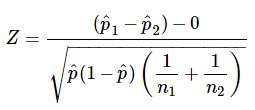
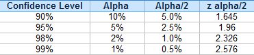
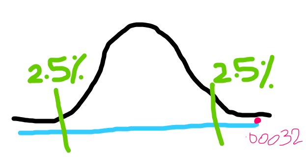
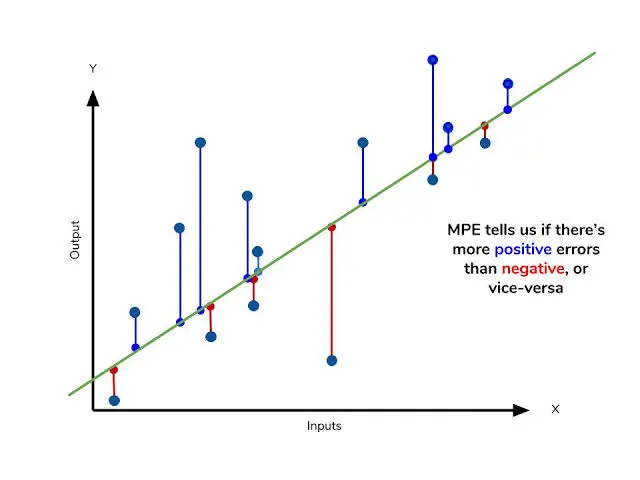
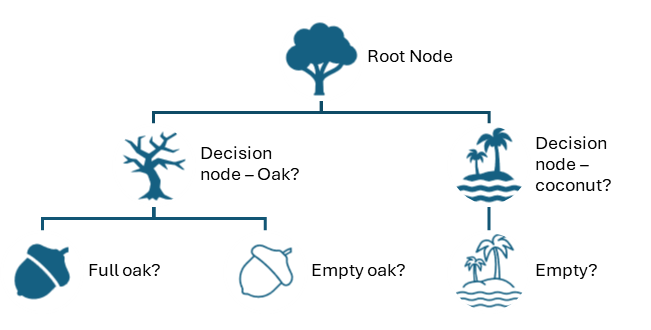
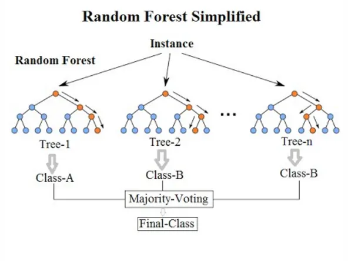
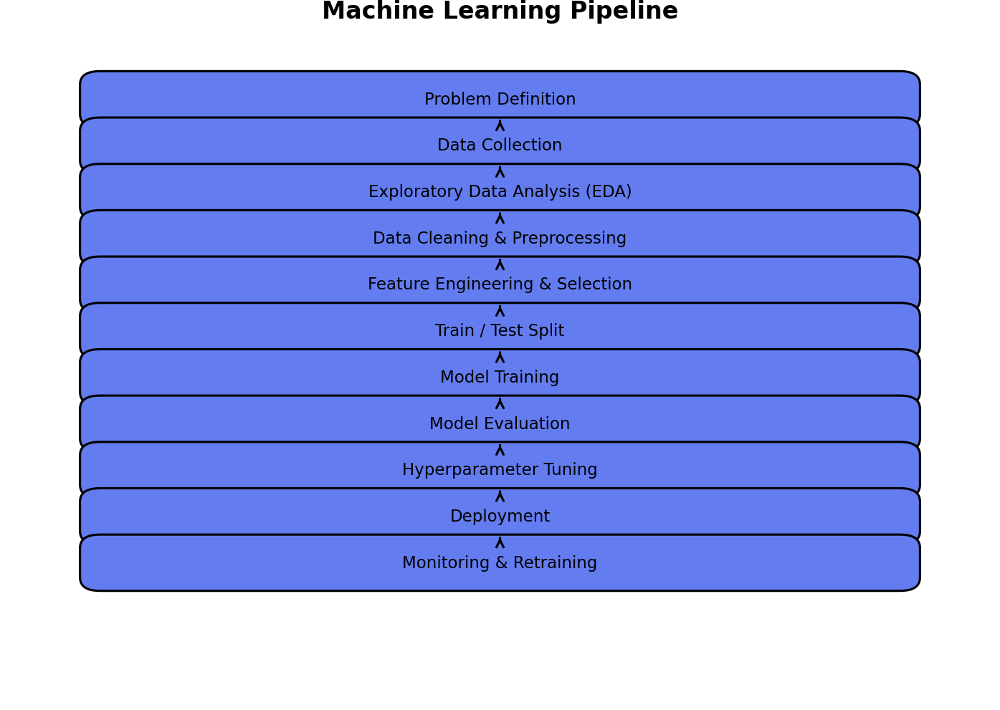
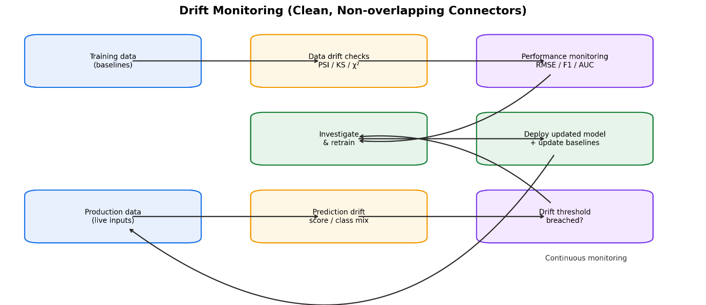
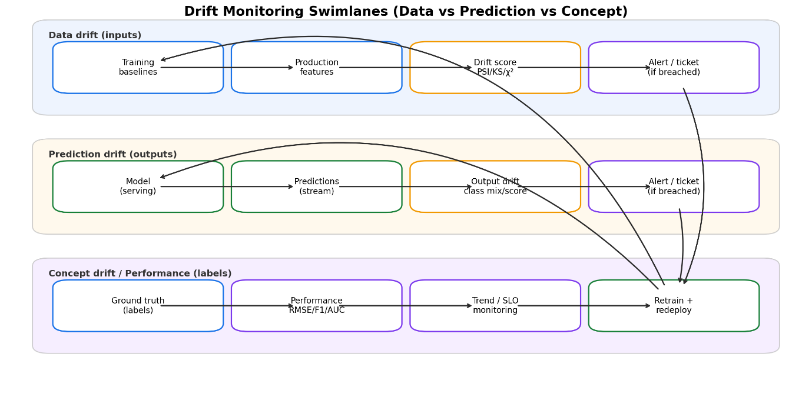

**Artificial Intelligence Data Specialist, Level 7 Apprenticeship**
**Learner:** Jesse Karadia
**Organisation:** HMRC

- [[#Describes how to use statistical, AI and machine learning methodologies such as data mining, supervised/unsupervised machine learning, natural language processing and machine vision to meet business objectives|Describes how to use statistical, AI and machine learning methodologies such as data mining, supervised/unsupervised machine learning, natural language processing and machine vision to meet business objectives]]
	- [[#Describes how to use statistical, AI and machine learning methodologies such as data mining, supervised/unsupervised machine learning, natural language processing and machine vision to meet business objectives#STARR: selecting methodologies for Hubble|STARR: selecting methodologies for Hubble]]
	- [[#Describes how to use statistical, AI and machine learning methodologies such as data mining, supervised/unsupervised machine learning, natural language processing and machine vision to meet business objectives#Technical notes: clarification knowledge|Technical notes: clarification knowledge]]
		- [[#Technical notes: clarification knowledge#Statistical methods|Statistical methods]]
		- [[#Technical notes: clarification knowledge#Data mining|Data mining]]
		- [[#Technical notes: clarification knowledge#Supervised machine learning|Supervised machine learning]]
		- [[#Technical notes: clarification knowledge#Unsupervised machine learning|Unsupervised machine learning]]
		- [[#Technical notes: clarification knowledge#Other learning paradigms (clarification breadth)|Other learning paradigms (clarification breadth)]]
		- [[#Technical notes: clarification knowledge#NLP and machine vision|NLP and machine vision]]
		- [[#Technical notes: clarification knowledge#Meeting business objectives|Meeting business objectives]]
- [[#Explains how to solve problems and evaluate software solutions via analysis of test data and results from research, feasibility, acceptance and usability testing in line with organisational requirements|Explains how to solve problems and evaluate software solutions via analysis of test data and results from research, feasibility, acceptance and usability testing in line with organisational requirements]]
	- [[#Explains how to solve problems and evaluate software solutions via analysis of test data and results from research, feasibility, acceptance and usability testing in line with organisational requirements#STARR: evaluating the Hubble classification solution|STARR: evaluating the Hubble classification solution]]
	- [[#Explains how to solve problems and evaluate software solutions via analysis of test data and results from research, feasibility, acceptance and usability testing in line with organisational requirements#Technical notes: clarification knowledge|Technical notes: clarification knowledge]]
		- [[#Technical notes: clarification knowledge#Problem solving and research / feasibility|Problem solving and research / feasibility]]
		- [[#Technical notes: clarification knowledge#Testing phases (software and users)|Testing phases (software and users)]]
		- [[#Technical notes: clarification knowledge#Analysis of test data|Analysis of test data]]
		- [[#Technical notes: clarification knowledge#Evaluation and decision-making|Evaluation and decision-making]]
		- [[#Technical notes: clarification knowledge#Train / validate / test and overfitting|Train / validate / test and overfitting]]
		- [[#Technical notes: clarification knowledge#Drift as ongoing evaluation (production)|Drift as ongoing evaluation (production)]]
		- [[#Technical notes: clarification knowledge#Poor data quality and KPIs|Poor data quality and KPIs]]
- [[#Describes the relationship between mathematical principles and core techniques in AI and data science within the organisational context|Describes the relationship between mathematical principles and core techniques in AI and data science within the organisational context]]
	- [[#Describes the relationship between mathematical principles and core techniques in AI and data science within the organisational context#STARR: the mathematics behind the Hubble model choice|STARR: the mathematics behind the Hubble model choice]]
	- [[#Describes the relationship between mathematical principles and core techniques in AI and data science within the organisational context#STARR: testing whether an agent presented higher risk|STARR: testing whether an agent presented higher risk]]
	- [[#Describes the relationship between mathematical principles and core techniques in AI and data science within the organisational context#Technical notes: clarification knowledge|Technical notes: clarification knowledge]]
		- [[#Technical notes: clarification knowledge#Mathematical principles|Mathematical principles]]
		- [[#Technical notes: clarification knowledge#How maths maps to core techniques|How maths maps to core techniques]]
		- [[#Technical notes: clarification knowledge#Key formulas to recall|Key formulas to recall]]
		- [[#Technical notes: clarification knowledge#Organisational relevance|Organisational relevance]]
- [[#Explains how they have used programming languages and modern machine learning libraries for commercially beneficial scientific analysis, simulation and data engineering to meet business needs|Explains how they have used programming languages and modern machine learning libraries for commercially beneficial scientific analysis, simulation and data engineering to meet business needs]]
	- [[#Explains how they have used programming languages and modern machine learning libraries for commercially beneficial scientific analysis, simulation and data engineering to meet business needs#STARR: using R, Python and SQL as one Hubble pipeline|STARR: using R, Python and SQL as one Hubble pipeline]]
	- [[#Explains how they have used programming languages and modern machine learning libraries for commercially beneficial scientific analysis, simulation and data engineering to meet business needs#Technical notes: clarification knowledge|Technical notes: clarification knowledge]]
		- [[#Technical notes: clarification knowledge#Clarification checklist (hit each point)|Clarification checklist (hit each point)]]
- [[#Uses applied research and data modelling to design and refine the infrastructure and architectures to deliver secure, stable and scalable data products, including enterprise, private and public cloud resources and services|Uses applied research and data modelling to design and refine the infrastructure and architectures to deliver secure, stable and scalable data products, including enterprise, private and public cloud resources and services]]
	- [[#Uses applied research and data modelling to design and refine the infrastructure and architectures to deliver secure, stable and scalable data products, including enterprise, private and public cloud resources and services#STARR: refining Hubble's data-product architecture|STARR: refining Hubble's data-product architecture]]
	- [[#Uses applied research and data modelling to design and refine the infrastructure and architectures to deliver secure, stable and scalable data products, including enterprise, private and public cloud resources and services#STARR: controlling access to S3 data|STARR: controlling access to S3 data]]
	- [[#Uses applied research and data modelling to design and refine the infrastructure and architectures to deliver secure, stable and scalable data products, including enterprise, private and public cloud resources and services#STARR: challenging auto-scaling as the default database architecture|STARR: challenging auto-scaling as the default database architecture]]
	- [[#Uses applied research and data modelling to design and refine the infrastructure and architectures to deliver secure, stable and scalable data products, including enterprise, private and public cloud resources and services#Technical notes: clarification knowledge|Technical notes: clarification knowledge]]
		- [[#Technical notes: clarification knowledge#Clarification checklist|Clarification checklist]]
		- [[#Technical notes: clarification knowledge#Architecture options and parallel concepts|Architecture options and parallel concepts]]
- [[#Explains how to design algorithms for accessing and analysing large amounts of data, including Application Programming Interfaces (API) to different databases and data sets|Explains how to design algorithms for accessing and analysing large amounts of data, including Application Programming Interfaces (API) to different databases and data sets]]
	- [[#Explains how to design algorithms for accessing and analysing large amounts of data, including Application Programming Interfaces (API) to different databases and data sets#STARR: moving Hubble from files to scalable data access|STARR: moving Hubble from files to scalable data access]]
- [[#Distinction: Explains when they have challenged the norm through investigating and proposing a solution and the impact this had|Distinction: Explains when they have challenged the norm through investigating and proposing a solution and the impact this had]]
	- [[#Distinction: Explains when they have challenged the norm through investigating and proposing a solution and the impact this had#STARR: extracting contextual features before a calculation issue emerged|STARR: extracting contextual features before a calculation issue emerged]]
	- [[#Distinction: Explains when they have challenged the norm through investigating and proposing a solution and the impact this had#STARR: challenging "LLM for everything" on tax-risk profiling|STARR: challenging "LLM for everything" on tax-risk profiling]]
	- [[#Distinction: Explains when they have challenged the norm through investigating and proposing a solution and the impact this had#STARR: replacing annual wide-table ingestion with a taxonomy-independent model|STARR: replacing annual wide-table ingestion with a taxonomy-independent model]]
	- [[#Distinction: Explains when they have challenged the norm through investigating and proposing a solution and the impact this had#STARR: reusing tagged descriptions to classify untagged content|STARR: reusing tagged descriptions to classify untagged content]]
	- [[#Distinction: Explains when they have challenged the norm through investigating and proposing a solution and the impact this had#Technical notes: clarification knowledge|Technical notes: clarification knowledge]]
- [[#Explains how they have developed their professional working practices and leadership techniques in regard to AI and data science and how this has improved organisational practice|Explains how they have developed their professional working practices and leadership techniques in regard to AI and data science and how this has improved organisational practice]]
	- [[#Explains how they have developed their professional working practices and leadership techniques in regard to AI and data science and how this has improved organisational practice#STARR: leading the growth of the Data Analytics Platform|STARR: leading the growth of the Data Analytics Platform]]
	- [[#Explains how they have developed their professional working practices and leadership techniques in regard to AI and data science and how this has improved organisational practice#STARR: taking ownership of Hubble's technical direction|STARR: taking ownership of Hubble's technical direction]]
	- [[#Explains how they have developed their professional working practices and leadership techniques in regard to AI and data science and how this has improved organisational practice#Technical notes: clarification knowledge|Technical notes: clarification knowledge]]
		- [[#Technical notes: clarification knowledge#Developing professional working practices|Developing professional working practices]]
		- [[#Technical notes: clarification knowledge#Leadership techniques|Leadership techniques]]
		- [[#Technical notes: clarification knowledge#Impact on organisational practice (clarification examples)|Impact on organisational practice (clarification examples)]]
- [[#Justifies their choice of techniques, explaining the risks and benefits and offers an alternative to technical and non-technical audiences|Justifies their choice of techniques, explaining the risks and benefits and offers an alternative to technical and non-technical audiences]]
	- [[#Justifies their choice of techniques, explaining the risks and benefits and offers an alternative to technical and non-technical audiences#STARR: communicating the LinearSVC decision|STARR: communicating the LinearSVC decision]]
	- [[#Justifies their choice of techniques, explaining the risks and benefits and offers an alternative to technical and non-technical audiences#Technical notes: clarification knowledge|Technical notes: clarification knowledge]]
		- [[#Technical notes: clarification knowledge#Justifying a technique (decision process)|Justifying a technique (decision process)]]
		- [[#Technical notes: clarification knowledge#Risks and benefits (present both sides)|Risks and benefits (present both sides)]]
		- [[#Technical notes: clarification knowledge#Offering alternatives|Offering alternatives]]
		- [[#Technical notes: clarification knowledge#Audience tailoring|Audience tailoring]]
- [[#Explains how they share and disseminate AI and data science practices across organisations to improve industry practice|Explains how they share and disseminate AI and data science practices across organisations to improve industry practice]]
	- [[#Explains how they share and disseminate AI and data science practices across organisations to improve industry practice#STARR: sharing proportionate LLM practice beyond "tokens for everything"|STARR: sharing proportionate LLM practice beyond "tokens for everything"]]
	- [[#Explains how they share and disseminate AI and data science practices across organisations to improve industry practice#STARR: sharing practice internally through DAP guidance and mentoring|STARR: sharing practice internally through DAP guidance and mentoring]]
	- [[#Explains how they share and disseminate AI and data science practices across organisations to improve industry practice#Technical notes: clarification knowledge|Technical notes: clarification knowledge]]
		- [[#Technical notes: clarification knowledge#Internal sharing mechanisms|Internal sharing mechanisms]]
		- [[#Technical notes: clarification knowledge#External dissemination|External dissemination]]
		- [[#Technical notes: clarification knowledge#Improving industry practice|Improving industry practice]]
- [[#Distinction: Critically analyses the wider social context and current issues and trends, applying the findings with justification and shares these with the wider community|Distinction: Critically analyses the wider social context and current issues and trends, applying the findings with justification and shares these with the wider community]]
	- [[#Distinction: Critically analyses the wider social context and current issues and trends, applying the findings with justification and shares these with the wider community#STARR: applying GenAI trend analysis to reject "tokens for everything"|STARR: applying GenAI trend analysis to reject "tokens for everything"]]
	- [[#Distinction: Critically analyses the wider social context and current issues and trends, applying the findings with justification and shares these with the wider community#STARR: challenging overly broad internal AI guidance|STARR: challenging overly broad internal AI guidance]]
	- [[#Distinction: Critically analyses the wider social context and current issues and trends, applying the findings with justification and shares these with the wider community#Technical notes: clarification knowledge|Technical notes: clarification knowledge]]
		- [[#Technical notes: clarification knowledge#1. Critically analyse the wider social context|1. Critically analyse the wider social context]]
		- [[#Technical notes: clarification knowledge#2. Current issues and trends|2. Current issues and trends]]
		- [[#Technical notes: clarification knowledge#3. Apply findings with justification|3. Apply findings with justification]]
		- [[#Technical notes: clarification knowledge#4. Share with the wider community|4. Share with the wider community]]
- [[#Explains how they have made independent impartial decisions respecting the opinions and views of others in complex, unpredictable and changing circumstances to benefit the business|Explains how they have made independent impartial decisions respecting the opinions and views of others in complex, unpredictable and changing circumstances to benefit the business]]
	- [[#Explains how they have made independent impartial decisions respecting the opinions and views of others in complex, unpredictable and changing circumstances to benefit the business#STARR: balancing licence, compute and funding priorities for DAP|STARR: balancing licence, compute and funding priorities for DAP]]
	- [[#Explains how they have made independent impartial decisions respecting the opinions and views of others in complex, unpredictable and changing circumstances to benefit the business#STARR: choosing an existing database route over a new S3 path|STARR: choosing an existing database route over a new S3 path]]
	- [[#Explains how they have made independent impartial decisions respecting the opinions and views of others in complex, unpredictable and changing circumstances to benefit the business#Technical notes: clarification knowledge|Technical notes: clarification knowledge]]
- [[#Explains how they have worked with software engineers to ensure suitable testing and documentation processes are implemented in line with organisational requirements|Explains how they have worked with software engineers to ensure suitable testing and documentation processes are implemented in line with organisational requirements]]
	- [[#Explains how they have worked with software engineers to ensure suitable testing and documentation processes are implemented in line with organisational requirements#STARR: engineering controls for Hubble|STARR: engineering controls for Hubble]]
	- [[#Explains how they have worked with software engineers to ensure suitable testing and documentation processes are implemented in line with organisational requirements#Technical notes: clarification knowledge|Technical notes: clarification knowledge]]
- [[#Describes how the potential roles and impact of AI and data science could affect own organisation, industry and society|Describes how the potential roles and impact of AI and data science could affect own organisation, industry and society]]
	- [[#Describes how the potential roles and impact of AI and data science could affect own organisation, industry and society#STARR: Hubble's organisational and societal impact|STARR: Hubble's organisational and societal impact]]
	- [[#Describes how the potential roles and impact of AI and data science could affect own organisation, industry and society#Technical notes: clarification knowledge|Technical notes: clarification knowledge]]
		- [[#Technical notes: clarification knowledge#Impact on own organisation|Impact on own organisation]]
		- [[#Technical notes: clarification knowledge#Impact on the industry|Impact on the industry]]
		- [[#Technical notes: clarification knowledge#Impact on society|Impact on society]]
		- [[#Technical notes: clarification knowledge#AI and jobs|AI and jobs]]
- [[#Explains how they have assessed and addressed the potential business impact of ethical issues relating to AI and data science, the way procedures and methods are selected, and the unintended consequences to the business when they are applied|Explains how they have assessed and addressed the potential business impact of ethical issues relating to AI and data science, the way procedures and methods are selected, and the unintended consequences to the business when they are applied]]
	- [[#Explains how they have assessed and addressed the potential business impact of ethical issues relating to AI and data science, the way procedures and methods are selected, and the unintended consequences to the business when they are applied#STARR: ethical impact assessment for Hubble|STARR: ethical impact assessment for Hubble]]
	- [[#Explains how they have assessed and addressed the potential business impact of ethical issues relating to AI and data science, the way procedures and methods are selected, and the unintended consequences to the business when they are applied#Technical notes: clarification knowledge|Technical notes: clarification knowledge]]
		- [[#Technical notes: clarification knowledge#Assessing ethical issues|Assessing ethical issues]]
		- [[#Technical notes: clarification knowledge#Addressing ethical issues|Addressing ethical issues]]
		- [[#Technical notes: clarification knowledge#Past-learner risk categories (useful vocabulary)|Past-learner risk categories (useful vocabulary)]]
		- [[#Technical notes: clarification knowledge#Method selection|Method selection]]
		- [[#Technical notes: clarification knowledge#Unintended consequences|Unintended consequences]]
		- [[#Technical notes: clarification knowledge#Business impact of getting ethics right|Business impact of getting ethics right]]
		- [[#Technical notes: clarification knowledge#Reference frameworks|Reference frameworks]]
- [[#Describes how they have applied solutions, demonstrated awareness and explained the changes and trends that have led to enhancement of working practices within their organisation and other members of the team|Describes how they have applied solutions, demonstrated awareness and explained the changes and trends that have led to enhancement of working practices within their organisation and other members of the team]]
	- [[#Describes how they have applied solutions, demonstrated awareness and explained the changes and trends that have led to enhancement of working practices within their organisation and other members of the team#STARR: applying the grounded-LLM trend in iXBRL viewer|STARR: applying the grounded-LLM trend in iXBRL viewer]]
	- [[#Describes how they have applied solutions, demonstrated awareness and explained the changes and trends that have led to enhancement of working practices within their organisation and other members of the team#STARR: testing modern model families before selecting a simpler Hubble model|STARR: testing modern model families before selecting a simpler Hubble model]]
	- [[#Describes how they have applied solutions, demonstrated awareness and explained the changes and trends that have led to enhancement of working practices within their organisation and other members of the team#Technical notes: clarification knowledge|Technical notes: clarification knowledge]]
		- [[#Technical notes: clarification knowledge#Applied solutions|Applied solutions]]
		- [[#Technical notes: clarification knowledge#Demonstrated awareness (how to identify trends)|Demonstrated awareness (how to identify trends)]]
		- [[#Technical notes: clarification knowledge#Explaining changes and trends|Explaining changes and trends]]
		- [[#Technical notes: clarification knowledge#Enhancement of working practices|Enhancement of working practices]]
- [[#Explains the impact, consequences and risks of non-compliance to the business|Explains the impact, consequences and risks of non-compliance to the business]]
	- [[#Explains the impact, consequences and risks of non-compliance to the business#STARR: designing to prevent non-compliance in Hubble|STARR: designing to prevent non-compliance in Hubble]]
	- [[#Explains the impact, consequences and risks of non-compliance to the business#Technical notes: clarification knowledge|Technical notes: clarification knowledge]]
- [[#Evaluates the regulatory, ethical and legal requirements that affect implementation of solutions, including the need for accessibility for all users and diversity of user needs|Evaluates the regulatory, ethical and legal requirements that affect implementation of solutions, including the need for accessibility for all users and diversity of user needs]]
	- [[#Evaluates the regulatory, ethical and legal requirements that affect implementation of solutions, including the need for accessibility for all users and diversity of user needs#STARR: applying governance and privacy controls to Hubble|STARR: applying governance and privacy controls to Hubble]]
	- [[#Evaluates the regulatory, ethical and legal requirements that affect implementation of solutions, including the need for accessibility for all users and diversity of user needs#STARR: reviewing an existing product with a WCAG specialist|STARR: reviewing an existing product with a WCAG specialist]]
	- [[#Evaluates the regulatory, ethical and legal requirements that affect implementation of solutions, including the need for accessibility for all users and diversity of user needs#STARR: providing an accessible installation route for iXBRL viewer|STARR: providing an accessible installation route for iXBRL viewer]]
	- [[#Evaluates the regulatory, ethical and legal requirements that affect implementation of solutions, including the need for accessibility for all users and diversity of user needs#STARR: reducing cognitive confusion in the Hubble dashboard|STARR: reducing cognitive confusion in the Hubble dashboard]]
	- [[#Evaluates the regulatory, ethical and legal requirements that affect implementation of solutions, including the need for accessibility for all users and diversity of user needs#Technical notes: clarification knowledge|Technical notes: clarification knowledge]]
		- [[#Technical notes: clarification knowledge#1. Regulatory requirements|1. Regulatory requirements]]
		- [[#Technical notes: clarification knowledge#2. Ethical considerations|2. Ethical considerations]]
		- [[#Technical notes: clarification knowledge#3. Legal requirements|3. Legal requirements]]
		- [[#Technical notes: clarification knowledge#4. Accessibility for all users|4. Accessibility for all users]]
		- [[#Technical notes: clarification knowledge#5. Diversity of user needs|5. Diversity of user needs]]
- [[#Analyses how they take responsibility for their own and their team's currency of knowledge and skills, and their professional and personal growth and development|Analyses how they take responsibility for their own and their team's currency of knowledge and skills, and their professional and personal growth and development]]
	- [[#Analyses how they take responsibility for their own and their team's currency of knowledge and skills, and their professional and personal growth and development#STARR: staying current with iXBRL and LLM practice|STARR: staying current with iXBRL and LLM practice]]
	- [[#Analyses how they take responsibility for their own and their team's currency of knowledge and skills, and their professional and personal growth and development#STARR: using current research to improve Hubble model selection|STARR: using current research to improve Hubble model selection]]
	- [[#Analyses how they take responsibility for their own and their team's currency of knowledge and skills, and their professional and personal growth and development#STARR: converting personal learning into team capability|STARR: converting personal learning into team capability]]
	- [[#Analyses how they take responsibility for their own and their team's currency of knowledge and skills, and their professional and personal growth and development#Technical notes: clarification knowledge|Technical notes: clarification knowledge]]
		- [[#Technical notes: clarification knowledge#1. Staying current with knowledge and skills (own)|1. Staying current with knowledge and skills (own)]]
		- [[#Technical notes: clarification knowledge#2. Team development|2. Team development]]
		- [[#Technical notes: clarification knowledge#3. Professional growth|3. Professional growth]]
		- [[#Technical notes: clarification knowledge#4. Personal growth|4. Personal growth]]
- [[#Explains how they selected and applied the most effective/appropriate AI and data science techniques to solve a complex business problem in line with organisational and regulatory requirements|Explains how they selected and applied the most effective/appropriate AI and data science techniques to solve a complex business problem in line with organisational and regulatory requirements]]
	- [[#Explains how they selected and applied the most effective/appropriate AI and data science techniques to solve a complex business problem in line with organisational and regulatory requirements#STARR: evidence-led selection for a regulated Hubble deployment recommendation|STARR: evidence-led selection for a regulated Hubble deployment recommendation]]
	- [[#Explains how they selected and applied the most effective/appropriate AI and data science techniques to solve a complex business problem in line with organisational and regulatory requirements#Technical notes: clarification knowledge|Technical notes: clarification knowledge]]
		- [[#Technical notes: clarification knowledge#1. Start with the business problem (not the model)|1. Start with the business problem (not the model)]]
		- [[#Technical notes: clarification knowledge#2. Diagnose whether AI/ML is needed|2. Diagnose whether AI/ML is needed]]
		- [[#Technical notes: clarification knowledge#3. Frame the ML task type|3. Frame the ML task type]]
		- [[#Technical notes: clarification knowledge#4. Assess data readiness|4. Assess data readiness]]
		- [[#Technical notes: clarification knowledge#5. Build a baseline first|5. Build a baseline first]]
		- [[#Technical notes: clarification knowledge#6. Decision matrix (performance vs constraints)|6. Decision matrix (performance vs constraints)]]
		- [[#Technical notes: clarification knowledge#7. Validate with risk-aligned metrics|7. Validate with risk-aligned metrics]]
		- [[#Technical notes: clarification knowledge#8. Production-ready (MLOps)|8. Production-ready (MLOps)]]
		- [[#Technical notes: clarification knowledge#9. Organisational and regulatory compliance|9. Organisational and regulatory compliance]]
		- [[#Technical notes: clarification knowledge#60-90 second answer (past-learner)|60-90 second answer (past-learner)]]
- [[#Learning paradigms|Learning paradigms]]
	- [[#Learning paradigms#Supervised|Supervised]]
	- [[#Learning paradigms#Unsupervised|Unsupervised]]
	- [[#Learning paradigms#Semi-supervised|Semi-supervised]]
	- [[#Learning paradigms#Self-supervised|Self-supervised]]
	- [[#Learning paradigms#Reinforcement|Reinforcement]]
	- [[#Learning paradigms#Deep learning and generative AI|Deep learning and generative AI]]
	- [[#Learning paradigms#Data mining|Data mining]]
	- [[#Learning paradigms#Data quality dimensions|Data quality dimensions]]
- [[#Overfitting, validation and imbalance|Overfitting, validation and imbalance]]
	- [[#Overfitting, validation and imbalance#Overfitting and underfitting|Overfitting and underfitting]]
	- [[#Overfitting, validation and imbalance#Train, validate, test and cross-validation|Train, validate, test and cross-validation]]
	- [[#Overfitting, validation and imbalance#Imbalance handling|Imbalance handling]]
- [[#Classification metrics|Classification metrics]]
	- [[#Classification metrics#Accuracy|Accuracy]]
	- [[#Classification metrics#Precision|Precision]]
	- [[#Classification metrics#Recall (sensitivity)|Recall (sensitivity)]]
	- [[#Classification metrics#F1|F1]]
	- [[#Classification metrics#Macro-F1, micro-F1 and weighted-F1|Macro-F1, micro-F1 and weighted-F1]]
	- [[#Classification metrics#Specificity|Specificity]]
	- [[#Classification metrics#ROC, AUC and balanced accuracy|ROC, AUC and balanced accuracy]]
- [[#Regression metrics|Regression metrics]]
	- [[#Regression metrics#MAE|MAE]]
	- [[#Regression metrics#MSE|MSE]]
	- [[#Regression metrics#RMSE|RMSE]]
	- [[#Regression metrics#R² and adjusted R²|R² and adjusted R²]]
	- [[#Regression metrics#Median absolute error|Median absolute error]]
- [[#Classic algorithms: how each works|Classic algorithms: how each works]]
	- [[#Classic algorithms: how each works#Linear regression|Linear regression]]
	- [[#Classic algorithms: how each works#Logistic regression|Logistic regression]]
	- [[#Classic algorithms: how each works#Naive Bayes|Naive Bayes]]
	- [[#Classic algorithms: how each works#Decision tree|Decision tree]]
	- [[#Classic algorithms: how each works#Random forest|Random forest]]
	- [[#Classic algorithms: how each works#Gradient boosting (XGBoost, LightGBM, CatBoost)|Gradient boosting (XGBoost, LightGBM, CatBoost)]]
	- [[#Classic algorithms: how each works#SVM and LinearSVC|SVM and LinearSVC]]
	- [[#Classic algorithms: how each works#KNN|KNN]]
	- [[#Classic algorithms: how each works#K-means|K-means]]
	- [[#Classic algorithms: how each works#Hierarchical clustering|Hierarchical clustering]]
	- [[#Classic algorithms: how each works#DBSCAN|DBSCAN]]
	- [[#Classic algorithms: how each works#PCA|PCA]]
	- [[#Classic algorithms: how each works#Apriori|Apriori]]
- [[#Text representation|Text representation]]
	- [[#Text representation#TF-IDF|TF-IDF]]
	- [[#Text representation#N-grams|N-grams]]
	- [[#Text representation#Embeddings (Word2Vec, MPNet, e5, BERT-style)|Embeddings (Word2Vec, MPNet, e5, BERT-style)]]
- [[#Neural networks and transformers|Neural networks and transformers]]
	- [[#Neural networks and transformers#How a neural network works|How a neural network works]]
	- [[#Neural networks and transformers#Training decisions|Training decisions]]
	- [[#Neural networks and transformers#Activations|Activations]]
	- [[#Neural networks and transformers#CNN|CNN]]
	- [[#Neural networks and transformers#RNN and LSTM|RNN and LSTM]]
	- [[#Neural networks and transformers#Transformers and BERT|Transformers and BERT]]
- [[#Hyperparameter tuning|Hyperparameter tuning]]
	- [[#Hyperparameter tuning#Grid search|Grid search]]
	- [[#Hyperparameter tuning#Random search|Random search]]
	- [[#Hyperparameter tuning#Successive halving|Successive halving]]
	- [[#Hyperparameter tuning#Bayesian optimisation (e.g. Optuna)|Bayesian optimisation (e.g. Optuna)]]
- [[#Statistical tests|Statistical tests]]
	- [[#Statistical tests#Paired t-test|Paired t-test]]
	- [[#Statistical tests#Welch's t-test|Welch's t-test]]
	- [[#Statistical tests#Z-test|Z-test]]
	- [[#Statistical tests#Chi-square|Chi-square]]
	- [[#Statistical tests#ANOVA|ANOVA]]
	- [[#Statistical tests#Quick recall|Quick recall]]
	- [[#Statistical tests#Bootstrap intervals|Bootstrap intervals]]
- [[#Drift and monitoring|Drift and monitoring]]
	- [[#Drift and monitoring#Drift types|Drift types]]
	- [[#Drift and monitoring#Detection (PSI, KS, chi-square)|Detection (PSI, KS, chi-square)]]
	- [[#Drift and monitoring#Response|Response]]
	- [[#Drift and monitoring#KPIs under poor data quality|KPIs under poor data quality]]
- [[#Lifecycle, DataOps and MLOps|Lifecycle, DataOps and MLOps]]
	- [[#Lifecycle, DataOps and MLOps#CRISP-DM and SEMMA|CRISP-DM and SEMMA]]
	- [[#Lifecycle, DataOps and MLOps#DataOps|DataOps]]
	- [[#Lifecycle, DataOps and MLOps#MLOps|MLOps]]
- [[#Communication by audience|Communication by audience]]
- [[#Generic frameworks for open-ended questions|Generic frameworks for open-ended questions]]
	- [[#Generic frameworks for open-ended questions#Selecting the right technique|Selecting the right technique]]
	- [[#Generic frameworks for open-ended questions#Disseminating practice|Disseminating practice]]
	- [[#Generic frameworks for open-ended questions#Tracking trends|Tracking trends]]
	- [[#Generic frameworks for open-ended questions#Managing resistance to AI|Managing resistance to AI]]
- [[#Risks of adopting AI (and mitigations)|Risks of adopting AI (and mitigations)]]
	- [[#Risks of adopting AI (and mitigations)#1. Descriptive Statistics|1. Descriptive Statistics]]
	- [[#Risks of adopting AI (and mitigations)#2. Inferential Statistics|2. Inferential Statistics]]
	- [[#Risks of adopting AI (and mitigations)#Key Difference (Interview-friendly summary)|Key Difference (Interview-friendly summary)]]
	- [[#Risks of adopting AI (and mitigations)#Real‑World Example of Inferential Statistics|Real‑World Example of Inferential Statistics]]
	- [[#Risks of adopting AI (and mitigations)#Real‑World Example of Inferential Statistics in IT Operations|Real‑World Example of Inferential Statistics in IT Operations]]
	- [[#Risks of adopting AI (and mitigations)#1. t‑test|1. t‑test]]
	- [[#Risks of adopting AI (and mitigations)#2. Z‑test|2. Z‑test]]
	- [[#Risks of adopting AI (and mitigations)#3. Chi‑square (χ²) Test|3. Chi‑square (χ²) Test]]
	- [[#Risks of adopting AI (and mitigations)#4. ANOVA (Analysis of Variance)|4. ANOVA (Analysis of Variance)]]
	- [[#Risks of adopting AI (and mitigations)#Quick Interview Summary Table (verbal)|Quick Interview Summary Table (verbal)]]
	- [[#Risks of adopting AI (and mitigations)#Linear Regression - Mathematical Foundation|Linear Regression - Mathematical Foundation]]
	- [[#Risks of adopting AI (and mitigations)#Decision Trees - Mathematical Foundation|Decision Trees - Mathematical Foundation]]
	- [[#Risks of adopting AI (and mitigations)#Random Forests - Mathematical Foundation|Random Forests - Mathematical Foundation]]
	- [[#Risks of adopting AI (and mitigations)#Neural Network Architecture|Neural Network Architecture]]
	- [[#Risks of adopting AI (and mitigations)#Mathematics Inside a Neuron (Node)|Mathematics Inside a Neuron (Node)]]
	- [[#Risks of adopting AI (and mitigations)#Weights and Biases|Weights and Biases]]
	- [[#Risks of adopting AI (and mitigations)#Loss Function (Error Measurement)|Loss Function (Error Measurement)]]
	- [[#Risks of adopting AI (and mitigations)#Gradients and Backpropagation|Gradients and Backpropagation]]
	- [[#Risks of adopting AI (and mitigations)#Gradient Descent (Learning Process)|Gradient Descent (Learning Process)]]
	- [[#Risks of adopting AI (and mitigations)#Putting It All Together (Training Loop)|Putting It All Together (Training Loop)]]
	- [[#Risks of adopting AI (and mitigations)#Sigmoid Activation Function|Sigmoid Activation Function]]
	- [[#Risks of adopting AI (and mitigations)#ReLU (Rectified Linear Unit)|ReLU (Rectified Linear Unit)]]
- [[#LSTM Long Short-Term Memory (**LSTM**)|LSTM Long Short-Term Memory (**LSTM**)]]
- [[#GRU Gated Recurrent Unit (**GRU**) networks|GRU Gated Recurrent Unit (**GRU**) networks]]
- [[#CNN Convolutional Neural Networks (**CNNs**)|CNN Convolutional Neural Networks (**CNNs**)]]
- [[#Bidirectional (Bi) RNNBidirectional (**Bi**)|Bidirectional (Bi) RNNBidirectional (**Bi**)]]
	- [[#Bidirectional (Bi) RNNBidirectional (**Bi**)#K-Means Clustering|K-Means Clustering]]
	- [[#Bidirectional (Bi) RNNBidirectional (**Bi**)#Hierarchical Clustering|Hierarchical Clustering]]
	- [[#Bidirectional (Bi) RNNBidirectional (**Bi**)#DBSCAN (Density-Based Clustering)|DBSCAN (Density-Based Clustering)]]
	- [[#Bidirectional (Bi) RNNBidirectional (**Bi**)#Regression Metrics|Regression Metrics]]
	- [[#Bidirectional (Bi) RNNBidirectional (**Bi**)#Mean Absolute Error (MAE)|Mean Absolute Error (MAE)]]
	- [[#Bidirectional (Bi) RNNBidirectional (**Bi**)#Mean Squared Error (MSE)|Mean Squared Error (MSE)]]
	- [[#Bidirectional (Bi) RNNBidirectional (**Bi**)#Root Mean Squared Error (RMSE)|Root Mean Squared Error (RMSE)]]
	- [[#Bidirectional (Bi) RNNBidirectional (**Bi**)#R-squared (**$\mathbf{R}^{\mathbf{2}}$**)|R-squared (**$\mathbf{R}^{\mathbf{2}}$**)]]
	- [[#Bidirectional (Bi) RNNBidirectional (**Bi**)#Adjusted R-squared|Adjusted R-squared]]
	- [[#Bidirectional (Bi) RNNBidirectional (**Bi**)#Classification Metrics|Classification Metrics]]
	- [[#Bidirectional (Bi) RNNBidirectional (**Bi**)#Accuracy|Accuracy]]
	- [[#Bidirectional (Bi) RNNBidirectional (**Bi**)#Precision|Precision]]
	- [[#Bidirectional (Bi) RNNBidirectional (**Bi**)#Recall (Sensitivity)|Recall (Sensitivity)]]
	- [[#Bidirectional (Bi) RNNBidirectional (**Bi**)#F1-Score|F1-Score]]
	- [[#Bidirectional (Bi) RNNBidirectional (**Bi**)#Specificity|Specificity]]
	- [[#Bidirectional (Bi) RNNBidirectional (**Bi**)#ROC Curve & AUC|ROC Curve & AUC]]
	- [[#Bidirectional (Bi) RNNBidirectional (**Bi**)#Supervised Learning|Supervised Learning]]
	- [[#Bidirectional (Bi) RNNBidirectional (**Bi**)#Unsupervised Learning|Unsupervised Learning]]
	- [[#Bidirectional (Bi) RNNBidirectional (**Bi**)#Semi-Supervised Learning|Semi-Supervised Learning]]
	- [[#Bidirectional (Bi) RNNBidirectional (**Bi**)#Reinforcement Learning|Reinforcement Learning]]
	- [[#Bidirectional (Bi) RNNBidirectional (**Bi**)#Self-Supervised Learning (Modern Category)|Self-Supervised Learning (Modern Category)]]
	- [[#Bidirectional (Bi) RNNBidirectional (**Bi**)#Problem Definition|Problem Definition]]
	- [[#Bidirectional (Bi) RNNBidirectional (**Bi**)#Data Collection|Data Collection]]
	- [[#Bidirectional (Bi) RNNBidirectional (**Bi**)#Data Understanding & Exploration (EDA)|Data Understanding & Exploration (EDA)]]
	- [[#Bidirectional (Bi) RNNBidirectional (**Bi**)#Data Preprocessing & Cleaning|Data Preprocessing & Cleaning]]
	- [[#Bidirectional (Bi) RNNBidirectional (**Bi**)#Feature Engineering & Selection|Feature Engineering & Selection]]
	- [[#Bidirectional (Bi) RNNBidirectional (**Bi**)#Train-Test Split|Train-Test Split]]
	- [[#Bidirectional (Bi) RNNBidirectional (**Bi**)#Model Selection|Model Selection]]
	- [[#Bidirectional (Bi) RNNBidirectional (**Bi**)#Model Training|Model Training]]
	- [[#Bidirectional (Bi) RNNBidirectional (**Bi**)#Model Evaluation|Model Evaluation]]
	- [[#Bidirectional (Bi) RNNBidirectional (**Bi**)#Hyperparameter Tuning|Hyperparameter Tuning]]
	- [[#Bidirectional (Bi) RNNBidirectional (**Bi**)#Model Deployment|Model Deployment]]
	- [[#Bidirectional (Bi) RNNBidirectional (**Bi**)#Monitoring & Maintenance|Monitoring & Maintenance]]
	- [[#Bidirectional (Bi) RNNBidirectional (**Bi**)#Data Drift (Input Drift)|Data Drift (Input Drift)]]
	- [[#Bidirectional (Bi) RNNBidirectional (**Bi**)#Concept Drift (Relationship Drift)|Concept Drift (Relationship Drift)]]
	- [[#Bidirectional (Bi) RNNBidirectional (**Bi**)#Prediction Drift (Output Drift)|Prediction Drift (Output Drift)]]
- [[#Clean Drift Monitoring Diagram|Clean Drift Monitoring Diagram]]
- [[#How are PSI and Chi‑Square Test Measured?|How are PSI and Chi‑Square Test Measured?]]
	- [[#How are PSI and Chi‑Square Test Measured?#Core Accuracy KPIs (by Problem Type)|Core Accuracy KPIs (by Problem Type)]]
	- [[#How are PSI and Chi‑Square Test Measured?#Business-Aligned Accuracy KPIs (Very Important)|Business-Aligned Accuracy KPIs (Very Important)]]
	- [[#How are PSI and Chi‑Square Test Measured?#Production Accuracy KPIs (Operational)|Production Accuracy KPIs (Operational)]]
	- [[#How are PSI and Chi‑Square Test Measured?#Threshold-Based Accuracy KPIs (Governance)|Threshold-Based Accuracy KPIs (Governance)]]
	- [[#How are PSI and Chi‑Square Test Measured?#F1 Score & AUC Calculator|F1 Score & AUC Calculator]]
	- [[#How are PSI and Chi‑Square Test Measured?#Find the Residual Sum of Squares (\\SSR\\) \[[1](https://medium.com/@vasu.koradiya1998/simple-linear-regression-96a1f4ec27c2)\]|Find the Residual Sum of Squares (\\SSR\\) \[[1](https://medium.com/@vasu.koradiya1998/simple-linear-regression-96a1f4ec27c2)\]]]
	- [[#How are PSI and Chi‑Square Test Measured?#Error-Based KPIs (More Robust than Accuracy)|Error-Based KPIs (More Robust than Accuracy)]]
	- [[#How are PSI and Chi‑Square Test Measured?#Business-Safe KPIs (Instead of Accuracy)|Business-Safe KPIs (Instead of Accuracy)]]
	- [[#How are PSI and Chi‑Square Test Measured?#Support Vector Machine (SVM)|Support Vector Machine (SVM)]]
	- [[#How are PSI and Chi‑Square Test Measured?#Principal Component Analysis (PCA)|Principal Component Analysis (PCA)]]
	- [[#How are PSI and Chi‑Square Test Measured?#Apriori Algorithm|Apriori Algorithm]]
	- [[#How are PSI and Chi‑Square Test Measured?#Naive Bayes|Naive Bayes]]
	- [[#How are PSI and Chi‑Square Test Measured?#Grid Search|Grid Search]]
	- [[#How are PSI and Chi‑Square Test Measured?#Random Search|Random Search]]
	- [[#How are PSI and Chi‑Square Test Measured?#Bayesian Optimisation (Advanced)|Bayesian Optimisation (Advanced)]]
	- [[#How are PSI and Chi‑Square Test Measured?#Sigmoid Function|Sigmoid Function]]
	- [[#How are PSI and Chi‑Square Test Measured?#ReLU (Rectified Linear Unit)|ReLU (Rectified Linear Unit)]]
	- [[#How are PSI and Chi‑Square Test Measured?#Tanh (Hyperbolic Tangent)|Tanh (Hyperbolic Tangent)]]

---

# Theme 1: Use and knowledge of computing and statistical foundations of AI and data science

**Theme KSBs:** K7, K16, K18, K19, K22, K25, S1, S16, S19, S20, S26.

## Describes how to use statistical, AI and machine learning methodologies such as data mining, supervised/unsupervised machine learning, natural language processing and machine vision to meet business objectives

**Relevant KSBs:** K19, K22, K25, S26.

### STARR: selecting methodologies for Hubble

**Situation:** Company accounts and tax computations are submitted as iXBRL, but some tax computations had only around 30% of their figures tagged, so conventional extraction omitted much of the available information. Hubble could extract the untagged descriptions, but the same accounting concept could be described in many different ways. That made population profiling through manually maintained regular expressions impractical. 

**Task:** I needed to turn inconsistent, untagged descriptions into standard taxonomy concepts so that analysts could profile far more of the data and identify tax risk more efficiently. 

**Action:** There was still 30% of figures tagged, so I could use that for training and to understand the data. 

I began by exploring the data. Descriptive statistics - summary measures of description length, histograms and boxplots, and Pareto plots of concept frequency - showed a long-tailed, heavily imbalanced label set. Accuracy alone would be dominated by common classes, so using f1-macro would be one of the key metric to use.

I then mined patterns in the text and labels: cosine similarity between descriptions. That showed  real ambiguity - generic descriptions such as "Total" mapped to many concepts - and very similar concepts loan to group and loan to related party. Highlighted limits to any model. 

From that exploration I decided supervised model was the right fit. While 70% of the items were untagged the 30% tagged tagged items already supplied target concepts, so I framed the work as multi-class text classification.

I built an NLP pipeline that parsed the iXBRL documents, cleaned and canonicalised the text, and vectorised the text. tried tfidf and embeddings. I used silhouette scores over known concept labels to compare how well different vector spaces(tfidf vs BERT embeddings) captured the data. BERT embeddings were slightly better. 

Since I had tagged data, it was supervised multi-label categorisation problem.
I then compared model families on that pipeline: Naive Bayes, decision trees ensembles, SVM, CNN and other neural approaches, SEC-BERT, and MPNet.

For the classical models like SVM, decision trees, MN NaiveBayes, Initially I was looking at means and standard deviations, but realised a Paired t-tests over cross-validation folds would be more objective, dropped significantly worse classical models.

I also used bootstrap confidence intervals which was useful when comparing the final candidate models.

*TF-IDF with LinearSVC was the strongest operational recommendation, even though it did not have the highest point estimate on every metric. Its holdout macro-F1 was 0.800 against 0.808 for the CNN and 0.823 for SEC-BERT, and the confidence intervals overlapped, which factored into the decision matrix, where there was an overlap penalty.* 

**Result:** So the result was a way for analysts to more easily profile and analyse data. 

**Reflection:**  So while the core model was supervised ML was appropriate here. Unsupervised methods were used to help explore and understand the data.

### Technical notes: clarification knowledge

Drawn from past-learner notes on Statistical Methods, Data Mining, Supervised/Unsupervised ML, Types of ML and Why Unsupervised Learning. Aligns to the EPA clarification's methodology list.

#### Statistical methods

Statistical methods collect, summarise, analyse and interpret data to support decisions. They split into descriptive and inferential.

**Descriptive statistics** summarise and describe the main features of a dataset. They organise, simplify and present data, and do not draw conclusions beyond the data itself. Key techniques: measures of central tendency (mean, median, mode); measures of dispersion (range, variance, standard deviation); presentation (tables, histograms, bar charts, box plots). 

One-liner: descriptive statistics explain *what the data shows*.

**Inferential statistics** draw conclusions or make predictions about a population from a sample, using probability and a stated confidence level. Key techniques: hypothesis testing (t-test, Z-test, chi-square, ANOVA); estimation (confidence intervals); predictive methods (regression, correlation). 

One-liner: inferential statistics explain *what the data means for a larger population*.

**Common hypothesis tests (interview recall)**

| Test | Use |
| --- | --- |
| t-test | Compare means; small samples / unknown σ. One-sample, independent, or paired. |
| Z-test | Compare means or proportions; large samples (n ≥ 30), known variance or adequate counts. |
| Chi-square (χ²) | Association or independence between categorical variables; also goodness of fit. |
| ANOVA | Compare means across three or more groups (avoids inflated error from many t-tests). |

Paired t-test formula on fold or score differences: `t = mean(d)/(sd(d)/√n)`. Welch's t-test for unequal variances: `t = (m₁−m₂)/√(s₁²/n₁+s₂²/n₂)`. Always pair statistical significance with effect size and practical cost.

#### Data mining

Purpose: discover hidden patterns, trends and relationships in large datasets. Techniques: clustering (group similar points); association-rule mining (items that co-occur, e.g. Apriori with support/confidence/lift); anomaly detection (unusual behaviour). Applications include fraud/risk analysis, customer behaviour, IT anomaly detection and market-basket analysis. 

One-liner: data mining uncovers patterns that improve performance, reduce risk and support decisions.

#### Supervised machine learning

Purpose: train on labelled data to predict or classify unseen cases. Common techniques: linear regression (continuous); logistic regression (binary); decision trees; random forests; SVM/LinearSVC; neural networks. Applications: churn, fraud, credit scoring, ticket classification, demand forecasting. 

One-liner: supervised learning uses labelled examples to predict outcomes.

#### Unsupervised machine learning

Purpose: find structure in unlabelled data. Tasks: clustering, pattern discovery, dimensionality reduction, anomaly detection. Algorithms: K-means, hierarchical clustering, DBSCAN, PCA. Use when labels are absent or expensive, for segmentation, exploration or to bootstrap later supervised work. A clustering result still needs domain interpretation before it becomes a business decision. 

One-liner: unsupervised learning finds hidden patterns without labels.

#### Other learning paradigms (clarification breadth)

- **Semi-supervised:** small labelled set + large unlabelled set (self-training, label propagation, pseudo-labelling).
- **Self-supervised:** model generates its own targets from raw data (masked-word prediction). Underpins BERT and LLM pre-training.
- **Reinforcement learning:** agent learns a policy from rewards in an environment (Q-learning, DQN). Robotics, games, control - not a fixed labelled classification problem.

#### NLP and machine vision

- **NLP:** enable machines to process human language. Techniques: tokenisation, sentiment analysis, NER, topic modelling, text classification, language models (BERT, GPT).
- **Machine vision:** interpret visual information. Techniques: image classification, object detection, segmentation (usually CNN / vision transformer based). Only needed when the signal is in images rather than already-extractable text or structure.

#### Meeting business objectives

Typical objectives these methodologies serve: improving customer retention and experience; optimising operations; increasing sales and marketing effectiveness; fraud detection; risk management; quality control. The right methodology is the one that meets the objective under data, infrastructure, explainability and governance constraints - not the most fashionable model.

## Explains how to solve problems and evaluate software solutions via analysis of test data and results from research, feasibility, acceptance and usability testing in line with organisational requirements

**Relevant KSBs:** K7, S26.

### STARR: evaluating the Hubble classification solution

**Situation:** Analysts could not practically profile effectively the extracted untagged descriptions. The wording was inconsistent,  e.g. vehicles could be described differently , ford, vehicle, car

**Task:** I was responsible for defining the problem, researching feasible solutions, testing them objectively, and confirming that the chosen output was usable and met HMRC requirements for security, explainability, infrastructure and analyst adoption.

**Action:** 

I researched the literature, package and model documentation. Initially I was just testing a variety of models on public data, so public accounts. So there were a variety of possible solutions traditional methods like decision tree, SVM, customer neural nets and transformer based models like BERT, or even more powerful fronteer LLM models. So initially some methods like just using regex or using a fronteer model was discounted. 

For like-for-like testing I created fixed dataset with test train and holdout split and some subpopulations. 

Seeded 80/10/10 train, test and holdout flags plus a 10,000-row holdout sample. Classical models used five-fold `StratifiedKFold` with `GridSearchCV`(Cross validation) and `HalvingRandomSearchCV`; During the classical search I used paired t-tests over the cross-validation folds at 95% confidence: many models were significantly worse than the leading configuration, and only those that were not significantly worse on the 1% population went forward to the full population. 
I did some testing and there was fairly good correlation on the 1% population and the full population for training. Pearson was 0.971, so it was reasonable to do some initial filtering at the lower training population. 

neural and transformer runs used Optuna with MLflow tracking. 

I analysed macro-F1 as the headline. But also looked accuracy, precision and recall, confusion matrices, residual errors, confidence intervals, runtime and model size. 

I then stress-tested robustness with crafted adversarial, contextual, long-context, OCR-noise, Unicode and typo cases. LinearSVC beat SEC-BERT on most categories, SEC-BERT won on Unicode substitution.

I compared the surviving candidates in a decision matrix with pre-agreed weights: quality metrics plus train time, interpretability, deployment simplicity, maintenance, domain fit, model lifecycle, dependency risk, train time, inference speed. Risks of wrong predictions, opacity and infrastructure dependency were scored alongside benefits, so the choice was evidence-led rather than preference-led.

Finally I involved users. I created a dashboard which helped users test out the model and see how well it worked on various concepts. 

*In acceptance testing, That exposed predictions being made from blank descriptions using only surrounding headings, so I changed the logic to return no prediction where the description was missing.* 

In usability testing, so users could put in various descriptions and see the top-5 results but some of those were very poor matches and it wasn't clear what the scores meant, so I limited the display to more confident matches and added explanatory text about what the scores meant. 

**Result:** TF-IDF plus LinearSVC balanced model quality with speed, explainability, supportability and security. Its holdout macro-F1 was 0.800; SEC-BERT's higher point estimate was not separated from it by the confidence intervals; and the decision-matrix / operational rubric favoured the simpler model. I would not quote the rubric's numeric ranking unqualified while its interpretability field-name defect remains. Acceptance testing changed extraction and prediction behaviour, and usability testing made the dashboard clearer. I treat this as a validated comparison and proof of concept, not proven production deployment.

**Reflection:** Some of the bespoke code I used around narrowing down the models and hyperparameters like the t-tests and graphing, and using multiple iterations with different sample sizes.  Optuna automated comparison and visualisation that I had partly built myself. I also learned that training, test and production preprocessing need a single controlled implementation so that rules like blank-description handling cannot diverge. In production I  monitor extraction failures, with drift tests(chi-squared), f1-macro scores.  New concepts that come in with new taxonomies.

### Technical notes: clarification knowledge

Drawn from past-learner notes on The Machine Learning Pipeline, KPIs for Algorithm Accuracy, Poor Data Quality, Model Drift / PSI-Chi-square, and Hyperparameter tuning. Aligns to the EPA clarification on problem solving, testing phases, analysis of test data, and evaluation.

#### Problem solving and research / feasibility

Define the business problem and success criteria first. Research candidate solutions (literature, package docs, empirical runs). Assess feasibility across technical (can it run on the estate?), operational (can the team support it?) and financial (cost, GPU, maintenance) dimensions. Do not force ML if rules or BI would solve the problem at lower risk.

#### Testing phases (software and users)

| Phase | Purpose |
| --- | --- |
| Unit | Individual components correct |
| Integration | Modules / services work together |
| System | Complete system against requirements |
| Acceptance (UAT) | End users confirm the product meets needs |
| Usability | Ease of use via interviews, task tests, surveys |

For ML specifically, also treat train/validate/test and production monitoring as part of evaluation.

#### Analysis of test data

Collect data from all phases. Use statistical methods (means, CIs, paired tests, confusion matrices, residual analysis, bootstrap intervals) to find patterns, trends and anomalies. Document findings and give stakeholders actionable recommendations. Prefer metrics aligned to business risk: F1/AUC and precision/recall under imbalance; MAE/RMSE for regression; latency, throughput and cost for operations.

#### Evaluation and decision-making

Compare solutions on performance, usability and feasibility. Assess risks (wrong predictions, drift, opacity, infrastructure). Decide on the evidence, not preference. A decision matrix with pre-agreed weights and confidence penalties for overlapping intervals is one way to keep the choice impartial.

interpretability, deployment simplicity, maintenance, domain fit, model lifecycle, dependency risk, train time, inference speed, 
#### Train / validate / test and overfitting

Training fits parameters; validation tunes hyperparameters; a final untouched holdout evaluates once. Cross-validation folds train and validate: K folds, train on K−1, validate on the held-out fold, rotate and average. Stratify by class under imbalance. Fit learned preprocessing inside each training fold to avoid leakage. Repeatedly peeking at the holdout turns it into another validation set.

**Overfitting:** high train, weak test - learned noise. Mitigate with regularisation, simpler models, more data, dropout, early stopping, CV. **Underfitting:** poor on both - need better features, more capacity or less regularisation. Bias-variance: total error ≈ bias² + variance + irreducible noise.

#### Drift as ongoing evaluation (production)

Data drift (input distribution), concept drift (input→output relationship), prediction drift (output distribution before labels). Detect with PSI (&lt;0.1 none; 0.1-0.25 moderate; &gt;0.25 significant), KS (continuous), chi-square (categorical), and sliding-window performance. Response: confirm type → contain → relabel → retrain → revalidate → redeploy → reset baselines.

#### Poor data quality and KPIs

Raw accuracy and R² mislead when labels or features are poor. Prefer robust signals: MAE / median absolute error, stability trends, drift KPIs, confidence/coverage, override rates, and the cost of wrong predictions. Hyperparameter tuning (grid, random, successive halving, Bayesian/Optuna) belongs inside validation, then confirm once on the holdout.

## Describes the relationship between mathematical principles and core techniques in AI and data science within the organisational context

**Relevant KSBs:** K19, K22.

### STARR: the mathematics behind the Hubble model choice

**Situation:** Hubble needed to classify short, inconsistent accounting descriptions into a large and imbalanced set of standard concepts. Stakeholders needed reliable outputs and an explanation of how the method worked.

**Task:** Select the right methods at each stage, such as vectorising the text and selecting the best model for categorising the text. 

**Action:** 

I then represented each canonical description as a numeric vector using word TF-IDF over one-to-three-word n-grams. Raw n-gram counts are multiplied by a  inverse document frequency, and each description vector is L2-normalised. Common words are down-weighted while distinctive phrases such as "interest receivable" keep their signal. 
I also compared them to embedding vectors, so embedding vectors embed more semantic meaning into the vectors. On initial analysis embeddings had better silhouette scores which suggested they might do better for models. 

It state vector machine(SVM) finds one-versus-rest separating hyperplanes using a decision boundary to maximise the geometric margin, the distance between the hyperplan and closest point, with `C=2.8` a moderately soft margin allowing some points within the boundary.  When optimizing for hyperparameters, L1 penalty with dual = False performed just as well but was much faster. L1 drives many feature weights exactly to zero, which produces a sparse and inspectable coefficient set inside a very large feature space. Which has the benefit in that it's more easily explainable. Balanced class weights scaled each class's contribution inversely to its frequency, so errors on minority concepts genuinely mattered during training. Since it's a really imbalanced data set this is more important. 

I estimated generalisation with stratified cross-validation and expressed holdout uncertainty with bootstrap intervals. That same mathematics framed the embedding comparison. On the standard MPNet's advantage over TF-IDF was about 0.003 macro-F1 and was statistically significant at the 95% level, but it cost roughly 67 times the fit time - 9,602 seconds against 143. A statistically real improvement of a third of a percentage point did not justify a GPU dependency and that compute cost, so I rejected it on practical grounds. Neural and transformer candidates rely on calculus - gradients and backpropagation to minimise cross-entropy. But for this task the increased in performance over LinearSVC was marginal, with overlapping confidence intervals. 

**Result:** The mathematics supported an organisationally appropriate choice. The model was fast on existing CPUs, explainable through its coefficients, and better aligned to minority concepts than a selection made on accuracy alone. Reframing the evaluation around macro-F1 made rare-class performance visible and gave stakeholders an impartial basis for comparison. I summarised those mathematical and operational factors in a decision matrix - performance (macro-F1 with confidence intervals), latency, cost, interpretability, and governance fit - so organisational constraints entered the choice with the same weight as the statistical evidence, rather than as an afterthought. 

**Reflection:** Mathematical principles explain why a technique behaves as it does and whether its output is suitable for a decision. While theoretical understanding is useful, often empirical evidence was more useful. Initially more complex NN models didn't seem like they were explainable but packages like SHAP and LIME can actually do a fairly good job making the outputs more explainable. 

[[423561a0248e4629398e9e2f2474efe2_MD5.jpg|Open: Pasted image 20260718143136.png]]
![[423561a0248e4629398e9e2f2474efe2_MD5.jpg]]
[[6c74de607b126f6e5ef6277e749f531b_MD5.jpg|Open: Pasted image 20260718143223.png]]
![[6c74de607b126f6e5ef6277e749f531b_MD5.jpg]]
### STARR: testing whether an agent presented higher risk

**Situation:** In a separate piece of agent-level risk work, a qualitative review suggested that one agent might present higher risk than the wider comparison group.

**Task:** I needed to test that suspicion quantitatively rather than allow an impression to drive the conclusion.

**Action:** I set the null hypothesis that the agent's risk equalled the comparison group's, then checked the assumptions before choosing a test. The data was two independent groups on a ratio scale, approximately normally distributed, with more than 30 observations and unknown population variances. An F-test showed unequal variances, so Student's pooled-variance t-test was inappropriate. I therefore used Welch's t-test, `t = (m₁ − m₂)/√(s₁²/n₁ + s₂²/n₂)`, which adjusts the degrees of freedom.

**Result:** At a 99% confidence level I rejected the null hypothesis and concluded that the agent presented higher risk than the comparison group. That gave the business quantitative evidence rather than a judgement based only on qualitative review. Rejecting at 99% means the observed difference would be unlikely if the means were truly equal; it does not mean there is a 99% probability that the conclusion is true.

**Reflection:** The test must follow the data and its assumptions. I would present the confidence interval and the practical effect size as well as the p-value, because statistical significance alone does not show how important a difference is operationally.

### Technical notes: clarification knowledge

Drawn from past-learner notes on Statistical Methods, Supervised ML maths (linear regression / trees / forests), Neural networks, Activation functions / Softmax, Clustering maths, Common algorithms / SVM definition. Aligns to the EPA clarification on linear algebra, calculus, probability/statistics, optimisation, and core techniques in organisational context. Full algorithm walkthroughs also sit in the Technical answer bank.

#### Mathematical principles

- **Linear algebra:** vectors and matrices represent data and weights. SVD / eigen-decomposition underpin PCA, recommendations and compression. TF-IDF descriptions are sparse vectors; LinearSVC scores are `w·x + b`.
- **Calculus:** differentiation drives optimisation. Gradient descent minimises loss; partial derivatives + chain rule = backpropagation. Activations introduce non-linearity (ReLU default for hidden layers; sigmoid/tanh; softmax for multi-class outputs).
- **Probability and statistics:** distributions model uncertainty; Bayesian inference updates beliefs; hypothesis tests, CIs and regression infer from samples. Macro-F1, paired t-tests and bootstrap intervals are how uncertainty enters model choice.
- **Optimisation:** convex problems (single global minimum) underpin least squares, logistic regression and SVMs. Stochastic methods (SGD, Adam) scale to large data. Tree splits are greedy local optimisation (Gini / entropy / information gain), not globally optimal.

#### How maths maps to core techniques

| Technique | Core maths idea |
| --- | --- |
| Linear regression | Least squares; normal equation or gradient descent; convex |
| Logistic regression | Sigmoid / log-likelihood; linear decision boundary |
| Decision tree | Gini = 1−Σp² or entropy; information gain; recursive partition |
| Random forest | Bagging + random features → variance reduction |
| SVM / LinearSVC | Max-margin; hinge / squared-hinge; soft-margin C; kernels for non-linear |
| Neural net | Matrix multiplies + activations; backprop; cross-entropy / MSE |
| K-means | Minimise Σ‖x−centroid‖²; silhouette for cohesion vs separation |
| PCA | Eigen / SVD of covariance; max retained variance |
| Transformer | Attention = softmax(QKᵀ/√d_k)V |

#### Key formulas to recall

- Macro-F1 = (1/K) Σ F1_k
- Paired t: `t = mean(d)/(sd(d)/√n)`
- Welch: `t = (m₁−m₂)/√(s₁²/n₁+s₂²/n₂)` (check variances with F-test first)
- SVM: `min ½‖w‖² + C Σ max(0, 1−yᵢ(w·xᵢ+b))` (or squared-hinge / L1 variant)
- Softmax: turns logits into a probability distribution over classes

#### Organisational relevance

Mathematical properties become organisational constraints: compute cost (dense embeddings vs sparse TF-IDF), minority-class coverage (macro-F1 vs accuracy), interpretability (coefficients vs black-box), uncertainty (CIs, overlapping intervals) and auditability (can you defend the choice?).

## Explains how they have used programming languages and modern machine learning libraries for commercially beneficial scientific analysis, simulation and data engineering to meet business needs

**Relevant KSBs:** K18, K25, S26.

### STARR: using R, Python and SQL as one Hubble pipeline

**Situation:** Company returns in XML and accounts in iXBRL/XHTML contained valuable structured and semi-structured data. The analysts who would maintain and use the extraction worked primarily in R, while the strongest documented machine learning ecosystem for the classification experiments was Python.

**Task:** I needed to select languages and libraries for extraction, cleaning, model experimentation and delivery without forcing the whole pipeline into one language or creating an unsupported workflow. That meant challenging the norm that a project stays in the language it started in.

**Action:** I investigated package maturity, team capability, platform support and long-term maintenance.

I did the initial data extracting R, because that had mature XML and HTML parsing tooling and that R was the primary language used within HMRC for data analytical work. Keeping extraction in the language its maintainers actually used reduced the support burden.

When the classification work needed Python's machine learning ecosystem, I bridged rather than rewriting. Python has more mature and extensive packages and support for ML. I used `reticulate` that would allow me to call python functions from an R package.  

For the ML side of work I used packages like BeautifulSoup Numpy, Polars, seaborn, matplotlib, for the  EDA and data engineering; scikit-learn provides TF-IDF, the classical models(multinomial naive bayes, State Vector Machiens, decision trees), cross-validation and the halving searches; SentenceTransformers supplies MPNet and e5; TensorFlow and Keras implement the neural and CNN(DNN, RNN, STLT) experiments; PyTorch and Hugging Face fine-tune SEC-BERT; Optuna runs the hyperparameter searches and MLflow records the experiments.

Feature engineering was empirical throughout that path. Lower-casing and whitespace and punctuation normalisation. Typed placeholders such as `hubble_name`, `hubble_date` and `hubble_number` removed high-cardinality identifiers while preserving the information that a name, date or number was present. I tested rather than assumed each choice: replacing forward slashes with spaces reduced performance, so it was not retained. 

In the end the production code was mainly the cleaning and canonicalisation code. It was a key part in the extracting data. 

For delivery, `dbplyr` represented remote Oracle tables lazily and translated tidyverse verbs into SQL, so filtering, grouping and joins executed inside the database rather than after downloading the whole dataset. I inspected the generated SQL and the query plans for expensive operations rather than assuming the translation was optimal.

**Result:** The pipeline gave a complete experimental path from semi-structured public filings to repeatable model comparisons over millions of rows, and showed why a CPU-compatible scikit-learn model could beat GPU-heavy alternatives operationally. From an R-based initial tool, Python was integrated for the ML work so we kept analyst-maintainable extraction and still used the strongest ML libraries. Commercially that meant wider analytical coverage and faster risk profiling without unsupported rewrites.

Hundreds of billions have been identified as incorrect. Not all will have a tax effect, but it was tens of millions in actual tax that we expect would be impacted. 

**Reflection:** Python support is growing in HMRC and looking forward with the AWS lakehouse, Python is more supported, so looking forwards it might be that we need to rewrite the extraction part in Python to better fit into the future ecosystem. Also with the latest state of LLMs, using them to help with a rewrite makes it feasible as opposed to being a massive project using developers. 

### Technical notes: clarification knowledge

Past-learner notes are thin here (only a scikit-learn metrics snippet). Content below follows the EPA clarification points directly, with Hubble-relevant library examples kept as knowledge rather than applied claims.

#### Clarification checklist (hit each point)

1. **Programming languages** - name languages used and why suitable. Python: data analysis/ML, extensive libraries. R: statistics, visualisation, analyst communities. SQL: declarative relational querying. Java/Scala: JVM data engineering (Spark). Mixed-language designs need pinned environments and integration tests (`reticulate`, drivers).
2. **Modern ML libraries** - scikit-learn (classical ML, TF-IDF, CV, searches); TensorFlow/Keras and PyTorch (deep learning); Hugging Face Transformers / SentenceTransformers (pre-trained language models and embeddings); Optuna (hyperparameter search); MLflow (experiment tracking); XGBoost/LightGBM (boosting). Libraries supply tested implementations so effort goes into the problem.
3. **Commercially beneficial scientific analysis** - analysing large datasets for trends, predictions or process optimisation; reproducible and evidence-led.
4. **Simulation** - computational models of real-world scenarios (Monte Carlo, what-if, agent-based). Controlled model/hyperparameter experiments on fixed splits are experimental analysis, not physical simulation - say so honestly.
5. **Data engineering** - collect, clean, transform, prepare; formats such as Parquet; lazy query pushdown (`dbplyr`/SQL); batching and durable writes.
6. **Meeting business needs** - tie skills to efficiency, cost, coverage, revenue or better decisions.

## Uses applied research and data modelling to design and refine the infrastructure and architectures to deliver secure, stable and scalable data products, including enterprise, private and public cloud resources and services

**Relevant KSBs:** K16, S1, S16, S19.

### STARR: refining Hubble's data-product architecture

**Situation:** The existing iXBRL extraction was taking up to 9 months to extract data. And we only have a 12month period to investigate. 

**Task:** I was looking to extract the iXBRL data as well as untagged data. I needed to define and refine an architecture that could burst for large extraction jobs, recover reliably, and provide queryable outputs without overloading the shared platform.

**Action:** I began with applied research into the sources and constraints: taxonomy change, Oracle width limits(1,000 columns), the shape of the workload and what analysts actually needed. From that I proposed a long-form data model instead of the wide annual-taxonomy tables that forced structural change and width pressure every year. The long model costs more rows and occasional pivots for some outputs, but it is taxonomy-independent and removes the annual schema remapping. Before committing, I consulted analysts to confirm they could genuinely work with long data. To was 1NF(First normal form)(each field contains one value, not lists),  but not fully 3NF(non key only depend on primary key), since it was more practical, you don't want analyst to be doing lots of joins
2ND - non-key fields just depend on primary key - mostly but not fully.

So while I also used an Oracle data base I structured the data very differently. 

The overall architecture mixed public-cloud services (AWS S3 object storage and temporary EC2 via On-Demand Compute) with enterprise platform resources (POSIT DAP for development; Oracle as the governed relational store). A regular job listed new files in S3, then kicked off an on-demand compute job to process them - public cloud for burst capacity, enterprise controls for access and analyst delivery. Public *provider* does not mean public *data*: filings and outputs stayed behind organisational access controls.

With the model agreed, I worked with platform engineers on scalable compute. On-Demand Compute spun up temporary EC2 capacity, including large-core or GPU configurations when justified, and shut it down afterwards. That isolated heavy workloads from the shared platform and controlled cost. Because document sizes varied widely, static partitioning left some workers idle while stragglers finished, so I used dynamic work allocation in which workers pulled the next document when free. I also watched where scaling stops helping - when input/output, database writes, serial setup or credential management becomes the bottleneck.

Outputs went to Oracle for stable, queryable access. Access to S3, Oracle and the filesystem was limited through distribution-list controls (secure), workload isolation and durable stores supported stability, and ODC plus dynamic scheduling provided scalability. 

**Result:** The architecture separated large jobs from the main platform, scaled compute only when needed, and provided fast search plus structured analyst access. The long-form model was taxonomy-independent, removed the wide annual mappings, and supported access to new submissions within days rather than the previous ingestion delay of around nine months.

**Reflection:** Longer term, Spark on EMR with Redshift or lakehouse-native storage may integrate the processing more effectively, subject to benchmarking and access-control assurance. 
Currently the ETL is mainly in R, so while spark supports R, there is more support as a python ETL on AWS lakehouse, which might be something I'll need to consider going forwards. 

### STARR: controlling access to S3 data

**Situation:** Valuable data was held in S3 buckets but should not have been available to every user of the connected analytics system.

**Task:** I needed to define and supervise an access route that allowed authorised users to reach the data without opening the buckets broadly.

**Action:** I created a proxy and controlled access to it through a distribution list. That kept the cloud resource behind an organisationally controlled route and limited access to people with a demonstrated need.

**Result:** Only the intended user group could reach the S3 data. The control met the security requirement, although the extra layer introduced some reliability and performance overhead.

**Reflection:** System-level access is a weaker substitute for direct user-level authorisation. A future lakehouse design should enforce permissions for individual users at the data layer, which would remove the need for a slower proxy workaround.

### STARR: challenging auto-scaling as the default database architecture

**Situation:** For a smaller project, I initially built a database on native AWS auto-scaling services because they were easy to provision and included managed backup and scaling.

**Task:** I needed to determine whether that architecture was technically and financially sustainable for the project's actual workload.

**Action:** I reviewed the charges at low and zero usage and compared the managed auto-scaling design with fixed-price and self-hosted EC2 alternatives. I weighed total cost of ownership - concurrency, storage, idle time, support effort, recovery and expected growth - rather than headline compute prices alone. The serverless billing was opaque and the baseline cost was disproportionate for a small, intermittent workload, so on that evidence I challenged the assumption that cloud-native auto-scaling is automatically the most cost-effective choice.

**Result:** Fixed-price or self-hosted capacity was more predictable for this project and could still be resized when demand genuinely grew. The decision separated the technical ability to scale from the commercial question of whether the scaling model was appropriate.

**Reflection:** A scalable service must also be financially sustainable. I would use measured workload profiles and total-cost comparisons before selecting serverless or auto-scaling infrastructure, rather than treating either as a default.

### Technical notes: clarification knowledge

Past-learner notes are thin on cloud architecture (only MLOps/deployment/monitoring). Follow EPA clarification; keep architecture vocabulary ready.

#### Clarification checklist

1. **Applied research and data modelling** - profile sources, prototype schemas, benchmark alternatives before locking the design (e.g. wide annual tables vs long-form taxonomy-independent rows).
2. **Design and refine infrastructure/architectures** - continuously improve systems so they remain robust for required processing (ODC burst compute, dynamic work allocation, matched stores).
3. **Secure, stable, scalable data products**
   - Secure: least privilege, controlled networks, encryption, audit, distribution-list / proxy access
   - Stable: replication, tested code, durable storage, workload isolation, recovery
   - Scalable: horizontal scaling, parallelism, elastic compute - and know when scaling stops helping (Amdahl; I/O, DB writes, serial setup)
4. **Enterprise, private and public cloud** - enterprise = internal platforms; private = dedicated org cloud; public = AWS/Azure/GCP on demand. Public *provider* ≠ public *data*. Know how HMRC classifies the components you used.

#### Architecture options and parallel concepts

Relational DB (governed SQL); search index (Solr - sharding/replication); object store (S3); lake vs lakehouse vs fabric. Embarrassingly parallel workloads; static vs dynamic scheduling; stragglers; total cost of ownership for auto-scaling vs fixed capacity. MLOps link: deployment and drift monitoring are part of a stable data product, not afterthoughts.

## Explains how to design algorithms for accessing and analysing large amounts of data, including Application Programming Interfaces (API) to different databases and data sets

**Relevant KSBs:** K16, S19, S20.

### STARR: moving Hubble from files to scalable data access

**Situation:** The first Hubble workflow saved results to files, which users often exported as CSV or Excel. Runs were slow and usually limited to selected populations, and the repeated file movement made querying, joins and reuse difficult. 

**Task:** I needed to redesign the access and processing so that Hubble could handle large document populations without saturating the main platform, exposing results through data stores analysts already used.

**Action:** I challenged the file-based workflow and investigated where time and manual effort were being lost. The redesign centred on algorithms for large-scale access: data locality, batching, query pushdown, parallelism, storage format and the cost of repeated serialisation.

Access used AWS S3 APIs/packages to list and fetch objects from the buckets (a double forward slash in the path limited which functions worked, which I had to diagnose).  Working with everything in memory without saving a copy of the raw files. 

Structured results were written and read through database APIs: R database drivers with DBI-style calls to Oracle, and `dbplyr` as a higher-level query interface that builds a lazy query representation and only sends translated SQL when results are collected - so filters, aggregation and joins execute close to the data. But I had to write some bespoke function to make it simpler to do regular expression matches, since that wasn't exposed by the package. So that's by passing a command in SQL format. 

Where a SAS-writing package proved unreliable, I used a shared FSx route with Parquet rather than inventing another bespoke file protocol; longer term I would prefer SAS to read Oracle (or via Denodo) instead of maintaining two separate stores.

I first worked with DevOps to provision On-Demand Compute and used dynamic parallel scheduling. Documents went into a work queue and workers pulled the next one when free, so roughly 128 returns could be processed concurrently without the long tail caused by static batches of differently sized documents. The correct worker count sits just before contention at S3, the network, parsing memory or the Oracle writes removes the benefit of adding cores. 
Analysis then happened in-database. 

**Result:** Large extraction jobs ran on isolated temporary capacity without degrading the shared platform. The database and Parquet outputs made results easier to query, join and reuse, while the R analysts kept their familiar syntax and let the database do the heavy work. APIs to S3 and Oracle (plus Parquet on FSx where needed) replaced ad-hoc file movement as the access path for large populations.

**Reflection:** An efficient algorithm is one part of a wider data-access design: parallelism without a durable queryable store still leaves analysts exporting files. I would keep the API and scheduling choices documented so the design can be revalidated when lakehouse or Denodo options mature. 

## Distinction: Explains when they have challenged the norm through investigating and proposing a solution and the impact this had

**Relevant KSBs:** K7, S1, S20, S26.
### STARR: extracting contextual features before a calculation issue emerged

**Situation:** Hubble's original requirement focused on extracting untagged figures, and descriptions. but iXBRL documents also contain headings, table names and positional context, and it was not yet known which of those features future investigations would need. 

**Task:** I had to decide whether to meet only the narrow requirement or design a more general extraction that preserved useful context.

**Action:** I challenged the narrow scope and added general support for contextual features in advance. Later, a material issue involving very large incorrect figures produced by software companies required analysts to recreate calculations. Tagged-only data was insufficient because the relevant figures could be mistagged or left untagged, and the volume was far too large for manual checking. I used Hubble's untagged values and contextual features to support the reconstruction.

**Result:** Hubble could extract the information the investigation needed without a new development cycle, allowing calculations to be checked at a scale that manual work and tagged-only data could not support.

**Reflection:** Designing for likely analytical reuse can create significant value, but it must be balanced against unnecessary collection. I would document the original design decision, the exact features used and the verified business outcome, while avoiding sensitive operational detail.

### STARR: challenging "LLM for everything" on tax-risk profiling

**Situation:** The emerging norm was to treat generative AI as the default for analytics: colleagues wanted to pass whole accounts to an LLM with free-text queries. Local results could look impressive on a handful of filings, but the approach was expensive, slow, hard to explain, and could not run across the full population.

**Task:** I needed to investigate whether that norm was justified, propose a proportionate alternative, and show the impact on scale and auditability.

**Action:** I challenged the "tokens for everything" assumption with evidence rather than preference. Investigation covered cost and latency at population scale, explainability risk (including Anthropic material showing that a model's verbalised reasons need not match its actual computation), and whether structured extraction already existed. I proposed: extract deterministically once; keep the structured data for reuse; then use an LLM where helpful to design or refine queries (for example against Solr or SQL) that analysts can review and run across the full population - not one-off opaque LLM judgments on individual filings.

**Result:** Teams gained a reusable pattern for full-population profiling with clearer auditability than per-account LLM review. The challenge shifted practice from impressive demos on small samples toward scalable, explainable analysis.

**Reflection:** Longer term, RAG or similar retrieval may pull only the text needed for a query, but that still depends on disciplined extraction and grounding. I would keep the investigation record - cost, scale and explainability evidence - so the challenge remains distinguishable from fashion-driven adoption.

### STARR: replacing annual wide-table ingestion with a taxonomy-independent model

**Situation:** The established approach relied on tagged iXBRL and wide annual Oracle tables. New taxonomies needed manual mapping, the tables approached Oracle width limits, and ingestion could take over nine months. HMRC normally needs to open enquiries within about a year, so that delay left very little time for profiling and case action. Untagged values and free-text descriptions were largely unavailable at scale. 

**Task:** I needed to investigate whether a different data model could remove the annual ingestion bottleneck without making the result unusable for analysts.

**Action:** I challenged the assumption that the output needed to be a manually mapped wide table. I profiled the source data, investigated the pattern of taxonomy change and the database limitations, and proposed a long-form, taxonomy-independent representation. Before committing, I consulted analysts to confirm that they could work with long data.

**Result:** New taxonomies could be ingested without annual structural remapping, and analysts could begin profiling submissions within days rather than waiting around nine months.

**Reflection:** Challenging the norm works when it is based on evidence and user validation rather than novelty. The long format traded some immediate human readability for adaptability and scale, which is why consulting analysts was essential. I would retain the benchmarks, acceptance records and before-and-after timings so the impact is easy to show later.

### STARR: reusing tagged descriptions to classify untagged content

**Situation:** The norm was to rely on tagged data or manually maintained matching rules. Inconsistent wording made population-level profiling of untagged descriptions impractical.

**Task:** I needed to investigate whether untagged content could be mapped to the standard taxonomy without analysts maintaining an impossibly large set of regular expressions.

**Action:** I challenged the assumption that tagged and untagged data had to be treated separately. I proposed using the correctly tagged descriptions as supervised training labels for a classifier over the untagged content, then researched and compared classical machine learning, embeddings, neural networks and transformers. Selection followed a decision matrix 
 then candidates scored on macro-F1 and per-class behaviour, inference speed, training cost, explainability, maintainability, security/provenance and deployment complexity - so TF-IDF with LinearSVC won as the simplest model that met all constraints, not as the highest laboratory score.

**Result:** The classifier provided a reusable way to categorise untagged descriptions, extended analytical coverage and reduced the dependence on manual matching rules. Analysts gained access to data they could not previously exploit consistently at scale.

**Reflection:** The novel element was not simply using machine learning. It was recognising that an existing labelled subset could supervise a previously unusable unlabelled subset. I would retain the decision matrix, the experiment record and the user evidence so this impact stays distinguishable from the separate long-format ingestion change.

### Technical notes: clarification knowledge

Past-learner notes have little narrative "challenge the norm" content; use their select-and-apply / evidence-vs-accuracy framing as the investigation method. Four elements to hit explicitly:

1. **Norm challenged** - the existing practice, process or belief that needed change (e.g. wide annual tables; tagged-only analysis; accuracy as headline metric; auto-scaling as default).
2. **Investigation** - research, data analysis or expert consultation showing the challenge was informed. Past-learner method: baseline → data readiness → decision matrix → constraints → validate. Use KPIs and poor-data-quality thinking so you do not challenge fashion with fashion.
3. **Proposed solution** - what was innovative and how it differed from the norm (long-form model; supervised reuse of tagged labels; contextual features; fixed-price capacity).
4. **Impact** - measurable benefit (efficiency, cost, performance, coverage, time-to-profile) and how it was validated (before/after timings, user confirmation, experiment record). Keep claims to artefacts you can name.

---

# Theme 2: Professional practice in a commercial environment

**Theme KSBs:** K8, K10, S6, S8, S14, S23, S28, B1, B4, B7.

**Distinction integration:** the pass answers also consider the wider public-sector and social context and current AI trends where that is natural. The standalone distinction answers remain the fullest versions.

## Explains how they have developed their professional working practices and leadership techniques in regard to AI and data science and how this has improved organisational practice

**Relevant KSBs:** K10, S6, B1, B4.

### STARR: leading the growth of the Data Analytics Platform

**Situation:**  In my areas of the department there wasn't a POSIT data analytics platform. So we couldn't do some of the more advanced ML with pythong.

**Task:** The Data Analytics Platform began with a single user and needed to support a growing number of analysts using R, Python, data engineering and machine learning.

As the platform owner, I needed to keep the service useful and funded, expand its capability, give technical direction and help users develop the skills to use it effectively.

**Action:** I worked with budget holders to justify licence growth, arranged upgrades and new functionality, and collaborated with engineers on On-Demand Compute and GPU access. Alongside that I supported users directly, mentored project teams and ran discussions about machine learning opportunities. I also created and maintained practical wiki guidance covering virtual environments, secure data access, reproducibility and platform use, and I tailored my communication for analysts, engineers, suppliers and decision-makers rather than giving every audience the same level of detail. 

Also pushed users to use teams channels more, so I could get others to more easily help with questions, so I could easily point the platform teams to questions. Or just other users who can answer questions, rather than it always being private communications. Often a question one user had would be applicable to others. So making it all more structured. With clear guidance, which improves efficiency in HMRC. 

Arranged meetings with others who have a similar platform in other areas of HMRC. 

Since I'm the main port of call, often I have to work out when I need to research it myself, vs get input, e.g. Database credentials. 

**Result:** DAP grew from one user to more than 250 and supported teams building their own analytical and machine learning tools. Users developed tools and integrations themselves rather than relying on me for every change, which extended organisational capability beyond my own delivery - efficiency through reusable guidance, innovation through ODC/GPU access, and team development through mentoring.

**Reflection:** Leadership in AI/data science is as much about enabling others and standardising safe practice as it is about personal delivery. I would keep clearer measures of mentoring outcomes and wiki reuse so the organisational impact is easy to evidence.

### STARR: taking ownership of Hubble's technical direction

**Situation:** The Hubble project was too large for me alone to run, plus it was a single point of failure.

**Task:** So rather than working on it myself, I requested more resource and moved into a more leadership role - giving technical direction, structuring delivery, and building the team's capability to contribute safely.

**Action:** With a team, regular meetings and a structured way to work were more important. GitLab was used more, with issues and Kanban boards created to structure work. I created templates for issues, tasks and pull requests. I also created detailed READMEs and docs on how to use and set up the tool. I ran recorded sessions on branches and merge requests, highlighting VS Code's GUI for resolving merge conflicts more safely than command-line-only workflows.

I also pushed a system where users would review merge requests from others. During calls I often went through issues with the whole team, to upskill them and show how the system worked and how I would approach the issue - mentoring through live problem-solving rather than only written guidance.

**Result:** Hubble was no longer dependent on a single person. Contributors could set up from the README, work through issues and merge requests with templates, and review each other's changes. Delivery became more auditable and the team's AI/data engineering practice improved through shared standards rather than informal knowledge.

**Reflection:** Working with a team changed the type of work I do as a leader: upskilling others, documentation and change control became as important as writing the extraction or model code myself. 

### Technical notes: clarification knowledge

Drawn from EPA clarification plus past-learner dissemination / enablement notes (closest available leadership content).

#### Developing professional working practices

Adopt new tools and technologies; stay current with industry trends; continuous learning (courses, workshops, self-study); standardise methods (lifecycle, governance, templates); write reusable guidance (wikis, READMEs); promote reproducibility, testing and proportionate model selection.

#### Leadership techniques

Lead projects; mentor; foster collaboration; make strategic decisions; give technical direction; tailor communication by audience (analysts vs engineers vs budget holders); align senior stakeholders; build capability so others can deliver without you.

#### Impact on organisational practice (clarification examples)

- **Enhanced efficiency** - streamlined processes and workflows
- **Innovation** - new AI/data solutions and competitive capability
- **Improved decision-making** - data-driven insights
- **Team development** - skilled, motivated team through mentorship and enablement

Be ready with a verified organisational measure (users, delivery, mentoring outcome) rather than only describing activity.

## Justifies their choice of techniques, explaining the risks and benefits and offers an alternative to technical and non-technical audiences

**Relevant KSBs:** K8, S6, S8, S28.

### STARR: communicating the LinearSVC decision

**Situation:** Stakeholders had different preferences. Some wanted accuracy as the headline measure, analysts suggested models such as Random Forest, and transformer models attracted interest because they were current and powerful.

**Task:** I needed to make an impartial recommendation, explain the benefits and risks, provide credible alternatives, and communicate the same decision appropriately to technical and non-technical audiences.

**Action:** I consulted the stakeholders first and turned their concerns into a comparison covering macro-F1 and per-class reliability, accuracy, speed, compute cost, explainability, security and provenance, maintainability and deployment fit.

I then ran the shortlist - LinearSVC, CNN and SEC-BERT - on one common holdout, alongside rubric-scored operational criteria. SEC-BERT had the highest macro-F1 point estimate at 0.823 against 0.808 and 0.800, but the confidence intervals overlapped. LinearSVC trained in minutes rather than the better part of an hour, ran inference orders of magnitude faster, and was about 8 MB rather than about 1.8 GB, with stronger deployment, maintenance and dependency-risk ratings. A

When I presented the decision I gave risks and benefits in both directions. LinearSVC's risks are its linear decision boundary and its lack of contextual understanding. SEC-BERT's risks are its GPU dependency, slower throughput, weaker explainability, provenance and assurance concerns, and lifecycle cost.

For technical audiences I explained sparse TF-IDF vectors, L1 regularisation, the imbalance handling, cross-validation, bootstrap uncertainty and the CPU and GPU constraints. For non-technical audiences I used examples  to explain some of the more technical concepts, e.g. macro vs weighted scores, confusion matrixes were more easily understandable than just terms like f1. 
Residual analysis, showing what kinds of things one model gets right vs another. 

Examples of coefficient values in terms of explainability. So there were examples where they were shown so you could see why the model selected that category.

The alternative I offered was SEC-BERT or another assured domain model, if a remapped, grouped evaluation established a worthwhile gain and future infrastructure, assurance and maintenance could support it. The decision matrix itself was designed to be honest about uncertainty: where a model's confidence interval overlapped the best model's on a metric, that metric's score was reduced by a confidence penalty, so an uncertain win could not carry the ranking. So I made it clear that SEC-BERT had the best raw scores but the decision matrix helped me explain why some of disadvantages meant that LinearSVC was a better choice. 

**Result:** TF-IDF with LinearSVC was the operational recommendation, offering competitive quality, fast CPU-compatible processing, clearer explanations and lower lifecycle risk.

**Reflection:** The best model is the one that meets the business outcome reliably under constraints - not the highest laboratory score. I would reopen SEC-BERT or another assured model only if a remapped, grouped evaluation showed a material gain and the infrastructure, assurance and maintenance estate could support it.

### Technical notes: clarification knowledge

Drawn from past-learner notes on "select and apply the most effective/appropriate AI…", KPIs, Poor Data Quality, and Risks of adopting AI. Aligns to justification, risks/benefits, alternatives, and audience tailoring.

#### Justifying a technique (decision process)

1. Start with the business decision and measurable KPIs / constraints (accuracy, latency, interpretability, compliance, cost).
2. Check whether ML is needed at all (rules / BI may be lower risk).
3. Frame the ML task (regression, binary/multi-class, clustering, anomaly, NLP, vision, time series).
4. Assess data readiness (labels, quality, leakage, freshness).
5. Build a fast baseline.
6. Choose with a decision matrix: performance vs interpretability vs latency vs governance - simplest model that meets all constraints.
7. Validate with risk-aligned metrics; productionise with monitoring.

Interview phrasing: "The best model is the one that meets the business outcome reliably under constraints - not the highest laboratory score."

#### Risks and benefits (present both sides)

- **Benefits:** performance, coverage, cost/speed, new capability, explainability where coefficients or SHAP/LIME apply.
- **Risks:** limitations of the decision boundary, errors on edge cases, resource needs (GPU), maintenance and provenance, opacity, drift, over-dependence.
- Use risk vocabulary from AI adoption notes: data, model (bias/opacity), operational (drift), business (wrong decisions), security, compliance, skills, financial, ethical.

#### Offering alternatives

Always name a credible runner-up and the conditions under which it would win (e.g. remapped evaluation shows a material gain *and* infrastructure/assurance can support a transformer). That proves the choice was deliberate.

#### Audience tailoring

| Audience | Emphasise |
| --- | --- |
| Technical | Algorithms, vectors, metrics, CIs, infrastructure, failure modes |
| Non-technical | Problem solved, cost, what could go wrong, decision needed, plain-language metrics (e.g. "reliability across rare as well as common concepts") |

## Explains how they share and disseminate AI and data science practices across organisations to improve industry practice

**Relevant KSBs:** S23, B7.

### STARR: sharing proportionate LLM practice beyond "tokens for everything"

**Situation:** Colleagues were trying complex LLM queries over small sets of accounts for single tax-risk questions. Results could look good locally, but the approach did not scale, was expensive and slow, and left decisions hard to explain. At the same time, organisational discussion often treated generative AI as the default for every analytics task.

**Task:** I needed to share a more proportionate practice - when LLMs help, when structured extraction and queries are better, and what the explainability risks are - so teams could improve how they used AI rather than only hearing restrictions or hype.

**Action:** I wrote and shared a post arguing that not every problem needs tokens. The practical alternative I set out was: use an LLM to help design extraction and structure the data once; keep that structured data for reuse across profiles; then generate or refine a query (SQL or similar) that can run across the full population. I also explained explainability risk: an LLM may flag risk for opaque or inappropriate correlates (including sensitive attributes in names), and the model's verbalised reasons do not reliably match its decision process. I followed up with conversations about how existing projects could adopt extraction-first patterns and human-reviewed queries instead of one-off LLM reviews over a handful of filings.

**Result:** The discussion gave teams a reusable pattern for scale and auditability, and opened follow-up work on changing existing projects. Sharing the practice improved local industry practice inside HMRC by making proportionate, explainable alternatives concrete rather than abstract policy.

**Reflection:** Dissemination works when it standardises a reusable approach, enables others to apply it, and shows value through real cases. I would capture reuse and feedback more formally so the impact on organisational practice is easier to evidence.

### STARR: sharing practice internally through DAP guidance and mentoring

**Situation:** DAP users came from different teams and had varying experience with environments, data access, reproducibility, testing and the limitations of machine learning.

**Task:** I needed to make safe, effective practice reusable across the organisation rather than repeatedly solving the same setup and delivery problems for individuals.

**Action:** I shared guidance through Teams channels, direct mentoring, demonstrations and a maintained wiki. The material covered virtual environments, secure data access, reproducibility, testing, model limitations, human-in-the-loop use and proportionate model selection. I also documented Hubble with a full README and detailed design notes so contributors could understand how to run it and why the important choices had been made. 

**Result:** Users gained reusable guidance and support, and Hubble contributors adopted more consistent, reproducible workflows. The documentation reduced the reliance on individual knowledge and made it easier for colleagues to build their own tools.

**Reflection:** Internal dissemination needs maintenance, feedback and examples, not just publishing a page. I would track wiki use, mentoring outcomes and reuse by other teams to show the improvement in organisational practice.

### Technical notes: clarification knowledge

Drawn nearly in full from past-learner notes: "How do you disseminate AI and Data Science practices?"

#### Internal sharing mechanisms

1. **Standard frameworks and guidelines** - common ML lifecycle, model governance, ethical AI; templates for problem definition, evaluation, KPI dashboards and documentation. Ensures consistency, quality and auditability.
2. **Knowledge sharing** - communities of practice; meetups; wikis (Confluence/SharePoint); playbooks; Git repositories.
3. **Training and enablement** - role-based: business users (awareness), engineers (techniques), leaders (strategy/governance); hands-on workshops.
4. **Reusable assets** - pipelines, feature libraries, prebuilt models/APIs, data-quality and drift tools. Faster delivery, less duplication.
5. **Embedded governance** - validation/approval, bias/fairness checks, privacy compliance, version control and audit trails; MLOps and Responsible AI.
6. **Pilots and use cases** - high-impact PoCs → scaled solutions; showcase cost, SLA or automation benefits.
7. **Dashboards and transparency** - performance, drift and business-impact metrics (Power BI / Tableau) to build trust.
8. **Data-driven culture** - encourage experimentation; reward outcomes; secure senior sponsorship.

**End-to-end flow:** Standards → Training → Tools/Assets → Use Cases → Governance → Scaling → Culture.

#### External dissemination

Conference presentations, publications, professional networks/forums, and open demonstrations on public or synthetic data (never expose organisational data).

#### Improving industry practice

Influencing standards, best practice and guidelines. Be honest: sharing is evidenced by the activity; demonstrated industry change needs reuse, feedback or changed practice as evidence.

**30-second answer:** "I disseminate AI practice by standardising frameworks and governance, enabling teams through training and communities of practice, providing reusable tools, demonstrating value through pilots, and embedding AI into processes with transparent metrics."

## Distinction: Critically analyses the wider social context and current issues and trends, applying the findings with justification and shares these with the wider community

**Relevant KSBs:** K8, S23, B7.

### STARR: applying GenAI trend analysis to reject "tokens for everything"

**Situation:** Public and organisational discussion treated generative AI as the default solution for almost every analytics task. Colleagues wanted to pass whole accounts to an LLM with queries. That sat in a wider social context of GenAI hype, rising concern about opaque automated judgment, and pressure on public bodies to adopt AI quickly without losing accountability.

**Task:** I needed to analyse that trend critically, apply a justified alternative in practice, and share the finding so others were not left only with hype or blanket restriction.

**Action:** I examined the wider issues: cost and energy at scale; explainability and public trust; and research showing that asking a model "why" is unreliable evidence - Anthropic's work on arithmetic showed that how a model *says* it computes need not match how it actually computes. Against that analysis I justified an extract-first pattern: deterministic extraction into structured stores, then LLM-assisted query design (Solr/SQL) under human review, rather than opaque per-filing LLM risk flags. I shared the practice through a written post and follow-up conversations so teams had a concrete alternative, not only policy language.

**Result:** Full-population profiling became practical with clearer audit trails, and the wider community of users gained a proportionate pattern that separated useful GenAI assistance from unsafe over-automation.

**Reflection:** Critical analysis only counts when it changes practice and is shared. I would keep dated sources (Anthropic, iXBRL International, internal reuse feedback) linked to the decisions they changed.

### STARR: challenging overly broad internal AI guidance

**Situation:** New organisational guidance, introduced in response to the risks of generative AI, treated conventional machine learning as if it had the same risk profile. It restricted work to LLM-oriented platforms that did not support ordinary ML development well.

**Task:** I needed to interpret the guidance in its wider public-sector context, protect the organisation from genuine AI risk, and avoid disproportionate restrictions that would block valuable, lower-risk work.

**Action:** I compared the risks of conventional supervised machine learning with those of generative models, including hallucination, prompt injection, ungrounded generation, data leakage and over-automation. I tested the guidance against practical development workflows and showed specifically where it was not implementable or would create substantial business cost without addressing the actual risks. Rather than only objecting, I supplied detailed, usable amendments.

**Result:** The guidance was changed in line with my comments, giving the organisation a more proportionate basis for governing different types of AI work.

**Reflection:** Responsible practice requires the confidence to challenge policy with evidence. Proportionate governance protects public trust more effectively than treating every technique as identical, and the guidance should continue to be reviewed as technology, regulation and public expectations change.

### Technical notes: clarification knowledge

Drawn from past-learner notes on identifying AI trends, Will AI remove jobs?, and Impact of AI / Risks. Four distinction elements to hit explicitly.

#### 1. Critically analyse the wider social context

Examine ethics, privacy, economic impact, cultural influence and public perception with evidence. Useful framing for jobs: AI more often **changes tasks** than eliminates whole occupations (displacement vs augmentation). Credible scale figures: WEF ~170m roles created / 92m displaced by 2030; IMF ~40% global employment exposed (~60% advanced economies); ILO - clerical work especially exposed to GenAI. Biggest practical risk is often "people with AI skills vs without", plus loss of accountability if humans rubber-stamp outputs.

#### 2. Current issues and trends

How past learners track trends:
1. Research and publications (arXiv, major labs, Gartner/McKinsey/Forrester)
2. Vendor / ecosystem (AWS, Azure, Google; Hugging Face; copilots; agents)
3. Enterprise adoption patterns (automation, GenAI, predictive analytics, governance)
4. Data-driven signals (job demand, investment)
5. Communities and conferences
6. Use-case evolution (descriptive → predictive → prescriptive; standalone models → platforms)
7. Regulatory/governance (EU AI Act, privacy law, trustworthy/explainable AI)
8. Validate with PoCs; filter hype vs maturity (scalability, cost-benefit, integration, governance)

Example talking points: LLMs/GenAI, copilots, multimodal AI, agents, responsible AI, edge inference.

#### 3. Apply findings with justification

Link action to analysis (e.g. proportionate AI guidance distinguishing conventional ML from GenAI risk; grounded-LLM pattern because unstructured HTML performs poorly). Justify with evidence, not fashion.

#### 4. Share with the wider community

Articles, presentations, forums, demonstrations on public data; keep limitations visible (hallucination, injection, leakage, opacity, cost, over-automation).

## Explains how they have made independent impartial decisions respecting the opinions and views of others in complex, unpredictable and changing circumstances to benefit the business

**Relevant KSBs:** S8, S28, B4.

### STARR: balancing licence, compute and funding priorities for DAP

**Situation:** As DAP owner I received competing demands. Users needed more licences and GPU capability, engineers had platform constraints, and budget holders needed a clear business case. 

**Task:** I needed to respect those perspectives and provide capacity where it benefited the organisation, without committing to unaffordable permanent infrastructure.

**Action:** I gathered evidence of demand and of the work that additional capacity would enable, listening to users, engineers and budget holders before deciding. I justified licence growth with the budget holders, and I worked with the engineers to provide On-Demand Compute, including GPU instances that could be started for specific work and shut down afterwards. Using a SWOT analysis (Strengths, Weaknesses, Opportunities, Threats)

I compared permanent enlargement of the shared platform against burst ODC: a always-on GPU platform is expensive when idle, one user can still block others, and single users can exhaust resources however large the box is. Criteria were cost, fairness of access, engineering supportability and business benefit - agreed against the evidence rather than against the loudest request. 

**Result:** DAP grew beyond 250 users with appropriate licences, and ODC provided large CPU and GPU capacity cost-effectively when projects needed it.

**Reflection:** The solution came from separating the underlying need - occasional access to high-capacity compute - from the requested implementation of permanent capacity. I would keep short decision records showing the demand, options, cost and outcome.

### STARR: choosing an existing database route over a new S3 path

**Situation:** Some users wanted data written directly to an S3 bucket so POSIT Connect could access it, while an existing controlled database route could already satisfy much of the analytical need.

**Task:** I needed to decide impartially between user convenience and the security, support and maintenance implications of creating another data path.

**Action:** I clarified the outcome the users actually needed (access for analysis), consulted the relevant stakeholders, and compared the proposed S3 route with the existing database connection on security, support burden, maintenance and whether it met the need. Criteria were set before preferring either path. I explained the additional access-control, operational and support burden of the new route, incorporated the valid convenience concern, and still recommended the existing route where it met the requirement - impartiality as separating need from preferred implementation.

**Result:** Avoiding an unnecessary new path limited the security, maintenance and delivery overhead while still giving users access to the data they required.

**Reflection:** Respecting a proposal does not mean accepting its implementation. Impartial decisions start by separating the user's need from their preferred solution and making the trade-off visible.

### Technical notes: clarification knowledge

Past learners cover evidence-led trade-offs more than interpersonal impartiality. Merge EPA clarification with the select-and-apply / stakeholder "value + risk" narrative.

1. **Independent and impartial** - decide on objective analysis and evidence, not personal bias or pressure. Agree criteria and weights *before* seeing final scores where possible.
2. **Respecting others' views** - active listening; value diverse perspectives; incorporate relevant feedback; still decide on the evidence. Separating the user's *need* from their preferred *implementation* is a practical impartiality technique.
3. **Complex, unpredictable, changing circumstances** - unexpected challenges, new information, shifting priorities or funding. Adapt the process; do not drop the evidence standard.
4. **Benefit to the business** - efficiency, conflict resolution, innovation, strategic goals. Name the outcome (capacity provided, path avoided, model chosen) and keep a short decision record (demand, options, cost, outcome).

## Explains how they have worked with software engineers to ensure suitable testing and documentation processes are implemented in line with organisational requirements

**Relevant KSBs:** S14, B1.

### STARR: engineering controls for Hubble

**Situation:** Hubble became a complex tool with varied real-world documents, several contributors and many users. A small change to parsing or preprocessing could silently affect extraction, model inputs or the outputs analysts relied on.

**Task:** I needed to establish, with engineers and contributors, proportionate testing, change control and documentation that supported safe delivery without imposing a heavyweight process on a small team.

**Action:** In the workplace repository I established the principle that changes require tests.So to create tests where possible, but due to the complexity of the data it isn't feasible to test everything, accounts are very complex with lots of software. Unit tests covered individual functions; integration-style cases covered complex real documents, because input variation cannot be covered by isolated tests alone. User acceptance came through the analyst testing described under the evaluation criterion.

System testing, stuff like large number of extracts extracts. Highlighted an issue with s3 token expiring and causing issues since everything is parallel. 

For planning and traceability I used GitLab issues, templates, epics and milestones, together with a lightweight Kanban board.

I then documented at three levels as the work grew: a full README for system setup, detailed Markdown design notes for architecture, workflows and the reasons behind key decisions, and analyst guidance on how to interpret the outputs.

*Throughout, I collaborated with platform and DevOps engineers on ODC, data paths and environment constraints, and turned operational findings into tests or documentation wherever possible. In a public-sector context, undocumented behaviour or an unrepeatable result can undermine trust even when a metric looks strong, so reproducibility and traceability were treated as requirements rather than extras.*

**Result:** New users could set up the project from the README, contributors could change tested functions with confidence, and the issues and milestones provided an audit trail from requirement to implementation.

**Reflection:** Up-front tests and documentation reduce future change cost and dependency on individual knowledge, and they make AI work more open to review. The largest remaining risk is the diversity of source documents, so I would expand a versioned representative corpus, automate the integration tests in the merge pipeline, and link requirements, tests and release notes explicitly.

### Technical notes: clarification knowledge

Past-learner notes only lightly touch documentation, Git and MLOps. Follow the EPA clarification structure; add pipeline/MLOps vocabulary where useful.

1. **Collaboration with software engineers** - regular communication, joint planning, shared understanding of technical constraints (ODC, data paths, environments), collaborative problem-solving.
2. **Suitable testing processes**
   - Unit - individual components
   - Integration - modules/services together; complex real documents
   - System - complete system against requirements
   - UAT - end users validate functionality and usability
   - Plus MLOps-style checks: schema, missing-rate, ranges; CI before merge
3. **Documentation processes**
   - Technical - architecture, code, APIs, design decisions
   - User - guides and manuals for interpreting outputs
   - Process - development, testing, maintenance, setup (README)
4. **Organisational alignment** - comply with organisational standards, industry best practice, regulatory requirements and QA guidelines. In a public-sector context, undocumented or unrepeatable behaviour undermines trust even when a metric looks strong.

# Theme 3: Awareness of the current and future impact of AI and data science for industry and society

**Theme KSBs:** K11, K17, K21.

## Describes how the potential roles and impact of AI and data science could affect own organisation, industry and society

**Relevant KSBs:** K11.

### STARR: Hubble's organisational and societal impact

**Situation:** HMRC has a lot of data that be used and exploited. 

**Task:** Looking at ways AI can impact HMRC, there are more direct goals like using ML to analyse data but also stuff like a chatbot for guidance. 

**Action:** 
**Organisation:** ML and extraction let us profile far more of the data than tagged-only workflows allowed, surfacing risky accounts and computations so caseworkers can open enquiries with better evidence. 

That supports HMRC's operational efficiency, data-driven insights and ability to close the tax gap. 

**Industry:** similar techniques are reshaping how tax authorities and compliance teams use unstructured filings - moving from sample review toward population-scale profiling, while regulation around privacy and AI use continues to tighten. 

iXBRL international introduced a json standard for the data, which is better for a ML model to use. Passing the json data is better than passing the raw semi-structured html documents. 

Frc is investigating how best to use ML over accounts. 

**Society:** taxes fund hospitals, schools and other public services, so better risk identification has a direct social return; ethically, classifications must remain decision-support under human review rather than automated judgment. 

On jobs, AI more often changes tasks than eliminates whole occupations: simpler work can be automated first, while judgement and accountability always requires a human in the loop. But that could mean headcount is reduced, while still keeping a human in the loop. 

**Result:** Hubble has been used to identify substantial tax risk, including hundreds of billions in incorrectly claimed losses. Organisationally that improves case selection; societally it supports fairer revenue collection when used as advisory input.

**Reflection:** Longer term I expect AI to let us do much more with the data we hold, provided that data is accessible - lakehouse plans matter here - and that human oversight and reskilling keep pace so augmentation does not become unaccountable automation. 

### Technical notes: clarification knowledge

#### Impact on own organisation

- **Operational efficiency** - automate repetitive tasks, optimise workflows, improve decisions
- **Innovation** - new products/services, enhanced customer or analyst experience, competitive capability
- **Data-driven insights** - trends, prediction, strategic decisions
Keep Hubble claims to verified outcomes; distinguish extraction impact from classifier impact.

#### Impact on the industry

- Market dynamics and new business models; disruption of traditional practice
- Regulatory change (privacy, AI regulation)
- Collaboration and integration of AI across sectors
Label industry impact as *potential* unless you can show external reuse or changed practice.

#### Impact on society

- **Ethical** - privacy, bias, fairness, accountability
- **Economic** - job creation and displacement; changed nature of work
- **Social** - healthcare, education, public services (including fairer/more efficient revenue work when used as decision support)

#### AI and jobs 

AI more often **changes tasks** than eliminates whole occupations. Roles mix routine (automatable), judgement (harder) and accountability (often required by policy). Credible figures: WEF ~170m created / 92m displaced by 2030; IMF ~40% global exposure (~60% advanced economies); ILO - clerical work especially exposed to GenAI. Frame **displacement vs augmentation**. Organisational response: work redesign and reskilling. Biggest risk often "people with AI skills vs without", plus loss of human accountability if outputs are rubber-stamped.

## Explains how they have assessed and addressed the potential business impact of ethical issues relating to AI and data science, the way procedures and methods are selected, and the unintended consequences to the business when they are applied

**Relevant KSBs:** K11, K17. Cross-reference S12 and B3 in Theme 4.

### STARR: ethical impact assessment for Hubble

**Situation:** Hubble processed accounts and tax computations containing names, references and detailed financial information. A classifier used in a tax-risk context could create privacy, bias, transparency and accountability risks if its categories were treated as fact or used outside their intended purpose.

**Task:** I needed to assess those ethical issues before and during development, choose proportionate procedures and methods, and reduce the likelihood that unintended model behaviour would cause legal, operational or reputational harm.

**Action:** I completed a DPIA before work began and reviewed it as the design evolved. l That is data minimisation, removed personal details like names.

Ethics also shaped the model choice itself. I chose an explainable TF-IDF and LinearSVC pipeline partly so that coefficients, LIME and SHAP could expose feature influence, and model provenance was part of the selection decision. 

Explainability is a big factor in providing more assurance on how the model works, which could come up in disputes with customers. 

 Demographic fairness, so looked at how the model did for different size companies and different software. So larger companies had much better results than smaller companies and the there were some software that did very poorly. I didn't want the model to be very different depending on the software and some of the scores for cheaper software were really bad. But looking at where there were differences they weren't objectively wrong, so it would be two concepts that were very similar, and based on the data it's something that a human might classify similarly. This highlighted the issue that the truth value being compared against isn't a perfect measure. 

Also I ensure that analysts understand that there needs to be a human in the loop, rather than it being something that can make automated decision.

*Some software was making mistakes and the tool allowed us to identify who had done it correctly, hence removing them from any communications to all other users of that software. So that's very important, if you received a letter suggesting you did something wrong but actually it was correct that could be more confusing.* 

**Result:** The DPIA and feature minimisation reduced privacy and misuse risk from the start; the explainable model choice made predictions easier to challenge; and acceptance and usability testing removed two unintended behaviours before they reached analysts. Classifications remained advisory inputs under human review. That protected trust and reputational position, reduced the chance of legal or compliance challenge from unguarded automation, and kept the business impact of ethics controls visible: defensible decision support rather than opaque automated judgment.

**Reflection:** Ethical assessment must cover the whole sociotechnical process: the data, labels, metrics, model, interface, users and downstream decisions. A technically explainable model can still be misused, so future improvements include monitoring, enforced workflow controls, periodic DPIA review and clearer warnings for low-reliability classes.

### Technical notes: clarification knowledge

Drawn from past-learner Risks of Adopting AI + mitigations, governance bullets, Model Drift / Poor Data Quality. Aligns to assess → address → method selection → unintended consequences → business impact.

#### Assessing ethical issues

Identify privacy, algorithmic bias, transparency, accountability, accuracy. Methods: ethical audits, stakeholder consultation, DPIA / impact assessments; quantitative representation and imbalance analysis (macro-F1, per-class, confusion, residuals) rather than headline accuracy alone.

#### Addressing ethical issues

Data-protection measures; fairness checks (demographic parity, equalised odds - if implemented); transparency/explainability (coefficients, LIME/SHAP); GDPR and ethical AI / Responsible AI principles; human-in-the-loop for significant decisions.

#### Past-learner risk categories (useful vocabulary)

Data (quality, privacy, access); model (bias, opacity); operational (drift, latency, weak monitoring); business (wrong predictions, over-dependence); security (adversarial, poisoning); compliance (audit trails, approval); skills/adoption; financial; ethical/societal.

**Mitigations:** data governance; validation and explainability; continuous monitoring; meaningful human review; security testing; formal approval/audit; training and change management.

#### Method selection

Weigh ethical implications alongside performance (explainability may favour linear models over transformers). Explicit decision criteria. Prefer robust methods and HITL when label quality is poor.

#### Unintended consequences

Anticipate (risk assessment); detect (monitoring, UAT/usability); correct and retest. Examples: blank-description predictions; dashboard false confidence; drift after taxonomy or process change.

#### Business impact of getting ethics right

Public/customer trust; avoided legal issues; protected reputation; defensible decisions. For a public body, legitimacy can outweigh any fine.

#### Reference frameworks

UK responsible-AI principles (safety/security/robustness; transparency/explainability; fairness; accountability/governance; contestability/redress); OECD AI guidelines; EU AI Act risk tiers.

## Describes how they have applied solutions, demonstrated awareness and explained the changes and trends that have led to enhancement of working practices within their organisation and other members of the team

**Relevant KSBs:** K17, K21.

### STARR: applying the grounded-LLM trend in iXBRL viewer

**Situation:** Users want to use LLM over accounts and tax computations. 

**Task:** I needed to understand the latest state of play for exploiting iXBRL data.

iXBRL International has a newsletter about the latest changes, they had a blog showed that passing a complete HTML filing to an LLM performed poorly, while extracting the structured iXBRL first gave the model more relevant context.

**Action:** I built an iXBRL viewer which extracts the iXBRL, select the relevant structured content, and combine it with the user's query.  Which results in better outputs since the LLM is getting most of the data in a structured way. There are warning about hallucinations and that they need to check the outputs. But this kind of approach doesn't scale for risking. 

For larger scale analysis pushing people to extract the data to a database and use queries rather than passing all the data to a LLM. That makes it more scalable, cheaper, faster, explainable. That's the preferred route for actual risking on scale rather than asking question about a single return. There is a move away from passing all the data to a LLM in a risking perspective. 

**Result:** The result is that LLMs can work better with structured data rather than the full semi-structured iXBRL document. 

**Reflection:** Advances in LLMs mean that it's important to keep track of changes, since what works well now might not be best practice tomorrow. 

### STARR: testing modern model families before selecting a simpler Hubble model

**Situation:** The initial requirements were just to extract the raw data from accounts and tax computations. Initial versions required complex regexes and lots of input from customers of variations of descriptions for the same concept. Transformers, domain BERT models and embedding pipelines were the highly visible trend for text work, and it would have been easy to treat them as the default.

**Task:** I needed to test whether those developments improved the classification problem, explain the trend and the result to the team, and separate research and vendor momentum from what was practical under HMRC constraints.

**Action:** I tracked the trend through the research literature, technical documentation and practical communities, then validated the claims with a hands-on comparison rather than adopting by reputation. Candidates included classical baselines, embeddings, CNNs/neural nets and SEC-BERT, scored in the same decision matrix used for the deployment recommendation: macro-F1 and per-class behaviour versus speed, cost, explainability, provenance and deployment fit. I explained the change in working practice to analysts with concrete examples - for example royalties, advances and licences being grouped as the same concept - so the value of supervised classification over maintaining regex lists was clear without requiring every stakeholder to understand the algorithms.

**Result:** The testing showed that the simpler TF-IDF and LinearSVC pipeline categorised descriptions well enough to simplify many analysts' workflows, while the modern families did not clear the operational and governance bar. Team practice shifted from "use the latest model" toward evidence-led selection.

**Reflection:** Awareness of a trend does not require adopting it. Applying the trend meant testing it credibly, explaining it to the team, and letting the result improve model-selection practice.

### Technical notes: clarification knowledge

Drawn from past-learner "How do you identify trends…" plus dissemination (turning awareness into practice).

#### Applied solutions

Concrete implementations: new technologies, methodologies or strategies put into practice (tested model families; grounded-LLM tool; reusable wiki/README workflows) - not just awareness.

#### Demonstrated awareness (how to identify trends)

1. Track research and industry reports
2. Monitor vendor/ecosystem updates
3. Analyse enterprise adoption patterns
4. Use data-driven signals (jobs, investment)
5. Engage communities/networks
6. Observe use-case evolution
7. Track regulatory/governance trends
8. Validate with PoCs; separate hype from maturity (scalability, cost-benefit, governance fit)

Current talking points: GenAI/LLMs, copilots, multimodal AI, agents, responsible AI, edge inference; shift descriptive → predictive → prescriptive.

#### Explaining changes and trends

Communicate significance and impact to the team - demonstrations, docs, stakeholder discussions - not only personal reading.

#### Enhancement of working practices

Tangible improvements: efficiency, collaboration, quality, reproducibility (experiment tracking, environments, tests, per-class evaluation, HITL). Prefer a measured before/after where possible.

## Explains the impact, consequences and risks of non-compliance to the business

**Relevant KSBs:** K11, K17. Cross-reference S12 and B3 in Theme 4.

### STARR: designing to prevent non-compliance in Hubble

**Situation:** Hubble used sensitive data in a regulated public-sector environment. Non-compliance could arise through excessive collection, personal-data leakage, weak access controls, unassured technology, opaque model use, or decisions made without appropriate human review.

**Task:** I needed to understand the impact of those failures and build preventive controls into the pipeline so the product remained legally, ethically and organisationally sound.

**Action:** *I used the DPIA to identify the data-protection and governance risks, then designed the controls in from the start: minimising and canonicalising personal information, keeping processing in controlled environments, restricting S3 and Oracle access, considering provenance in the model selection, documenting lineage and design choices, and retaining human review throughout. Hubble's classifications were advisory inputs, which matters because UK GDPR Article 22 restricts solely automated decisions that have legal or similarly significant effects, and a nominal human-in-the-loop is insufficient if the person lacks the time, information or authority to disagree.*

For HMRC it's particularly important since customers often appeal decisions and take us to the tribunal, so there is significant risk if we use AI without the right controls or move into solely automated decision-making. Non-compliance can mean operational disruption (outputs quarantined, decisions reviewed, systems rolled back), legal consequences (ICO enforcement; UK GDPR higher maximum £17.5m or 4% worldwide turnover), remediation and legal costs, and reputational damage that erodes public trust. For a public body, loss of legitimacy can outweigh any fine.

In the past lost data caused a major issue, so it's important that it's controlled. There was scrutiny form the IOC, media and government. 

**Result:** The work avoided any known privacy or security incident and proceeded with proportionate controls. Those controls reduced the likelihood of regulatory investigation, legal challenge, invalid decisions, operational rollback, financial loss, reputational damage and loss of public trust.

**Reflection:** For a public body the largest consequence may be the loss of legitimacy and trust, even where a financial penalty is not the immediate outcome. Compliance evidence must remain current as the data, users, models and infrastructure change, so I would schedule formal DPIA and control reviews linked to releases.

### Technical notes: clarification knowledge

Closely linked to the previous ethics criterion. Drawn from EPA clarification plus past-learner compliance/governance risk bullets. Prefer Assessment-criteria figures for UK GDPR fines (past learners mention GDPR but not the UK £ amounts).

1. **Impact on business operations** - delays, interrupted service, forced shutdown, outputs quarantined, decisions reviewed, systems rolled back.
2. **Legal consequences** - penalties, fines, sanctions, enforcement notices, litigation.
3. **GDPR penalty figures** - UK GDPR/DPA 2018: higher max £17.5m or 4% worldwide turnover; standard £8.7m or 2%. EU GDPR: €20m/4% and €10m/2%. UK regulator: ICO.
4. **Financial risks** - remediation, legal fees, incident response, new systems/processes, duplicated analysis, delayed outcomes; also unclear ROI / maintenance costs from past-learner financial-risk list.
5. **Reputational damage** - eroded public/customer trust; stakeholder confidence. For a public body, legitimacy loss can outweigh any fine.
6. **Operational risks** - breaches, security vulnerabilities, inefficiencies; missing audit trails or approval processes (past-learner compliance risks).
7. **Regulatory scrutiny** - increased oversight across programmes after a failure.

Preventive framing: identify requirements → DPIA → controls → test → approve → monitor → reassess on change. Article 22: solely automated significant decisions need valid condition and meaningful human review.

---

# Theme 4: Development of suitable AI and data science solutions with consideration for ethical, legal, regulatory, governance and accessibility issues

**Theme KSBs:** K29, S12, B3.

## Evaluates the regulatory, ethical and legal requirements that affect implementation of solutions, including the need for accessibility for all users and diversity of user needs

**Relevant KSBs:** K29, S12, B3.

### STARR: applying governance and privacy controls to Hubble

**Situation:** Hubble processed accounts and tax computations containing names, references and detailed financial information. Its classifications could create privacy, fairness, transparency and accountability risks if used outside their intended purpose.

**Task:** I needed to evaluate the legal, ethical, regulatory and governance requirements across the end-to-end data process and make the pipeline sound in a public-sector environment.

**Action:** I completed a DPIA before development and reviewed the controls as the design evolved. It covered items like the UK GDPR principles 
UK GDPR seven principles:** lawfulness, fairness and transparency; purpose limitation; data minimisation; accuracy; storage limitation; integrity and confidentiality; accountability.

Purpose limitation meant using the data only for the defined analytical purpose. Minimisation meant replacing unnecessary names, companies, dates, postcodes and numbers with typed placeholders before training, which reduced the identity signal reaching the model, while recognising that the retained source still needs access, retention and lawful-purpose governance. 

In the past others have had issues with ML being discriminatory on factors like race, so removing any data like that upfront help minimise that risk, especially if things change in the future on how it works. 

Security meant controlled environments and controlled output stores. Accountability meant retaining the DPIA, the decision records, the lineage and the tests.

The lawful basis was covered since it's required as part of our function. Model provenance formed part of the selection, and I chose an established, explainable TF-IDF and LinearSVC is more explainable. 

The ML shouldn't be used to make automated decisions. So you need human in the loop. 

The data is ingested into existing systems, which helps with accessibility since existing tools meet WCAG requirements.

Also simplified dashboards make the data and models easier to understand and use by a wider audience. The initial version were too complex and confusing for users to understand so made changes to say top-5 matches to only show stronger matches. 

**Result:** The design reduced unnecessary personal-data signal in the model feature and made the model's use easier to explain and challenge. Showing that the identifiable source data itself was governed still depends on the DPIA, retention and access controls, and controlled-environment evidence.

**Reflection:** Governance is a lifecycle activity, not a one-off approval. So the DPIA is reviewed when something changes or otherwise at least once a year.

### STARR: reviewing an existing product with a WCAG specialist

**Situation:** On another project, an existing product lacked evidence that it met the accessibility needs of all users. This is a live issue for a public-sector body, because WCAG conformance at Level AA is a legal requirement for digital services.

**Task:** I needed to identify the gaps with appropriate expertise and establish a practical remediation route.

**Action:** I engaged a WCAG specialist, reviewed the existing product with them, agreed a plan to address the identified issues and began implementing the fixes.

So items like aria-labels on icones that don't have text, like say a close button.

**Result:** The project gained an expert-informed accessibility remediation plan and started moving accessibility work into the delivery process.

**Reflection:** Retrofitting accessibility is harder than designing it in. I would introduce an accessibility checklist, acceptance criteria and representative user testing during discovery, and I would retain the WCAG version, the findings and the retest evidence.

### STARR: providing an accessible installation route for iXBRL viewer

**Situation:** iXBRL viewer was normally installed by dragging a bookmarklet to the browser's bookmarks bar, an interaction that some users cannot perform.

**Task:** I needed to provide another way to install the tool without relying on that drag-and-drop action.

**Action:** I wrote alternative installation guidance that achieved the same outcome without requiring users to drag the bookmarklet.

**Result:** Users who could not use the default interaction had an alternative route to install iXBRL viewer.

**Reflection:** Accessibility includes setup instructions and interaction methods, not only the main user interface. I would validate the alternative with affected users and include keyboard and assistive-technology checks in future releases.

### STARR: reducing cognitive confusion in the Hubble dashboard

**Situation:** The dashboard showed the top five candidate concepts and their raw scores. User testing showed that the weak alternatives and unfamiliar scores confused non-specialist users.

**Task:** I needed to make the output clearer for users with different technical and domain knowledge while avoiding false confidence in the model.

**Action:** I reviewed the feedback, limited the display to more confident matches, and added explanatory wording about what the scores meant and how the predictions should be used. I treated cognitive clarity and plain language as accessibility requirements in their own right, alongside the technical checklist.

**Result:** The dashboard presented less distracting information and gave users clearer context for interpreting the model's suggestions.

**Reflection:** Accessibility includes cognitive clarity and language matched to the audience. I would test the revised presentation with representative analysts, subject-matter experts and accessibility users, and retain the evidence.

### Technical notes: clarification knowledge

Past learners only give high-level privacy/bias/governance vocabulary - the GDPR/WCAG detail below is Assessment-criteria authored and must stay. Structured to the EPA clarification's five points; linked to the compliance criterion in Theme 3.

#### 1. Regulatory requirements

Stay current with laws and standards governing the industry: UK GDPR / DPA 2018, sector rules, accessibility regulations. Incorporate changes into solutions; name owners and reassessment triggers.

**UK GDPR seven principles:** lawfulness, fairness and transparency; purpose limitation; data minimisation; accuracy; storage limitation; integrity and confidentiality; accountability.

**Six lawful bases:** consent, contract, legal obligation, vital interests, public task, legitimate interests.

**Special-category data:** racial/ethnic origin, political opinions, religious/philosophical beliefs, trade-union membership, genetic, biometric, health, sex life, sexual orientation. **Equality Act protected characteristics:** age, disability, gender reassignment, marriage/civil partnership, pregnancy/maternity, race, religion/belief, sex, sexual orientation.

**DPIA:** required where processing is likely high risk. Records nature/scope/context/purpose, necessity/proportionality, risks to people, controls, residual risk, consultation, approval. Start before processing; revisit on material change.

**Article 22:** restricts solely automated decisions with legal or similarly significant effects unless a valid condition and safeguards apply. Meaningful human review = understanding + evidence + authority to override.

**UK vs EU GDPR:** near-identical; differences in scope (national security/immigration), age of consent (13 UK vs default 16 EU), enforcement (ICO vs EDPB/member states). Transfers: adequacy or SCCs/BCRs.

#### 2. Ethical considerations

Fairness, transparency, accountability; bias; privacy; responsible use. Past-learner mitigations: governance, SHAP/LIME, HITL, monitoring. UK responsible-AI principles; OECD; EU AI Act risk tiers (banned / high-risk / transparency / minimal).

#### 3. Legal requirements

IP, contracts, licences (dependencies and models), data-sharing conditions, controller/processor roles, retention, support status, right to audit. Protect stakeholder interests; keep solutions legally sound.

#### 4. Accessibility for all users

WCAG 2.2 (A / AA / AAA). UK public-sector digital services: Level AA under Public Sector Bodies Accessibility Regulations. Practice: keyboard, visible focus, semantics, text alternatives, labels/errors, contrast, zoom/reflow, captions, not colour-only. Test: automated + keyboard + screen reader + representative users. Includes setup routes and cognitive clarity (plain language, not overwhelming alternatives).

#### 5. Diversity of user needs

Cultural, social, economic and ability diversity. Interface diversity (assistive tech, devices, language, confidence) and data diversity (unrepresentative training → biased models). Gather feedback; incorporate diverse perspectives into design and evaluation.

---

# Theme 5: Continuous professional development

**Theme KSBs:** B5, B8.

## Analyses how they take responsibility for their own and their team's currency of knowledge and skills, and their professional and personal growth and development

**Relevant KSBs:** B5, B8.

### STARR: staying current with iXBRL and LLM practice

**Situation:** I wanted to develop my own skills for iXBRL accounts ML but also wider skills to support the POSIT DAP platform for users. 

**Task:** *I needed to keep my knowledge current from credible sources, test which trends were actually usable at HMRC.*

**Action:** I followed accountancy mailing lists(accountancy age) and iXBRL International newsletters alongside arXiv papers, Anthropic technical blogs, Hacker News. Data amplified conference.
Read and share data on teams. ixbrl extract first. Not everything needs a token. 

iXBRL International material showed that passing complete HTML filings to an LLM performed poorly, while extracting structured iXBRL first improved results - a finding I later applied in an iXBRL viewer. 

Anthropic writing on how models perform arithmetic versus how they *explain* that behaviour reinforced that asking a model "why" is not trustworthy explainability. 

Attention is all you need paper, but also youtube videos from say 3blue1brown were also useful in understanding the paper. 

- Clear development goals and plans
- Regular performance/skills reviews; identify gaps - use others who have a more technical background

Acted as a mentor for data science accelerator. Which actually helped me solidify my understanding as well. Decision tree. 

There is a regular ML call, where people talk about their ML and where I have provided advice and suggestions to others. Cleaning data is very important. 

Working more on ensuring the POSIT DAP  meets the needs. That requires learning different skills. So acting as a database admin. 

**Result:** So I'm developing various skills, some in depth like ML, and others fairly wide around linux and providing support for the POSIT DAP.

**Reflection:** I have a nice balance of skills, which is nice to help and support lots of users in a variety of ways. 

### STARR: using current research to improve Hubble model selection

**Situation:** Hubble needed a credible text-classification approach while transformers, domain-specific BERT models, embeddings and experimentation tools were developing rapidly.

**Task:** I needed to keep my technical knowledge current enough to test those approaches properly, avoiding both obsolete methods and fashion-driven choices.

**Action:** I used the transformer literature, practical sources, Hugging Face documentation, relevant GitHub repositories, and the documentation for scikit-learn, TensorFlow and Keras, Optuna and MLflow. I applied the learning directly by testing TF-IDF, LinearSVC, embeddings, BERT and SEC-BERT, and CNN, MLP and RNN models, and by improving the experiment comparison and reproducibility.

**Result:** The learning directly informed the evidence-led selection of TF-IDF with LinearSVC and gave the model comparison greater technical credibility.

**Reflection:** Staying current is useful when it changes a real decision. In this case, testing the modern methods credibly strengthened the justification for the simpler operational choice.

### STARR: converting personal learning into team capability

**Situation:** DAP users needed current practical guidance, and useful knowledge has limited organisational value if it stays with one person.

**Task:** I needed to transfer the relevant learning into reusable team practice and support colleagues' development.

**Action:** I recorded the learning in project documentation, setup scripts and the DAP wiki, demonstrated approaches, and mentored teams. The guidance covered virtual environments, reproducibility, testing, secure data access, human oversight, model limitations and technique selection.

**Result:** Team members gained the guidance and support to build their own tools, while DAP grew from one user to more than 150.

**Reflection:** Team development needs stronger evidence than publication counts. I would formalise skills reviews, agree learning goals, check progress, and gather feedback on what colleagues can do independently afterwards.

### Technical notes: clarification knowledge

Drawn from past-learner trend-tracking (own currency) and dissemination (team development), plus EPA clarification.

#### 1. Staying current with knowledge and skills (own)

- Continuous learning: courses, certifications, workshops, seminars (including structured apprenticeship material)
- Reading/research: journals, papers, books; prioritise by relevance and credibility
- Networking: professional groups, conferences, online communities - 
- Trend methods from past learners: research tracking, vendor/ecosystem monitoring, adoption patterns, PoCs to separate hype from value

#### 2. Team development

- Training programmes and knowledge-sharing meetings
- Mentorship and guidance (describe informal mentoring accurately)
- Encourage continuous learning and further education
- Dissemination toolkit: standards, CoP, wikis, reusable assets, governance, pilots

#### 3. Professional growth

- Clear development goals and plans
- Regular performance/skills reviews; identify gaps
- Coaching, advancement opportunities, recognition
- Link learning to decisions changed (dated CPD record)

#### 4. Personal growth

- Work-life balance and well-being
- Soft skills: communication, leadership, teamwork
- Support broader interests that aid development

Be ready to name specific courses, books and articles, with a brief reaction to each, and any community membership.

## Explains how they selected and applied the most effective/appropriate AI and data science techniques to solve a complex business problem in line with organisational and regulatory requirements

**Relevant KSBs:** B5, B8. Cross-reference S26.

### STARR: evidence-led selection for a regulated Hubble deployment recommendation

**Situation:** 70% of the figures in tax computations were not tagged. Hubble was extracting lots of descriptions associated with those values, that could be very varied based and had no fixed taxonomy. e.g. Vehicles, could write vehicle or could write ford, car, etc. 

**Task:** I needed to choose and apply a technique that helped us profile across that data at scale while meeting organisational policy, data-protection, security, infrastructure, cost and maintenance requirements.

**Action:** I defined the problem and success criteria first, and which KPIs mattered (interpretability, deployment simplicity, maintenance burden, domain fit, model lifecycle, dependency risk/security, accuracy, precision, recall, f1-macro, train and inference speeds), Weights were agreed beforehand . Where a model's confidence interval overlapped the best model's on a metric, that metric's contribution was reduced by a confidence penalty, so an uncertain point-estimate win could not carry the ranking. 

Pure rules and manually maintained regexes were ruled out as not scalable across inconsistent wording. e.g. cars. Labelled data already existed in tagged items and the data was unstructured text, so supervised NLP multi-class classification fitted.

 used pipeline to clean and canonicalised data, e.g. removing special characters, some changes like replacing forward slash to space didn't work well. Label engineering  names, companies, dates, postcodes and numbers so high-cardinality identifiers were not the trained feature. Removing items like names helps limit bias, since the data is just accountancy data, it's possible a model could treat more common names differently.  It helps with data minimisation. 

I made a polars dataframe, that had test, train and holdout splits.

I used scikit-learn provides TF-IDF, the classical models(multinomial naive bayes, State Vector Machiens, decision trees), cross-validation and the halving searches; 
SentenceTransformers supplies MPNet and e5; 
PyTorch and Hugging Face fine-tune SEC-BERT; 
TensorFlow and Keras implement the neural and CNN(DNN, RNN, STLT) experiments; 
Optuna runs the hyperparameter searches and 
MLflow records the experiments.

LinearSVC recorded 0.800 macro-F1 against 0.808 for the CNN and 0.823 for SEC-BERT, with overlapping intervals. LinearSVC trained in minutes rather than than hours, ran inference orders of magnitude faster, and was about 8 MB rather than about 1.8 GB. 

I then tested the final model on more recent unseen data. 

Organisational and regulatory constraints shaped that choice directly. The DPIA and minimisation requirements shaped the features. Explainability expectations favoured inspectable coefficients over a fine-tuned transformer. The infrastructure reality of a CPU estate with scarce GPUs, together with provenance and assurance concerns, weighed against SEC-BERT. SEC-BERT was from a relatively unknown source, even if it's on Huggingface. 

Outputs are now stored in Oracle, which  has user level permissions so only those that need to see the data can see it. 

Documentation explains how the ML works and has guidance around how there needs to be human-in-the-loop and no automated decisions should be made. Documented key decisions in a project notebook and had a separate document to explain the ML in simple and complex terms. 

In testing I looked at the results based on the size of the company, and there was quite a bit of difference, larger companies did much better than smaller companies. But checking the data showed that it was.

**Result:** The evidence supports an operational recommendation for TF-IDF plus LinearSVC. It is CPU-compatible, directly inspectable, and free of SEC-BERT's lifecycle burden in exchange for an uncertain point-estimate gain. I treat this as a validated comparison and a deployment recommendation rather than proof of live production.

**Reflection:** The most effective technique is the one that meets the complete business and regulatory need, not the model with the highest laboratory score. My decision matrix helped make a more objective choice.

### Decision matrix
interpretability, deployment simplicity, maintenance, domain fit, model lifecycle, dependency risk, train time, inference speed, 

| model       | interpretability_explainability                                                                                          | deployment_simplicity                                                                                     | maintenance_burden                                                                                                                 | domain_fit                                                                                                                                                                                  | model_lifecycle                                                                                                                                      | dependency_risk                                                                                                                                                |
| ----------- | ------------------------------------------------------------------------------------------------------------------------ | --------------------------------------------------------------------------------------------------------- | ---------------------------------------------------------------------------------------------------------------------------------- | ------------------------------------------------------------------------------------------------------------------------------------------------------------------------------------------- | ---------------------------------------------------------------------------------------------------------------------------------------------------- | -------------------------------------------------------------------------------------------------------------------------------------------------------------- |
| str         | str                                                                                                                      | str                                                                                                       | str                                                                                                                                | str                                                                                                                                                                                         | str                                                                                                                                                  | str                                                                                                                                                            |
| "LinearSVC" | "High interpretability and explainability; model coefficients directly indicate how features contribute to predictions." | "Simple to deploy; standard libraries and low resource requirements."                                     | "Limited maintenance; requires monitoring, and is easy to retrain and update."                                                     | "Good fit for text based classification. TFIDF captures the domain specific terminology well, but may miss semantic nuances."                                                               | "Low risk; Mature packages with long-term support; low risk of obsolescence."                                                                        | "Minimal dependency risk; model can be trained using well established opensource packages."                                                                    |
| "CNN"       | "Low interpretability; explanations require post-hoc methods such as LIME or SHAP."                                      | "Moderate deployment complexity; requires GPU for optimal performance."                                   | "Moderate maintenance; requires monitoring and retraining."                                                                        | "Good fit for text based classification. CNNs can capture local patterns and but can stuggle with deeper semantic relationships"                                                            | "Low risk; Mature packages with long-term support; low risk of obsolescence."                                                                        | "Low dependency risk; model can be trained using well established opensource packages but the software stack is more complicated than traditional approaches." |
| "SEC-BERT"  | "Low interpretability; explanations require post-hoc methods such as LIME or SHAP."                                      | "Complex deployment; requires significant resources, expertise and requires GPU for optimal performance." | "Moderate maintenance; requires monitoring but reatraining can be resource intensive that can't be done on existing architecture." | "Theoretically a stronger fit for accountancy text data and semantic understanding, but didn't pan out in robustness testing. But was trained on US SEC data not UK company accounts data." | "High risk; the publicly available SEC-BERT has received limited maintenance since release creating unvertainty around future support and updates" | "High dependency risk; reliance on unverified external third-party pre-trained models."                                                                        |

### Technical notes: clarification knowledge

Primary past-learner source: "select and apply the most effective/appropriate AI and data science techniques…". Also Types of ML, ML Pipeline, KPIs / Poor Data Quality, Common algorithms, Model Drift, governance constraints.

#### 1. Start with the business problem (not the model)

Clarify the decision and who uses it. Convert to a measurable objective. Define success KPIs and constraints: accuracy targets, latency, interpretability, regulatory/compliance, cost, operational effort.

#### 2. Diagnose whether AI/ML is needed

- Rules/automation when logic is stable, auditability is high, or labels/data are missing
- Analytics/BI when insight/reporting is enough
- ML/AI when patterns are complex, scale is large, and predictions/segmentation are needed with usable data

#### 3. Frame the ML task type

| Business need | Formulation |
| --- | --- |
| Numerical estimate / forecast | Regression |
| Yes/No | Binary classification |
| Multiple categories | Multi-class classification |
| Group similar items | Clustering |
| Unusual behaviour | Anomaly detection |
| Text / documents | NLP (+ classifier / transformer / RAG as needed) |
| Images/video | CNN / vision transformers |
| Sequential decisions | Reinforcement learning (less common enterprise) |

#### 4. Assess data readiness

Availability, quality, label quality/bias/timeliness, leakage, freshness/drift risk. Poor quality → robust methods, simple baselines, quality/drift KPIs, HITL for high-risk decisions.

#### 5. Build a baseline first

Naïve / rules / simple statistical or tree baseline. Confirms feasibility, sets a floor, helps stakeholders see improvement.

#### 6. Decision matrix (performance vs constraints)

- Interpretability critical → linear/logistic, trees, explainable boosting, SHAP for ensembles
- Tabular performance → RF / gradient boosting
- Text → embeddings + classifier; transformers where justified
- Limited labels → semi/self-supervised, active learning, clustering + human validation
Prefer the simplest model that meets performance, latency, interpretability and governance.

interpretability, deployment simplicity, maintenance, domain fit, model lifecycle, dependency risk, train time, inference speed, 

#### 7. Validate with risk-aligned metrics

Classification: F1/AUC under imbalance; precision if FP costly; recall if FN costly. Regression: MAE / RMSE. Operational: latency, throughput, cost, calibration, fairness. Business: SLA, cost, deflection, etc.

#### 8. Production-ready (MLOps)

Feature pipelines; versioning/reproducibility; automated tests; deployment strategy (shadow/A-B/canary); monitoring (PSI/KS/χ², prediction drift, performance drift); retraining triggers and governance approvals.

#### 9. Organisational and regulatory compliance

Data privacy/security (GDPR); ethical concerns (bias, fairness, transparency); documentation and reporting; human override and escalation when confidence is low.

#### 60-90 second answer (past-learner)

"I start by clarifying the business decision and KPIs, and checking whether ML is required. I map the problem to the right technique, assess data readiness, build a baseline, then select models on performance vs interpretability vs latency vs governance. I validate with risk-aligned metrics and productionise with MLOps, drift monitoring and retraining triggers, with stakeholder alignment and operational controls."

---

# Technical answer bank

These are pure revision notes for the "what does that mean?", "how does X work?" and "what are the strengths and weaknesses?" follow-ups. Give a plain-English explanation first, then the formula. Examiner guidance lists the common algorithms to be able to explain as SVM, decision trees, Naive Bayes, neural networks, K-means, PCA and Apriori, and all of them are covered below. The applied Hubble examples live in the STARRs above, not here.

## Learning paradigms

### Supervised
Learns from labelled examples to predict labels for new cases. Examples include regression, decision trees, SVM and neural networks.

### Unsupervised
Finds structure without labels. Examples include K-means, hierarchical clustering, PCA, Apriori and anomaly detection.

### Semi-supervised
A small labelled set plus a large unlabelled set, using self-training, label propagation or pseudo-labelling. Useful when labelling is expensive.

### Self-supervised
The model generates its own targets from raw data, such as masked words. This underpins LLMs and BERT pre-training.

### Reinforcement
An agent learns a policy from rewards through interaction with an environment (Q-learning, SARSA, Deep Q-Networks). Used in robotics, game AI and control.

### Deep learning and generative AI
Deep learning: multi-layer neural networks learning hierarchical representations. Generative AI: models that produce new content such as text and images from learned distributions.

### Data mining
Discovering hidden patterns, trends and relationships in large datasets through clustering, association rules and anomaly detection.

### Data quality dimensions
Accuracy, completeness, consistency, validity, timeliness, uniqueness, lineage and relevance.

## Overfitting, validation and imbalance

### Overfitting and underfitting
Overfitting: the model learns training noise, giving high training performance but weak test performance. Mitigate with regularisation, simpler models, more data, dropout, early stopping, pruning and cross-validation. Underfitting: the model is too simple and performs poorly on both. Mitigate with better features, more capacity or less regularisation. The bias-variance trade-off frames total error as bias squared (oversimplification) plus variance (sensitivity to the training sample) plus irreducible noise.

### Train, validate, test and cross-validation
Training fits the parameters, validation tunes the hyperparameters, and the test set is unseen data used once at the end. Cross-validation folds train and validate together: K folds, train on K minus 1, validate on the held-out fold, rotate and average. Stratified CV keeps class proportions per fold. Fit any data-derived preprocessing inside each training fold to avoid leakage.

### Imbalance handling
Accuracy misleads, because an always-majority model can score 99%. Use class weighting (weight roughly N/(K·n_k)), oversampling or SMOTE (synthetic minority examples created by interpolation), undersampling, and macro-F1, per-class metrics or AUC rather than raw accuracy.

## Classification metrics

Per class, one versus rest: **TP** is predicted and correct. **FP** is predicted and wrong, a Type I error. **FN** is missed, a Type II error and often the dangerous one in safety contexts. **TN** is correctly rejected. The **confusion matrix** tabulates these across the classes.

### Accuracy
(TP+TN)/total. Overall correctness, misleading under class imbalance.

### Precision
TP/(TP+FP). Of everything predicted positive, how much was right. Use when false positives are costly.

### Recall (sensitivity)
TP/(TP+FN). Of all real positives, how many were found. Use when false negatives are costly.

### F1
2PR/(P+R). The harmonic mean of precision and recall, which penalises extreme imbalance between them. High precision with near-zero recall still scores low. Recall versus F1 (a past question): recall only measures coverage of the true positives, while F1 balances that coverage against precision.

### Macro-F1, micro-F1 and weighted-F1
Macro-F1: the unweighted mean of per-class F1, so every class counts equally and rare classes matter. Micro-F1 aggregates TP, FP and FN first and is dominated by frequent classes. Weighted-F1 weights each class by its support.

### Specificity
TN/(TN+FP), the true-negative rate.

### ROC, AUC and balanced accuracy
The ROC plots recall against the false-positive rate across thresholds. AUC is the probability that a random positive ranks above a random negative, where 1.0 is perfect and 0.5 is random. For heavily imbalanced data, prefer the precision-recall curve and average precision. Balanced accuracy = (sensitivity + specificity)/2.

## Regression metrics

### MAE
mean(|y−ŷ|). The average absolute error. Robust to outliers and in the same units as the target.

### MSE
mean((y−ŷ)²). Penalises large errors and is differentiable, but its units are squared.

### RMSE
√MSE. Same units as the target and strongly penalises large errors.

### R² and adjusted R²
R² = 1 − SS_res/SS_tot. The proportion of variance explained, which can be negative for a poor fit. Adjusted R² penalises unnecessary features.

### Median absolute error
Even more robust than MAE. A good answer for evaluation under poor data quality.

## Classic algorithms: how each works

### Linear regression
Y = β₀ + β₁x₁ + … + ε, fitted by least squares. The problem is convex with a single global minimum, solvable by the normal equation or gradient descent. It assumes linearity, independent errors, constant variance, and normal errors for inference.

### Logistic regression
The sigmoid P = 1/(1+e^−z) applied to a linear combination, thresholded to classify. Interpretable coefficients and probabilistic output, but a linear boundary.

### Naive Bayes
Bayes' theorem, P(class|features) proportional to P(features|class)·P(class), with the "naive" assumption that features are conditionally independent given the class. The likelihood therefore factorises into a product of per-feature probabilities. It is fast, a strong text baseline, and works with little data, but the independence assumption is unrealistic and calibration is poor. Variants: Multinomial for word counts (the usual text one), Gaussian for continuous features, Bernoulli for binary features. It is generative, modelling the data per class, in contrast to logistic regression's discriminative boundary-learning. (A past question.)

### Decision tree
Recursively split on the feature and threshold that most reduces impurity. Gini = 1 − Σp_k². Entropy = −Σp_k·log₂p_k. Information gain = parent entropy minus the weighted child entropy. Easy to explain and handles non-linearity, but overfits easily and is unstable. Algorithms include ID3, C4.5 and CART, where CART's binary splits are the basis of random forests and boosting.

### Random forest
An ensemble of trees built with bagging (bootstrap samples) plus random feature selection at each split, which decorrelates the trees. Prediction is by majority vote or averaging. It has lower variance than a single tree and gives feature importance, but is less interpretable and heavier to run.

### Gradient boosting (XGBoost, LightGBM, CatBoost)
Trees are built sequentially, with each one correcting the errors of the previous ones by gradient descent in function space. Typically more accurate than a random forest, but easier to overfit and requiring more tuning.

### SVM and LinearSVC
Finds the maximum-margin separating hyperplane by minimising ½‖w‖² + CΣmax(0, 1−yᵢ(w·xᵢ+b)). The prediction is the sign for binary problems, or the argmax of per-class scores in a one-versus-rest scheme. C trades margin width against violations: small C gives a soft margin, large C risks overfitting. The kernel trick (RBF, polynomial) implicitly maps the data to a higher-dimensional space to give non-linear boundaries, at a scaling cost. Linear SVMs suit large sparse text.

### KNN
A lazy, non-parametric method that classifies a point by majority vote of its K nearest training points. It has no training phase, but is expensive at prediction time, needs feature scaling, and suffers the curse of dimensionality.

### K-means
Minimises Σ‖x − centroid‖². Assign points to the nearest centroid, recompute centroids as the means, and repeat to convergence. Choose K with the elbow method or the silhouette score, which runs from −1 to 1 and measures cohesion against separation. It is fast and scalable, but needs K in advance, is sensitive to outliers and initialisation (K-means++ helps), and assumes compact clusters.

### Hierarchical clustering
Builds a dendrogram, agglomerative or divisive, with a linkage rule (single, complete, average or Ward). It needs no K but costs O(n²) or more.

### DBSCAN
Groups dense regions and labels sparse points as noise, handling irregular shapes well.

### PCA
Finds orthogonal directions of maximum variance through eigen-decomposition or SVD of the covariance matrix, then projects the data onto the top components ranked by explained variance. It reduces dimensionality and noise and removes correlated features, but the components are linear combinations and not directly interpretable. Standardise the features first.

### Apriori
Frequent-itemset mining for association rules. Support(A) is the fraction of transactions containing A. Confidence(A→B) = support(A∩B)/support(A). Lift(A→B) = confidence/support(B), where a value above 1 means positive association. The algorithm builds up itemsets, pruning anything below minimum support at each step. Used for market-basket-style analysis.

## Text representation

### TF-IDF
TF(t,d) multiplied by IDF(t), where IDF = log(N/df(t)) and smoothed variants add ones. Usually L2-normalised. Common words are down-weighted and distinctive terms up-weighted. It is fast, CPU-friendly, interpretable, and strong with sparse linear models and domain-specific text, but has no synonym or context understanding and suffers vocabulary drift.

### N-grams
Unigram, bigram and trigram features capture phrase-level meaning at the cost of feature count and sparsity.

### Embeddings (Word2Vec, MPNet, e5, BERT-style)
Dense vectors capturing semantic similarity, so related phrases group together across different wording. They are less interpretable and slower, and generic pre-training can miss specialist domain language. TF-IDF often wins on domain-specific tasks with distinctive vocabulary.

## Neural networks and transformers

### How a neural network works
The input layer takes the feature values, and hidden layers of nodes connect to it by weighted links. Each node computes a weighted sum plus a bias, z = Σwᵢxᵢ + b, then applies a non-linear activation. This is the feed-forward pass. The output layer produces the prediction, using softmax over the classes for classification or a single node for regression. The loss, cross-entropy for classification or MSE for regression, is computed against the labels. Backpropagation applies the chain rule to compute each weight's gradient, and gradient descent updates the weights opposite the gradient, w ← w − η·∂L/∂w, batch by batch. A full pass through the data is an epoch, and training repeats until convergence. The final weights are the model's parameters. (A past question.)

### Training decisions
The architecture (number and size of layers), activation functions, loss function, optimiser (SGD, momentum, Adam), learning rate (too large diverges, too small crawls), batch size, number of epochs, early stopping and dropout.

### Activations
Sigmoid outputs 0 to 1 and suits binary outputs but suffers vanishing gradients. Tanh outputs −1 to 1 and is zero-centred. ReLU = max(0,z) is the hidden-layer default, with a dying-ReLU risk addressed by Leaky ReLU, PReLU or ELU. Softmax produces a multi-class output distribution.

### CNN
Convolutional filters learn local patterns, whether image regions or phrase-like patterns over token sequences, and pooling downsamples. Fully connected layers do the final classification.

### RNN and LSTM
A sequential hidden state carried through the sequence, with LSTM's input, forget and output gates mitigating vanishing gradients. Both are largely superseded by transformers for NLP.

### Transformers and BERT
Self-attention, Attention(Q,K,V) = softmax(QKᵀ/√d_k)V, lets every token attend to every other token in parallel. BERT is a bidirectional encoder pre-trained with masked-language modelling and next-sentence prediction, using WordPiece tokenisation and the `[CLS]` token for classification. BERT-Base has 12 layers, 768 dimensions and 12 heads. RoBERTa trains longer without NSP. Domain models such as SEC-BERT add specialist pre-training on financial text. The strengths are context and long-range dependencies. The weaknesses are GPU needs, slow inference, weak explainability, and provenance and supply-chain risk.

## Hyperparameter tuning

Hyperparameters control learning and are set around training: the split ratio, learning rate, optimiser, activation, loss, layers and units, dropout, epochs, K in clustering, kernel or filter size, and batch size. Parameters, the weights, are learned.

### Grid search
Exhaustive search over a defined grid of hyperparameter combinations.

### Random search
Samples combinations and is often nearly as good as grid search for less cost.

### Successive halving
Gives more resource to promising candidates and drops the rest early.

### Bayesian optimisation (e.g. Optuna)
Uses prior trials to choose the next ones. Select on validation or cross-validation performance. Avoid tuning-time overfitting with more data, early stopping, not chasing the single top score, dropout and pruning, then confirm on one final untouched holdout.

## Statistical tests

### Paired t-test
`t = mean(d)/(sd(d)/√n)` on paired score differences, for example two models on the same folds. Pairing controls for split difficulty. It assumes roughly normal differences. Statistical significance is not practical significance, so always consider effect size and cost.

### Welch's t-test
`t = (m₁−m₂)/√(s₁²/n₁ + s₂²/n₂)`. Compares independent group means with unequal variances, checked first with an F-test. Safer than Student's pooled t-test in that case.

### Z-test
Compares means or proportions via the normal distribution. It needs large samples (n of 30 or more) and known variance, or adequate counts for proportions.

### Chi-square
`Σ((O−E)²/E)`. Tests association between categorical variables or goodness of fit. It needs adequate expected counts and shows association, not causation.

### ANOVA
Compares means across three or more groups, one-way or two-way, without inflating the error rate that many pairwise t-tests would create.

### Quick recall
t-tests and Z-tests compare means (small versus large samples). Chi-square tests categorical relationships. ANOVA compares three or more group means.

### Bootstrap intervals
Resample to express the uncertainty in a metric. Overlapping intervals between models justify caution about superiority claims. The stronger design bootstraps the paired difference directly.

## Drift and monitoring

### Drift types
Data drift, where the input distribution shifts. Concept drift, where the input-to-output relationship changes. Prediction drift, where the output distribution changes before labels arrive. Label or taxonomy drift, where the target's meaning changes. Upstream or extraction drift, where source-format changes alter the fields supplied.

### Detection (PSI, KS, chi-square)
Compare training and production distributions. PSI bins both and computes Σ(A−E)·ln(A/E), where below 0.10 means no drift, 0.10 to 0.25 moderate, and above 0.25 significant. It works for numeric and categorical data and is threshold-based. The KS test covers continuous features with a significance result, and chi-square covers categorical ones. For concept drift, track performance on recent labelled data with a sliding window.

### Response
Confirm the drift type, contain the risk, collect fresh labels, retrain, re-validate, redeploy and reset the baselines.

### KPIs under poor data quality
Raw accuracy and R² mislead, hiding garbage-in behind a plausible number. Prefer robust signals such as MAE or median absolute error, stability trends, drift KPIs (PSI, missing-rate), confidence and coverage rates, override and rollback rates, and the cost of wrong predictions.

## Lifecycle, DataOps and MLOps

### CRISP-DM and SEMMA
CRISP-DM: business understanding, data understanding, data preparation, modelling, evaluation, deployment. SEMMA is sample, explore, modify, model, assess. The operational pipeline expands to problem definition with KPIs, collection, EDA, cleaning and preprocessing, feature engineering, splitting, model selection, training, evaluation, tuning, deployment, then monitoring and retraining.

### DataOps
Collaboration, automation, reuse, analytics-as-code, testing, monitoring, short cycles and data-driven improvement.

### MLOps
Reproducibility, meaning an old model can be retrained with comparable results. Accountability, meaning production output can be traced to the code, data, model and parameters. Versioned collaboration, continuous testing, continuous monitoring and reusable infrastructure.

## Communication by audience

Senior managers want the business problem, value, risk, cost, timescale and the decisions needed, with metrics translated into consequences. Analysts want examples, confusion matrices, per-class reliability and how to use the outputs. Subject-matter experts want domain meaning, edge cases and correctness. DevOps and engineers want infrastructure, dependencies, runtime, tests and monitoring. Governance reviewers want the DPIA, minimisation, security, limitations, human oversight and auditability.

## Generic frameworks for open-ended questions

### Selecting the right technique
Start with the business decision and KPIs, not the model. Check whether ML is needed at all. Map the question to a task type. Assess data readiness in terms of labels, quality, leakage and freshness. Build a fast, interpretable baseline. Choose through a decision matrix against interpretability, deployment simplicity, maintenance, domain fit, model lifecycle, dependency risk, train time, inference speed, 

Validate with risk-aligned metrics, and treat monitoring and retraining as part of the solution.

### Disseminating practice
Standardise with methodologies, templates and documentation. Enable through communities of practice, wikis and training. Provide reusable assets. Embed governance. Demonstrate value through pilots. Make results visible, and foster the culture with senior sponsorship.

### Tracking trends
Research and publication tracking (arXiv, the major labs), vendor and ecosystem monitoring, adoption-pattern analysis, community engagement through forums and conferences, and hands-on proof-of-concepts. Then filter hype from value by assessing scalability, cost-benefit and governance fit before recommending adoption.

### Managing resistance to AI
Understand the concern, whether it is jobs, trust or competence. Involve users early. Show augmentation rather than replacement. Train people. Start with low-risk wins, and keep humans in control of the decisions.

## Risks of adopting AI (and mitigations)

The risk categories: data (quality, privacy, access control), model (bias, opacity), operational (drift, latency, weak monitoring), business (wrong predictions, over-dependence eroding oversight), security (adversarial inputs, data poisoning, supply chain), compliance (missing audit trails, no approval process), skills and adoption (gaps, resistance), financial (cost exceeding unclear benefit), and ethical and societal (unfair impact, loss of accountability).

The mitigations: data governance and quality controls, least privilege, validation and explainability tools such as SHAP and LIME, drift and performance monitoring, meaningful human review, adversarial and security testing, formal approval and audit, and training and change management.

---

# Final evidence and rehearsal checks

**Evidence checks**

- Verify the strongest numerical claims and bring an artefact where possible: 233% more extracted data, DAP growth to 150+ users, days rather than nine months, identified tax risk, the model scores and the 80% assessment result.
- Keep the label counts straight: 826 labels survived preprocessing, 141 met the frequency threshold and were modelled, and 685 were excluded.
- Treat the current scores as proof-of-concept estimates. The split is row-level rather than grouped, and the CNN and SEC-BERT heads need remapping before a final cross-family claim.
- Quote like for like: macro-F1 of 0.800, 0.808 and 0.823 with overlapping intervals, and LinearSVC's minutes-versus-hours training, sub-second-versus-minutes inference, and megabytes-versus-gigabytes size. State the hardware.
- Correct the decision-matrix interpretability key and sensitivity-test the weights before quoting its numeric ranking.
- Be precise about prototype versus production. The code establishes TF-IDF with LinearSVC as an operational recommendation, not proof of deployment. Add the internal release or approval artefact before saying it was deployed.
- Do not imply that Hubble makes tax decisions. It categorises data to support analyst judgement, with a human in the loop.
- Where the evidence is knowledge rather than a completed workplace action, say so clearly and connect it to the decision made. Do not invent a project.
- For each answer, be ready to name the artefact, another person who saw the work, the business outcome, the principal trade-off, the largest risk, and what would be improved next.

**Discussion technique**

- Speak in the first person. Say "I", not "we". The assessment is of my work.
- Replay the question back before answering, and use the KSB language in the answer.
- State my role and responsibilities early, and reference the journal and portfolio artefacts by name.
- Use STARR to structure answers, and always connect the technique to the business value.
- If asked about an algorithm I have not studied in depth, give the high-level view honestly and say I have not explored its mathematical foundations, rather than improvising.
- Cue cards and notes are allowed. The journal is a memory aid, not a submission.

# Statistical Methods

Statistical methods are techniques used to **collect, summarize, analyze, and interpret data** to support decision‑making. They are broadly divided into **Descriptive Statistics** and **Inferential Statistics**.

------------------------------------------------------------------------

### 1. Descriptive Statistics

**Purpose:** To **summarize and describe** the main features of a dataset.

- It deals with **organizing, simplifying, and presenting data**.

- It does **not draw conclusions beyond the data itself**.

- Helps understand patterns, trends, and variability.

**Key techniques:**

- **Measures of central tendency:** Mean, Median, Mode

- **Measures of dispersion:** Range, Variance, Standard Deviation

- **Data presentation:** Tables, histograms, bar charts, box plots

**Example:**

Calculating the average test score of a class or showing monthly sales using a bar chart.

------------------------------------------------------------------------

### 2. Inferential Statistics

**Purpose:** To **draw conclusions or make predictions about a population** based on a sample.

- Uses probability theory to make **generalizations**.

- Helps test assumptions and support decision‑making.

- Results are expressed with a **level of confidence**.

**Key techniques:**

- **Hypothesis testing:** t-test, Z-test, Chi-square test, ANOVA

- **Estimation:** Confidence intervals

- **Predictive methods:** Regression analysis, correlation

**Example:**

Using a sample of customers to estimate overall customer satisfaction or testing whether a new process improves performance.

------------------------------------------------------------------------

### Key Difference (Interview-friendly summary)

- **Descriptive statistics** explain *what the data shows*.

- **Inferential statistics** explain *what the data means for a larger population*.

------------------------------------------------------------------------

**One‑line closing (optional):**

“Descriptive statistics summarize data, while inferential statistics help make data‑driven decisions and predictions.”

------------------------------------------------------------------------

### Real‑World Example of Inferential Statistics

**Example: Customer Satisfaction Survey**

A company wants to know if a **new mobile app feature improves customer satisfaction**.

- They **survey 200 customers** selected randomly out of **50,000 total users**.

- The sample shows an **average satisfaction score increase of 15%** after the feature launch.

- Using **inferential statistics (e.g., hypothesis testing and confidence intervals)**, the company determines that:

  - The improvement is **statistically significant**

  - With **95% confidence**, the new feature has increased satisfaction across the **entire customer base**, not just the sample

**Why this is inferential statistics:**\
Because conclusions about the **whole population** are made based on a **sample**, using probability and statistical testing.

------------------------------------------------------------------------

**Interview one‑liner:**

“Inferential statistics uses a sample to draw conclusions about a larger population, such as determining whether a new product feature genuinely improves customer satisfaction.”

------------------------------------------------------------------------

### Real‑World Example of Inferential Statistics in IT Operations

**Example: Reducing IT Incident Resolution Time**

An IT operations team wants to check whether a **new incident management process** has reduced resolution time.

- The organisation handles **10,000+ incidents per month**.

- The team analyses a **random sample of 300 incidents** before and after the process change.

- The sample shows the **average resolution time dropped from 6 hours to 4.8 hours**.

- Using **inferential statistics** (e.g., hypothesis testing and confidence intervals), the team concludes:

  - The reduction is **statistically significant**

  - With **95% confidence**, the new process has improved resolution times **across all incidents**, not just the sample

**Why this is inferential statistics:**\
Because the IT team uses **sample data** to make a **data‑driven conclusion about overall IT operations performance**.

------------------------------------------------------------------------

**Interview one‑liner:**

“In IT operations, inferential statistics helps determine whether process improvements-such as reduced incident resolution time-are genuinely effective across all systems, based on sampled data.”

------------------------------------------------------------------------

### 1. t‑test

**Purpose:** To compare **means** when the **sample size is small** and population standard deviation is unknown.

**When to use:**

- Comparing averages between **one or two groups**

- Data is **numerical** and approximately **normally distributed**

**Common types:**

- **One‑sample t‑test:** Sample mean vs a known value

- **Independent t‑test:** Mean of two separate groups

- **Paired t‑test:** Same group before vs after a change

**Example:**

Comparing average incident resolution time **before and after** a new IT process.

------------------------------------------------------------------------

### 2. Z‑test

**Purpose:** To compare **means** when the **sample size is large (n ≥ 30)** and population standard deviation is known.

**When to use:**

- Large datasets

- Data follows a normal distribution

- Population variance is known

**Example:**

Checking whether the average API response time from a sample of 1,000 requests differs from the SLA target.

**Example: SharePoint and Onedrive shared with externally using 2 proportion Z-test hypothesis**

*Null Hypothesis*: Test proportions are same for external sharing in September

*Alternative Hypothesis*: Test proportions are different for external sharing in September

I am using 2 Proportion Z-test hypothesis test for this comparison. Since I want to make sure that the test results are valid and repeatable. Also, the dataset has approximately normal distribution (bell curve). 2 Proportion Z-test hypotheses is suitable for this dataset since

- Sample size is more than 30

- Data points are independent

- Bell Curve (normal distribution)

- Data is randomly generated and selection randomly from the population

- Sample size, as it is created by me, can be equal

With this information, I decided to use 2 Proportion Z-test since this is the best hypothesis test available for the data set and what I am looking for.

Data sets for the month of September SharePoint: 63 external and 717 internal sharing

Data sets for the month of September OneDrive: 44 external and 2161 internal sharing

*Find Proportions:*

P1=63/(63+717)=0.080=8%

P2=44/(44+2161)=0.0199=2%

*Find overall Sample proportions:*

P=(63+44)/(63+44+717+2161)= 0.0358=3.6%

*Test Statics formula:*

The test statics formula is shown in [Figure 3: Test Statics formula](#_Ref186688410). This formula is provided in the 2 Proportion Z-tests. I am using this formula as it is to proceed.

<figure>

<figcaption>
Figure 3: Test Statics formula
</figcaption>
</figure>

Z= (0.08-0.0199)/sqroot(0.0358(1-0.0358)(1/780-1/2205))

Z=0.000321

*2 Proportion Z-tests:*

Confidence level table is shown below

Figure 4: Confidence level chart

Z-score is associated with alpha/2, so the 5% alpha level is 1.96

Comparing the results of Z with Z-score for 5% alpha

0.000321 \< 1.96

**Accept Null Hypothesis.**

<figure>

<figcaption>
Figure 5: 2 Proportion Z-test bell curve
</figcaption>
</figure>

The 2 Proportion Z-test shows that Null Hypothesis is correct. Both SharePoint and OneDrive external sharing is comparable for the month of September. Z from calculation is 0.00032 and the Z score from table is 1.96 which is greater than the Z from calculation. [Figure 5: 2 Proportion Z-test bell curve](#_Ref186689749) shows the position of the comparison point on the bell curve.

**Interview tip:**

Z‑test is similar to t‑test but used for **large samples**.

------------------------------------------------------------------------

### 3. Chi‑square (χ²) Test

**Purpose:** To test the **relationship between categorical variables**.

**When to use:**

- Data is **categorical**, not numerical

- Want to check **association or independence**

**Common uses:**

- Independence test

- Goodness‑of‑fit test

**Example:**

Checking whether **incident priority (High/Low)** is related to **resolution success rate (Resolved/Unresolved)**.

------------------------------------------------------------------------

### 4. ANOVA (Analysis of Variance)

**Purpose:** To compare **means of three or more groups**.

**When to use:**

- One numerical outcome

- One categorical factor with **3+ groups**

**Types:**

- **One‑way ANOVA:** One factor

- **Two‑way ANOVA:** Two factors

**Example:**

Comparing mean system downtime across **three different data centres**.

**Why not multiple t‑tests?**

ANOVA avoids increased **error risk** from repeated comparisons.

------------------------------------------------------------------------

### Quick Interview Summary Table (verbal)

- **t‑test:** Compare means (small samples)

- **Z‑test:** Compare means (large samples)

- **Chi‑square:** Relationship between categories

- **ANOVA:** Compare means across multiple groups

------------------------------------------------------------------------

**One‑line interview closer:**

“t‑test and Z‑test compare averages, Chi‑square tests relationships between categories, and ANOVA compares means across multiple groups.”

------------------------------------------------------------------------

# Data Mining

------------------------------------------------------------------------

**Purpose:**\
To **discover hidden patterns, trends, and relationships** in large datasets to support decision‑making.

**Techniques:**

- **Clustering:** Groups similar data points together

- **Association Rule Mining:** Finds relationships between variables (e.g., items frequently used together)

- **Anomaly Detection:** Identifies unusual or unexpected data patterns

**Applications:**

- **IT operations:** Detecting abnormal system behaviour or security threats

- **Business intelligence:** Identifying customer behaviour patterns and trends

- **Retail:** Market basket analysis and cross‑selling recommendations

- **Finance:** Fraud detection and risk analysis

- **Healthcare:** Identifying disease patterns and treatment outcomes

------------------------------------------------------------------------

**One‑line interview summary:**

“Data mining is used to analyse large datasets and uncover patterns that help organisations improve performance, reduce risk, and make data‑driven decisions.”

------------------------------------------------------------------------

# Supervised Machine Learning

**Purpose:**\
To **train models on labelled data** so they can make accurate **predictions or classifications** on new, unseen data.

**Techniques:**

- **Linear Regression:** Predicts continuous values

- **Logistic Regression:** Classifies binary outcomes

- **Decision Trees:** Rule‑based decision making

- **Random Forests:** Ensemble of decision trees for higher accuracy

- **Support Vector Machines (SVM):** Separates classes using optimal boundaries

**Applications:**

- **IT operations:** Predicting incident volumes, classifying ticket priority

- **Business:** Customer churn prediction and sales forecasting

- **Finance:** Credit scoring and fraud detection

- **Healthcare:** Disease prediction and diagnosis support

- **Security:** Spam filtering and intrusion detection

------------------------------------------------------------------------

**One‑line interview summary:**

“Supervised machine learning uses labelled data to train models that predict outcomes or classify data accurately in real‑world business and IT scenarios.”

------------------------------------------------------------------------

### Linear Regression - Mathematical Foundation

**Objective**

Model the relationship between input features and a **continuous output** by fitting a straight line (or hyperplane).

**Model equation**

For one feature:

$$
y = \beta_{0} + \beta_{1}x + \varepsilon
$$

For multiple features:

$$
y = \beta_{0} + \beta_{1}x_{1} + \beta_{2}x_{2} + \cdots + \beta_{p}x_{p} + \varepsilon
$$

- $\beta$: model parameters (weights)

- $\varepsilon$: error term

**Cost function (Least Squares)**

Linear regression minimizes the **sum of squared errors**:

$$
J(\beta) = \sum_{i = 1}^{n}(y_{i} - {\widehat{y}}_{i})^{2}
$$

This ensures:

- Errors are penalised heavily when large

- A **convex optimisation problem** (single global minimum)

**Parameter estimation (Normal Equation)**

$$
\widehat{\beta} = (X^{T}X)^{- 1}X^{T}y
$$

Or solved using **gradient descent** for large datasets.

**Key mathematical assumptions**

- Linearity

- Independence of errors

- Constant variance (homoscedasticity)

- Normally distributed errors (for inference)

**Intuition (interview‑friendly)**

Linear regression fits a line by minimising squared distances between predicted and actual values.

------------------------------------------------------------------------

### Decision Trees - Mathematical Foundation

**Objective**

Split data into **pure subsets** using a sequence of rules to predict an outcome.

**Core concept: Recursive partitioning**

At each node, choose the feature and split that **maximises information gain**.

------------------------------------------------------------------------

**Impurity measures**

**(a) Gini Impurity (most common) (Continuous)**

$$
G = 1 - \sum_{k = 1}^{K}p_{k}^{2}
$$

- $p_{k}$: proportion of class $k$

- Lower Gini = purer node

**(b) Entropy (Categorical)**

$$
H = - \sum_{k = 1}^{K}p_{k}{\log}_{2}p_{k}
$$

**Information Gain**

$$
IG = H(parent) - \sum_{i = 1}^{n}\frac{N_{i}}{N}H(child_{i})
$$

The split with **highest information gain** is selected.

------------------------------------------------------------------------

**Regression trees**

Instead of Gini/Entropy, minimise **Mean Squared Error (MSE)**:

$$
MSE = \frac{1}{n}\sum_{i}^{}(y_{i} - \overset{ˉ}{y})^{2}
$$

------------------------------------------------------------------------

**Key mathematical properties**

- Non‑linear

- No distribution assumptions

- Greedy optimisation (local, not global optimum)

**Limitation (math‑driven)**

- High variance

- Small data changes ⇒ different tree

**Intuition**

A decision tree repeatedly splits data to minimise uncertainty in predictions.

------------------------------------------------------------------------

### Random Forests - Mathematical Foundation

**Objective**

Improve decision trees by **reducing variance** through **ensembling**.

------------------------------------------------------------------------

**Core mathematical ideas**

**(a) Bootstrap Aggregation (Bagging)**

- Draw multiple datasets using **sampling with replacement**

- Train one tree per sample

This lowers variance:

$$
Var(\overset{ˉ}{Y}) = \frac{1}{n}Var(Y)
$$

------------------------------------------------------------------------

**(b) Random feature selection**

At each split:

- Use only a **random subset of features**

- Decorrelates trees

If trees are less correlated:

$$
Var_{forest} \approx \rho\sigma^{2} + \frac{1 - \rho}{T}\sigma^{2}
$$

- $\rho$: correlation between trees

- $T$: number of trees

Lower correlation ⇒ better performance.

------------------------------------------------------------------------

**Prediction**

- **Classification:** Majority vote

$$
\widehat{y} = \text{mode}(h_{1}(x),h_{2}(x),\ldots,h_{T}(x))
$$

- **Regression:** Average prediction

$$
\widehat{y} = \frac{1}{T}\sum_{t = 1}^{T}h_{t}(x)
$$

------------------------------------------------------------------------

**Mathematical advantages**

- Lower variance than a single tree

- Handles non‑linearity and interactions well

- Law of large numbers improves stability

**Trade‑off**

- Less interpretable

- Higher computational cost

**Intuition**

Random forests average many weak, uncorrelated trees to produce a strong, stable model.

------------------------------------------------------------------------

**Comparison Summary (Interview‑Friendly)**

| **Model** | **Core Maths Idea** | **Strength** | **Weakness** |
|----|----|----|----|
| Linear Regression | Least squares optimisation | Simple, interpretable | Assumes linearity |
| Decision Tree | Entropy / Gini minimisation | Non‑linear, intuitive | High variance |
| Random Forest | Variance reduction via averaging | Accurate, robust | Less interpretable |

------------------------------------------------------------------------

**Final one‑liner for interviews**

“Linear regression is based on least‑squares optimisation, decision trees minimise impurity using entropy or Gini, and random forests reduce variance by aggregating many randomly trained trees.”

------------------------------------------------------------------------

# Neural networks ( architecture, gradient, maths in the nodes, gradient descent, weights)

------------------------------------------------------------------------

### Neural Network Architecture

A **neural network** is a layered function approximator.

**Basic structure**

- **Input layer:** Features $x_{1},x_{2},\ldots,x_{n}$

- **Hidden layer(s):** Non‑linear transformations

- **Output layer:** Prediction (regression or classification)

Input → Hidden Layers → Output

Each layer consists of **neurons (nodes)** connected by **weights**.

Deep NN: 2 or more hidden layers

------------------------------------------------------------------------

### Mathematics Inside a Neuron (Node)

Each neuron performs **two main mathematical steps**:

**(a) Weighted Sum**

$$
z = w_{1}x_{1} + w_{2}x_{2} + \cdots + w_{n}x_{n} + b
$$

- $x_{i}$: input features

- $w_{i}$: weights

- $b$: bias (shifts the function)

------------------------------------------------------------------------

**(b) Activation Function**

$$
a = f(z)
$$

This introduces **non‑linearity**, allowing the network to model complex patterns.

**Common activation functions:**

- **ReLU:** $f(z) = \max(0,z)$

- **Sigmoid:** $\frac{1}{1 + e^{- z}}$

- **Tanh:** $\frac{e^{z} - e^{- z}}{e^{z} + e^{- z}}$

- **Softmax (output layer):**

$$
\text{Softmax}(z_{i}) = \frac{e^{z_{i}}}{\sum_{j}^{}e^{z_{j}}}
$$

**Interview intuition:**

A neuron computes a weighted sum of inputs and passes it through a non‑linear activation.

------------------------------------------------------------------------

### Weights and Biases

- **Weights** determine **importance** of each input

- **Bias** allows output to shift left/right

Mathematically, the network represents a **parameterised function**:

$$
\widehat{y} = f(x;W,b)
$$

Training means **finding optimal values of weights and biases**.

------------------------------------------------------------------------

### Loss Function (Error Measurement)

The network learns by minimising a **loss function**.

**Examples**

- **Regression (MSE):**

$$
L = \frac{1}{n}\sum(y - \widehat{y})^{2}
$$

- **Classification (Cross‑entropy):**

$$
L = - \sum y\log(\widehat{y})
$$

The loss defines **how wrong the prediction is**.

------------------------------------------------------------------------

### Gradients and Backpropagation

**What is a Gradient?**

A **gradient** is the partial derivative of the loss with respect to a parameter:

$$
\frac{\partial L}{\partial w}
$$

It tells:

- **Direction** to change the weight

- **How much** the change affects the loss

------------------------------------------------------------------------

**Backpropagation (Core Idea)**

Backpropagation applies the **chain rule of calculus** to compute gradients efficiently.

For a weight:

$$
\frac{\partial L}{\partial w} = \frac{\partial L}{\partial a} \cdot \frac{\partial a}{\partial z} \cdot \frac{\partial z}{\partial w}
$$

Where:

- $\frac{\partial a}{\partial z} = f'(z)$(activation derivative)

- $\frac{\partial z}{\partial w} = x$

------------------------------------------------------------------------

**Why backprop works**

- Reuses intermediate derivatives

- Scales to deep networks

**Interview intuition:**

Backpropagation calculates how much each weight contributed to the final error.

### Gradient Descent (Learning Process)

Once gradients are known, weights are updated using **gradient descent**.

**Update rule**

$$
w_{new} = w_{old} - \eta\frac{\partial L}{\partial w}
$$

- $\eta$: learning rate

- Move **opposite** to the gradient (downhill)

------------------------------------------------------------------------

**Variants**

- **Batch Gradient Descent:** Full dataset

- **Stochastic Gradient Descent (SGD):** One sample

- **Mini‑batch GD:** Small batches (most common)

------------------------------------------------------------------------

**Problems & fixes**

- **Too large learning rate:** Divergence

- **Too small:** Slow learning

- **Local minima / saddle points:** Momentum, Adam optimizer

------------------------------------------------------------------------

### Putting It All Together (Training Loop)

1.  Forward pass → compute predictions

2.  Compute loss

3.  Backpropagation → compute gradients

4.  Gradient descent → update weights

5.  Repeat until convergence

------------------------------------------------------------------------

**Interview Comparison Summary**

| **Concept**      | **Mathematical Role**               |
|------------------|-------------------------------------|
| Architecture     | Function composition                |
| Weights          | Learnable parameters                |
| Node             | Weighted sum + activation           |
| Gradient         | Direction of steepest loss increase |
| Backpropagation  | Chain rule                          |
| Gradient Descent | Optimisation                        |

------------------------------------------------------------------------

**Final Interview One‑Liner**

“A neural network is a layered mathematical function where each neuron computes a weighted sum followed by a non‑linear activation, and the weights are learned using gradient descent through backpropagation.”

------------------------------------------------------------------------

**Mathematics Inside a Neuron**

Each neuron performs two steps:

**1. Weighted Sum**

$$
z = w_{1}x_{1} + w_{2}x_{2} + \cdots + w_{n}x_{n} + b
$$

- $x_{i}$: inputs

- $w_{i}$: weights

- $b$: bias

------------------------------------------------------------------------

**2. Activation Function**

$$
a = f(z)
$$

The **activation function** introduces non‑linearity, allowing the network to model complex relationships.

------------------------------------------------------------------------

**ReLU (Rectified Linear Unit)**

**Definition**

$$
\text{ReLU}(z) = \max(0,z)
$$

- If $z > 0$→ output $z$

- If $z \leq 0$→ output $0$

**Why ReLU is Used in Neural Networks**

**1. Introduces Non‑Linearity**

Without ReLU, a neural network becomes a chain of linear functions and cannot model complex patterns.

------------------------------------------------------------------------

**2. Solves the Vanishing Gradient Problem**

Earlier activations like sigmoid and tanh squash values into small ranges, causing gradients to become very small.

ReLU:

- Gradient = **1** for $z > 0$

- Gradient = **0** for $z \leq 0$

This allows **faster and more stable training**.

------------------------------------------------------------------------

**3. Computationally Efficient**

- Simple max operation

- Faster than sigmoid/tanh

------------------------------------------------------------------------

**Derivative of ReLU (for Backpropagation)**

$$
\frac{d}{dz}\text{ReLU}(z) = \left\{ \begin{matrix}
1, & z > 0 \\
0, & z \leq 0
\end{matrix} \right.\ 
$$

This derivative is used during **backpropagation** to update weights using gradient descent.

------------------------------------------------------------------------

**ReLU in Training (Backpropagation Context)**

1.  Forward pass computes:

$$
z = Wx + b,a = \max(0,z)
$$

2.  Loss is calculated

3.  Backpropagation computes gradients:

$$
\frac{\partial L}{\partial w} = \frac{\partial L}{\partial a} \cdot \frac{\partial a}{\partial z} \cdot \frac{\partial z}{\partial w}
$$

> Where:
>
> $\frac{\partial L}{\partial w}$tells:

- **Direction** to change the weight

- **How much** the change affects the loss

<!-- -->

- $\frac{\partial a}{\partial z} = f'(z)$(activation derivative)

- $\frac{\partial z}{\partial w} = x$

4.  Weights updated using gradient descent:

$$
w_{new} = w_{old} - \eta\frac{\partial L}{\partial w}
$$

------------------------------------------------------------------------

**Limitations of ReLU**

**Dying ReLU Problem**

- If a neuron’s weights make $z \leq 0$always,

- Gradient becomes **zero**

- Neuron stops learning

------------------------------------------------------------------------

**Variants of ReLU (Briefly)**

- **Leaky ReLU:** Allows small gradient when $z < 0$

$$
f(z) = \max(0.01z,z)
$$

- **Parametric ReLU (PReLU):** Learnable slope

- **ELU:** Smooth negative values

------------------------------------------------------------------------

**Interview Comparison (Quick)**

| **Activation** | **Issue**                |
|----------------|--------------------------|
| Sigmoid        | Vanishing gradients      |
| Tanh           | Vanishing gradients      |
| ReLU           | Faster, sparse, scalable |
| Leaky ReLU     | Fixes dying ReLU         |

------------------------------------------------------------------------

**Final Interview One‑Liner**

“A neural network is a layered mathematical model where each neuron computes a weighted sum followed by an activation, and ReLU is the most commonly used activation because it introduces non‑linearity and enables faster, more stable training.”

------------------------------------------------------------------------

**ReLU vs Sigmoid (Activation Functions)**

**Diagram: ReLU vs Sigmoid**

Show more lines

------------------------------------------------------------------------

### Sigmoid Activation Function

**Mathematical Definition**

$$
\sigma(z) = \frac{1}{1 + e^{- z}}
$$

**Key Characteristics**

- Output range: **(0, 1)**

- Smooth, S‑shaped curve

- Interpretable as probability

**Problems (Math‑Driven)**

- **Vanishing gradient**:\
  For large $\mid z \mid$,

$$
\sigma'(z) \approx 0
$$

- Slows learning in deep networks

- Gradients die as layers increase

**Typical Use**

- **Output layer** for binary classification

------------------------------------------------------------------------

### ReLU (Rectified Linear Unit)

**Mathematical Definition**

$$
\text{ReLU}(z) = \max(0,z)
$$

**Key Characteristics**

- Output range: **\[0, ∞)**

- Piecewise linear

- Sparse activation (many zeros)

**Gradient Behaviour**

$$
\frac{d}{dz}\text{ReLU}(z) = \left\{ \begin{matrix}
1 & z > 0 \\
0 & z \leq 0
\end{matrix} \right.\ 
$$

- Strong gradients when active

- Enables **fast and stable training**

**Typical Use**

- **Hidden layers** in deep neural networks

------------------------------------------------------------------------

**Key Comparison Table (Interview‑Friendly)**

| **Aspect**     | **Sigmoid**           | **ReLU**              |
|----------------|-----------------------|-----------------------|
| Formula        | $\frac{1}{1 + e^{- z}}$ | $\max(0,z)$         |
| Output Range   | (0, 1)                | \[0, ∞)               |
| Gradient Issue | Vanishing gradient    | Zero for $z \leq 0$ |
| Speed          | Slower                | Faster                |
| Deep Networks  | Poor                  | Very good             |
| Common Usage   | Binary output         | Hidden layers         |

------------------------------------------------------------------------

**Intuition Using the Diagram**

- **Sigmoid** flattens at both ends → gradients shrink

- **ReLU** grows linearly for positive values → strong gradients

- This is why **ReLU dominates modern deep learning**

**Final Interview One‑Liner**

“Sigmoid squashes values between 0 and 1 but suffers from vanishing gradients, while ReLU is computationally simple, avoids gradient shrinkage, and enables efficient training of deep neural networks.”

------------------------------------------------------------------------

## LSTM Long Short-Term Memory (**LSTM**) 

networks are a type of RNN designed to capture long-range dependencies in sequences by using a memory cell and three gates (input, forget, output) to control information flow over time. 
## GRU Gated Recurrent Unit (**GRU**) networks 
are a simplified RNN variant similar to LSTMs, but with only two gates (update and reset) and a single hidden state, giving fewer parameters and often faster training while still handling long-term dependencies. 
## CNN Convolutional Neural Networks (**CNNs**) 
use convolution and pooling layers to extract local patterns (e.g., edges, textures) from structured data like images or time series, making them effective for tasks such as classification, detection, and segmentation. 
## Bidirectional (Bi) RNNBidirectional (**Bi**) 

RNNs process a sequence in both forward and backward directions and combine the two hidden states, allowing the model to use both past and future context at each time step (common in NLP tasks like tagging and sequence labeling).

# Clustering

------------------------------------------------------------------------

**Clustering**

**Definition:**\
Clustering is an **unsupervised machine learning technique** used to **group similar data points together** without using labelled data.

------------------------------------------------------------------------

**Purpose**

- Discover **natural groupings or structure** in data

- Identify patterns when outcomes or labels are **unknown**

- Simplify large datasets by segmentation

------------------------------------------------------------------------

**How Clustering Works (High Level Maths)**

- A **similarity or distance measure** (e.g. Euclidean distance) is used

- Data points that are **closer** are grouped into the same cluster

- The goal is:

  - **High similarity within clusters**

  - **Low similarity between clusters**

------------------------------------------------------------------------

**Common Clustering Techniques**

### K-Means Clustering

**Idea:** Partition data into **K clusters** by minimising within‑cluster variance.

**Mathematical objective:**

$$
\min\sum_{i = 1}^{K}{\sum_{x \in C_{i}}^{}{\parallel x -}}\mu_{i} \parallel^{2}
$$

- $\mu_{i}$: centroid of cluster $i$

- Iterative assignment → update centroids → repeat

**Pros:** Fast, simple\
**Cons:** Need to pre‑define $K$, sensitive to outliers

------------------------------------------------------------------------

### Hierarchical Clustering

**Idea:** Builds a **tree (dendrogram)** of clusters.

- **Agglomerative:** bottom‑up (merge clusters)

- **Divisive:** top‑down (split clusters)

Uses distance measures like:

- Single linkage

- Complete linkage

- Average linkage

------------------------------------------------------------------------

### DBSCAN (Density-Based Clustering)

**Idea:** Groups points in **dense regions** and labels sparse points as noise.

- Does not require number of clusters

- Good for irregular shapes and outliers

------------------------------------------------------------------------

**Applications**

- **IT operations:**

  - Grouping similar incidents or alerts

  - Detecting unusual system behaviour (pre‑step to anomaly detection)

- **Business:**

  - Customer segmentation

  - Usage pattern analysis

- **Security:**

  - Identifying abnormal access patterns

- **Data exploration:**

  - Understanding structure in large datasets

------------------------------------------------------------------------

**Key Characteristics (Interview Focus)**

| **Aspect**      | **Clustering**                         |
|-----------------|----------------------------------------|
| Learning type   | Unsupervised                           |
| Labels required | No                                     |
| Output          | Grouped clusters                       |
| Main challenge  | Choosing distance & number of clusters |

------------------------------------------------------------------------

**Clustering vs Classification (Quick Contrast)**

- **Clustering:** Finds groups with *no labels*

- **Classification:** Assigns labels using *training data*

------------------------------------------------------------------------

**Final Interview One‑Liner**

“Clustering is an unsupervised learning technique that groups similar data points based on distance or density to discover hidden structure in datasets.”

------------------------------------------------------------------------

**K‑Means Clustering: Step‑by‑Step**

**What is K‑Means?**

K‑Means is an **unsupervised learning algorithm** that groups data into **K clusters** by minimising the distance between data points and their cluster centre (centroid).

------------------------------------------------------------------------

**Step 1: Choose the Number of Clusters (K)**

- Decide how many clusters you want (**K**) before running the algorithm.

- This is usually based on domain knowledge or methods like the **Elbow method**.

**Example:**\
Choose $K = 3$to group incidents into 3 patterns.

------------------------------------------------------------------------

**Step 2: Initialise Centroids**

- Randomly select **K data points** as initial cluster centroids.

- Each centroid represents the “centre” of a cluster.

**Why it matters:**\
Random initialisation can affect the final result.

------------------------------------------------------------------------

**Step 3: Assign Data Points to the Nearest Centroid**

- Calculate the **distance** between each data point and every centroid.

- Assign the data point to the **closest centroid**.

Most common distance:

$$
\text{Euclidean~Distance} = \sqrt{\sum(x_{i} - \mu_{i})^{2}}
$$

------------------------------------------------------------------------

**Step 4: Update Centroids**

- For each cluster, recompute the centroid as the **mean of all assigned points**.

$$
\mu = \frac{1}{n}\sum_{i = 1}^{n}x_{i}
$$

This moves the centroid closer to the centre of its cluster.

------------------------------------------------------------------------

**Step 5: Repeat Assignment and Update**

- Reassign points using the **new centroids**

- Recalculate centroids again

- Continue iterating until:

  - Centroids no longer move **or**

  - Assignments stop changing **or**

  - Maximum iterations reached

This is called **convergence**.

------------------------------------------------------------------------

**Step 6: Final Clusters Output**

- Each data point belongs to one cluster

- Each cluster has a final centroid

- Within‑cluster variance is minimised

Mathematical objective:

$$
\min\sum_{k = 1}^{K}{\sum_{x \in C_{k}}^{}{\parallel x -}}\mu_{k} \parallel^{2}
$$

------------------------------------------------------------------------

**Key Characteristics (Interview Focus)**

| **Aspect**      | **K‑Means**                      |
|-----------------|----------------------------------|
| Learning type   | Unsupervised                     |
| Input           | Numerical data                   |
| Objective       | Minimise within‑cluster variance |
| Distance metric | Usually Euclidean                |
| Output          | K clusters + centroids           |

------------------------------------------------------------------------

**Advantages**

- Simple and fast

- Scales well to large datasets

- Easy to implement

------------------------------------------------------------------------

**Limitations**

- Must pre‑define **K**

- Sensitive to initial centroids

- Struggles with non‑spherical clusters

- Sensitive to outliers

------------------------------------------------------------------------

**Real‑World Example (IT Operations)**

- Cluster incidents by **resolution time and category**

- Identify common failure patterns

- Support proactive problem management

------------------------------------------------------------------------

**Final Interview One‑Liner**

“K‑Means works by choosing K cluster centres, assigning points to the nearest centre, updating the centres using the mean, and repeating the process until the clusters stabilise.”

------------------------------------------------------------------------

**Where Do You Use K‑Means Clustering?**

K‑Means is used when you want to **group similar data points** and **don’t have predefined labels**. It is most suitable when the data is **numerical** and clusters are expected to be relatively **well‑separated**.

------------------------------------------------------------------------

**Common Real‑World Use Cases**

**1. IT Operations (Very Interview‑Relevant ✅)**

- **Incident clustering:**\
  Group incidents based on resolution time, category, and impact to identify common failure patterns

- **Alert noise reduction:**\
  Cluster similar alerts to eliminate duplicates and prioritise root causes

- **System performance analysis:**\
  Group servers or applications based on CPU, memory, and latency behaviour

**Example:**

Clustering incidents to identify which issues repeatedly cause SLA breaches.

------------------------------------------------------------------------

**2. Customer Segmentation**

- Group customers based on behaviour such as:

  - Usage frequency

  - Spending patterns

  - Engagement levels

**Example:**

Dividing users into high‑value, medium‑value, and low‑usage clusters.

------------------------------------------------------------------------

**3. Business & Sales Analytics**

- Market segmentation

- Sales territory analysis

- Product usage pattern identification

**Example:**

Grouping products by sales volume and profitability.

------------------------------------------------------------------------

**4. Data Exploration & Pattern Discovery**

- First step in **exploratory data analysis**

- Helps understand structure before applying other models

**Example:**

Exploring unknown datasets to see natural groupings.

------------------------------------------------------------------------

**5. Image Compression (Classic Example)**

- Pixels are clustered by colour

- Each pixel is replaced by its cluster centroid

**Result:**\
Lower storage size with minimal quality loss.

------------------------------------------------------------------------

**6. Telecommunications & Network Analysis**

- Grouping cell towers by traffic load

- Identifying usage hotspots

- Network capacity planning

------------------------------------------------------------------------

**7. Healthcare & Research**

- Patient risk grouping

- Grouping medical records with similar attributes

- Disease pattern exploration

------------------------------------------------------------------------

**When K‑Means Is a Good Choice**

✅ You use K‑Means when:

- Data is **numerical**

- You want **quick, scalable clustering**

- Approximate cluster shapes are expected

- You know or can estimate the number of clusters (**K**)

**When NOT to Use K‑Means (Interview Tip)**

❌ Avoid K‑Means when:

- Clusters are non‑spherical

- Many outliers exist

- Data is categorical

- You don’t know K and clusters vary widely in size

------------------------------------------------------------------------

**Quick Interview Summary**

**One‑liner:**

“K‑Means is used to group similar data points in large, unlabeled datasets, such as clustering IT incidents, customer segments, or system performance patterns.”

------------------------------------------------------------------------

**Model Evaluation Metrics**

Metrics are used to **measure how well a machine‑learning model performs** by comparing predictions with actual values.

------------------------------------------------------------------------

### Regression Metrics

(Used when the target variable is **continuous**)

### Mean Absolute Error (MAE)

$$
MAE = \frac{1}{n}\sum \mid y - \widehat{y} \mid 
$$

- Average absolute difference between actual and predicted values

- Easy to interpret

- Less sensitive to outliers

**Best when:** Errors should be treated equally\
**Example:** Average error in predicting response time

------------------------------------------------------------------------

### Mean Squared Error (MSE)

$$
MSE = \frac{1}{n}\sum(y - \widehat{y})^{2}
$$

- Squares errors → larger errors penalised more

- Differentiable, widely used in optimisation

**Downside:** Units are squared\
**Example:** Predicting server load

------------------------------------------------------------------------

### Root Mean Squared Error (RMSE)

$$
RMSE = \sqrt{MSE}
$$

- Same unit as target variable

- Penalises large errors strongly

**Best when:** Large errors are costly\
**Example:** Forecasting downtime duration

------------------------------------------------------------------------

### R-squared (**$\mathbf{R}^{\mathbf{2}}$**)

$$
R^{2} = 1 - \frac{SS_{res}}{SS_{tot}}
$$

- SSE: sum of squared errors (residuals), ∑(yi−y^i)2∑(yi​−y^​i​)2.
    
- SSTSST: total sum of squares, ∑(yi−yˉ)2∑(yi​−yˉ​)2.
-
- Measures **variance explained** by the model

- Range: $0$to $1$(can be negative)

**Interpretation:**

- $R^{2} = 0.85$→ 85% variance explained

**Limitation:**

- Doesn’t show prediction accuracy directly

------------------------------------------------------------------------

### Adjusted R-squared

- Penalises unnecessary features

- Better for **multiple linear regression**

------------------------------------------------------------------------

**Regression Metrics Summary**

| **Metric** | **Focus**             |
|------------|-----------------------|
| MAE        | Average error         |
| MSE        | Penalise large errors |
| RMSE       | Error magnitude       |
| R²         | Model fit             |

------------------------------------------------------------------------

### Classification Metrics

(Used when the target variable is **categorical**)

Based on the **Confusion Matrix**:

| **Actual \\ Predicted** | **Positive** | **Negative** |
|-------------------------|--------------|--------------|
| Positive                | TP           | FN           |
| Negative                | FP           | TN           |

------------------------------------------------------------------------

### Accuracy

$$
Accuracy = \frac{TP + TN}{TP + TN + FP + FN}
$$

- Overall correctness

**Limitation:**

- Misleading for imbalanced datasets

------------------------------------------------------------------------

### Precision

$$
Precision = \frac{TP}{TP + FP}
$$

- Of predicted positives, how many are correct

- Focuses on **false positives**

**Example:** Spam detection (avoid flagging valid emails)

------------------------------------------------------------------------

### Recall (Sensitivity)

$$
Recall = \frac{TP}{TP + FN}
$$

- Of actual positives, how many were captured

- Focuses on **false negatives**

**Example:** Security threat detection

------------------------------------------------------------------------

### F1-Score

$$
F1 = 2 \times \frac{Precision \times Recall}{Precision + Recall}
$$

- Balance between precision and recall

- Best for **imbalanced classes**

------------------------------------------------------------------------

### Specificity

$$
Specificity = \frac{TN}{TN + FP}
$$

- True negative rate

- Important in medical or risk models

------------------------------------------------------------------------

### ROC Curve & AUC

- **ROC:** Recall vs False Positive Rate

- **AUC:** Area under ROC curve

**Interpretation:**

- AUC = 1 → perfect model

- AUC = 0.5 → random guessing

------------------------------------------------------------------------

**Classification Metrics Summary**

| **Metric** | **Measures**           |
|------------|------------------------|
| Accuracy   | Overall correctness    |
| Precision  | False positives        |
| Recall     | False negatives        |
| F1‑Score   | Balance                |
| AUC‑ROC    | Classification quality |

------------------------------------------------------------------------

**Regression vs Classification (Quick Contrast)**

| **Aspect**   | **Regression** | **Classification**          |
|--------------|----------------|-----------------------------|
| Output       | Continuous     | Discrete                    |
| Core metrics | MAE, RMSE, R²  | Accuracy, Precision, Recall |
| Typical use  | Prediction     | Decision making             |

------------------------------------------------------------------------

**Final Interview One‑Liners**

- **Regression:**

“Regression metrics measure prediction error and model fit on continuous values.”

- **Classification:**

“Classification metrics evaluate correctness and trade‑offs between false positives and false negatives.”

------------------------------------------------------------------------

# Types of Machine Learning

Machine learning can be broadly classified based on **how the model learns from data** and **whether labelled data is available**.

------------------------------------------------------------------------

### Supervised Learning

**Definition:**\
The model is trained on **labelled data** (input + correct output).

**Goal:**\
Learn a mapping from inputs to outputs to make accurate **predictions or classifications**.

**Common Tasks**

- **Regression:** Predict continuous values

- **Classification:** Predict categories

**Algorithms**

- Linear Regression

- Logistic Regression

- Decision Trees

- Random Forests

- Support Vector Machines

- Neural Networks

**Applications**

- Predicting incident volumes

- Spam detection

- Credit scoring

- Disease diagnosis

**Interview one‑liner:**

“Supervised learning learns from labelled examples to predict outcomes.”

------------------------------------------------------------------------

### Unsupervised Learning

**Definition:**\
The model learns from **unlabelled data** with no predefined output.

**Goal:**\
Discover **patterns, structures, or groupings** in data.

**Common Tasks**

- Clustering

- Pattern discovery

- Dimensionality reduction

**Algorithms**

- K‑Means Clustering

- Hierarchical Clustering

- DBSCAN

- PCA (Principal Component Analysis)

**Applications**

- Customer segmentation

- Incident pattern analysis

- Anomaly detection

**Interview one‑liner:**

“Unsupervised learning finds hidden patterns in data without labels.”

------------------------------------------------------------------------

### Semi-Supervised Learning

**Definition:**\
Uses a **small amount of labelled data** and a **large amount of unlabelled data**.

**Goal:**\
Improve model accuracy when labelled data is expensive or limited.

**Techniques**

- Self‑training

- Label propagation

- Pseudo‑labelling

**Applications**

- Image classification

- Text classification

- Web content tagging

**Interview one‑liner:**

“Semi‑supervised learning combines limited labelled data with abundant unlabelled data.”

------------------------------------------------------------------------

### Reinforcement Learning

**Definition:**\
An agent learns by **interacting with an environment** and receiving **rewards or penalties**.

**Goal:**\
Learn the **best action policy** to maximise cumulative reward.

**Key Elements**

- Agent

- Environment

- Actions

- Rewards

- Policy

**Algorithms**

- Q‑Learning

- SARSA

- Deep Q‑Networks (DQN)

**Applications**

- Robotics

- Game AI (e.g., AlphaGo)

- Resource optimisation

- Automated control systems

**Interview one‑liner:**

“Reinforcement learning learns optimal actions through trial and error using rewards.”

------------------------------------------------------------------------

### Self-Supervised Learning (Modern Category)

**Definition:**\
The model creates its **own labels from raw data**.

**Goal:**\
Learn useful representations without manual labelling.

**Examples**

- Predicting masked words in text

- Image feature learning

**Applications**

- Large Language Models

- Speech recognition

- Computer vision

**Interview one‑liner:**

“Self‑supervised learning generates labels from the data itself to learn representations.”

------------------------------------------------------------------------

**Summary Table (Interview Recall)**

| **Type**        | **Labels Needed** | **Main Use**               |
|-----------------|-------------------|----------------------------|
| Supervised      | Yes               | Prediction, classification |
| Unsupervised    | No                | Pattern discovery          |
| Semi‑Supervised | Few               | Cost‑efficient learning    |
| Reinforcement   | Reward‑based      | Decision‑making            |
| Self‑Supervised | Generated         | Representation learning    |

------------------------------------------------------------------------

**Final Interview Wrap‑Up (30 seconds)**

“Machine learning can be supervised, unsupervised, semi‑supervised, or reinforcement‑based, depending on whether labelled data or reward signals are used. Modern systems also use self‑supervised learning to scale with unlabelled data.”

------------------------------------------------------------------------

# The Machine Learning Pipeline

The machine learning pipeline describes the **sequence of steps followed to build, train, evaluate, and deploy an ML model** in a systematic and repeatable way.

------------------------------------------------------------------------

### Problem Definition

**What happens:**

- Define the **business problem**

- Decide if it is **regression, classification, clustering**, etc.

- Identify success criteria (KPIs)

**Example:**\
Predict incident resolution time → **Regression problem**

------------------------------------------------------------------------

### Data Collection

**What happens:**

- Gather data from sources such as:

  - Databases

  - Logs

  - APIs

  - Sensors

  - CSV / Excel files

**Key point:**\
Data quality directly affects model quality.

------------------------------------------------------------------------

### Data Understanding & Exploration (EDA)

**What happens:**

- Understand structure and content of data

- Identify:

  - Missing values

  - Outliers

  - Distributions

  - Correlations

**Techniques:**

- Summary statistics

- Visualisations (histograms, box plots)

- Correlation analysis

------------------------------------------------------------------------

### Data Preprocessing & Cleaning

**What happens:**

- Handle missing values (mean, median, drop)

- Remove duplicates

- Handle outliers

- Encode categorical variables

- Scale/normalise features

**Why important:**

ML models learn patterns - bad data → bad patterns.

------------------------------------------------------------------------

### Feature Engineering & Selection

**What happens:**

- Create new features from existing ones

- Select relevant features

- Remove redundant or irrelevant features

**Examples:**

- Creating “average response time per day”

- Selecting most impactful metrics

**Goal:**\
Improve model performance and interpretability.

------------------------------------------------------------------------

### Train-Test Split

**What happens:**

- Split data into:

  - **Training set** (e.g. 70-80%)

  - **Test set** (e.g. 20-30%)

**Why needed:**

- To evaluate model performance on **unseen data**

- Prevent overfitting

------------------------------------------------------------------------

### Model Selection

**What happens:**

- Choose appropriate algorithm:

  - Linear Regression

  - Decision Trees

  - Random Forest

  - Neural Networks

**Factors considered:**

- Problem type

- Data size

- Interpretability

- Complexity

------------------------------------------------------------------------

### Model Training

**What happens:**

- Model learns patterns from training data

- Optimises parameters (weights) by minimising loss

**Techniques used:**

- Gradient descent

- Backpropagation (for neural networks)

------------------------------------------------------------------------

### Model Evaluation

**What happens:**

- Evaluate model on test data using metrics

**Metrics:**

- **Regression:** MAE, RMSE, R²

- **Classification:** Accuracy, Precision, Recall, F1‑score, AUC

**Goal:**\
Measure how well the model generalises.

------------------------------------------------------------------------

### Hyperparameter Tuning

**What happens:**

- Optimise parameters not learned automatically

**Techniques:**

- Grid search

- Random search

- Cross‑validation

**Example:**\
Number of trees in Random Forest

------------------------------------------------------------------------

### Model Deployment

**What happens:**

- Deploy model into production

- Integrate with applications or systems

- Expose via APIs or pipelines

**Outcome:**\
Model starts making **real‑time or batch predictions**.

------------------------------------------------------------------------

### Monitoring & Maintenance

**What happens:**

- Monitor model performance

- Detect data drift or concept drift

- Retrain model periodically

**Why important:**

Real‑world data changes over time.

------------------------------------------------------------------------

**ML Pipeline Summary Flow**

Problem → Data → EDA → Preprocessing → Features

→ Train/Test Split → Model Training

→ Evaluation → Tuning → Deployment → Monitoring

------------------------------------------------------------------------

**Interview One‑Liner**

“The machine learning pipeline is a structured process that starts with problem definition and data preparation, followed by model training, evaluation, deployment, and continuous monitoring.”

------------------------------------------------------------------------

**15‑Second Interview Version**

“The ML pipeline includes data collection, preprocessing, feature engineering, model training, evaluation, deployment, and monitoring to ensure reliable, scalable predictions.”

------------------------------------------------------------------------

------------------------------------------------------------------------

------------------------------------------------------------------------

**✅ How to Explain This Diagram (Interview‑Ready)**

“The machine learning pipeline starts with problem definition and data collection. The data is then explored, cleaned, and transformed through feature engineering. After splitting into training and test sets, models are trained, evaluated, and tuned. Once the best model is selected, it is deployed and continuously monitored and retrained as data evolves.”

------------------------------------------------------------------------

**✅ Key Characteristics of This Diagram**

- Clear **top‑to‑bottom flow**

- Each step represented as a **distinct block**

- Logical separation between:

  - Data stages

  - Modeling stages

  - Operational stages

- Easy to **reproduce on a whiteboard**

------------------------------------------------------------------------

**✅ Whiteboard / Exam Shortcut Version**

If you need to redraw quickly:

Problem

↓

Data → EDA → Preprocess → Features

↓

Train/Test → Train → Evaluate → Tune

↓

Deploy → Monitor → Retrain

------------------------------------------------------------------------

# Model Drift

------------------------------------------------------------------------

**How Do You Monitor Model Drift?**

**Model drift** happens when a machine‑learning model’s performance degrades over time because **data or real‑world behaviour changes**. Monitoring drift ensures the model remains **accurate, reliable, and trustworthy in production**.

There are **three main types of drift**, and each is monitored differently.

------------------------------------------------------------------------

### Data Drift (Input Drift)

**What it is**

When the **distribution of input features changes** compared to training data.

**Example:**\
User traffic patterns shift after a system upgrade.

------------------------------------------------------------------------

**How to Monitor**

**✅ Statistical Distribution Monitoring**

Compare **training vs production data**:

- Mean / median

- Variance

- Histograms

- Percentiles

**✅ Statistical Tests**

- **KS Test (Kolmogorov-Smirnov)** - continuous features

- **Chi‑Square Test** - categorical features

- **Population Stability Index (PSI)** - common in industry

**Rule of thumb (PSI):**

- \< 0.1 → No drift

- 0.1-0.25 → Moderate drift

- 0.25 → Significant drift

------------------------------------------------------------------------

**Interview one‑liner**

“I monitor data drift by comparing feature distributions in production against training data using statistical tests like KS test or PSI.”

------------------------------------------------------------------------

### Concept Drift (Relationship Drift)

**What it is**

The **relationship between inputs and outputs changes**, even if inputs look similar.

**Example:**\
Incidents start resolving faster after automation, so old predictors lose relevance.

------------------------------------------------------------------------

**How to Monitor**

**✅ Performance Metrics Over Time**

Track metrics on recent labelled data:

- Regression: RMSE, MAE

- Classification: Accuracy, Precision, Recall, F1

Sudden metric drops indicate concept drift.

**✅ Sliding Window Evaluation**

- Compare **recent window performance vs historical baseline**

- E.g. last 7 days vs training period

------------------------------------------------------------------------

**Interview one‑liner**

“I detect concept drift by monitoring model performance metrics over time using rolling windows.”

### Prediction Drift (Output Drift)

**What it is**

Model predictions change abnormally, even before labels arrive.

**Example:**\
Sudden spike in high‑priority incident predictions.

------------------------------------------------------------------------

**How to Monitor**

**✅ Output Distribution Monitoring**

- Track class probabilities

- Monitor prediction frequencies

Example:

- % of incidents predicted as “Critical”

- Average predicted resolution time

This is useful when **labels are delayed**.

------------------------------------------------------------------------

**4. Thresholds, Alerts & Dashboards**

**What You Put in Place**

✅ Automated alerts when:

- PSI crosses threshold

- Accuracy drops by X%

- Prediction distribution deviates significantly

✅ Dashboards showing:

- Feature drift trends

- Model performance over time

- Prediction stability

------------------------------------------------------------------------

**5. Retraining Strategy (What Happens After Drift)**

When drift is detected:

1.  Confirm drift type (data vs concept)

2.  Collect fresh labelled data

3.  Retrain model

4.  Re‑validate performance

5.  Redeploy model

6.  Reset monitoring baselines

------------------------------------------------------------------------

**End‑to‑End Monitoring Flow (Simple)**

Production Data

↓

Statistical Drift Checks

↓

Performance Monitoring

↓

Alerts & Dashboards

↓

Retraining Decision

------------------------------------------------------------------------

**Real‑World IT Operations Example**

- Monitor drift in:

  - Incident volume features

  - Resolution time predictions

- Detect seasonality or process changes

- Retrain quarterly or when thresholds breach

------------------------------------------------------------------------

**Final Interview‑Perfect Answer (30 seconds)**

“I monitor model drift by tracking data drift using statistical tests like PSI and KS tests, monitoring concept drift through performance metrics over time, and observing prediction distributions when labels are delayed. When drift exceeds thresholds, the model is retrained and redeployed.”

------------------------------------------------------------------------

## Clean Drift Monitoring Diagram

**What it shows (quick read):**

- **Training data** sets the baseline → **Data drift checks**

- **Production data** → **Prediction drift checks**

- Drift signals feed into **Performance monitoring** + **Threshold decision**

- If breached → **Investigate & retrain** → **Deploy updated model**

- Deployment feeds back into production for **continuous monitoring**

------------------------------------------------------------------------

**2) Swimlane Version (Data vs Prediction vs Concept Drift)**

**Swimlanes included:**

1.  **Data drift (inputs):** Training baseline vs production feature distributions (PSI/KS/χ²)

2.  **Prediction drift (outputs):** Prediction score/class mix changes (useful when labels are delayed)

3.  **Concept drift / Performance:** Ground truth labels → metrics trend (RMSE/F1/AUC) → retrain/redeploy

------------------------------------------------------------------------

## How are PSI and Chi‑Square Test Measured?

Both **PSI** and **Chi‑Square tests** are used to **measure data drift**, but they differ in **what they compare and how they interpret change**.

------------------------------------------------------------------------

**1. Population Stability Index (PSI)**

**What PSI Measures**

PSI measures **how much the distribution of a feature in production data has shifted compared to training (baseline) data**.

- Widely used in **industry for drift monitoring**

- Works for **numerical and categorical** variables

- Simple and interpretable

------------------------------------------------------------------------

**How PSI Is Calculated (Step‑by‑Step)**

**Step 1: Bin the Data**

- Split the feature into equal bins (e.g. deciles or fixed ranges) - Deciles divide data into ten equal‑sized groups based on rank, with each group containing 10% of the observations.

- Use **same bins** for training and production

Example bins:

Bin1 \| Bin2 \| Bin3 \| Bin4 \| Bin5

------------------------------------------------------------------------

**Step 2: Calculate Percentage per Bin**

For each bin $i$:

- $Expected_{i}$→ % of training data

- $Actual_{i}$→ % of production data

------------------------------------------------------------------------

**Step 3: Apply PSI Formula**

$$
PSI = \sum_{i = 1}^{n}{(Actua}l_{i} - Expected_{i}) \times \ln\left( \frac{Actual_{i}}{Expected_{i}} \right)
$$

Where:

- $n$= number of bins

- Log = natural logarithm

------------------------------------------------------------------------

**Step 4: Interpret PSI Value**

| **PSI Value** | **Interpretation** |
|---------------|--------------------|
| \< 0.10       | No drift           |
| 0.10 - 0.25   | Moderate drift     |
| \> 0.25       | Significant drift  |

------------------------------------------------------------------------

**PSI Example (Simple)**

| **Bin** | **Training %** | **Production %** |
|---------|----------------|------------------|
| Low     | 30%            | 20%              |
| Medium  | 40%            | 50%              |
| High    | 30%            | 30%              |

PSI quantifies **how different these percentages are across bins**.

------------------------------------------------------------------------

**PSI Interview One‑Liner**

“PSI quantifies feature distribution shifts by comparing binned percentages between training and production data.”

------------------------------------------------------------------------

**2. Chi‑Square (χ²) Test**

**What Chi‑Square Measures**

The Chi‑Square test measures whether **observed frequencies differ significantly from expected frequencies**.

- Best for **categorical features**

- Tells **statistical significance**, not magnitude

- Returns a **p‑value**

------------------------------------------------------------------------

**How Chi‑Square Is Calculated (Step‑by‑Step)**

**Step 1: Create a Frequency Table**

Example:

| **Category** | **Expected (Training)** | **Observed (Production)** |
|--------------|-------------------------|---------------------------|
| A            | 50                      | 40                        |
| B            | 30                      | 45                        |
| C            | 20                      | 15                        |

------------------------------------------------------------------------

**Step 2: Apply Chi‑Square Formula**

$$
\chi^{2} = \sum\frac{(Observed - Expected)^{2}}{Expected}
$$

------------------------------------------------------------------------

**Step 3: Compute p‑value**

- Compare χ² statistic to **Chi‑Square distribution**

- Degrees of freedom:

$$
df = (number\ of\ categories - 1)
$$

------------------------------------------------------------------------

**Step 4: Interpret Result**

| **p‑value** | **Meaning**          |
|-------------|----------------------|
| p \< 0.05   | Significant drift    |
| p ≥ 0.05    | No significant drift |

------------------------------------------------------------------------

**Chi‑Square Interview One‑Liner**

“The Chi‑Square test checks whether differences between training and production category frequencies are statistically significant.”

------------------------------------------------------------------------

**PSI vs Chi‑Square (Very Important for Interviews)**

| **Aspect**      | **PSI**               | **Chi‑Square**           |
|-----------------|-----------------------|--------------------------|
| Data type       | Numeric & categorical | Categorical              |
| Output          | Drift magnitude       | Statistical significance |
| Threshold‑based | ✅ Yes                | ❌ No                    |
| Easy to explain | ✅                    | ⚠️ Moderate              |
| Industry use    | Very common           | Common                   |

------------------------------------------------------------------------

**When to Use Which?**

✅ **Use PSI when:**

- Monitoring numeric features continuously

- You want a **simple threshold‑based alert**

- Labels are unavailable

✅ **Use Chi‑Square when:**

- Feature is categorical

- You need **statistical significance**

- Feature frequencies matter

------------------------------------------------------------------------

**Final Interview Answer (30 seconds)**

“PSI measures how much production data distributions deviate from training data by comparing binned percentages, while the Chi‑Square test evaluates whether observed category frequencies differ significantly from expected ones using a statistical hypothesis test.”

------------------------------------------------------------------------

# KPIs for Algorithm Accuracy

Algorithm accuracy KPIs measure **how well a model’s predictions match reality** and whether it is **fit for production use**.

------------------------------------------------------------------------

### Core Accuracy KPIs (by Problem Type)

**✅ Classification Models**

| **KPI** | **What it Measures** | **When to Use** |
|----|----|----|
| **Accuracy** | Overall correctness | Balanced datasets |
| **Precision** | False positives control | Spam, fraud alerts |
| **Recall (Sensitivity)** | False negatives control | Security, incident detection |
| **F1‑Score** | Balance of precision & recall | Imbalanced datasets |
| **AUC‑ROC** | Ranking quality across thresholds | Risk scoring systems |
| **Specificity** | True negative rate | Medical / risk domains |

**Interview one‑liner:**

“For classification accuracy, I track F1‑score and AUC rather than raw accuracy on imbalanced data.”

------------------------------------------------------------------------

**✅ Regression Models**

| **KPI**  | **What it Measures**     | **When to Use**            |
|----------|--------------------------|----------------------------|
| **MAE**  | Average prediction error | Business interpretability  |
| **RMSE** | Penalises large errors   | SLA / risk‑sensitive cases |
| **R²**   | Variance explained       | Model fit assessment       |
| **Map** | Percentage error         | Forecasting, demand        |

**Interview one‑liner:**

“For regression accuracy, RMSE shows error magnitude while R² explains model fit.”

------------------------------------------------------------------------

### Business-Aligned Accuracy KPIs (Very Important)

Accuracy alone is not enough. You should track **impact‑based KPIs**.

**Examples**

- **SLA prediction accuracy (%)**

- **Wrong critical predictions (%)**

- **Cost of incorrect predictions**

- **Automation success rate**

- **Incident prioritisation accuracy**

**Example (IT Ops):**

% of incidents correctly classified as P1/P2

### Production Accuracy KPIs (Operational)

These ensure **accuracy remains stable after deployment**.

**✅ Performance Stability**

- Accuracy / RMSE trend over time

- Rolling window performance (e.g. last 7 vs last 30 days)

**✅ Drift‑Aware Accuracy**

- Accuracy before vs after drift detection

- Accuracy drop % triggering retraining

**✅ Latency‑Adjusted Accuracy**

- Accuracy under real‑time constraints

- Accuracy vs response‑time trade‑off

------------------------------------------------------------------------

### Threshold-Based Accuracy KPIs (Governance)

Used for **alerts, audit, and retraining decisions**.

| **KPI**       | **Example Threshold** |
|---------------|-----------------------|
| Accuracy drop | \> 5-10%              |
| F1‑score drop | \> 0.05               |
| RMSE increase | \> 15%                |
| AUC drop      | \< 0.7                |

**Interview phrasing:**

“We define accuracy thresholds, and retraining is triggered when metrics breach agreed limits.”

------------------------------------------------------------------------

**5. Model Confidence & Reliability KPIs (Advanced)**

- **Prediction confidence distribution**

- **Calibration error**

- **Coverage at confidence ≥ X%**

- **Error concentration (top decile error rate)**

Useful for **high‑risk decisions**.

------------------------------------------------------------------------

**6. KPI Selection Cheat Sheet**

| **Scenario**              | **Primary KPI**              |
|---------------------------|------------------------------|
| Balanced classification   | Accuracy                     |
| Imbalanced classification | F1 / AUC                     |
| False positives expensive | Precision                    |
| False negatives expensive | Recall                       |
| Forecasting               | RMSE / Map                  |
| Model governance          | Accuracy trends + thresholds |
| Production ML             | Accuracy + drift metrics     |

------------------------------------------------------------------------

**Final Interview Answer (30 seconds)**

“Algorithm accuracy KPIs depend on the problem type. For classification, I track F1‑score, precision, recall, and AUC, especially for imbalanced data. For regression, I use MAE, RMSE, and R². In production, I also monitor accuracy trends, threshold breaches, and business‑impact KPIs to ensure accuracy remains reliable over time.”

------------------------------------------------------------------------

This tool calculates the F1 Score and AUC (Area Under the Curve) for binary classification models based on input confusion matrix values or prediction scores. \[[1](https://learn.microsoft.com/en-us/azure/machine-learning/how-to-understand-automated-ml?view=azureml-api-2), [2](https://sebastianraschka.com/faq/docs/computing-the-f1-score.html), [3](https://www.researchgate.net/figure/Confusion-matrix-The-accuracy-precision-recall-F1-score-and-AUC-mainly-rely-on-the_fig2_355985914), [4](https://www.geeksforgeeks.org/deep-learning/how-to-calculate-the-f1-score-and-other-custom-metrics-in-pytorch/)\]

### F1 Score & AUC Calculator

Enter your model's confusion matrix values to calculate metrics instantly. \[[1](https://www.aiclouddatapulse.com/auc-vs-f1-score/), [2](https://calcbe.com/en/calculators/precision-recall/)\]

| **Metric \[[1](https://www.statsig.com/perspectives/calculate-true-positive-rate), [2](https://igulms.iqdigit.com/storage/16071/lec-27.pdf), [3](https://telnyx.com/learn-ai/calculating-f1-score), [4](https://medium.com/@balaji92/mastering-classification-metrics-a-deep-dive-from-f1-score-to-auc-roc-87e82b0ebfae), [5](https://www.aiclouddatapulse.com/auc-vs-f1-score/)\]** | **Formula** | **Calculator** |
|----|----|----|
| **True Positives (TP)** | Correct Positive Predictions | \[Input\] |
| **False Positives (FP)** | Incorrect Positive Predictions | \[Input\] |
| **False Negatives (FN)** | Incorrect Negative Predictions | \[Input\] |
| **True Negatives (TN)** | Correct Negative Predictions | \[Input\] |
| **Precision** | \\\frac{TP}{TP+FP}\\ | \[Auto-Calc\] |
| **Recall** | \\\frac{TP}{TP+FN}\\ | \[Auto-Calc\] |
| **F1 Score** | \\2 \times \frac{Precision \times Recall}{Precision + Recall}\\ | \[Auto-Calc\] |
| **AUC-ROC** | \\\text{Area\\ under\\ TPR/FPR\\ Curve}\\ | \[Requires Thresholds\] |

**2. Formulas and Interpretation**

- **F1 Score:** The harmonic mean of precision and recall. It is best used for imbalanced datasets where you need a balance between precision and recall, ranging from 0 to 1.

- **AUC-ROC:** Represents the probability that a classifier will rank a randomly chosen positive instance higher than a randomly chosen negative one.

  - **0.5:** Random guessing.

  - **1.0:** Perfect classifier. \[[1](https://scikit-learn.org/stable/modules/generated/sklearn.metrics.f1_score.html), [2](https://developers.google.com/machine-learning/crash-course/classification/accuracy-precision-recall), [3](https://stackoverflow.com/questions/44172162/f1-score-vs-roc-auc), [4](https://learn.microsoft.com/en-us/azure/machine-learning/how-to-understand-automated-ml?view=azureml-api-2), [5](https://www.evidentlyai.com/classification-metrics/explain-roc-curve)\]

**3. Example Calculation (Binary Classification)**

If your model has:

- **TP:** 90, **FP:** 20, **FN:** 10, **TN:** 880

- **Precision:** \\\frac{90}{90+20} = 0.818\\

- **Recall:** \\\frac{90}{90+10} = 0.900\\

- **F1 Score:** \\2 \times \frac{0.818 \times 0.900}{0.818+0.900} \approx \mathbf{0.857}\\ \[[1](https://www.aiclouddatapulse.com/auc-vs-f1-score/)\]

------------------------------------------------------------------------

------------------------------------------------------------------------

To calculate \\R^{2}\\ (the Coefficient of Determination), you compare the variance explained by your regression model against the total variance in the data. The \\R^{2}\\ value for this example is **\\0.9486\\**, indicating that the model explains approximately **\\94.86\\\\** of the variability in the dependent variable. \[[1](https://www.youtube.com/watch?v=bMccdk8EdGo&t=104), [2](https://www.investopedia.com/terms/r/r-squared.asp), [3](https://mbrenndoerfer.com/writing/r-squared-coefficient-of-determination-formula-intuition-model-fit), [4](https://lean6sigmahub.com/how-to-calculate-and-interpret-the-coefficient-of-determination-r-squared-in-data-analysis/)\]

------------------------------------------------------------------------

**Step-by-Step Calculation Example**

We will use the following actual values (\\y\\) and predicted values (\\\\{y}\\):

- **Actual values (\\y\\):** \\\[3, -0.5, 2, 7\]\\

- **Predicted values (\\\\{y}\\):** \\\[2.5, 0, 2, 8\]\\ \[[1](https://medium.com/@ebimsv/machine-learning-series-day-2-simple-linear-regression-46a8566a5ac4), [2](https://medium.com/@tavishi.1402/linear-regression-in-ml-56107a59be03), [3](https://quantra.quantinsti.com/community/t/trading-with-machine-learning-regression/25169)\]

**1. Calculate the Mean of Actual Values**

First, find the average (\\\\{y}\\) of the actual data points.\
\\\\{y}=\frac{3+(-0.5)+2+7}{4}=2.875\\

**2. Find the Total Sum of Squares (\\SST\\)**

\\SST\\ measures the total variation in the actual data relative to the mean.\
\\SST=\sum (y\_{i}-\\{y})^{2}\\

- \\(3 - 2.875)^2 = 0.015625\\

- \\(-0.5 - 2.875)^2 = 11.390625\\

- \\(2 - 2.875)^2 = 0.765625\\

- \\(7 - 2.875)^2 = 17.015625\\

- **\\SST = 29.1875\\**

### Find the Residual Sum of Squares (\\SSR\\) \[[1](https://medium.com/@vasu.koradiya1998/simple-linear-regression-96a1f4ec27c2)\]

\\SSR\\ (also known as \\SSE\\) measures the variation that the model *cannot* explain-the distance between actual and predicted values.\
\\SSR=\sum (y\_{i}-\\{y}\_{i})^{2}\\

- \\(3 - 2.5)^2 = 0.25\\

- \\(-0.5 - 0)^2 = 0.25\\

- \\(2 - 2)^2 = 0\\

- \\(7 - 8)^2 = 1\\

- **\\SSR = 1.5\\**

**4. Compute \\R^{2}\\**

Plug the values into the [standard \\R^{2}\\ formula](https://www.investopedia.com/terms/r/r-squared.asp) provided by Investopedia.\
\\R^{2}=1-\frac{SSR}{SST}\\\\R^{2}=1-\frac{1.5}{29.1875}\approx 1-0.05139=0.94861\\

The visualization above highlights the residuals (gray lines), which are the errors the model makes. Because these residuals are small compared to the distance from the mean (green line), the resulting \\R^{2}\\ is high. \[[1](https://www.mas.ncl.ac.uk/ask/numeracy-maths-statistics/statistics/regression-and-correlation/coefficient-of-determination-r-squared.html), [2](https://www.youtube.com/watch?v=-7U10N8PvlQ&t=35), [3](https://arize.com/blog-course/r-squared-understanding-the-coefficient-of-determination/), [4](https://amanrai77.medium.com/decoding-r-squared-back-to-basics-39a2aea6e83c), [5](https://www.youtube.com/watch?v=bMccdk8EdGo&t=104)\]

------------------------------------------------------------------------

**Final Answer**

The \\R^{2}\\ value for this regression model is **\\0.9486\\**.\
This indicates that approximately **\\94.86\\\\** of the variance in the actual data is accounted for by the model's predictions. \[[1](https://mbrenndoerfer.com/writing/r-squared-coefficient-of-determination-formula-intuition-model-fit), [2](https://lean6sigmahub.com/how-to-calculate-and-interpret-the-coefficient-of-determination-r-squared-in-data-analysis/)\]

------------------------------------------------------------------------

------------------------------------------------------------------------

# Poor Data quality

When **data quality is not good**, **pure accuracy metrics are unreliable**. In that situation, you should shift focus from *“how accurate is the prediction?”* to *“how reliable, stable, and trustworthy is the model given bad data?”*

------------------------------------------------------------------------

**✅ Short Answer (Interview‑ready)**

**When data quality is poor, accuracy alone should not be used. Instead, use robustness, stability, drift, and confidence‑based KPIs alongside error metrics like MAE rather than accuracy.**

------------------------------------------------------------------------

**✅ Recommended KPIs When Data Quality Is Poor**

### Error-Based KPIs (More Robust than Accuracy)

**✅ MAE (Mean Absolute Error)**

**Why:**

- Less sensitive to noise and outliers

- Easier to interpret with messy data

✅ Prefer **MAE** over RMSE when data quality is poor.

📌 *Use for regression models*

------------------------------------------------------------------------

**✅ Median Absolute Error**

- Even more robust to bad data

- Ignores extreme outliers caused by data issues

📌 *Very interview‑friendly answer for poor data quality*

------------------------------------------------------------------------

**2. Stability & Trend KPIs (Critical)**

When labels or data are noisy, **consistency matters more than correctness**.

**✅ Metric Stability Over Time**

- Accuracy / MAE trend (rolling windows)

- Week‑on‑week or month‑on‑month change

📌 KPI example:

% variation in MAE over last 30 days

------------------------------------------------------------------------

**✅ Prediction Stability**

- Drift in prediction distribution

- Sudden spikes indicate data problems

📌 KPI example:

% change in predicted critical cases

------------------------------------------------------------------------

**3. Drift‑Focused KPIs (Must‑have)**

Poor data quality often shows up first as **drift**.

**✅ Data Drift KPIs**

- **PSI**

- **KS‑test**

- Feature missing rate (% null increase)

📌 KPI example:

Number of features breaching PSI threshold

------------------------------------------------------------------------

**✅ Prediction Drift KPIs**

- Change in class mix

- Change in score distribution

📌 Useful when labels are unreliable

------------------------------------------------------------------------

**4. Confidence & Coverage KPIs (Very Strong Interview Point)**

When data quality is low, evaluate **how confident the model is**.

**✅ Coverage at Confidence Threshold**

% of predictions made with confidence ≥ 80%

Low coverage = unreliable input data.

------------------------------------------------------------------------

**✅ Low‑Confidence Prediction Rate**

% predictions below confidence threshold

High value = poor data quality affecting model.

------------------------------------------------------------------------

### Business-Safe KPIs (Instead of Accuracy)

When data is unreliable, ask:

“Is the business impact acceptable?”

**Examples:**

- % high‑risk predictions manually overridden

- % automated decisions rolled back

- Cost of wrong predictions

- SLA breach rate due to model output

------------------------------------------------------------------------

**🚫 KPIs to Avoid When Data Quality Is Poor**

❌ Raw Accuracy\
❌ R² alone\
❌ Precision/Recall without context\
❌ Optimised metrics on noisy labels

**Why:**\
They give a **false sense of performance**.

------------------------------------------------------------------------

**✅ KPI Selection Summary (Cheat Sheet)**

| **Situation**               | **Recommended KPI**          |
|-----------------------------|------------------------------|
| Poor data quality           | MAE, Median Error            |
| Noisy labels                | Stability trends             |
| Missing / inconsistent data | Drift KPIs (PSI, KS)         |
| Low trust inputs            | Confidence & coverage        |
| Production monitoring       | Accuracy + drift + stability |

------------------------------------------------------------------------

**✅ Final 30‑Second Interview Answer**

“When data quality is poor, I don’t rely on accuracy alone because it becomes misleading. I prioritise robust metrics like MAE or median error, monitor performance stability over time, track data and prediction drift using PSI or distribution checks, and use confidence‑based KPIs to understand reliability. Accuracy is reviewed only in combination with these signals.”

------------------------------------------------------------------------

# select and apply the most effective/appropriate AI and data science techniques to solve complex business problems

------------------------------------------------------------------------

**1) Start with the business problem (not the model)**

**What I do**

- Clarify the **decision** the business needs to make and **who** will use it.

- Convert the problem into a measurable objective:

  - *Reduce cost? Improve SLA compliance? Detect risk earlier? Increase conversion?*

- Define **success KPIs** and constraints:

  - Accuracy targets, latency, interpretability, regulatory/compliance, cost, operational effort.

**Interview phrasing**

“I start by translating the business objective into a measurable ML objective, with clear KPIs and constraints-because the ‘best model’ is the one that meets the business outcome reliably.”

------------------------------------------------------------------------

**2) Diagnose whether AI/ML is even needed**

Before choosing techniques, I run a quick “fit check”:

**Use rules/automation (non‑ML) when:**

- Logic is stable and explicit (e.g., policy rules)

- High auditability is required

- Data is sparse, noisy, or labels are missing

**Use analytics/BI when:**

- Need insight and reporting (dashboards, trends)

- Not required to predict, classify, or optimise decisions

**Use ML/AI when:**

- Pattern is complex or non‑linear

- Scale is large (too many cases for humans)

- Predictions/segmentation are needed and data exists (or can be generated)

**Interview phrasing**

“I don’t force ML. If a rules engine or BI solves it with lower risk and cost, that’s the right choice.”

------------------------------------------------------------------------

**3) Frame the problem into the right ML task type**

I map the business question to an ML formulation:

**Common mappings**

- **Forecasting / numerical estimate** → *Regression* (e.g., time-to-resolve, demand)

- **Yes/No decision** → *Binary classification* (e.g., churn, fraud)

- **Multiple categories** → *Multi-class classification* (e.g., ticket routing)

- **Group similar items** → *Clustering* (e.g., incident patterns)

- **Find unusual behaviour** → *Anomaly detection* (e.g., security, outages)

- **Recommend next best action** → *Recommenders*

- **Optimise sequential decisions** → *Reinforcement learning* (less common in enterprises)

------------------------------------------------------------------------

**4) Assess data readiness (this drives technique choice)**

This is where many projects succeed/fail.

**I check:**

- **Availability**: Do we have enough history? Are features accessible?

- **Quality**: missingness, duplicates, outliers, inconsistent definitions

- **Label quality**: correctness, bias, timeliness (for supervised ML)

- **Leakage risks**: features that “know the future”

- **Freshness**: does data change quickly? drift risk?

**If data quality is poor:**

I prioritise:

- **robust methods** (e.g., tree ensembles)

- **simple baselines**

- **data quality KPIs + drift monitoring**

- **human-in-the-loop** workflows for high risk decisions

**Interview phrasing**

“My technique selection is data-driven: data quality and label reliability often decide whether we use supervised learning, weak supervision, or unsupervised methods.”

------------------------------------------------------------------------

**5) Build a baseline first (fast, interpretable, measurable)**

I always create a **baseline** before advanced AI:

- **Naïve baseline** (e.g., last value / simple rules)

- **Simple statistical model** (linear/logistic regression)

- **Basic tree model**

Why?

- Confirms feasibility

- Sets a performance floor

- Helps stakeholders understand improvement

------------------------------------------------------------------------

**6) Choose models using a decision matrix (performance vs constraints)**

**A practical selection guide**

**If interpretability is critical:**

- Linear/logistic regression

- Decision trees

- Explainable boosting (where available)

- Post-hoc explainability (SHAP) for ensembles

**If performance is primary and data is tabular:**

- Random Forest, Gradient Boosting (XGBoost/LightGBM/CatBoost)

**If text is central (emails, tickets, documents):**

- NLP embeddings + classifier

- Transformer models (where needed)

- Retrieval‑augmented methods for knowledge tasks

**If images/video:**

- CNNs / Vision Transformers

**If time series:**

- ARIMA/Prophet (baseline), gradient boosting with lag features

- LSTM/Transformers if complex patterns and scale justify

**If labels are limited:**

- Semi-supervised learning

- Self-supervised feature learning

- Active learning (label the most informative samples)

- Clustering + human validation to bootstrap labels

**Interview phrasing**

“I select the simplest model that meets performance, latency, interpretability, and governance needs-then only increase complexity if the business benefit is clear.”

------------------------------------------------------------------------

**7) Validate properly (metrics aligned to business risk)**

**Metrics selection (examples)**

**Classification**

- **F1 / AUC** for imbalanced data

- **Precision** if false positives are costly (e.g., blocking users)

- **Recall** if false negatives are costly (e.g., security threats)

**Regression**

- **MAE** for robustness and interpretability

- **RMSE** when large errors are especially harmful

- **Map** for percentage error (if scale varies)

**Operational**

- latency, throughput, cost per prediction

- calibration (confidence reliability)

- fairness/bias checks where relevant

**Business**

- SLA improvement, cost reduction, deflection rate, MTTR impact

------------------------------------------------------------------------

**8) Make it production-ready (MLOps + monitoring)**

Complex problems fail if they don’t operationalise.

**What I implement**

- Feature pipelines (repeatable transformations)

- Model versioning and reproducibility

- Automated tests (data schema, missing rate, ranges)

- Deployment strategy (shadow, A/B, canary)

- Monitoring:

  - **Data drift** (PSI/KS/χ²)

  - **Prediction drift**

  - **Performance drift** (sliding window metrics)

- Retraining triggers and governance approvals

**Interview phrasing**

“I treat ML as a product: deployment, monitoring, and retraining are part of the solution, not afterthoughts.”

------------------------------------------------------------------------

**9) Manage stakeholders with a “value + risk” narrative**

To solve complex business problems, I keep stakeholders aligned with:

- **What decisions improve** (value)

- **What could go wrong** (risk)

- **How we control it** (governance, monitoring, fallback)

I also define:

- Human override paths

- Escalation policies when confidence is low

- Periodic model review cadence

------------------------------------------------------------------------

**A concise “STAR-style” interview answer (60-90 seconds)**

“I start by clarifying the business decision, defining measurable success KPIs, and checking whether ML is even required. I then map the problem to the right technique-regression, classification, clustering, anomaly detection, or NLP-based on the outcome needed. Next I assess data readiness and label quality, build a baseline model first, and then select models using a trade-off between performance, interpretability, latency, and governance. I validate using metrics aligned to business risk-precision/recall or MAE/RMSE-and I productionise with MLOps, drift monitoring, and retraining triggers. Finally, I ensure adoption with stakeholder alignment, explainability, and operational controls.”

------------------------------------------------------------------------

**Quick example (IT operations - to make it tangible)**

**Problem:** Reduce SLA breaches and speed up incident resolution\
**Approach:**

- Predict **resolution time** → regression (MAE/RMSE)

- Classify **likely breach** → classification (recall for high-risk, AUC)

- Cluster incidents → identify recurring patterns for problem management

- Monitor drift (PSI, performance trend) as processes and systems change

------------------------------------------------------------------------

# How do you disseminate AI and Data Science practices?

------------------------------------------------------------------------

**✅ 1. Establish Standard Frameworks and Guidelines**

**What I do:**

- Define **common methodologies** (e.g., ML lifecycle, model governance, ethical AI)

- Create **standard templates**:

  - Problem definition

  - Model evaluation

  - KPI dashboards

  - Documentation

**Why:**\
Ensures **consistency, quality, and auditability** across teams.

**Interview line:**

“I start by standardising AI practices through frameworks, guidelines, and reusable templates.”

------------------------------------------------------------------------

**✅ 2. Build Knowledge Sharing Mechanisms**

**a) Communities of Practice (CoP)**

- Create internal AI/data science forums

- Regular meetups or knowledge sessions

- Share:

  - Use cases

  - Lessons learned

  - Best practices

**b) Internal Documentation**

- Wikis (e.g., Confluence, SharePoint)

- Playbooks and case studies

- Code repositories (Git)

**Interview line:**

“I promote knowledge sharing through communities of practice, internal wikis, and reusable code repositories.”

------------------------------------------------------------------------

**✅ 3. Training & Enablement Programs**

**What I implement:**

- Role‑based training:

  - Business users → AI awareness

  - Engineers → ML techniques

  - Leaders → AI strategy & governance

- Hands‑on workshops and labs

**Why:**\
Bridges the gap between **data science teams and business users**.

**Interview line:**

“I ensure capability building through structured training programs tailored to different roles.”

------------------------------------------------------------------------

**✅ 4. Reusable Assets and Tooling**

**What I create:**

- Reusable ML pipelines

- Feature engineering libraries

- Prebuilt models / APIs

- Data quality and drift monitoring tools

**Outcome:**

- Faster delivery

- Reduced duplication

- Increased consistency

**Interview line:**

“I accelerate adoption by creating reusable assets and standard pipelines.”

------------------------------------------------------------------------

**✅ 5. Embed Governance and Best Practices**

**Key elements:**

- Model validation and approval process

- Bias and fairness checks

- Data privacy compliance

- Version control and audit trails

**Frameworks:**

- MLOps practices

- Responsible AI guidelines

**Interview line:**

“I embed governance into the lifecycle to ensure models are reliable, compliant, and auditable.”

------------------------------------------------------------------------

**✅ 6. Use Real Use Cases & Pilots**

**Approach:**

- Start with **high‑impact use cases**

- Deliver quick wins (PoCs → scaled solutions)

- Showcase outcomes:

  - Cost savings

  - SLA improvement

  - Automation benefits

**Why:**\
Real results drive **adoption faster than theory**.

**Interview line:**

“I demonstrate value through pilot use cases and scale successful solutions across the organisation.”

**✅ 7. Create Dashboards & Transparency**

**What I share:**

- Model performance dashboards

- Drift monitoring dashboards

- Business impact metrics

**Tools:**

- Power BI / Tableau

**Purpose:**

- Build **trust and transparency**

- Enable **data‑driven decisions**

------------------------------------------------------------------------

**✅ 8. Foster a Data‑Driven Culture**

**Cultural initiatives:**

- Encourage decision-making based on data

- Promote experimentation

- Reward data‑driven outcomes

**Leadership alignment:**

- Ensure senior stakeholders support AI adoption

------------------------------------------------------------------------

**✅ End‑to‑End Dissemination Flow**

Standards → Training → Tools/Assets → Use Cases → Governance → Scaling → Culture

------------------------------------------------------------------------

**✅ Final Interview Answer (30-40 seconds)**

“I disseminate AI and data science practices by establishing standard frameworks and governance, enabling teams through training and communities of practice, and providing reusable tools and pipelines. I promote adoption by delivering high‑impact use cases, sharing results through dashboards, and embedding AI into business processes. This ensures consistency, scalability, and a strong data‑driven culture.”

------------------------------------------------------------------------

**✅ Ultra‑Short Version**

“Standardise, enable, reuse, govern, and scale AI through training, tools, and real business use cases.”

------------------------------------------------------------------------

# How do you identify trends in the current AI landscape?

------------------------------------------------------------------------

**✅ 1. Track Industry Research & Publications**

**What I do:**

- Follow leading sources:

  - Research papers (arXiv, Google, OpenAI, DeepMind)

  - Industry reports (Gartner, McKinsey, Forrester)

- Identify:

  - Emerging techniques (e.g., LLMs, multimodal AI)

  - Shifts in adoption patterns

**Interview line:**

“I continuously track research papers and industry reports to understand emerging AI capabilities and adoption trends.”

------------------------------------------------------------------------

**✅ 2. Monitor Technology & Vendor Ecosystem**

**What I look at:**

- Major platform updates (Microsoft, AWS, Google)

- New product launches (Copilot, GPT, AI agents)

- Open‑source ecosystem (Hugging Face, LangChain)

**Why:**

Vendors often signal where the market is moving.

------------------------------------------------------------------------

**✅ 3. Analyse Enterprise Adoption Patterns**

**Focus areas:**

- Where AI is being used at scale:

  - Automation (RPA + AI)

  - Generative AI (content, coding, chatbots)

  - Predictive analytics (forecasting, risk)

**Example trends:**

- Shift from **ML models → Generative AI / LLMs**

- Rise of **AI copilots in business processes**

- Focus on **AI governance and responsible AI**

------------------------------------------------------------------------

**✅ 4. Use Data‑Driven Trend Analysis**

**Approach:**

- Analyse:

  - Job market demand (skills, roles)

  - Investment trends

  - AI adoption across industries

- Monitor:

  - Growth rates

  - Usage patterns

  - Benchmark improvements

------------------------------------------------------------------------

**✅ 5. Engage with Communities & Networks**

**What I do:**

- Participate in:

  - AI forums, LinkedIn, GitHub

  - Conferences (e.g., NeurIPS, industry events)

- Learn from:

  - Practitioner discussions

  - Real-world challenges and solutions

------------------------------------------------------------------------

**✅ 6. Observe Business Use Case Evolution**

**Key insight:**

Trends are best identified through **real problem-solving patterns**

**Examples:**

- Shift from **descriptive analytics → predictive → prescriptive**

- Move from **standalone models → integrated AI platforms**

- Growth of **AI in decision support (Copilots, assistants)**

------------------------------------------------------------------------

**✅ 7. Track Regulatory & Governance Trends**

**Important signals:**

- AI regulations (EU AI Act, data privacy laws)

- Ethical AI guidelines

- Enterprise compliance requirements

**Trend:**

Increasing focus on **trustworthy and explainable AI**

------------------------------------------------------------------------

**✅ 8. Validate Trends with Practical Experiments**

**What I do:**

- Build **PoCs and pilots**

- Test:

  - New models

  - New frameworks

- Evaluate:

  - Performance

  - Scalability

  - Business impact

------------------------------------------------------------------------

**✅ 9. Identify Technology Maturity**

Not all trends are actionable.

I assess:

- **Hype vs real adoption**

- Scalability

- Cost vs benefit

- Integration feasibility

------------------------------------------------------------------------

**✅ Current AI Trends (Example Talking Points)**

You can mention these in interviews:

- Generative AI and Large Language Models (LLMs)

- AI copilots embedded in enterprise workflows

- Multimodal AI (text + image + voice)

- AI agents and automation

- Responsible AI and governance

- Edge AI and real-time inference

------------------------------------------------------------------------

**✅ Final Interview Answer (30-40 seconds)**

“To identify trends in the AI landscape, I analyse research publications, track vendor innovations, and study enterprise adoption patterns. I also monitor data-driven indicators like investment and job trends, engage with industry communities, and validate insights through hands-on experiments. Importantly, I distinguish between hype and practical applicability by assessing business impact, scalability, and governance requirements.”

------------------------------------------------------------------------

**✅ Ultra‑Short Version**

“I identify AI trends by combining research insights, market adoption patterns, vendor developments, and hands-on experimentation to separate real value from hype.”

------------------------------------------------------------------------

# Common algorithms to know

------------------------------------------------------------------------

### Support Vector Machine (SVM)

**✅ Core Idea**

Find a **decision boundary (hyperplane)** that **maximises the margin** between classes.

------------------------------------------------------------------------

**📐 Mathematical Formulation**

**Hyperplane:**

$$
w \cdot x + b = 0
$$

- $w$: weight vector

- $x$: input features

- $b$: bias

**Objective (Maximise Margin)**

Margin = distance between closest points (support vectors)

$$
\min\frac{1}{2} \mid \mid w \mid \mid^{2}
$$

Subject to:

$$
y_{i}(w \cdot x_{i} + b) \geq 1
$$

------------------------------------------------------------------------

**Key Concept**

- Only **support vectors** (boundary points) affect the decision boundary

------------------------------------------------------------------------

**✅ Example**

Classify emails: spam vs not spam

Data:

- Spam emails (feature: word “offer” frequency high)

- Not spam (low frequency)

SVM draws a **line (or hyperplane)** that separates the two with **maximum margin**.

------------------------------------------------------------------------

**✅ Interview One‑liner**

“SVM finds the optimal hyperplane that maximises the margin between classes using support vectors.”

------------------------------------------------------------------------

### Principal Component Analysis (PCA)

**✅ Core Idea**

Reduce dimensions by finding **new axes (principal components)** that maximise variance.

------------------------------------------------------------------------

**📐 Mathematical Steps**

**Step 1: Standardise data**

------------------------------------------------------------------------

**Step 2: Compute covariance matrix**

$$
C = \frac{1}{n - 1}X^{T}X
$$

------------------------------------------------------------------------

**Step 3: Eigen decomposition**

$$
Cv = \lambda v
$$

- $v$: eigenvectors (directions)

- $\lambda$: eigenvalues (variance)

------------------------------------------------------------------------

**Step 4: Select top components**

Pick eigenvectors with **highest eigenvalues**

------------------------------------------------------------------------

**Step 5: Transform data**

$$
Z = XV
$$

------------------------------------------------------------------------

**✅ Example**

Dataset:

- Features: CPU usage, Memory, Disk

PCA:

- Combines into:

  - PC1 = “overall system load”

  - PC2 = “I/O vs compute difference”

------------------------------------------------------------------------

**✅ Interview One‑liner**

“PCA reduces dimensionality by projecting data onto directions of maximum variance using eigen decomposition.”

------------------------------------------------------------------------

### Apriori Algorithm

**✅ Core Idea**

Find **frequent itemsets** and generate **association rules**.

------------------------------------------------------------------------

**📐 Key Metrics**

**(1) Support**

$$
Support(A) = \frac{\text{transactions~containing~A}}{\text{total~transactions}}
$$

------------------------------------------------------------------------

**(2) Confidence**

$$
Confidence(A \rightarrow B) = \frac{Support(A \cap B)}{Support(A)}
$$

------------------------------------------------------------------------

**(3) Lift**

$$
Lift(A \rightarrow B) = \frac{Confidence(A \rightarrow B)}{Support(B)}
$$

------------------------------------------------------------------------

**✅ Algorithm Steps**

1.  Generate frequent **1‑itemsets**

2.  Remove those below **minimum support**

3.  Generate **2‑itemsets**

4.  Repeat (Apriori property: subset must be frequent)

------------------------------------------------------------------------

**✅ Example (Market Basket)**

Transactions:

| **Basket**          |
|---------------------|
| Milk, Bread         |
| Milk, Bread, Butter |
| Bread, Butter       |

- Support(Milk, Bread) = 2/3

- Confidence(Milk → Bread) = 100%

------------------------------------------------------------------------

**✅ Interview One‑liner**

“Apriori finds frequent item combinations using support and generates association rules using confidence and lift.”

------------------------------------------------------------------------

### Naive Bayes

**✅ Core Idea**

Uses **Bayes’ theorem** assuming **feature independence**

------------------------------------------------------------------------

**📐 Mathematical Formula**

$$
P(Y \mid X) = \frac{P(X \mid Y) \cdot P(Y)}{P(X)}
$$

Since $P(X)$is constant:

$$
P(Y \mid X) \propto P(X \mid Y) \cdot P(Y)
$$

------------------------------------------------------------------------

**Naive Assumption:**

$$
P(X \mid Y) = P(x_{1} \mid Y) \cdot P(x_{2} \mid Y) \cdot \ldots
$$

------------------------------------------------------------------------

**✅ Example (Spam Detection)**

Features:

- x₁ = “offer”

- x₂ = “free”

$$
P(Spam \mid X) \propto P(offer \mid Spam) \cdot P(free \mid Spam) \cdot P(Spam)
$$

Compare with:

$$
P(NotSpam \mid X)
$$

Pick the higher probability.

------------------------------------------------------------------------

**✅ Interview One‑liner**

“Naive Bayes applies Bayes’ theorem with independence assumptions to compute class probabilities efficiently.”

------------------------------------------------------------------------

**✅ Final Comparison (Quick Recall)**

| **Algorithm** | **Core Maths Idea**   | **Type**                 |
|---------------|-----------------------|--------------------------|
| SVM           | Max margin hyperplane | Classification           |
| PCA           | Eigen decomposition   | Dimensionality reduction |
| Apriori       | Support & confidence  | Association rules        |
| Naive Bayes   | Bayes theorem         | Classification           |

------------------------------------------------------------------------

**✅ Final 30‑Second Interview Answer**

“SVM maximises the margin between classes using support vectors, PCA reduces dimensionality using eigen decomposition, Apriori identifies frequent itemsets using support and confidence, and Naive Bayes uses Bayes’ theorem with independence assumptions to calculate class probabilities.”

------------------------------------------------------------------------

# Hyperparameter tuning

------------------------------------------------------------------------

**✅ What is Hyperparameter Tuning?**

**Hyperparameter tuning** is the process of **selecting the best set of configuration parameters (hyperparameters)** for a machine learning model to achieve **optimal performance**.

------------------------------------------------------------------------

**✅ Key Idea**

- **Model parameters** → learned automatically during training (e.g., weights)

- **Hyperparameters** → set **before training** and control how the model learns

------------------------------------------------------------------------

**✅ Examples of Hyperparameters**

| **Algorithm**     | **Hyperparameters**                         |
|-------------------|---------------------------------------------|
| Linear Regression | Regularisation (λ)                          |
| Decision Tree     | Max depth, min samples split                |
| Random Forest     | Number of trees, max features               |
| SVM               | Kernel type, C (regularisation)             |
| Neural Network    | Learning rate, batch size, number of layers |

------------------------------------------------------------------------

**✅ Why Hyperparameter Tuning is Important**

- Improves **accuracy and generalisation**

- Prevents **overfitting / underfitting**

- Optimises model performance for real‑world data

------------------------------------------------------------------------

**✅ How Hyperparameter Tuning Works**

**Step‑by‑Step**

1.  **Choose hyperparameters to tune**\
    (e.g., number of trees, learning rate)

2.  **Define value ranges**

    - Example: learning rate = 0.001, 0.01, 0.1

3.  **Train model on different combinations**

4.  **Evaluate using validation data**

    - Metrics: Accuracy, F1, RMSE

5.  **Select best combination**

------------------------------------------------------------------------

**✅ Common Tuning Techniques**

### Grid Search

- Tries **all possible combinations**

- Accurate but computationally expensive

------------------------------------------------------------------------

### Random Search

- Samples random combinations

- Faster and often equally effective

------------------------------------------------------------------------

### Bayesian Optimisation (Advanced)

- Uses previous results to **choose smarter combinations**

- Efficient for complex models

------------------------------------------------------------------------

**✅ Example**

**Problem: Predict incident resolution time**

- Model: Random Forest

- Hyperparameters:

  - Trees: 100, 200, 300

  - Max depth: 5, 10, 15

Test combinations like:

- (100 trees, depth 5)

- (200 trees, depth 10)

Select the one with **lowest RMSE**

------------------------------------------------------------------------

**✅ Interview One‑Liner**

“Hyperparameter tuning is the process of optimising model settings such as learning rate or tree depth to improve performance using techniques like grid search or random search.”

------------------------------------------------------------------------

**✅ Ultra‑Short Version**

“Hyperparameters control how a model learns, and tuning them improves accuracy and generalisation.”

------------------------------------------------------------------------

**✅ Key Interview Tip**

You can add:

“I use cross‑validation during tuning to ensure the model generalises well to unseen data.”

------------------------------------------------------------------------

# Definition of SVM (Support Vector Machine)

------------------------------------------------------------------------

**Support Vector Machine (SVM)** is a **supervised machine learning algorithm** used for **classification and regression**, which works by finding the **optimal hyperplane that separates data into different classes with maximum margin**.

------------------------------------------------------------------------

**✅ Key Idea**

- SVM identifies a **decision boundary (hyperplane)** that best separates the data

- It chooses the boundary that **maximises the margin** between classes

- Only **critical data points (support vectors)** influence the model

------------------------------------------------------------------------

**✅ Mathematical Definition**

The decision boundary is given by:

$$
w \cdot x + b = 0
$$

SVM optimises:

$$
\min\frac{1}{2} \mid \mid w \mid \mid^{2}\text{subject~to }y_{i}(w \cdot x_{i} + b) \geq 1
$$

- $w$: weight vector

- $b$: bias

- $y_{i}$: class label (+1 or −1)

------------------------------------------------------------------------

**✅ Types of SVM**

- **Linear SVM** → linear separation

- **Non‑linear SVM** → uses kernels (e.g., polynomial, RBF)

------------------------------------------------------------------------

**✅ Simple Example**

- Classify emails as **Spam vs Not Spam**

- SVM finds a boundary that separates the two classes with **maximum distance from nearest points**

------------------------------------------------------------------------

**✅ Interview One‑Liner**

“SVM is a supervised learning algorithm that finds the optimal hyperplane to separate classes by maximising the margin between them using support vectors.”

------------------------------------------------------------------------

**✅ Ultra‑Short Version**

“SVM separates data by maximising the margin between classes using the most important boundary points called support vectors.”

# Activation Functions in Neural Networks

Activation functions convert the neuron output $z$into a **non‑linear output**, enabling neural networks to learn **complex patterns**.

$$
a = f(z)
$$

------------------------------------------------------------------------

### Sigmoid Function

**✅ Definition**

$$
\sigma(z) = \frac{1}{1 + e^{- z}}
$$

**✅ Output Range**

$$
\left( 0,1 \right)
$$

------------------------------------------------------------------------

**✅ Characteristics**

- S‑shaped curve

- Outputs can be interpreted as **probabilities**

- Smooth and differentiable

------------------------------------------------------------------------

**✅ Problems**

- **Vanishing gradient** (for large positive/negative values)

- Slow training in deep networks

------------------------------------------------------------------------

**✅ Use Cases**

- Output layer in **binary classification**

------------------------------------------------------------------------

**✅ Example**

If input $z = 2$:

$$
\sigma(2) \approx 0.88
$$

------------------------------------------------------------------------

**✅ Interview One‑liner**

“Sigmoid squashes input into a probability value between 0 and 1.”

------------------------------------------------------------------------

### ReLU (Rectified Linear Unit)

**✅ Definition**

$$
ReLU(z) = \max(0,z)
$$

------------------------------------------------------------------------

**✅ Output Range**

$$
\lbrack 0,\infty)
$$

------------------------------------------------------------------------

**✅ Characteristics**

- Simple and computationally efficient

- Sparse activation (many zeros)

- Avoids vanishing gradient for positive inputs

------------------------------------------------------------------------

**✅ Problems**

- **Dying ReLU** (neuron outputs always 0 if $z \leq 0$)

------------------------------------------------------------------------

**✅ Use Cases**

- Most common for **hidden layers in deep networks**

------------------------------------------------------------------------

**✅ Example**

- $z = 3$→ Output = 3

- $z = - 2$→ Output = 0

------------------------------------------------------------------------

**✅ Interview One‑liner**

“ReLU outputs the input if positive, otherwise zero, making training faster and more efficient.”

### Tanh (Hyperbolic Tangent)

**✅ Definition**

$$
\tanh(z) = \frac{e^{z} - e^{- z}}{e^{z} + e^{- z}}
$$

------------------------------------------------------------------------

**✅ Output Range**

$$
( - 1,1)
$$

------------------------------------------------------------------------

**✅ Characteristics**

- Zero‑centred (better than sigmoid)

- Stronger gradients than sigmoid

- Still suffers from vanishing gradient

------------------------------------------------------------------------

**✅ Use Cases**

- Hidden layers (sometimes used instead of sigmoid)

------------------------------------------------------------------------

**✅ Example**

- $z = 2$→ Output ≈ 0.96

- $z = - 2$→ Output ≈ -0.96

------------------------------------------------------------------------

**✅ Interview One‑liner**

“Tanh maps inputs between −1 and 1 and is zero‑centred, making it better than sigmoid for hidden layers.”

------------------------------------------------------------------------

**✅ Comparison (Very Important for Interviews)**

| **Feature**        | **Sigmoid**  | **Tanh**     | **ReLU**     |
|--------------------|--------------|--------------|--------------|
| Range              | (0, 1)       | (-1, 1)      | \[0, ∞)      |
| Zero‑centred       | ❌ No        | ✅ Yes       | ❌ No        |
| Vanishing gradient | ❌ Yes       | ❌ Yes       | ✅ Less      |
| Speed              | Slow         | Medium       | Fast         |
| Usage              | Output layer | Hidden layer | Hidden layer |

------------------------------------------------------------------------

**✅ When to Use What**

- **Sigmoid** → Binary classification output

- **Tanh** → Hidden layers (better than sigmoid)

- **ReLU** → Preferred for deep learning (default choice)

------------------------------------------------------------------------

**✅ Final Interview Answer (30 seconds)**

“Sigmoid maps outputs between 0 and 1 and is mainly used for binary classification, tanh maps values between −1 and 1 and is zero‑centred, while ReLU outputs zero for negative inputs and linear for positive inputs, making it the most efficient and widely used activation function in deep neural networks.”

------------------------------------------------------------------------

**✅ Ultra‑Short Version**

- **Sigmoid:** Probability (0 to 1)

- **Tanh:** Zero‑centred (−1 to 1)

- **ReLU:** Fast, efficient, most commonly used

------------------------------------------------------------------------

# What is Softmax?

**Softmax** is an **activation function** used in neural networks to convert raw outputs (logits) into **probabilities across multiple classes**.

------------------------------------------------------------------------

**✅ Mathematical Definition**

For a vector $z = \lbrack z_{1},z_{2},...,z_{n}\rbrack$:

$$
\text{Softmax}(z_{i}) = \frac{e^{z_{i}}}{\sum_{j = 1}^{n}e^{z_{j}}}
$$

------------------------------------------------------------------------

**✅ Key Properties**

- Outputs are **probabilities between 0 and 1**

- Sum of all outputs = **1**

- Emphasises the **largest values**

- Used for **multi-class classification**

------------------------------------------------------------------------

**✅ How It Works (Intuition)**

1.  Apply **exponential** to each input → ensures positivity

2.  Normalize by dividing by the sum → gives a **probability distribution**

------------------------------------------------------------------------

**✅ Example**

Suppose a model outputs:

$$
z = \lbrack 2,1,0.1\rbrack
$$

**Step 1: Apply exponential**

$$
e^{2} = 7.39,e^{1} = 2.72,e^{0.1} = 1.105
$$

**Step 2: Sum**

$$
7.39 + 2.72 + 1.105 = 11.215
$$

**Step 3: Softmax output**

$$
\left\lbrack 0.66,\text{\:\,}0.24,\text{\:\,}0.10 \right\rbrack
$$

✅ These now represent **probabilities of 3 classes**

------------------------------------------------------------------------

**✅ Where Softmax is Used**

- **Output layer of neural networks**

- **Multi-class classification**

  - Image classification

  - Text classification

  - Speech recognition

------------------------------------------------------------------------

**✅ Softmax vs Sigmoid**

| **Feature** | **Softmax**            | **Sigmoid**           |
|-------------|------------------------|-----------------------|
| Output      | Multiple probabilities | Single probability    |
| Sum         | = 1                    | Not constrained       |
| Use         | Multi-class            | Binary classification |

------------------------------------------------------------------------

**✅ Interview One‑Liner**

“Softmax converts raw model outputs into a probability distribution across multiple classes, where all probabilities sum to 1.”

------------------------------------------------------------------------

**✅ Ultra‑Short Version**

“Softmax turns model outputs into class probabilities for multi-class classification.”

------------------------------------------------------------------------

**✅ Key Interview Tip**

You can add:

“Softmax is usually used with cross‑entropy loss for training multi-class classification models.”

------------------------------------------------------------------------

# Will AI remove jobs?

------------------------------------------------------------------------

Yes - **AI will remove *some* jobs**, but it’s more accurate to say **AI will change jobs (tasks) faster than it eliminates whole occupations**. The net effect depends on **how quickly organisations adopt AI**, **which tasks are automatable**, and **how well people and companies reskill and redesign work**. [\[imf.org\]](https://www.imf.org/-/media/files/publications/sdn/2024/english/sdnea2024001.pdf), [\[weforum.org\]](https://www.weforum.org/publications/the-future-of-jobs-report-2025/digest/)

------------------------------------------------------------------------

**1) What credible research says (big picture)**

**Jobs will be both created and displaced**

The World Economic Forum (WEF) projects that structural labour‑market transformation will involve **both job creation and displacement** by 2030, with **170 million roles created** and **92 million displaced** (net +78 million), highlighting that transitions are large even if net numbers are positive. [\[weforum.org\]](https://www.weforum.org/publications/the-future-of-jobs-report-2025/digest/)

**A large share of jobs will be “affected”**

The IMF estimates **almost 40% of global employment is exposed to AI**, with higher exposure in advanced economies (about **60%**), and notes the impact can be **replacement for some tasks/jobs** and **productivity complementarity for others**. [\[imf.org\]](https://www.imf.org/-/media/files/publications/sdn/2024/english/sdnea2024001.pdf)

**GenAI mostly transforms tasks, especially in clerical work**

The ILO’s refined exposure work notes **“one in four workers”** are in occupations with **some** exposure to generative AI, and that **clerical occupations** remain among the most exposed; it emphasises **job transformation** as the most likely impact because jobs are bundles of tasks requiring human input. [\[ilo.org\]](https://www.ilo.org/publications/generative-ai-and-jobs-refined-global-index-occupational-exposure)

**Bottom line:** The best evidence suggests **significant disruption**, but not a simple “AI replaces everyone” story. It’s **task reallocation + new work creation + some job displacement**. [\[imf.org\]](https://www.imf.org/-/media/files/publications/sdn/2024/english/sdnea2024001.pdf), [\[weforum.org\]](https://www.weforum.org/publications/the-future-of-jobs-report-2025/digest/), [\[ilo.org\]](https://www.ilo.org/publications/generative-ai-and-jobs-refined-global-index-occupational-exposure)

------------------------------------------------------------------------

**2) Why AI removes some jobs but not all jobs**

**AI automates tasks, not whole roles (most of the time)**

Most jobs combine:

- routine tasks (easier to automate),

- judgment/context tasks (harder),

- people-facing and accountability tasks (often required by policy/compliance). [\[imf.org\]](https://www.imf.org/-/media/files/publications/sdn/2024/english/sdnea2024001.pdf), [\[ilo.org\]](https://www.ilo.org/publications/generative-ai-and-jobs-refined-global-index-occupational-exposure)

So organisations often:

- **remove/automate parts of a role**,

- then **redesign the role** (more analysis, oversight, stakeholder work),

- and sometimes **reduce headcount** where workload shrinks. [\[imf.org\]](https://www.imf.org/-/media/files/publications/sdn/2024/english/sdnea2024001.pdf), [\[weforum.org\]](https://www.weforum.org/publications/the-future-of-jobs-report-2025/digest/)

------------------------------------------------------------------------

**3) Which jobs are most at risk (and why)**

**Higher risk characteristics**

Jobs are more exposed when they involve:

- **high volumes of repeatable digital work**

- **standardised outputs**

- **low requirement for physical presence**

- **limited need for nuanced accountability** [\[ilo.org\]](https://www.ilo.org/publications/generative-ai-and-jobs-refined-global-index-occupational-exposure), [\[imf.org\]](https://www.imf.org/-/media/files/publications/sdn/2024/english/sdnea2024001.pdf)

The WEF highlights expected declines in **clerical and administrative roles** (e.g., data entry, clerical support) and similar routine information-processing work.\
The ILO also points to clerical work as especially exposed to GenAI capabilities. [\[weforum.org\]](https://www.weforum.org/publications/the-future-of-jobs-report-2025/digest/) [\[ilo.org\]](https://www.ilo.org/publications/generative-ai-and-jobs-refined-global-index-occupational-exposure)

**Lower risk characteristics**

Jobs are typically less exposed when they require:

- complex human interaction (care, negotiation, leadership),

- physical work in unstructured environments,

- high-stakes accountability and regulated decisions. [\[imf.org\]](https://www.imf.org/-/media/files/publications/sdn/2024/english/sdnea2024001.pdf), [\[weforum.org\]](https://www.weforum.org/publications/the-future-of-jobs-report-2025/digest/)

------------------------------------------------------------------------

**4) What happens to people: “displacement” vs “augmentation”**

A useful way to explain this in interviews:

**Displacement**

- AI replaces a sufficient portion of tasks that the organisation needs **fewer people** in that function.\
  This is more likely for highly routine digital work. [\[weforum.org\]](https://www.weforum.org/publications/the-future-of-jobs-report-2025/digest/), [\[imf.org\]](https://www.imf.org/-/media/files/publications/sdn/2024/english/sdnea2024001.pdf)

**Augmentation**

- AI makes people faster/better, so the job shifts to **higher-value tasks** (review, judgment, stakeholder handling).\
  This is what many exposure studies expect to be common in practice. [\[ilo.org\]](https://www.ilo.org/publications/generative-ai-and-jobs-refined-global-index-occupational-exposure), [\[imf.org\]](https://www.imf.org/-/media/files/publications/sdn/2024/english/sdnea2024001.pdf)

------------------------------------------------------------------------

**5) So… will AI “remove people from jobs”?**

**A balanced answer**

- **Yes, some roles will shrink or disappear**, especially where work is routine and digitally standardised. [\[weforum.org\]](https://www.weforum.org/publications/the-future-of-jobs-report-2025/digest/), [\[ilo.org\]](https://www.ilo.org/publications/generative-ai-and-jobs-refined-global-index-occupational-exposure)

- **Many more roles will be redesigned**, with AI doing the first draft/triage and humans doing decision-making, governance, and exception handling. [\[imf.org\]](https://www.imf.org/-/media/files/publications/sdn/2024/english/sdnea2024001.pdf), [\[ilo.org\]](https://www.ilo.org/publications/generative-ai-and-jobs-refined-global-index-occupational-exposure)

- The biggest risk is not “AI vs people,” but **people with AI skills vs people without**, because productivity and employability will diverge. [\[imf.org\]](https://www.imf.org/-/media/files/publications/sdn/2024/english/sdnea2024001.pdf), [\[weforum.org\]](https://www.weforum.org/publications/the-future-of-jobs-report-2025/digest/)

------------------------------------------------------------------------

**6) Practical guidance (what to do about it)**

**For individuals (career resilience)**

Focus on skills that are repeatedly identified as rising in importance:

- **analytical thinking**

- **AI/data literacy**

- **cybersecurity/technology literacy**

- **creative problem solving**

- **communication and stakeholder management** [\[weforum.org\]](https://www.weforum.org/publications/the-future-of-jobs-report-2025/digest/), [\[imf.org\]](https://www.imf.org/-/media/files/publications/sdn/2024/english/sdnea2024001.pdf)

**For organisations (to avoid “replacement shock”)**

- Treat AI as **work redesign**, not just automation.

- Invest in **reskilling/upskilling** and **internal mobility** because skill shifts are large and ongoing. [\[weforum.org\]](https://www.weforum.org/publications/the-future-of-jobs-report-2025/digest/), [\[imf.org\]](https://www.imf.org/-/media/files/publications/sdn/2024/english/sdnea2024001.pdf)

------------------------------------------------------------------------

**Interview-ready 20‑second answer**

“AI will remove some jobs, especially routine digital roles, but more often it will **change jobs** by automating tasks and augmenting people. Research suggests large disruption: the IMF estimates ~40% of jobs are exposed to AI, while the WEF expects both job creation and displacement through 2030. The key is reskilling and redesigning work so humans focus on judgment, accountability, and complex problem solving.” [\[imf.org\]](https://www.imf.org/-/media/files/publications/sdn/2024/english/sdnea2024001.pdf), [\[weforum.org\]](https://www.weforum.org/publications/the-future-of-jobs-report-2025/digest/)

------------------------------------------------------------------------

# Impact of AI on Industry and Society

AI is having a **transformational impact** across both **industries** (how businesses operate) and **society** (how people live and work). The impact is **mixed**-bringing significant benefits along with important risks.

------------------------------------------------------------------------

**✅ 1. Impact on Industry**

**🔹 a) Productivity & Efficiency Gains**

- AI automates **repetitive and data‑intensive tasks**

- Improves speed, accuracy, and consistency

- Enables **real‑time decision‑making**

👉 Result:

- Higher productivity and lower operational costs

- Faster service

------------------------------------------------------------------------

**Risks of Adopting AI in an Organisation**

Adopting AI brings significant value, but it also introduces **technical, operational, ethical, and business risks** that must be actively managed.

------------------------------------------------------------------------

**✅ 1. Data Risks (High Impact)**

**🔹 Poor Data Quality**

- Inaccurate, incomplete, or biased data → **wrong predictions**

- “Garbage in → garbage out”

**🔹 Data Privacy & Security**

- Exposure of **sensitive data (PII, client data)**

- Risk of violating **GDPR / compliance regulations**

**Example:**\
Using AI on employee or customer data without proper controls → compliance breach

------------------------------------------------------------------------

**✅ 2. Model Risks**

**🔹 Bias and Fairness Issues**

- AI may learn **biased patterns** from historical data

- Leads to unfair or discriminatory decisions

**🔹 Lack of Explainability**

- Complex models (e.g., neural networks) behave like **black boxes**

- Difficult to justify decisions to clients, auditors, regulators

------------------------------------------------------------------------

**✅ 3. Operational Risks**

**🔹 Model Drift**

- Data changes over time → model accuracy drops

- If not monitored → poor decisions

**🔹 Reliability & Performance**

- AI systems may:

  - Produce inconsistent outputs

  - Fail under edge cases

  - Have latency issues in real-time systems

------------------------------------------------------------------------

**✅ 4. Business Risks**

**🔹 Wrong Decision Impact**

- AI errors can:

  - Misclassify critical incidents

  - Make incorrect predictions

  - Impact SLAs and customer experience

**🔹 Overdependence on AI**

- Teams may rely too much on AI outputs without validation

- Reduces human oversight and accountability

------------------------------------------------------------------------

**✅ 5. Security Risks (Critical)**

**🔹 Adversarial Attacks**

- Attackers manipulate inputs to fool AI models

**🔹 Data Poisoning**

- Malicious data injected during training → corrupt model

------------------------------------------------------------------------

**✅ 6. Compliance & Governance Risks**

- Regulatory non‑compliance (GDPR, AI regulations)

- Lack of audit trail

- No model approval or validation process

------------------------------------------------------------------------

**✅ 7. Skills & Adoption Risks**

**🔹 Skill Gap**

- Lack of:

  - Data scientists

  - AI engineers

  - AI governance expertise

**🔹 Resistance to Change**

- Employees may:

  - Not trust AI outputs

  - Resist new workflows

------------------------------------------------------------------------

**✅ 8. Financial Risks**

- High implementation cost

- Unclear ROI if use case not well defined

- Maintenance and retraining costs

------------------------------------------------------------------------

**✅ 9. Ethical & Societal Risks**

- Job displacement concerns

- Misuse of AI (automation without control)

- Loss of human accountability

------------------------------------------------------------------------

**✅ How to Mitigate These Risks (Strong Interview Add‑On)**

You should always mention mitigation (this differentiates strong candidates):

✅ Data governance (quality checks, access control)\
✅ Model validation & explainability tools (SHAP, LIME)\
✅ Continuous monitoring (drift, performance KPIs)\
✅ Human‑in‑the‑loop decision making\
✅ Security controls (data protection, adversarial testing)\
✅ AI governance framework (approval, audit, compliance)\
✅ Training and change management

------------------------------------------------------------------------

**✅ IT Operations Example (Very Relevant for You)**

If AI is used for:

- Incident prediction

- Ticket classification

**Risks:**

- Wrong priority classification → SLA breach

- Drift → inaccurate predictions over time

- Over-reliance by service desk

**Mitigation:**

- Confidence thresholds

- Manual override for critical cases

- Continuous monitoring dashboards

------------------------------------------------------------------------

**✅ Final Interview Answer (30-40 seconds)**

“The main risks of adopting AI include data quality and privacy issues, model bias and lack of explainability, operational risks like model drift, and business risks where incorrect predictions impact decisions. There are also security and compliance risks, along with skill and adoption challenges. These risks can be mitigated through strong data governance, model validation, continuous monitoring, and human oversight.”

------------------------------------------------------------------------

**✅ Ultra‑Short Version**

“AI risks include data issues, bias, lack of explainability, model drift, and business impact, which must be managed through governance, monitoring, and human oversight.”

------------------------------------------------------------------------

# Why Do We Use Unsupervised Learning?

We use **unsupervised learning when we don’t have labelled data** and want to **discover hidden patterns or structure** in data.

**Key reasons:**

**🔹 1. No Labels Available**

- Data does not have predefined outputs

- Manual labelling is **expensive or impossible**

👉 Example:

- No labels for customer segments → use clustering

------------------------------------------------------------------------

**🔹 2. Data Exploration (First Step)**

- Helps understand:

  - Structure of data

  - Relationships between variables

- Often used during **EDA (Exploratory Data Analysis)**

------------------------------------------------------------------------

**🔹 3. Pattern Discovery**

- Identify **groups, trends, or associations** that are not obvious

------------------------------------------------------------------------

**🔹 4. Feature Learning / Dimensionality Reduction**

- Reduce complexity (PCA)

- Identify **important features**

------------------------------------------------------------------------

**🔹 5. Anomaly / Outlier Detection**

- Detect unusual behaviour

- Useful for fraud, security, or system failures

------------------------------------------------------------------------

**✅ One‑line reason**

“We use unsupervised learning to discover hidden patterns in data when labelled outputs are not available.”

------------------------------------------------------------------------

**✅ 2. What Do We Find in Unsupervised Learning?**

Unsupervised learning helps uncover **four major things**:

------------------------------------------------------------------------

**🔹 1. Clusters (Grouping Similar Data)**

**What you find:**

- Natural groupings of data points based on similarity

**Example:**

- Group customers based on behaviour

- Group incidents based on patterns

------------------------------------------------------------------------

**🔹 2. Relationships / Associations**

**What you find:**

- Items or variables that frequently occur together

**Example (Apriori):**

- Customers who buy **laptop → also buy mouse**

------------------------------------------------------------------------

**🔹 3. Data Structure & Patterns**

**What you find:**

- Hidden structures

- Data distribution patterns

**Example:**

- Seasonality in demand

- Behaviour patterns in logs

------------------------------------------------------------------------

**🔹 4. Anomalies / Outliers**

**What you find:**

- Unusual or rare observations

**Example:**

- Cybersecurity threats

- Sudden spike in system errors

------------------------------------------------------------------------

**🔹 5. Reduced Dimensional Representation**

**What you find:**

- Key underlying factors (via PCA)

**Example:**

- Combine CPU, memory, disk into “system load” metric

------------------------------------------------------------------------

**✅ 3. Simple Example (Very Interview‑Friendly)**

**Problem:**

You have customer data but no labels

**Apply:**

- K‑Means clustering

**Output:**

- Segment customers into:

  - High-value

  - Medium-value

  - Low-value

👉 Insight:

- Target marketing strategies

------------------------------------------------------------------------

**✅ 4. Real‑World IT Operations Example (Important for you)**

**Use Case:**

Incident Management

**Apply clustering to:**

- Group incidents by:

  - Category

  - Resolution time

  - System affected

**Find:**

- Repeated failure patterns

- Root causes

- Noise alerts

------------------------------------------------------------------------

**✅ 5. Summary Table**

| **Why we use it** | **What we find**  |
|-------------------|-------------------|
| No labelled data  | Clusters (groups) |
| Explore data      | Relationships     |
| Discover patterns | Hidden structures |
| Reduce complexity | Key features      |
| Detect anomalies  | Outliers          |

------------------------------------------------------------------------

**✅ Final Interview Answer (30 seconds)**

“We use unsupervised learning when labelled data is not available, primarily to explore and understand the data. It helps us discover hidden patterns such as clusters, relationships, and anomalies. For example, clustering can segment customers or incidents, association rules can identify relationships between variables, and anomaly detection can highlight unusual behaviour.”

------------------------------------------------------------------------

**✅ Ultra‑Short Version**

“Unsupervised learning is used to find hidden patterns like clusters, relationships, and anomalies in unlabeled data.”

------------------------------------------------------------------------
