# 1. Introduction and background.

HMRC receives millions of financial documents such as company accounts and tax computations that contain a large amount of information used to provide insight for departmental/government policy and to identify tax risk. They are iXBRL documents; semi-structured (x)HTML documents where key items are tagged with concepts from fixed taxonomies (XBRL International, no date). 

Previous workflows allowed us to reliably extract, structure and analyse fully tagged documents, but a large proportion of figures in some document types are untagged, for various reasons from limitations in accountancy software to people deliberately leaving items they don't want HMRC to review untagged. 

The business priorities were to be able to make all the key data items usable from an analytical perspective promptly after receipt. 

Hubble is a tool I developed that extracts both tagged and untagged items from iXBRL documents and classifies them. I initially worked on Hubble myself, writing the vast majority of the code and doing all the ML elements myself, but as the project became bigger and more important to HMRC I arranged for more resource and lead a virtual team working on the project.

# 2. Outline of the issue or opportunity and the business problem to be solved.

Initial analysis showed that some document types only have approximately 30% of the figures tagged, so bulk numerical analysis couldn't use 70% of the figures. Profiles therefore didn't have access to billions of figures to properly identify errors and high-risk returns, limiting compliance yield HMRC can bring in by at least tens of millions of pounds (Section 11). We were not always able to provide accurate data or statistics for the department/government to make informed decisions. The previous workflows to extract iXBRL data required complex and long schema updates every year especially with Oracle's 1,000 column limit being hit, significantly limiting how current the data was.

Initial requirements just included extracting the raw data such as descriptions, but items can be described in lots of different ways with no fixed taxonomy. Analysis of the descriptions showed that some classes had a large variety of descriptions, some with over 23,000 unique descriptions, and subject matter experts (tax professionals) highlighted that many are domain-specific technical terms that not all analysts would be familiar with. Graphs and statistics showed a very long tail, beyond anything that could be comprehensively reviewed. Existing ad-hoc approaches took on average an hour or two for an analyst and subject matter expert to properly explore a single concept with some projects having hundreds of potential concepts, which wasn't feasible, limiting quality of analysis. 

While 70% of items are untagged, 30% of items are tagged, and they are tagged by software or accountants so were expected to be reasonable quality training data for supervised learning that could then be applied to the 70%. I recommended creating a supervised multi-class text classification ML model to classify the items. This would save significant analyst and subject matter expert time; reduce errors; and improve analysis quality. 

# 3. Methods used and justification.

## 3.1. Project management

I selected an agile approach for the overall project (Beck et al., 2001). I didn't strictly adhere to a specific framework, selecting features that were appropriate ("Teams tailor Agile practices to their needs, blending frameworks like Scrum and Kanban for optimal results" (Atlassian, no date)), with it being more Kanban focused since the project team was small and the overhead of SCRUM wouldn't be appropriate. The competing business demands on the team meant that fixed sprints weren't appropriate but regular Kanban updates ensured progress on this project while other business needs were accommodated. 


## 3.2 CRISP-DM

I used CRISP-DM since it accommodates the cyclical nature of ML and provides a clear intuitive structure (Chapman et al., 2000). I working on the ML aspect myself, so CRISP-DM is more appropriate than larger more complex methodologies like TDSP (Microsoft, 2023). Each stage produced documented artefacts, allowing evidence backed decisions in other steps. 

## 3.3 Languages and Tools

### 3.3.1 Gitlab

While using GitLab to manage project isn't common in HMRC, I decided that the advantages of transparency, audibility and documentation outweighed the costs of learning a new tool. 
- Documentation 
	- {Readme stuff?}
	- Data structures and types, 
	- Guide to setup Oracle tables/credentials, 
	- Details of key decisions and the reason why they were made. 
- The issues board worked well as the Kanban board helping us track issues and tasks. 
- The epics were useful for working with management who were focused on longer term timelines. 
- I created templates for issues, tasks and PR, which ensured they were completed to a consistent level by all team members. Covering details such as details of every step required to recreate the issue, expected vs actual and proposed fixes.
- Team members were encouraged to document issues in detail on GitLab, to update project markdown documents, and guided that code comments should be why code does what it does rather than just describing what it does. 
- Version control, branches and independent review of PR helped ensure changes were of sufficient quality and limit issues. This required training the team how to use branches, which I videoed for reference. 

### 3.3.2 Languages and packages

I used R due to its relevant packages and because it is the default coding language used by analysts at HMRC, so has much greater support and maintainability. 
- `aws.s3` to access iXBRL documents from AWS S3 buckets. 
- `rvest` and `xml2` for html extraction.
- `parallel` to allow processing hundreds of documents at the same time.
- `dbplyr` allowed Oracle database access using familiar tidyverse syntax analysts are used to.
- `testthat` for testing

I used python for the ML aspects since the classification packages are more mature and have more support. The reticulate package in R allows importing python function into a R workflow, which made integrating it work well. 
- `mlflow` to track tracks data version, model version, performance and various other metrics
- `scikit-learn` for traditional ML models (Pedregosa et al., 2011) 
- `tensorflow`/`keras` to build and train NN
- HuggingFace `transformers` to utilise pre-trained transformer based models (Wolf et al., 2020)
- `optuna` to fine tune parameters and hyperparameters (Akiba et al., 2019). 

Jupyter notebooks for exploratory work allowing for detailed narrative alongside the code. The exploratory notebooks are reproduced in Appendix A: extraction (A1), EDA and preprocessing (A2), traditional ML experiments (A3), neural networks (A4), transformers (A5) and the model comparison (A6). 

SQL was also used for setting up and managing the Oracle database and tables.

## 3.4 Testing

While working with others to review the code base, we discussed the scope, coverage and implementation of unit, integration and system testing. Constraints such as that the tests shouldn’t contain any customer data, so to use synthetic or anonymised fixtures instead. While we weren't using formal test driven development (Beck, 2003), I did explain to the team how in some situations it can be useful and instructed them to create a tests alongside new issues, since it makes it easier to investigate and verify the fixes. 

## 3.5 Scientific method and statistical analysis

I used hypothesis formulation; controlled experimentation including DummyClassifier baselines; stratified cross validation with paired t-tests at the 95% confidence level (Dietterich, 1998) to determine if models were statistically different from the top model (`compare_to_top` and `add_confidence_interval`, Appendix A3.2). Challenges included class imbalance which required using score like macro-F1 which gives equal weighting to each class. On the modelling side different approaches were tested such as balanced weights and/or square-root weighted training samples.

# 4. The scope of the project (including key performance indicators).

The project scope evolved over time, from pure extraction of core data like descriptions and values to file; to extracting and formatting other relevant data such as headings, table names, structural data (table number, row number, column number) and iXBRL data (concept, dimensional data); adding ML capabilities; and an automated pipeline extracting to Oracle database. 

Working with stakeholders success criteria were established. 
- Macro-F1 > 0.6, primary performance metric, weighing all classes equally, so common classes don't dominate (Sokolova and Lapalme, 2009).
- Accuracy > 0.7, a secondary metric metric that is more intuitive and easier top understand by stakeholders and does give real world performance.
- Automated extraction coverage > 95%, data automatically extracted and classified
- Timely extraction < 1 week from date of receipt. 
- Interpretability and explainability, we should be able to know why a choice was made and/or provide a human understandable explanation of the factors that drove the choice.
- Security (dependency risk)

Secondary KPIs used were precision; recall, train time, inference time, interpretability, explainability, maintainability, reliability, cost control, data protection, AI safeguards, logging, and ability to scale to millions of records quickly.

# 5. Data selection, collection and pre-processing.

## 5.1 Data selection

HMRC's systems are locked down, without any readily available GPU access making it difficult to do exploratory work with complex models, so exploratory work was done using a standalone device with a GPU over 298,461 publicly available iXBRL accounts submitted to Companies House (Companies House, 2026). It was a a month of data making it more representative, although many companies select specific dates like 31 December or 31 March, so the data might not be completely representative but that shouldn't have any material impact for my analysis. This resulted in 2.8m lines of data with 956 concepts (labels) (extraction code Appendix A1; dataset characteristics Appendix B15). For the implementation phase company accounts and tax computations submitted to HMRC were used. 

The source iXBRL documents were complex with inconsistent HTML structures, iXBRL data and multiple taxonomies. Appendix B1 shows how tagged and untagged values sit in the document, Appendix B2 and B3 the two structural variants (with and without HTML table nodes, ~85%/~15% of documents), and Appendix B4 the table name and headings that later became additional features. I asked subject matter experts about errors where the predicted class was what I expected but the iXBRL concept was slightly different, they explained that some concept names differ between the different taxonomies. A bespoke model for each taxonomy would give the best raw scores, but it would be confusing for analysts, so it was recommended to train only using the main taxonomy giving consistent categories.

## 5.2 Exploratory Data Analysis (EDA)

Rank frequency plots of both description and concept had a long tail (Appendix B5). With a Pareto chart showing that the 75 most common concepts cover 95% of items (Appendix B8); with a distribution closer to a lognormal fit than power-law (Appendix B9) (Clauset, Shalizi and Newman, 2009). Motivating the use of macro-F1 over accuracy so that common classes don't dominate the metrics. {I say this lots of times all over the place, maybe just say it here}

The main feature is a description that has various types, from nominal text, dates (temporal), names (nominal) and numeric figures (numeric ratio). Most descriptions are 1-9 words with a mode of 2 (Appendix B6), and the five most common concepts all have interquartile ranges of 2-7 words (Appendix B7). 

The xbrl concept (label) is a categorical nominal label from a fixed taxonomy. It's a single CammelCase word, but splitting into words make it human readable with similar concepts normally having similar wording. 

The descriptions and concepts are many-to-many (Appendix A2.2.7 and A2.2.8), with cosine similarity analysis identifying situations where some descriptions like "Taxation and social security costs" were used for very similar concepts, but other descriptions such as "total" were used for lots of different concepts. It also highlighted that taxonomy goes into a great deal of specificity, beyond what is generally required or could be predicted based on the human readable data in the accounts. Creating a real upper limit to any model. {Isn't this said elsewhere?}

Initially I did some classifier independent analysis, which showed that MPNet (Song et al., 2020) had the best silhouette score (0.467) (Rousseeuw, 1987) suggesting it is able to capture meaning of the different descriptions better than plain TFIDF (0.41) (Appendix A2.5, full scores at Appendix B16). 
## 5.3 Preprocessing

The text features like description were normalised, lowercasing and replacing special characters with spaces. Not all preprocessing was effective, for example replacing forward slashes with spaces actually reduced performance, so it was dropped (`clean_field`, Appendix A2.3). 

I canonicalised the description, so most dates were replaced by a placeholder "hubble_date", except for 31 March 1982, which subject matter experts explained has a special meaning for tax so that was replaced with "hubble_date_1982_03_31" (`canonicalize_field`, Appendix A2.3). 

Similarly company names, individual names, postcodes and numbers were identified using regular expressions and labels replaced by placeholders. This helps avoid overfitting and makes the model more generalisable; improves model performance since it reduces a lot of the noise; preserves privacy; and enhances data security through data minimisation. It is more ethical since it would treat less common ethnic names the same as more commonly used names. 

Subject matter experts advised that where there was a placeholder by itself, then that would not be enough information to categorise, so we agreed to do label engineering and changing them to similar placeholders like HubbleName (`target_engineer` and `standardise_names`, Appendix A2.3; effect on the label distribution at Appendix B12). So while we can't predict the actual concept the placeholder is related to, knowing it is a name can be useful in analysis. 

I implemented data quality controls aligned with HMRC expectation and broadly in line with DAMA UK’s quality dimensions (DAMA UK, 2013; Government Data Quality Hub, 2020).
- Completeness improved since untagged data was now extracted. 
- Consistency because the untagged data and iXBRL tagged data was structured and formatted in similar ways on the same tables. 
- Timeliness, the system architecture and structuring the data in a long format allows it to deal with any taxonomy, allowing extraction within days of receipt. 
- Validity and accuracy were addressed by removing descriptions less than 2 characters, missing; low-quality; or longer than 16 words which analysis showed weren't valid descriptions (`filter_data` and `filter_out_labels`, Appendix A2.3). 


This reduced the unique descriptions from 266,178 to 7,795 and labels from 956 to 826, while keeping 86% of the rows of data (Appendix B15). The effect on the distributions can be seen by comparing the rank frequency, word count and Pareto plots before and after preprocessing (Appendix B5-B9 against B10-B14). Along with measure like restricting access to systems and data to specific users ensured I was complying with both HMRC and regulatory requirements, DPIAs and *Data Protection Act 2018*/UK GDPR. 

Because the data was going to be used over various model architectures and packages, I created stratified splits upfront, 80/10/10, test, train, holdout plus sub splits and square-root weighted splits (`stratified_split`, `sample_split` and `add_sqrt_weight`, Appendix A2.6) (Kohavi, 1995). The holdout ensures that the final comparison is over unseen data, so provides a better view of performance against real data.


# 6. Survey of potential alternatives.

This is multi-class text classification with over 826 nominal classes with strong class imbalance. I initially used data exploration and theory to limit the solutions to those that would work well with classifying the short domain-specific terminology, reviewed the feasibility within the business context then and then evaluated the leading candidates. 

 I considered ways to systemise a rule-based system, using regular expressions which could have some successes but it would be too resource intensive of the subject matter experts time, and wouldn't cover the long tail (Sebastiani, 2002). It wasn't a feasible business solution, so I investigated alternatives. 

While the data was tagged, often the specificity was beyond what was required, so unsupervised methods were considered as a way to group similar concepts together. But initial analysis using cosine similarity highlighted that the great variety in descriptions for some concepts meant that it wasn't feasible. So I focused on supervised learning models. 

Traditional ML models can perform well with classifying short simple text, especially since descriptions in the accounts will normally have less variety and more domain-specific terminology than generic free text (Joachims, 1998). {Isn't this more about TFIDF than traditional ML algorithms}. Scikit-learn is a package that provides various high quality models that can be used for text classification, such as `SVC`, `LinearSVC`, `SGDClassifier`, `DecisionTreeClassifier`, `RandomForestClassifier`, `MultinomialNB`, `ComplementNB` and `PassiveAgressiveClassifier`. The full search space over these models is at Appendix A3.4.1.

There were two main methods used to embed the descriptions for the traditional ML models, sparse vectorisation (TF, TFIDF) and dense vector embeddings (MPNet, E5) (Song et al., 2020; Wang et al., 2022). TFIDF over character and word n-grams (Sparck Jones, 1972; Cavnar and Trenkle, 1994) can perform well since it captures domain specific terminology and phrasing well and works well with a variety of models with good speeds and performance. Dense vector embeddings (Reimers and Gurevych, 2019) capture more of the semantic meaning of phrases so should capture phrases that have similar meaning even if the words are different, which should improve classification especially on unseen descriptions (Appendix A2.5 and A3.5.2). 

A deep neural network can be trained to categorise descriptions, and has the advantage of being able to learn patterns beyond that of a fixed algorithm used in transitional ML. Various NN can be used for text classification such as DNN, LSTM, GRU, CNN and BI, all of which were included in the architecture search (`create_model`, Appendix A4.2.2) (Kim, 2014).

Transformer based models are a more advanced architecture that results in better semantic understanding of text that often outperforms other neural network architectures (Vaswani et al., 2017). Pre-trained models are trained over large amounts of text so have a lot of semantic understanding baked in (Devlin et al., 2019). Various transformer based models were tested, RoBERTa (Liu et al., 2019), SEC-BERT (Loukas et al., 2022), MPNet (Song et al., 2020), and MiniLM (Wang et al., 2020), covering different sizes, architectures and training data (Appendix A5.1 and A5.2). SEC-BERT is a model that was trained on SEC filing (financial filings), so should have better semantic understanding of accountancy terms and concepts.

It is expected that a frontier LLM, such as Chat GPT would have better semantic understanding of text, but it is likely to be excessive for this use case. A LLM would be good at understanding lots of text, but we just have short phrases. There are additional technical, data security and governance issues around using an API, which made this approach unfeasible from a business perspective. 


# 7. Implementation - performance metrics.

## 7.1 Population size validation

It wasn't possible to compare every model and hyperparameter over the full train dataset. So initially I tested a few smaller models over 1%, 10% and 100% train populations, to see if results using the smaller populations were representative of larger populations (Appendix A3.3). The 1% population had a fairly high score of Pearson correlation of 0.971 to the full train population and 10% had a very high score of 0.998 (Appendix B19 and B20). Paired T-tests showed that models that weren't not significantly worse over the 1% population were the same at 100% population. So this meant that it was reasonable to filter out models and hyperparameters using a smaller populations, and that the 10% train population was large enough for reliable results. 

Initially I focused on macro-F1 scores for within-class comparison.

## 7.2 Traditional ML algorithms

To narrow down the initial models and hyperparameters I used HalvingRandomSearchCV over 10,000 candidates, which let me cover many models and hyperparameters in an efficient way, while using a DummyClassifier floor to ensure real performance (Appendix A3.4.1 and A3.4.2; scores by model type and training time at Appendix B17, B18 and B21) (Bergstra and Bengio, 2012; Li et al., 2018). Robustness was improved through stratified cross validation which reduced variance and allowed paired T-test to indicate which models were not significantly worse at the 5% level, which was used to narrow down the models used at each stage. 

To get a better handle of the hyperparameters I plotted them against against scores, helping narrow down the ranges to use for subsequent iterations (Appendix A3.4.2.1 and A3.5.1.1.1). A 2D graph using colours showed that min_df 1 had clusters with better speed and macro-F1 scores over min_df 2, which was surprising on the speed aspect (Appendix B22). 

After fine tuning the hyper parameters and training on the full train dataset, LinearSVC was the best performing model beating out the alternatives at a 5% confidence level (Appendix A3.4.3 and A3.4.4). 

To deal with the class imbalance and reduce systematic bias towards majority classes, I used explored both using balanced class weight as part of the model hyperparameters and square-root weighted training data. The 10% square-root weighted vs strait 10% train population resulted in 1.3pp better macro-F1 score but 0.0573pp lower accuracy. But training on the full 100% population using a balanced hyperparameter resulted in the best f1-macro and accuracy, and would have the simplest pipeline. 

I tried both sparse and dense word embeddings and at the 5% significance level MPNet performed better (macro-F1) than a simple TFIDF embedding, but it was only by 0.3pp and took 67 times as long (Appendix A3.5.2). So I decided to stick with a simpler TFIDF word only embeddings, which would be faster, easier to maintain and would make it easier to interpret models using them. 

The final pipelines used TFIDF (1-3 word n-grams, min_df 1, norm l2) with LinearSVC (penalty l1, C 2.8, loss squared_hinge, dual False, class_weight balanced, max_iter 10000) (`final_grid_search`, Appendix A3.7). There was a range of similar performance for C, but a lower C was selected to prevent overfitting and enhance model generalisability. 

## 7.3 Conventional and Transformer based Neural Networks 

I used Optuna to compare and find the optimal architecture/model and hyperparameters such as activation, learning rates, dropout rates, embeddings dimensions, dense dimension size and number of layers (Appendix A4.3). CNN was the best performing conventional neural network, and was then tuned further in a dedicated study (Appendix A4.4; training curves at Appendix B26 and B27). It used dropout hyperparameters used as regularisation technique, limiting overfitting and improving generalisability (Srivastava et al., 2014). SEC-BERT was the best performing transformer based model, demonstrating that the domain based pre-training was beneficial (Appendix A5.2, with macro-F1 of 0.754 against 0.743 for RoBERTa, 0.714 for MPNet and 0.681 for MiniLM; loss curves at Appendix B29). 

## 7.4 Class imbalance

To deal with the class imbalance (He and Garcia, 2009) and reduce systematic bias towards majority classes, I used explored various methods such as: 
- Weighting models worked well with LinearSVC but reduced performance on the NN models (Appendix A4.4.1.1 and A5.3.7). 
- Square-root weighted training data over various models provided good increases in macro-F1 but sometimes with a very small decreases in accuracy, e.g. 1.3pp macro-F1 increase vs 0.0573pp accuracy decrease (Appendix A3.7.7).
- Random oversampling, actually reduced performance on the transformer based models (Appendix A5.3.9). 

While for the NN based models making a smaller modified training dataset improved performance compared to the full train dataset, LinearSVC performed best on the full train dataset, using a weighted model. 

## 7.5 Model selection

To compare the model architectures a decision matrix was used (Appendix A6), covering various objective and subjective measures (Saaty, 2008).

- Accuracy
- Macro-F1
- Macro-recall
- Macro-precision
- Weighted-F1
- Train time
- Inference time
- Model size
- Interpretability & explainability
- Deployment simplicity
- Maintenance burden
- Domain fit
- Model Lifecycle
- Dependency risk
- Cost

Each measure was weighted and adjustments were made if there were overlapping confidence intervals, using a confidence factor of 0.35 where a model could not be separated from the best model (Appendix B33). With a rubric setting the standard/scores for the the subjective scores with an accompanying narrative (rubric at Appendix A6.2.5, scored assessubject matter expertsnts at Appendix B31). 

To make comparison fair and due to memory/time constraints, all models were all trained on 10% square-root weighted data and evaluated on the same subset of the holdout data. The 5% confidence intervals were created using the bootstrap method (Efron and Tibshirani, 1993) over using cross validation due to complexity and computational time constraint reasons (measured values at Appendix B32). 

While SEC-BERT had the best macro-F1 score I chose LinearSVC (final scores at Appendix B34), trading marginal performance (2.3pp) for a solution that is simpler (more maintainable), more explainable (feature coefficients), quicker (220x), allows development on existing infrastructure (CPU based), with the ability to scale cost effectively, relies on well-established packages that are regularly updated.

## 7.5 Wider system

To scale we would need additional infrastructure, I worked dev-ops to setup on-demand-compute, which allows us to fire up an EC2 instance running POSIT just for a job and shuts it down when finished, which is much more cost effective than having a large machine running all the time. EC2 instances without a GPU were not only cheaper but also have better availability. 

The overall system consisted of the raw iXBRL documents in AWS S3, with ODC creating a dedicated EC2 instance running POSIT, where iXBRL document are accessed using `aws.s3`, then extracted using `rvest`/`xml2` and structured using bespoke R code, then `reticulate` allows the running of python function to canonicalise the features and use scikit-learn's `Pipeline` with `TfidfVectorizer` to embed the text features and `LinearSVC` to classify the features, with the output save to an Oracle database via `dbplyr`. The scope of the project meant that others were working on non-ML aspects, where I would often work collaboratively with them, partially to share knowledge and also up-skill them.

# 8. Results.

LinearSVC trained on the full dataset and tested over the full holdout has an accuracy of 0.975 (CI 0.975-0.976) and macro-F1 of 0.785 (CI 0.780-0.788) beating KPIs of 0.7 and 0.6 respectively (Appendix A3.7.3). The system also meets the KPIs by extracting over 99% of records; within 3 days; and has an interpretable and explainable ML model. 

Residual analysis helped identify which classes performed poorly and summaries were created for analysts (Appendix A3.10). I worked closely with analysts where I focused on outcomes, showing confusion matrices for good and poor quality classes and looking at examples (Appendix B24), so they understood where it would be good, situations where it would make mistakes and the kind of mistake they should expect. I got similar questions about the ML, so I also created an an interactive dashboard where users can test the model and also see details on how well it performs with certain concepts, which is much more user friendly than just having a large dataset they would have to filter/process themselves. The dashboard had a top-k, some of those were very poor matches confusing users, so I changed the dashboard to just show the plausible matches. As users understanding of how the ML worked their use increased.

Subject matter experts also provided input explaining how that in some cases there simply isn't enough information at all in the document to predict the specific concept used. For example the description "amounts owed to group undertakings" is associated with multiple but similar concepts. So the data is in the form of multi-label, but multi-class analysis is being used (Tsoumakas and Katakis, 2007). This highlights that maybe a simplified list of categories could actually be beneficial, especially on the evaluation aspect. 

Sensitivity analysis and model robustness was tested over various categories, abbreviations, adversarial (So phrased to be misleading), scenario planning, command (command to inject LLM), contextual (semantically the same), long context, OCR issues, synonyms, typos, unicode and variations (Appendix A3.8 and A5.3.5; results by category at Appendix B25) (Ribeiro et al., 2020). Overall LinearSVC outperformed SEC-BERT in robustness testing, scoring equal or better in nine of the eleven categories, which was unexpected since I would have expected the domain-specific training and theoretical better semantic understanding would have SEC-BERT doing better overall. Also the areas where LinearSVC did worse like typos and variations would be rare over real data, since accountancy documents are primarily generated by computers, rather than people typing every description. 

Bias was investigated both against size of companies and software provider (Mehrabi et al., 2021). So large companies had a macro-F1 score of 0.9343 vs 0.789835 for small companies. Which could be explained by smaller companies using cheaper software, with some software providers having a score of 0.184061 vs 0.913292. On residual analysis often the misclassifications were for very similar classes and there was not enough information to differentiate between them. This highlights an issues one that maybe the specificity of the model and testing to too high. Also it is highlighting just how different software tags items, but it's a training proxy, and such issues wouldn't apply to untagged items, or if we had human labelled classes this issue wouldn't show up. 

# 9. Discussion and conclusions/recommendations.

An Agile approach worked well with CRISP-DM. Iterating delivered usable products at each stage: basic raw data on file, iXBRL information, ML categories, improved architectures and database, with each step evaluated for feasibility, benefits, risk, proving the approach and provided business value. Regular meetings and a workshop helped get feedback such as the issues dealing with raw descriptions; validate business understanding and planned approaches. The customer requirements at the beginning wouldn't have foreseen the way the project developed, highlighting the benefit of an agile approach opposed to a more fixed waterfall approach. The iterative approach improved macro-F1 from under 0.50 to 0.785 on the evaluation dataset and adding additional features: table name and heading, improving macro-F1 by 9.8pp over the production dataset. 


While using metrics like macro-F1 works well for comparing similar classes of models, it's important to consider all the business requirements using method like decision matrixes. But some factors like interpretability and security are core requirements that could override a raw score. 

The coefficients of LinearSVC provide real interpretability that could be explained to technical audiences, that was not possible with neural networks (Appendix A3.9.1) (Rudin, 2019). But tools like LIME (Ribeiro, Singh and Guestrin, 2016) and SHAP (Lundberg and Lee, 2017) do provide explainability which does partially mitigate such risks with models that aren't interpretable and does provide additional benefits (Appendix A3.9.2 and A3.9.3, with SHAP output at Appendix B23 for LinearSVC and Appendix B28 for SEC-BERT). For example the phrase "cost of" has no coefficient of its own in the example but LIME and SHAP show it still drives the prediction by suppressing competing classes (Appendix A3.9.3 and B23). 

Since SEC-BERT is not created by a well established provider, even if it was the winner of the decision matrix, security aspects may prevent use (Sculley et al., 2015; National Cyber Security Centre, 2023). If it was materially superior then it might be that we would need to invest in training our own BERT based model. 

The short domain-specific descriptions led itself well to TF-IDF (1-3 n-grams) with domain-specific vocabulary captured as their own feature. LinearSVC works well with sparse matrices like those created by TF-IDF and using L1 regularisation which removes irrelevant features, resulted in even sparser matrices, allowing inner products to be done very efficiently. This allowed me to test and develop the model using existing infrastructure without impacting other users of the platform.

My communication approach evolved based on how stakeholders reacted to early explanations, and methods tailored for the use case and audience, such as powerpoint presentations, markdown guides, interactive dashboards, meeting, dashboards. Initial technical descriptions were too detailed for some audiences, so I shifted towards using Problem-Solution-Outcome for non-technical audiences and also increased visual and example-based explanations for others. So communicating residual analysis using, confusion matrixes with the examples of error. Very simple visual decision trees showing what attribute was split on, or graphed SVM 2D decision boundary. I used a simple example to helped illustrate the difference between weighted and macro scores rather than going into depth on formulas. With DevOps I focused on benchmarks, memory usage and future requirements, cost/benefit of specific EC2 instances. 

With managers I focused less on the technical development and focused on the business level, so benefits and outcomes, funding, blockers timeframes, and the benefits of more people working on the project, which resulted in additional people to help with development. I created a memos with a cost benefit analysis highlighting both improved timeliness and also extracting new untagged data, resulting in additional funding for infrastructure. 

With user acceptance testing, it highlighted that users might prefer numeric primary keys for joining rather than natural keys for join performance reasons. They also suggested structuring data in a way they are more familiar with. 

The project readme utilises markdown to provide clear headings and sections, with instructions, links and code blocks, which has been successfully used by many analysts to setup the tool. This means many analysts are now running the tool allowing me to focus on development. But further developments resulted in a centralised approach extracting the full population and storing the data in an Oracle database streamlining the process with users just needing to do a database query rather than running the tool themselves. When users have issues or questions, I updated the relevant documents to be clearer or cover such issues. 

I discovered Optuna while working with neural networks, and found that its built in visualisations and ability to automatically tune the hyperparameters, could have replaced a lot of the manual work and code used with scikit-learn. So going forwards I would use Optuna with scikit-learn and more widely in the future. Initial versions also had manual code to store information and results from different runs, before I found MLFlow. So going forwards I plan to do wider research on existing packages and functions to solve a problem rather than just jumping straight into coding a solution.

Recommendations:
- Increase coverage to 100%, to be able to replace existing workflows, this could significant cost savings if they can be fully replaced.
- Enhance system robustness, more robust scheduling system, move to a fully supported Oracle server.
- Data contracts for data sources and other system that will use this data.
- Monitor drift (Gama et al., 2014)
	- Monitoring drift of inputs, check if there new taxonomies. 
	- Drift on outputs to be detected for both accuracy and f1-macro, using a 2pp drop and for there to be non-overlapping confidence intervals, over two consecutive days. 
- Standard structure for ML communications, should have the headline figures and results, with a section that explains any technical terms with illustrations and examples, and an appendix with the technical details (Mitchell et al., 2019).
- Moving tests to a CI pipeline will add more assurance and reliability. 
- Human evaluation of tagging
- Consider implementing a simplifies taxonomy of concepts. Grouping together similar concepts would be more user friendly for analysts.

# 10. Summary of findings.

I developed a supervised classifier, multi-class, to categorise untagged items in financial iXBRL documents. A variety of models were evaluated using macro-F1, with the final candidate models, LinearSVC, CNN and SEC-BERT being compared using a decision matrix. While SEC-BERT lead on macro-F1 it was rejected because it wasn't as good on interpretability, deployment simplicity and dependency risk. 

The chosen pipeline was TF-IDF 1-3 word n-gram with LinearSVC.

The biggest factors were actually pre-processing which increased macro-F1 by 20pp, and adding additional features by 9.8pp. And going forwards I expect the main improvements would come from pre-processing or from simplifying the taxonomy used rather than changing the architectures or tweaking the hyperparameters. 

# 11. Implications.

Hubble helped us meet our quality standards. The ML category reduce the manual regex style work previously done, improved consistency and reliability of the analysis. 

Hubble being widely used in by multiple teams, with data being integrated into various dashboards and across multiple tax heads.

With untagged data now being extracted and classified, we have been able to perform data analysis previously not possible, which has been fed into improving departmental/government policy. 

The data has been used to better identify companies to investigate, and the estimated benefits stored on a spreadsheet is in the tens of millions, but completion of the spreadsheet is incomplete so I arranged for the central management system to have built in functionality to monitor benefits.

# 12. Caveats and limitations.

The model and evaluation were all based on tagged data. But the main use case would be on untagged data, and there is a risk that the untagged data could be different than the tagged data. e.g. An item might have been left untagged since there aren't any relevant taxonomy concepts for that item. Ideally untagged data would be human tagged, but it would require a large number of tax-trained experts spending a long time to label the data, which isn't feasible. But the experts will be feeding into a manual evaluation stage. Further evaluation between tagged and untagged descriptions would be useful going forwards.

Analysts were educated that the ML category can be wrong, so to use the dashboard to identify how well the concept performs. The ML category shouldn’t be used for automated decisions, and that there should always be a human in the loop before any action on it happens (Information Commissioner's Office, no date). 

LinearSVC has very good train times on smaller dataset sizes but doesn't scale as well on larger datasets, so it's not practical to train it on larger datasets. But going from the 10% train data set to 100% saw only a 0.3pp increase in f1-macro, so much larger datasets are unlikely to increase performance much (Appendix A3.7.7). 

Increasing data set size while keeping an absolute threshold, results in more labels, so model performance actually decreased with more data. Also different document types/sources had very different distributions in labels, also resulting in varied performance, making comparison difficult across different populations, document types and sources. 

The integration of R and python while working well, does add more complexity to setting up the project and other teams have had issues with the reticulate package. With the the long term move to a lakehouse, initial investigations suggest like python has more support for the ETL. With higher python use in HMRC now, it might be worth considering porting in the future. 

# 13. Reference list.

Akiba, T., et al. (2019) 'Optuna: a next-generation hyperparameter optimization framework', Proceedings of the 25th ACM SIGKDD International Conference on Knowledge Discovery and Data Mining. Anchorage, 4-8 August. pp. 2623-2631. Available at: https://doi.org/10.1145/3292500.3330701 (Accessed: 14 August 2026)

Atlassian (no date) What is Agile? Available at: https://www.atlassian.com/agile (Accessed: 14 August 2026)

Beck, K., et al. (2001) Principles behind the Agile Manifesto. Available at: https://agilemanifesto.org/principles.html (Accessed: 14 August 2026)

Beck, K. (2003) Test-driven development: by example. Boston, MA: Addison-Wesley.

Bergstra, J. and Bengio, Y. (2012) 'Random search for hyper-parameter optimization', Journal of Machine Learning Research, 13, pp. 281-305.

Cavnar, W. and Trenkle, J. (1994) 'N-gram-based text categorization', Proceedings of the Third Annual Symposium on Document Analysis and Information Retrieval (SDAIR-94). Las Vegas, 11-13 April. pp. 161-175.

Chapman, P., et al. (2000) CRISP-DM 1.0: step-by-step data mining guide. Chicago, IL: SPSS Inc.

Clauset, A., Shalizi, C. and Newman, M. (2009) 'Power-law distributions in empirical data', SIAM Review, 51(4), pp. 661-703. Available at: https://doi.org/10.1137/070710111 (Accessed: 14 August 2026)

Companies House (2026) Free accounts data product. Available at: https://download.companieshouse.gov.uk/en_accountsdata.html (Accessed: 14 August 2026)

DAMA UK (2013) The six primary dimensions for data quality assessubject matter expertsnt. Available at: https://www.dama-uk.org/resources/the-six-primary-dimensions-for-data-quality-assessubject matter expertsnt (Accessed: 14 August 2026)

Data Protection Act 2018, c. 12. Available at: https://www.legislation.gov.uk/ukpga/2018/12/contents (Accessed: 14 August 2026)

Devlin, J., et al. (2019) 'BERT: pre-training of deep bidirectional transformers for language understanding', Proceedings of the 2019 Conference of the North American Chapter of the Association for Computational Linguistics: Human Language Technologies. Minneapolis, 2-7 June. pp. 4171-4186. Available at: https://doi.org/10.18653/v1/N19-1423 (Accessed: 14 August 2026)

Dietterich, T. (1998) 'Approximate statistical tests for comparing supervised classification learning algorithms', Neural Computation, 10(7), pp. 1895-1923. Available at: https://doi.org/10.1162/089976698300017197 (Accessed: 14 August 2026)

Efron, B. and Tibshirani, R. (1993) An introduction to the bootstrap. New York: Chapman and Hall.

Gama, J., et al. (2014) 'A survey on concept drift adaptation', ACM Computing Surveys, 46(4), pp. 1-37. Available at: https://doi.org/10.1145/2523813 (Accessed: 14 August 2026)

Government Data Quality Hub (2020) The Government Data Quality Framework. Available at: https://www.gov.uk/government/publications/the-government-data-quality-framework/the-government-data-quality-framework (Accessed: 14 August 2026)

He, H. and Garcia, E. (2009) 'Learning from imbalanced data', IEEE Transactions on Knowledge and Data Engineering, 21(9), pp. 1263-1284. Available at: https://doi.org/10.1109/TKDE.2008.239 (Accessed: 14 August 2026)

HM Revenue and Customs (2024) Company Tax Returns. Available at: https://www.gov.uk/company-tax-returns (Accessed: 14 August 2026)

Information Commissioner's Office (no date) Automated decision-making and profiling. Available at: https://ico.org.uk/for-organisations/uk-gdpr-guidance-and-resources/individual-rights/automated-decision-making-and-profiling/ (Accessed: 14 August 2026)

Joachims, T. (1998) 'Text categorization with support vector machines: learning with many relevant features', in Nedellec, C. and Rouveirol, C. (eds.) Machine learning: ECML-98. Berlin: Springer, pp. 137-142.

Kim, Y. (2014) 'Convolutional neural networks for sentence classification', Proceedings of the 2014 Conference on Empirical Methods in Natural Language Processing (EMNLP). Doha, 25-29 October. pp. 1746-1751. Available at: https://doi.org/10.3115/v1/D14-1181 (Accessed: 14 August 2026)

Kohavi, R. (1995) 'A study of cross-validation and bootstrap for accuracy estimation and model selection', Proceedings of the 14th International Joint Conference on Artificial Intelligence (IJCAI). Montreal, 20-25 August. pp. 1137-1143.

Li, L., et al. (2018) 'Hyperband: a novel bandit-based approach to hyperparameter optimization', Journal of Machine Learning Research, 18(185), pp. 1-52.

Liu, Y., et al. (2019) RoBERTa: a robustly optimized BERT pretraining approach. Available at: https://arxiv.org/abs/1907.11692 (Accessed: 14 August 2026)

Loukas, L., et al. (2022) 'FiNER: financial numeric entity recognition for XBRL tagging', Proceedings of the 60th Annual Meeting of the Association for Computational Linguistics. Dublin, 22-27 May. pp. 4419-4431. Available at: https://doi.org/10.18653/v1/2022.acl-long.303 (Accessed: 14 August 2026)

Lundberg, S. and Lee, S. (2017) 'A unified approach to interpreting model predictions', Advances in Neural Information Processing Systems 30. Long Beach, 4-9 December. pp. 4765-4774.

Mehrabi, N., et al. (2021) 'A survey on bias and fairness in machine learning', ACM Computing Surveys, 54(6), pp. 1-35. Available at: https://doi.org/10.1145/3457607 (Accessed: 14 August 2026)

Microsoft (2023) Microsoft-TDSP: repository for Microsoft Team Data Science Process. Available at: https://github.com/Azure/Microsoft-TDSP (Accessed: 14 August 2026)

Mitchell, M., et al. (2019) 'Model cards for model reporting', Proceedings of the Conference on Fairness, Accountability, and Transparency. Atlanta, 29-31 January. pp. 220-229. Available at: https://doi.org/10.1145/3287560.3287596 (Accessed: 14 August 2026)

National Cyber Security Centre (2023) Guidelines for secure AI system development. Available at: https://www.ncsc.gov.uk/collection/guidelines-secure-ai-system-development (Accessed: 14 August 2026)

Pedregosa, F., et al. (2011) 'Scikit-learn: machine learning in Python', Journal of Machine Learning Research, 12, pp. 2825-2830.

Reimers, N. and Gurevych, I. (2019) 'Sentence-BERT: sentence embeddings using Siamese BERT-networks', Proceedings of the 2019 Conference on Empirical Methods in Natural Language Processing and the 9th International Joint Conference on Natural Language Processing. Hong Kong, 3-7 November. pp. 3982-3992. Available at: https://doi.org/10.18653/v1/D19-1410 (Accessed: 14 August 2026)

Ribeiro, M., Singh, S. and Guestrin, C. (2016) '"Why should I trust you?": explaining the predictions of any classifier', Proceedings of the 22nd ACM SIGKDD International Conference on Knowledge Discovery and Data Mining. San Francisco, 13-17 August. pp. 1135-1144. Available at: https://doi.org/10.1145/2939672.2939778 (Accessed: 14 August 2026)

Ribeiro, M., et al. (2020) 'Beyond accuracy: behavioral testing of NLP models with CheckList', Proceedings of the 58th Annual Meeting of the Association for Computational Linguistics. 5-10 July. pp. 4902-4912. Available at: https://doi.org/10.18653/v1/2020.acl-main.442 (Accessed: 14 August 2026)

Rousseeuw, P. (1987) 'Silhouettes: a graphical aid to the interpretation and validation of cluster analysis', Journal of Computational and Applied Mathematics, 20, pp. 53-65. Available at: https://doi.org/10.1016/0377-0427(87)90125-7 (Accessed: 14 August 2026)

Rudin, C. (2019) 'Stop explaining black box machine learning models for high stakes decisions and use interpretable models instead', Nature Machine Intelligence, 1(5), pp. 206-215. Available at: https://doi.org/10.1038/s42256-019-0048-x (Accessed: 14 August 2026)

Saaty, T. (2008) 'Decision making with the analytic hierarchy process', International Journal of Services Sciences, 1(1), pp. 83-98. Available at: https://doi.org/10.1504/IJSSCI.2008.017590 (Accessed: 14 August 2026)

Sculley, D., et al. (2015) 'Hidden technical debt in machine learning systems', Advances in Neural Information Processing Systems 28. Montreal, 7-12 December. pp. 2503-2511.

Sebastiani, F. (2002) 'Machine learning in automated text categorization', ACM Computing Surveys, 34(1), pp. 1-47. Available at: https://doi.org/10.1145/505282.505283 (Accessed: 14 August 2026)

Sokolova, M. and Lapalme, G. (2009) 'A systematic analysis of performance measures for classification tasks', Information Processing and Management, 45(4), pp. 427-437. Available at: https://doi.org/10.1016/j.ipm.2009.03.002 (Accessed: 14 August 2026)

Song, K., et al. (2020) 'MPNet: masked and permuted pre-training for language understanding', Advances in Neural Information Processing Systems 33. 6-12 December. pp. 16857-16867.

Sparck Jones, K. (1972) 'A statistical interpretation of term specificity and its application in retrieval', Journal of Documentation, 28(1), pp. 11-21. Available at: https://doi.org/10.1108/eb026526 (Accessed: 14 August 2026)

Srivastava, N., et al. (2014) 'Dropout: a simple way to prevent neural networks from overfitting', Journal of Machine Learning Research, 15, pp. 1929-1958.

Tsoumakas, G. and Katakis, I. (2007) 'Multi-label classification: an overview', International Journal of Data Warehousing and Mining, 3(3), pp. 1-13. Available at: https://doi.org/10.4018/jdwm.2007070101 (Accessed: 14 August 2026)

Vaswani, A., et al. (2017) 'Attention is all you need', Advances in Neural Information Processing Systems 30. Long Beach, 4-9 December. pp. 5998-6008.

Wang, L., et al. (2022) Text embeddings by weakly-supervised contrastive pre-training. Available at: https://arxiv.org/abs/2212.03533 (Accessed: 14 August 2026)

Wang, W., et al. (2020) 'MiniLM: deep self-attention distillation for task-agnostic compression of pre-trained transformers', Advances in Neural Information Processing Systems 33. 6-12 December. pp. 5776-5788.

Wolf, T., et al. (2020) 'Transformers: state-of-the-art natural language processing', Proceedings of the 2020 Conference on Empirical Methods in Natural Language Processing: System Demonstrations. 16-20 November. pp. 38-45. Available at: https://doi.org/10.18653/v1/2020.emnlp-demos.6 (Accessed: 14 August 2026)

XBRL International (no date) iXBRL. Available at: https://www.xbrl.org/the-standard/what/ixbrl/ (Accessed: 14 August 2026)

# 14. Appendices.

Appendix A reproduces the code and notebook commentary I wrote for the project. Appendix B reproduces the output tables and figures those notebooks produced. Sections are numbered so they can be referenced from the report, for example Appendix A3.4.2 is section 4.2 of the traditional ML notebook and Appendix B8 is the Pareto chart of concept frequency.

## Appendix A. Code and documentation used for the project.

### A1. Data extraction — `Code/00_ixbrl_data_extraction.ipynb`

```python
import os
from pathlib import Path
import re

from bs4 import BeautifulSoup
import pandas as pd
```

#### A1.1 Extraction functions

```python
def extract_xbrl_tags(row_element):
    
    tags = []
    for cell in row_element.find_all(['td', 'th']):
        xbrl_tags = cell.find_all(['ix:nonnumeric', 'ix:nonfraction'])
        for tag in xbrl_tags:
            tags.append({
                'tag_name': re.sub(r'^.*:', '', tag.get('name', '')),
                'value': tag.text.strip(),
                'context_ref': tag.get('contextref', '')
            })
    return tags


def analyze_table(table_soup, table_index):

    extracted_tables = pd.DataFrame()
    for row in table_soup.find_all('tr'):
        first_cell = row.find(['td', 'th'])
        if first_cell:
            description = first_cell.text.strip()
            if description and description != 'nan':
                xbrl_tags = extract_xbrl_tags(row)
                if xbrl_tags:
                    table_row = pd.DataFrame([{'table_index' : table_index, 'description' : description, 'label' : xbrl_tags[0]['tag_name']}])
                    extracted_tables = pd.concat([extracted_tables, table_row])


    return extracted_tables

def extract_all_tables(file_path):

    # print(f"extracting {file_path}")
    
    encodings = ['utf-8', 'latin-1', 'cp1252', 'iso-8859-1']
    html_content = None
    
    for encoding in encodings:
        try:
            with open(file_path, 'r', encoding=encoding) as f:
                html_content = f.read()
            break
        except UnicodeDecodeError:
            continue
    
    if html_content is None:
        print(f"Warning: Could not read file {file_path}")
        return pd.DataFrame()

    soup = BeautifulSoup(html_content, 'html.parser')
    tables = soup.find_all('table')

    all_tables_df = pd.DataFrame()
    for table_index in range(0, len(tables)):
        all_tables_df = pd.concat([all_tables_df, analyze_table(tables[table_index], table_index)])
    return all_tables_df
```

#### A1.2 Extract and Save

```python
path_to_data = Path('~/Downloads/Accounts_Monthly_Data-November2025').expanduser()
files = os.listdir(path_to_data)
path_to_data
files_paths = [str(path_to_data) + '/' + file for file in files]
table_extracted_lst = map(extract_all_tables, files_paths)
table_extracted_df = pd.concat(table_extracted_lst, ignore_index=True)

table_extracted_df.to_parquet('data/table_extracted_df_v5.parquet')
```

### A2. Exploratory data analysis and preprocessing — `Code/01_ixbrl_eda_preprocessing.ipynb`

```python
# Standard library
import random
import webbrowser
from pathlib import Path, PurePosixPath
from typing import Sequence
from zipfile import ZipFile

# Third-party
import matplotlib.pyplot as plt
import numpy as np
import pandas as pd
import polars as pl
import powerlaw
import seaborn as sns
from bs4 import BeautifulSoup
from IPython.display import display
from sentence_transformers import SentenceTransformer
from sklearn.feature_extraction.text import TfidfVectorizer
from sklearn.metrics import silhouette_score
from sklearn.model_selection import GridSearchCV, train_test_split
from sklearn.pipeline import FeatureUnion, Pipeline
from sklearn.preprocessing import LabelEncoder, Normalizer

# Local
from ixbrl_ai.display import display_wide, heading
from ixbrl_ai.sample import DataSample
```

```python
# Global definitions
MAX_WORDS = 15
SEED = 42
# High so that 1% subset has enough examples with cross validation 3
MIN_EXAMPLES = 350 

# Set random seed
np.random.seed(SEED)
random.seed(SEED)
```

#### A2.1 HTML Accounts

```python
def parse_html_file(file_path: Path) -> BeautifulSoup:
    """ Parses html file with BeautifulSoup

    Args:
        file_path (Path): Path to the file

    Returns:
        BeautifulSoup: BeautifulSoup object containing the parsed HTML content
    """
    
    encodings = ["utf-8", "latin-1", "cp1252", "iso-8859-1"]
    html_content = None
    
    for encoding in encodings:
        try:
            with open(file=file_path, mode="r", encoding=encoding) as f:
                html_content = f.read()
            break
        except UnicodeDecodeError:
            continue
    
    if html_content is None:
        print(f"Warning: Could not read file {file_path}")
        return BeautifulSoup(markup="", features="html.parser")

    return BeautifulSoup(markup=html_content, features="html.parser")
```

##### A2.1.1 Load Sample of html accounts

```python
path_to_data= Path('~/Downloads/Accounts_Monthly_Data-November2025').expanduser()
files = [file for file in path_to_data.iterdir() if file.is_file()]
```

```python
suffixes= [file.suffix for file in files]

zip_index = suffixes.index(".zip")

with ZipFile(files[zip_index]) as z:
    zip_suffixes = [PurePosixPath(name).suffix for name in z.namelist()]


set(suffixes + zip_suffixes)
```

```python
100 * np.sum(np.array(suffixes) == ".zip")/len(suffixes)
```

```python
sample_size = 1000
no_tables_html= None
many_tables_html= None

document_htmls = [parse_html_file(file_path=file) for file in files[0:sample_size]]
tables = [len(document_html.find_all(name="table")) for document_html in document_htmls]
table_lengths = np.array(tables)
```

```python
def view_html(files: Sequence[Path], index: int) -> None:
    """ Shows html in viewer(Positron) not sure if it work on other IDEs

    Args:
        index (int): index
    """
    path = files[index]
    webbrowser.open(url=path.as_uri())
```

##### A2.1.2 HTML table nodes

```python
display(f"Docs with table nodes: {len(table_lengths) - np.sum(table_lengths == 0)} out of {len(table_lengths)}")
# First document with 11 tables
view_html(files=files, index=np.flatnonzero(table_lengths == 11)[0])
```

##### A2.1.3 No table nodes

```python
display(f"Docs without any table nodes {np.sum(table_lengths == 0)} out of {len(table_lengths)}")
view_html(files=files, index=np.flatnonzero(table_lengths == 0)[4])
```

##### A2.1.4 Structure of data and features

#### A2.2 EDA over extracted data

```python
dataset_pl = (
    pl.read_parquet("data/table_extracted_df_v5.parquet")
    .rename({"label": "xbrl_concept"})
    )
```

##### A2.2.1 Describe Dataset

```python
def describe_dataset(dataset_pl: pl.DataFrame, description: str, label: str) -> dict:
    """ Describes the key characteristics of the dataset

    Args:
        dataset_pl (pl.DataFrame): Dataset
        description (str): The column name of the description feature
        label (str): The column name of the label

    Returns:
        dict: Key characteristics
    """
    description_col = dataset_pl[description]
    label_col = dataset_pl[label]
    word_count = description_col.str.count_matches(r"\w+").drop_nulls()
    word_mode = word_count.mode()
    word_mode_value = word_mode[0] if len(word_mode) > 0 else None

    stats = {
        "Shape": dataset_pl.shape,
        "Schema": dataset_pl.schema.items(),
        "Labels": label_col.n_unique(),
        "Unique descriptions": description_col.n_unique(),
        "Unique descriptions and labels": dataset_pl.select([description, label]).unique().height,  # n_unique doesn't give unique paris
        "Missing description values": description_col.null_count(),
        "Missing xbrl concepts": label_col.null_count(),
        "Mean description length(words)": word_count.mean(),
        "Mode description length(words)": word_mode_value,
        "Min description length(words)": word_count.min(),
        "Max description length(words)": word_count.max(),
        "Punctuation count(No words or letters)": description_col.str.contains(r"^[^\w\s]+$").fill_null(False).sum(),
    }
    heading("Descibe dataset")
    display(stats)
    return stats

description_stats = describe_dataset(dataset_pl, description="description", label="xbrl_concept")
```

##### A2.2.2 Frequency rank plot

```python
def frequency_rank_plot(
    dataset_pl: pl.DataFrame, description: str, label: str, max_rank: int = 3_000
) -> None:
    """Frequency rank plot

    Args:
        dataset_pl (pl.DataFrame): Dataset
        description (str): The column name of the description feature
        label (str): The column name of the label
        max_rank (int, optional): Cutoff number for how many tanks to show. Defaults to 3_000.
    """
    xbrl_concept_frequency = (
        dataset_pl.group_by(label)
        .len()
        .sort("len", descending=True)
        .get_column("len")
        .to_list()
    )
    description_frequency = (
        dataset_pl.group_by(description)
        .len()
        .sort("len", descending=True)
        .get_column("len")
        .to_list()
    )
    xbrl_concept_frequency = xbrl_concept_frequency[:max_rank]
    description_frequency = description_frequency[:max_rank]
    ax = sns.lineplot(
        y=description_frequency,
        x=np.arange(1, len(description_frequency) + 1),
        label=description,
    )
    sns.lineplot(
        y=xbrl_concept_frequency,
        x=np.arange(1, len(xbrl_concept_frequency) + 1),
        label=label,
        ax=ax,
    )
    ax.set_yscale("log")
    ax.set_xlabel("Rank")
    ax.set_ylabel("Frequency(log scale)")
    ax.set_title(f"Rank Frequency (top {max_rank} ranks)")
    plt.show()


frequency_rank_plot(dataset_pl, description="description", label="xbrl_concept")
```

##### A2.2.3 Word count of descriptions distribution

```python
def plot_word_count(dataset_pl: pl.DataFrame, description: str) -> None:
    """Plots histogram of the word count

    Args:
        dataset_pl (pl.DataFrame): Dataset
        description (str): Column name of the description feature
    """
    word_count = dataset_pl[description].str.count_matches(r"\w+").drop_nulls()
    short_word_count = word_count.filter(word_count < 20)

    ax = sns.histplot(short_word_count, binwidth=1, binrange=(-0.5, 19.5))
    ax.set_xlabel("Word Count")
    ax.set_ylabel("Frequency")
    ax.set_title("Word Count Distribution (< 20 words)")
    ax.set_xlim(-0.5, 19.5)
    ax.set_xticks(range(0, 20, 1))
    plt.show()


plot_word_count(dataset_pl, "description")
```

```python
def plot_word_distributions(dataset_pl: pl.DataFrame, description: str, label: str) -> None:
    """Plots boxplot of the 5 most common labels along with boxplot of everything

    Args:
        dataset_pl (pl.DataFrame): Dataset
        description (str): Column name of the description feature
        label (str): Column name of label
    """

    df = dataset_pl.with_columns(pl.col(description).str.count_matches(r"\w+").alias("word_count"))

    top_labels = df.group_by(label).len().sort("len", descending=True).head(5).get_column(label).to_list()

    all_df = df.select(pl.lit("All").alias(label), pl.col("word_count"))

    top_word_counts = (
        df.filter(pl.col(label).is_in(top_labels))
        .select(label, "word_count")
        .vstack(all_df)
        .filter(pl.col("word_count") < MAX_WORDS)
    )
    fig, ax1 = plt.subplots(figsize=(10, 10))
    sns.boxplot(y=label, x="word_count", data=top_word_counts.to_pandas(), ax=ax1)
    ax1.set_ylabel(label.replace("_", " "))
    ax1.set_xlabel("Word count")
    ax1.set_title(f"Boxplot of word distribution of 5 most common {label}s (word count < {MAX_WORDS})")

    plt.show()


plot_word_distributions(dataset_pl, description="description", label="xbrl_concept")
```

##### A2.2.4 Samples of datasets

```python
def display_filtered_data(dataset_pl: pl.DataFrame, description: str) -> None:
    """Displays samples of datasets with various characteristics,
    head, uniuqe, no word math, long word match and between 9 and 18 words

    Args:
        dataset_pl (pl.DataFrame): Dataset
        description (str): Column name for description feature
    """

    df = dataset_pl.with_columns(
        pl.col(description).str.count_matches(r"\w+").alias("wc"),
        pl.col(description).hash(seed=SEED).alias("hash"),
    )
    heading("Data extracts")

    heading("Sample")
    display_wide(dataset_pl.drop("table_index"))

    heading("Unique and common descriptions")

    display_wide(
        df.group_by(description)
        .agg(pl.len().alias("n"), pl.col("hash").first())
        .sort(["n", "hash"])
        .drop("hash")
    )

    heading("No word matches")
    no_words_pl = df.filter(pl.col("wc") == 0).sort("hash").drop(["table_index", "hash"])
    sample_n = min(20, no_words_pl.height)
    if no_words_pl.height > 0:
        display(no_words_pl.sample(n=sample_n, seed=SEED, with_replacement=False))
    else:
        display("Nothing with no words")

    heading("Over 100 words")
    long_words_pl = df.filter(pl.col("wc") > 100).sort("hash").drop("hash")
    sample_n = min(20, long_words_pl.height)
    if long_words_pl.height > 0:
        display(
            long_words_pl.get_column(description)
            .sample(n=sample_n, seed=SEED, with_replacement=False)
            .to_list()
        )
    else:
        display("Nothing with over 100 words")

    def display_descriptions_of_length(str_length: int):
        heading(f"Showing descriptions of length {str_length}")
        filtered_pl = (
            df.filter(pl.col("wc") == str_length).get_column(description).unique(maintain_order=True)
        )

        sample_n = min(20, filtered_pl.len())
        if filtered_pl.len() == 0:
            display(f"Noting with {str_length} words")
            return

        display(filtered_pl.sample(n=sample_n, seed=SEED, with_replacement=False).to_list())

    for i in range(9, 18):
        display_descriptions_of_length(i)


display_filtered_data(dataset_pl, "description")
```

###### Description

###### XBRL Concept

##### A2.2.5 Pareto plot

```python
def plot_pareto(dataset_pl: pl.DataFrame, label: str, limit: int = 200) -> pd.DataFrame:
    """Plots a pareto over the different labels and table of those top labels

    Args:
        dataset_pl (pl.DataFrame): Dataset
        label (str): Column name of the label
        limit (int, optional): How many classes to show. Defaults to 200.

    Returns:
        pd.DataFrame: _description_
    """

    concept_balance_pl = (
        dataset_pl.group_by(label)
        .len()
        .sort("len", descending=True)
        .with_columns(
            (pl.col("len") / pl.col("len").sum()).alias("percentage"),
            (pl.col("len").log1p()).alias("log_count"),
        )
        .with_columns((pl.col("percentage").cum_sum()).alias("cum_percentage"))
        .with_row_index("rank")
    )

    concept_balance_df = concept_balance_pl.to_pandas()

    total = len(concept_balance_df)
    balance_limited_df = concept_balance_df.head(limit).reset_index(drop=True)
    fig, ax1 = plt.subplots(figsize=(10, 5))
    ax1.bar(np.arange(len(balance_limited_df)), balance_limited_df["len"].to_numpy(), color="blue")
    ax1.set_xlabel("Rank")
    step = max(1, limit // 10)
    xticks = np.arange(0, len(balance_limited_df), step)
    ax1.set_xticks(xticks)
    ax1.set_xticklabels(xticks)
    ax1.set_ylabel("Count", color="blue")

    ax2 = ax1.twinx()
    ax2.plot(
        np.arange(len(balance_limited_df)), balance_limited_df["cum_percentage"].to_numpy() * 100, color="red"
    )
    ax2.set_ylabel("Cumulative %", color="red")
    ax1.set_title(f"Pareto chart (showing top {limit} concepts out of {total} {label}s)")

    ax2.scatter(xticks[1:], 100 * balance_limited_df["cum_percentage"].iloc[xticks[1:]], color="red", s=50)

    for r in xticks[1:]:
        y = balance_limited_df["cum_percentage"].iloc[r]
        ax2.text(r - 2, 100 * y + 2, f"{y:.0%}", ha="center", va="bottom")

    n = len(balance_limited_df)
    ax1.set_xlim(-0.5, n - 0.5)
    ax2.set_xlim(-0.5, n - 0.5)
    ax2.set_ylim(0, 110)

    rank_95_pct = concept_balance_pl.filter(pl.col("cum_percentage") > 0.95)[0, "rank"]

    ax2.axhline(95, linestyle="--", color="red")
    ax2.axvline(rank_95_pct, linestyle="--", color="red", label="95%")
    ax2.legend()

    display(f"Rank 95 percent {rank_95_pct}")
    plt.show()
    heading("Most commonly used concepts")
    display(concept_balance_df.head(20))

    return concept_balance_df


concept_balance_df = plot_pareto(dataset_pl, label="xbrl_concept")
```

##### A2.2.6 Powerlaw, Exponential, Lognormal

```python
def powerlaw_analysis(concept_balance_df: pd.DataFrame) -> None:
    """Does a powerlaw analysis comparing with powerlaw, lognormal and exponential

    Args:
        concept_balance_df (pd.DataFrame): Concepts with counts
    """
    counts = concept_balance_df["len"].values
    fit = powerlaw.Fit(counts, discrete = True)
    print(f"Alpha: {fit.alpha}, xmin: {fit.xmin}")

    # Closer to lognormal
    heading("Powerlaw vs lognormal. R<0 makes it closer to lognormal")
    R, p = fit.distribution_compare("power_law", "lognormal")
    print(f"R: {R}, and p: {p}")

    # Closer to powerlaw
    heading("Powerlaw vs exponential. R>0 makes it closer to powerlaw")
    R, p = fit.distribution_compare("power_law", "exponential")
    print(f"R: {R}, and p: {p}")

    # CCDF plot is the probability of observing values at least as large as x
    ax = fit.plot_ccdf(label = "data")
    fit.power_law.plot_ccdf(label = "power law")
    fit.lognormal.plot_ccdf(label = "lognormal")
    ax.legend()
    ax.set_xlabel("Count (log scale)")
    ax.set_ylabel("P(x >= x) (log scale)")
    ax.set_title("CCDF plot of data vs lognormal and powerlaw")
    plt.show()

powerlaw_analysis(concept_balance_df)
```

##### A2.2.7 Multiple XBRL Concepts per Description

```python
def multi_mapping(dataset_pl: pl.DataFrame, key: str, value: str) -> pl.DataFrame:
    """Shows mapping keys to unique values

    Args:
        dataset_pl (pl.DataFrame): Dataset
        key (str): The column to be the source of mapping
        value (str): The column which would be mapped to

    Returns:
        pl.DataFrame: Shows number of unique values per key, and structure the data so that mapping of key to value is shown
    """
    all_labels_pl = (
        dataset_pl.select(key, value)
        .unique()
        .sort(key)
        .with_columns(
            pl.col(value).count().over(key).alias("n_values"),
            pl.col(value).cum_count().over(key).alias("n"),
        )
        .filter(pl.col("n_values") > 1)
        .sort("n_values", descending=True)
        .with_row_index()
    )
    return all_labels_pl


def multi_label_analysis(all_labels_pl: pl.DataFrame, key: str, value: str, rows: int = 10) -> None:
    """Pivots the data wider to have all the different values on the same row

    Args:
        all_labels_pl (pl.DataFrame): Long table of keys mapped to values
        key (str): The column to be the source of mapping
        value (str): The column which would be mapped to
        rows (int, optional): How many rows to print. Defaults to 10.
    """

    heading(f"Multiple {value} per {key}")
    display_wide(all_labels_pl.pivot(values=value, on="n", index=[key, "n_values"]).head(rows))


all_labels_pl = multi_mapping(dataset_pl, "description", "xbrl_concept").with_columns(
    pl.col("xbrl_concept").str.replace_all("([a-z])([A-Z])", "$1 $2")
)
multi_label_analysis(all_labels_pl, key="description", value="xbrl_concept")
```

###### A2.2.7.1 Similarity of XBRL Concepts

```python
def show_overlap_similarity(
    all_labels_pl: pl.DataFrame, key: str, value: str, rows: int = 100, levels: Sequence[int] = [0, 5, 10]
) -> pl.DataFrame:
    """Calculates cosin for each group

    Args:
        all_labels_pl (pl.DataFrame): Dataset with mapping
        key (str): Column name for group
        value (str): Column name for mapped values
        rows (int, optional): Number of rows to print. Defaults to 100.
        levels (Sequence[int], optional): The min number of values to display. Defaults to [0, 5, 10].

    Returns:
        pl.DataFrame: _description_
    """

    def fast_group_similarity(group_pl: pl.DataFrame) -> pl.DataFrame:
        """Just calculate the cosine for group

        Args:
            group_pl (pl.DataFrame): Just the group

        Returns:
            pl.DataFrame: Contains individual and over group similarity
        """

        vectorizer = TfidfVectorizer(lowercase=True, ngram_range=(1, 1), use_idf=False, norm="l2")

        labels_vectorized = vectorizer.fit_transform(group_pl[value])

        sim_pl = labels_vectorized @ labels_vectorized.T
        row_sum = np.asarray(sim_pl.sum(axis=1)).ravel()

        indiv_group_sim = (row_sum - 1) / (row_sum.size - 1)
        group_sim = indiv_group_sim.sum() / (row_sum.size)

        return group_pl.with_columns(
            pl.Series("indiv_group_sim", np.round(indiv_group_sim, 4)),
            pl.lit(np.round(group_sim, 4)).alias("group_sim"),
        )

    sim_pl = (
        all_labels_pl.group_by(key, maintain_order=True)
        .map_groups(fast_group_similarity)
        .sort("group_sim", descending=True)
    )

    with pl.Config(tbl_rows=rows, tbl_width_chars=1_000, fmt_str_lengths=1_000):
        for n in levels:
            display(sim_pl.filter(pl.col("n_values") > n))

    return sim_pl


sim_pl = show_overlap_similarity(all_labels_pl, key="description", value="xbrl_concept")
```

##### A2.2.8 Multiple Descriptions per XBRL Concept

```python
multi_labels_pl = multi_mapping(dataset_pl, "xbrl_concept", "description")

multi_label_analysis(multi_labels_pl, "xbrl_concept", "description")
```

```python
dataset_pl.filter(pl.col("xbrl_concept").str.contains("Address")).select("xbrl_concept").unique()
```

###### A2.2.8.1 Similarity of descriptions per concept

```python
show_overlap_similarity(multi_labels_pl, "xbrl_concept", "description")
```

#### A2.3 Canonicalization and label engineering

```python
def clean_field(dataset_pl: pl.DataFrame, feature: str, output_feature: str) -> pl.DataFrame:
    """Cleans the field

    Args:
        dataset_pl (pl.DataFrame): Dataset
        feature (str): Column name of feature to clean
        output_feature (str): Column name for the cleaned feature

    Returns:
        pl.DataFrame: Dataset including the cleaned feature
    """

    clean = (
        pl.col(feature)
        .str.to_lowercase()
        .str.strip_chars()
        .str.replace_all(r"\(|\)", "")
        .str.replace_all(r":", " ")
        .str.replace_all(r"\s+", " ")
        # .str.replace_all(r'\/', ' ') # this actually reduces performance
        .str.strip_chars()
    )

    return dataset_pl.with_columns(clean.alias(output_feature))


def canonicalize_field(dataset_pl: pl.DataFrame, feature: str, output_feature: str) -> pl.DataFrame:
    """Normalize has multiple meanings so use canonicalize
    Replace names, dates and numbers with standardised hubble_type value

    Args:
        dataset_pl (pl.DataFrame): Dataset
        feature (str): Column name of the feature
        output_feature (str): Column name for the canonical feature

    Returns:
        pl.DataFrame: Dataset including canonical feature
    """

    company_pattern = r".*(ltd|limited|plc|(public limited company)|(public limited)|llp|(limited liability partnership)|lp|(limited partnership)|co)\b"
    postcode_pattern = r"(?i)\b(?:GIR 0AA|(?:[A-Z]{1,2}\d[A-Z\d]?|\d[A-Z]{2})\s?\d[A-Z]{2})\b"
    date_pattern = r"(?:as\s+)?(?:(at|on|in|as)\s+)?\d{1,2}\w{0,2} \b(?:jan(?:uary)?|feb(?:ruary)?|mar(?:ch)?|apr(?:il)?|may|jun(?:e)?|jul(?:y)?|aug(?:ust)?|sep(?:t(?:ember)?)?|oct(?:ober)?|nov(?:ember)?|dec(?:ember)?)\b\s*\d{0,4}"

    canonicalize = (
        pl.col(feature)
        .str.replace(
            r"31.*(march|03).*1982", "hubble_date_1982_03_31"
        )  # Special date for tax so treat differently
        .str.replace_all(company_pattern, "hubble_company_name")
        .str.replace(postcode_pattern, "hubble_postcode")
        .str.replace_all(date_pattern, "hubble_date")
        .str.replace_all(r"(?:as\s+)?(?:(at|on|in|as)\s+)?\d+\w* \w+ \d{2,4}", "hubble_date")
        .str.replace_all(r"(?:as\s+)?(?:(at|on|in|as)\s+)?\d+[\s\/\-]\d+[\s\/\-]\d+", "hubble_date")
        .str.replace_all(r"[\d,\.]+(rd|st|nd|th|)", "hubble_number")
        .str.replace_all(r"(.* |^)(mr|ms).*", "hubble_name")
        .str.strip_chars()
    )

    return dataset_pl.with_columns(canonicalize.alias(output_feature))


def standardise_names(dataset_pl: pl.DataFrame, feature: str, label: str) -> pl.DataFrame:
    """Backup to ensure all names are replaced with hubble_name

    Args:
        dataset_pl (pl.DataFrame): Dataset
        feature (str): Column name of feature
        label (str): Column name of label

    Returns:
        pl.DataFrame: Dataset with standardised names
    """

    names = [
        "NameEntityOfficer",
        "NamedEntityOfficer",
        "NameDirector",
        "DirectorSigningFinancialStatements",
        "NameSeniorStatutoryAuditor",
        "NameOfEngagementPartner",
        "NameLLPMember",
        "NameTrustee",
        "NameGeneralPartner",
        "NameLimitedPartner",
        "NameAssociate",
        "NameAccountantResponsible",
    ]
    company_names = [
        "NameEntity",
        "EntityCurrentLegalOrRegisteredName",
        "NameEntityLawyersOrLegalAdvisersEntityTradingName",
        "NameOfReportingEntity",
        "NameAuditor",
        "NameSeniorStatutoryCharityAuditor",
        "NameEntityCharityAuditors",
        "NameIndividualAuditor",
        "NameEntityAuditors",
        "NameOfAuditFirm",
        "NameSubsidiary",
        "NameParent",
        "NameImmediateParent",
        "NameUltimateParent",
        "NameRelatedParty",
        "NameEntityAccountants",
        "NameControllingParty",
        "NameEntityBankers",
        "NameParentEntity",
        "NameOrDescriptionRelatedPartyIfNotDefinedByAnotherTag",
    ]

    return dataset_pl.with_columns(
        pl.when(pl.col(label).is_in(names))
        .then(pl.lit("hubble_name"))
        .when(pl.col(label).is_in(company_names))
        .then(pl.lit("hubble_company_name"))
        .otherwise(pl.col(feature))
        .alias(feature)
    )


def target_engineer(dataset_pl: pl.DataFrame, feature: str, label: str, output_label: str) -> pl.DataFrame:
    """Replace the xbrl_tags with the cleaned_description if it just contains hubble_
    If it's just a number, date or name then it's not enough to predict the tag, but creating our own target labels might help.

    Args:
        dataset_pl (pl.DataFrame): Dataset
        feature (str): Column name of feature
        label (str): Column name of label
        output_label (str): Column name to be used for canonical label

    Returns:
        pl.DataFrame: Dataset with canonical label
    """
    return dataset_pl.with_columns(
        pl.when(pl.col(feature).str.contains("^hubble_[a-z_]*$"))
        .then(pl.col(feature))
        .otherwise(pl.col(label))
        .alias(output_label)
    )


def set_min_examples(dataset_pl: pl.DataFrame, label: str = "canonical_label", examples: int = MIN_EXAMPLES) -> pl.DataFrame:
    """Filters by min examples

    Args:
        df (pl.DataFrame): Dataset
        label (str, optional): Column name of label to count over. Defaults to "canonical_label".
        examples (int, optional): Number of minimum examples. Defaults to MIN_EXAMPLES.

    Returns:
        pl.DataFrame: _description_
    """
    return dataset_pl.with_columns(
        pl.len().over("canonical_label").ge(examples).alias("min_examples")
    )


def filter_data(dataset_pl: pl.DataFrame) -> pl.DataFrame:
    """Filters out problematic data, too long, too short or null

    Args:
        dataset_pl (pl.DataFrame): Dataset

    Returns:
        pl.DataFrame: Filtered datasetI
    """
    return dataset_pl.filter(
        # less than x words in the description, don't use canonicalized description since that can be misleading with the editing
        pl.col("description").str.count_matches(r"\w+") <= MAX_WORDS,
        pl.col("canonical_description").str.len_chars() > 2,
        pl.col("canonical_description").is_not_null(),
    )


def filter_out_labels(dataset_pl: pl.DataFrame) -> pl.DataFrame:
    """Filters out specific labels that we aren't interested in like locations or principal activity

    Args:
        dataset_pl (pl.DataFrame): Dataset

    Returns:
        pl.DataFrame: Filtered Dataset
    """

    xbrl_concepts = [
        "DescriptionPrincipalActivities",
        "DescriptionActivity",
        "AddressLine1",
        "AddressEntityBankers",
        "AddressLine2",
        "AddressEntityCharityAuditors",
        "AddressLine3",
        "PrincipalLocation-CityOrTown",
        "NameOrLocationOfficePerformingAudit",
        "NameOrLocationAccountantsOffice",
    ]
    return dataset_pl.filter(~pl.col("canonical_label").is_in(xbrl_concepts))


def standardizeLabelFormat(dataset_pl: pl.DataFrame, label: str) -> pl.DataFrame:
    """Turns snake_case labels to CammelCase

    Args:
        dataset_pl (pl.DataFrame): Dataset
        label (str): Column name for the label

    Returns:
        pl.DataFrame: Dataset with with CammelCase labels
    """
    return dataset_pl.with_columns(
        pl.when(pl.col(label).str.contains("hubble_"))
        .then(pl.col(label).str.split("_").list.eval(pl.element().str.to_titlecase()).list.join(""))
        .otherwise(pl.col(label))
        .alias(label)
    )


dataset_processed_pl = (
    dataset_pl.pipe(clean_field, feature="description", output_feature="cleaned_description")
    .pipe(canonicalize_field, feature="cleaned_description", output_feature="canonical_description")
    .pipe(standardise_names, feature="canonical_description", label="xbrl_concept")
    .pipe(
        target_engineer, feature="canonical_description", label="xbrl_concept", output_label="canonical_label"
    )
    .pipe(standardizeLabelFormat, "canonical_label")
    .pipe(filter_out_labels)
    .pipe(filter_data)
    .pipe(set_min_examples)
    .drop("row_id", strict=False)
    .with_row_index("row_id")
)

dataset_processed_pl
```

#### A2.4 EDA over processed data

##### A2.4.1 Descripbe Dataset

```python
description_stats = describe_dataset(dataset_processed_pl, description="canonical_description", label="canonical_label")
```

##### A2.4.2 Frequency rank plot

```python
frequency_rank_plot(dataset_processed_pl, description="canonical_description", label="canonical_label")
```

##### A2.4.3 Word Count of Descriptions Distribution

```python
plot_word_count(dataset_processed_pl, "canonical_description")
```

```python
plot_word_distributions(dataset_processed_pl, description="canonical_description", label = "canonical_label")
```

##### A2.4.4 Samples of datasets

```python
display_filtered_data(dataset_processed_pl, "canonical_description")
```

##### A2.4.5 Pareto Chart

```python
concept_balance_df = plot_pareto(dataset_processed_pl, label = "canonical_label")
```

##### A2.4.6 Powerlaw, Exponential, Lognormal

```python
powerlaw_analysis(concept_balance_df)
```

##### A2.4.7 Multiple XBRL Concepts per Description

```python
all_labels_pl = (
    multi_mapping(dataset_processed_pl, "canonical_description", "canonical_label")
    .with_columns(pl.col("canonical_label").str.replace_all("([a-z])([A-Z])", "$1 $2").alias("canonical_label"))
)

multi_label_analysis(all_labels_pl, key="canonical_description", value="canonical_label")
```

###### A2.4.7.1 Similarity of XBRL Concepts

```python
sim_pl = show_overlap_similarity(all_labels_pl, key="canonical_description", value="canonical_label")
```

##### A2.4.8 Multiple Descriptions per XBRL Concept

```python
multi_labels_pl = multi_mapping(dataset_processed_pl, "canonical_label", "canonical_description")

multi_label_analysis(multi_labels_pl, key="canonical_label", value="canonical_description", rows=20)
```

```python
show_overlap_similarity(multi_labels_pl, "canonical_label", "canonical_description")
```

#### A2.5 Embeddings

```python
sample_pl = dataset_processed_pl.sample(n=50_000, seed=SEED).with_columns(
    pl.col("xbrl_concept").str.replace_all("([a-z])([A-Z])", "$1 $2")
)
sample_descriptions=sample_pl.get_column("canonical_description").to_list()
```

```python
model_e5 = SentenceTransformer("intfloat/e5-base-v2", device="mps")
model_mpnet = SentenceTransformer("all-mpnet-base-v2", device="mps")
model_mini = SentenceTransformer("sentence-transformers/all-MiniLM-L6-v2", device="mps")
```

```python
vectorizer_tfidf_word = TfidfVectorizer(lowercase=True, ngram_range=(1, 3), use_idf=False, norm = "l2")
embeddings_tfidf_word = vectorizer_tfidf_word.fit_transform(sample_descriptions)
```

```python
vectorizer_tf_word = TfidfVectorizer(lowercase=True, ngram_range=(1, 3), use_idf=False, norm = "l2")
embeddings_tf_word = vectorizer_tf_word.fit_transform(sample_descriptions)
```

```python
# Wrapped in pipelines to get rid of warnings
vectorizer_tf_word_char = FeatureUnion(
    [
        (
            "word",
            TfidfVectorizer(
                analyzer="word",
                ngram_range=(1, 3),
                lowercase=True,
                min_df=2,
                norm=None,  # Since there are two parts, just do the norm as the normalizer don't want to do it here
                use_idf=False,
            ),
        ),
        (
            "char",
            TfidfVectorizer(
                analyzer="char_wb",
                ngram_range=(3, 5),
                lowercase=True,
                min_df=2,
                norm=None,
                use_idf=False,
            ),
        ),
    ]
)

pipeline_tf_word_char = Pipeline([("features", vectorizer_tf_word_char), ("normalize", Normalizer(norm="l2"))])

embeddings_tf_word_char = pipeline_tf_word_char.fit_transform(sample_descriptions)
```

```python
embeddings_mpnet = model_mpnet.encode(
    sample_descriptions,
    normalize_embeddings=True, 
    batch_size=256,
    show_progress_bar=True,
)

embeddings_mini = model_mini.encode(
    sample_descriptions,
    normalize_embeddings=True, 
    batch_size=256,
    show_progress_bar=True,
)

embeddings_e5 = model_e5.encode(
    sample_descriptions,
    normalize_embeddings=True, 
    batch_size=256,
    show_progress_bar=True,
)
```

```python
score_tfidf_word = silhouette_score(embeddings_tfidf_word, sample_pl.get_column("canonical_label"))
display(f"Tfidf word: {score_tfidf_word}")

score_tf_word = silhouette_score(embeddings_tf_word, sample_pl.get_column("canonical_label"))
display(f"Tf word: {score_tf_word}")

score_tf_word_char = silhouette_score(embeddings_tf_word_char, sample_pl.get_column("canonical_label"))
display(f"Tf word char: {score_tf_word_char}")

score_mpnet = silhouette_score(embeddings_mpnet, sample_pl.get_column("canonical_label"))
display(f"MPNET: {score_mpnet}")

score_mini = silhouette_score(embeddings_mini, sample_pl.get_column("canonical_label"))
display(f"MINI: {score_mini}")

score_e5 = silhouette_score(embeddings_e5, sample_pl.get_column("canonical_label"))
display(f"E5: {score_e5}")
```

#### A2.6 Split and save data

```python
def stratified_split(
    dataset_processed_pl: pl.DataFrame,
    label: str = "canonical_label",
    train_fraction: float = 0.8,
    test_fraction: float = 0.1,
) -> pl.DataFrame:
    """Adds split column saying if it belongs to train, best or holdout

    Args:
        dataset_processed_pl (pl.DataFrame): Dataset
        label (str, optional): Column name for the label. Defaults to "canonical_label".
        train_fraction (float, optional): Fraction of train. Defaults to 0.8.
        test_fraction (float, optional): Fraction of test. Defaults to 0.1.

    Returns:
        pl.DataFrame: Dataset with split column
    """

    min_examples = dataset_processed_pl["min_examples"].to_numpy()

    idx = np.arange(dataset_processed_pl.height)[min_examples]
    y = dataset_processed_pl.get_column(label).to_numpy()[min_examples]

    idx_train, idx_temp, y_train, y_temp = train_test_split(
        idx, y, test_size=(1 - train_fraction), stratify=y, random_state=SEED
    )

    idx_test, idx_holdout, y_test, y_holdout = train_test_split(
        idx_temp, y_temp, test_size=0.5, stratify=y_temp, random_state=SEED
    )

    idx_10_pct_holdout, idx_holdout_rest = train_test_split(
        idx_holdout, test_size=0.9, stratify=y_holdout, random_state=SEED
    )

    holdout_10_pct = np.full(dataset_processed_pl.height, False)
    holdout_10_pct[idx_10_pct_holdout] = True

    split = np.full(dataset_processed_pl.height, "excluded")
    split[min_examples] = "holdout"
    split[idx_train] = "train"
    split[idx_test] = "test"

    # Add a 5 pct column for faster BERT testing
    idx_5_pct, _ = train_test_split(
        idx_test,
        test_size=0.95,
        stratify=dataset_processed_pl[idx_test].get_column(label).to_numpy(),
        random_state=SEED,
    )

    test_5_pct = np.full(dataset_processed_pl.height, False)
    test_5_pct[idx_5_pct] = True

    return dataset_processed_pl.with_columns(
        pl.Series("split", split),
        pl.Series("test_5_pct", test_5_pct),
        pl.Series("train", split == "train"),
        pl.Series("test", split == "test"),
        pl.Series("holdout_10_pct", holdout_10_pct),
        pl.Series("holdout", split == "holdout"),
    )


dataset_split_pl = stratified_split(dataset_processed_pl)
```

```python
dataset_split_pl.filter(pl.col("holdout_10_pct")).pipe(display)
```

```python
dataset_split_pl.filter(pl.col("train")).pipe(display)
dataset_split_pl.filter(pl.col("split")=="train").pipe(display)
dataset_split_pl.filter(pl.col("split")=="test").pipe(display)
dataset_split_pl.filter(pl.col("split")=="holdout").pipe(display)
dataset_split_pl.filter(pl.col("split")=="excluded").pipe(display)
dataset_split_pl.filter(pl.col("test_5_pct")).pipe(display)
```

```python
def sample_split(
    dataset_split_pl: pl.DataFrame, feature: str = "canonical_description", label: str = "canonical_label"
) -> pl.DataFrame:
    """Adds columns for unique, 1%, 10%, 50% and 100% samples

    Args:
        df (pl.DataFrame): Dataset
        feature (str, optional): Column name of the feature. Defaults to "canonical_description".
        label (str, optional): Column name of the label. Defaults to "canonical_label".

    Returns:
        pl.DataFrame: Dataset with columns for sample types from DataSample
    """

    df = dataset_split_pl.drop("row_id", strict=False).with_row_index("row_id")

    train_pl = df.filter(pl.col("split") == "train")

    idx_train = train_pl.get_column("row_id").to_numpy()
    y = df[idx_train].get_column(label).to_numpy()

    def samples_bool(sample: DataSample, idx_rows: np.ndarray, y: np.ndarray, current_fraction: float | np.floating=1.0):
        if sample.fraction == 1:
            sample_array = np.full(df.height, False)
            sample_array[idx_rows] = True
            return sample_array, idx_rows

        if sample.fraction is None:
            return None, None

        test_fraction = (1 - sample.fraction/current_fraction)
        idx_sample, idx_not_sample = train_test_split(
            idx_rows,
            test_size=test_fraction,
            stratify=y,
            random_state=SEED,
        )
        sample_array = np.full(df.height, False)
        sample_array[idx_sample] = True
        return sample_array, idx_sample

    new_cols: list[pl.Series] = []

    idx_rows = idx_train
    current_fraction = 1.0
    for sample in DataSample:
        sample_array, idx_rows = samples_bool(sample, idx_rows, y, current_fraction)
        
        if sample_array is None:
            continue

        current_fraction = sample.fraction 

        new_cols.append(pl.Series(sample.label, sample_array))
        
        y = df[idx_rows].get_column(label).to_numpy()

    return df.with_columns(
        *new_cols,
        pl.when(pl.col("split") == "train")
        .then(pl.int_range(0, pl.len()).over(feature, label) == 0)
        .otherwise(True)
        .alias("sample_unique"),
    )


dataset_sample_split_pl = sample_split(dataset_split_pl)
```

```python
def add_sqrt_weight(dataset_sample_split_pl: pl.DataFrame) -> pl.DataFrame:
    """Add sqrt weigtings to make weigtings more balanced

    Args:
        dataset_sample_split_pl (pl.DataFrame): Dataset

    Returns:
        pl.DataFrame: Dataset
    """

    label_counts_pl = dataset_sample_split_pl["canonical_label"].value_counts()
    label_counts_pl = label_counts_pl.with_columns((1/pl.col("count").sqrt()).alias("sqrt_weight"))
    df = dataset_sample_split_pl.join(label_counts_pl, on="canonical_label")
    train_pl = df.filter(pl.col("split")=="train")
    probs = train_pl["sqrt_weight"]
    probs = probs / probs.sum()
    n = int(train_pl.height/100)
    indexes_1_pct = np.random.choice(train_pl.height, size=n, replace=False, p=probs)
    sample_rows_1_pct = train_pl[indexes_1_pct]["row_id"].to_numpy()

    n = int(10*train_pl.height/100)
    indexes_10_pct = np.random.choice(train_pl.height, size=n, replace=False, p=probs)
    sample_rows_10_pct = train_pl[indexes_10_pct]["row_id"].to_numpy()

    n = int(50*train_pl.height/100)
    indexes_50_pct = np.random.choice(train_pl.height, size=n, replace=False, p=probs)
    sample_rows_50_pct = train_pl[indexes_50_pct]["row_id"].to_numpy()

    return dataset_sample_split_pl.with_columns(
        pl.col("row_id").is_in(sample_rows_1_pct).alias("sample_1_pct_sqrt_weight"),
        pl.col("row_id").is_in(sample_rows_10_pct).alias("sample_10_pct_sqrt_weight"),
        pl.col("row_id").is_in(sample_rows_50_pct).alias("sample_50_pct_sqrt_weight"))
```

```python
dataset_sample_split_pl = add_sqrt_weight(dataset_sample_split_pl)
```

```python
def add_holdout_10k(dataset_pl: pl.DataFrame) -> pl.DataFrame:
    """Add a holdout 10k sample for faster testing on holdout

    Args:
        dataset_sample_split_pl (pl.DataFrame): Dataset

    Returns:        pl.DataFrame: Dataset with holdout 10k sample

    """

    rng = np.random.default_rng(seed=SEED)
    idx_holdout_10k = rng.choice(dataset_pl.filter(pl.col("holdout")).select("row_id"), size=10000, replace=False)
    dataset_pl = dataset_pl.with_columns(pl.col("row_id").is_in(idx_holdout_10k.flatten()).alias("holdout_10k"))

    return dataset_pl

dataset_sample_split_pl = add_holdout_10k(dataset_sample_split_pl)
```

```python
# Check splits
dataset_sample_split_pl.filter(pl.col("holdout_10k")).pipe(display)
dataset_sample_split_pl.filter(pl.col("sample_unique"), pl.col("train")).pipe(display)
dataset_sample_split_pl.filter(pl.col("sample_unique"), pl.col("split") == "train").pipe(display)
dataset_sample_split_pl.filter(pl.col("sample_1_pct"), pl.col("split") == "train").pipe(display)
dataset_sample_split_pl.filter(pl.col("sample_10_pct"), pl.col("split") == "train").pipe(display)
dataset_sample_split_pl.filter(pl.col("sample_50_pct"), pl.col("split") == "train").pipe(display)
dataset_sample_split_pl.filter(pl.col("sample_100_pct"), pl.col("split") == "train").pipe(display)
dataset_sample_split_pl.filter(pl.col(DataSample.sample_1_pct_sqrt_weight.label)).pipe(display)
dataset_sample_split_pl.filter(pl.col(DataSample.sample_10_pct_sqrt_weight.label)).pipe(display)
```

```python
le = LabelEncoder()
labels = le.fit_transform(dataset_sample_split_pl.get_column("canonical_label"))
dataset_encoded_pl = dataset_sample_split_pl.with_columns(pl.Series("label", labels))
```

```python
dataset_encoded_pl.write_parquet("data/canonicalized_split_v16.parquet")
```

### A3. Traditional ML experiments (scikit-learn) — `Code/03_ixbrl_experiment_models.ipynb`

```python
# Standard library
import json
import os
import random
import tempfile
import time
from datetime import datetime
from pathlib import Path
from typing import ( 
    Any, 
    Iterable, 
    Protocol, 
    Tuple, 
    Optional,
)
# Third-party: display / notebook
from IPython.display import HTML, Image, display

# Third-party: core data / numerical
import matplotlib.pyplot as plt
import mlflow
import mlflow.sklearn
import numpy as np
import pandas as pd
import polars as pl
import seaborn as sns
import shap
import tensorflow as tf
from lime.lime_text import LimeTextExplainer
from scipy.special import expit, softmax
from scipy.stats import bootstrap, loguniform, t
from sentence_transformers import SentenceTransformer

# Third-party: sklearn base
from sklearn.base import BaseEstimator, TransformerMixin
from sklearn.dummy import DummyClassifier
from sklearn.ensemble import RandomForestClassifier
from sklearn.experimental import enable_halving_search_cv
from sklearn.feature_extraction.text import TfidfVectorizer
from sklearn.linear_model import (
    PassiveAggressiveClassifier,
    RidgeClassifier,
    SGDClassifier,
)
from sklearn.metrics import (
    accuracy_score,
    f1_score,
    precision_recall_fscore_support,
    precision_score,
    recall_score,
    confusion_matrix,
    classification_report,
)
from sklearn.model_selection import (
    GridSearchCV,
    HalvingRandomSearchCV,
    RandomizedSearchCV,
    StratifiedKFold,
)
from sklearn.naive_bayes import ComplementNB, MultinomialNB
from sklearn.pipeline import FeatureUnion, Pipeline
from sklearn.preprocessing import Normalizer
from sklearn.svm import LinearSVC, SVC
from sklearn.tree import DecisionTreeClassifier

# Third-party: MLflow
from mlflow.entities import Run

# Third-party: persistence
import joblib

# Local imports
from ixbrl_ai.display import display_wide, heading
from ixbrl_ai.sample import DataSample

from ixbrl_ai.test import (
    bootstrap_ci,
    test_model_over_populations,
    log_population_test_results_to_mlflow,
    load_population_test_results_from_mlflow,
    IXBRL_TEXT_CLASSIFICATION_TEST_CASES
)

%load_ext autoreload
%autoreload 2
```

#### A3.1 Config, setup mlflow, load data

```python
os.environ["TOKENIZERS_PARALLELISM"] = "false"
# Set random seed
SEED = 42
tf.random.set_seed(SEED)
np.random.seed(SEED)
random.seed(SEED)

experiment_name = "model-compare"
mlflow.set_experiment(experiment_name)
mlflow.sklearn.autolog()
```

```python
dataset_version = "v13"
dataset_name = f"data/canonicalized_split_{dataset_version}.parquet"
dataset_pl = pl.read_parquet(dataset_name)
X = "canonical_description"
y = "label"

# Test dataset is mainly the same but with holdout_10k as well, need to treat differently since models are linked to the training dataset
dataset_test_pl = pl.read_parquet("data/canonicalized_split_v16.parquet")

combined_results_pl = pl.DataFrame()
```

#### A3.2 Define Functions

```python
def get_split(dataset_pl: pl.DataFrame, subset: DataSample) -> Tuple[pl.DataFrame, pl.DataFrame, pl.DataFrame]:
    """Filters to train, test, and holdout splits

    Args:
        dataset_df (pl.DataFrame): Dataset
        subset (DataSample): A subset type which is a sample or full dataset

    Returns:
        Tuple[pl.DataFrame, pl.DataFrame, pl.DataFrame]: test, train and holdout
    """

    return (
        dataset_pl.filter(pl.col(subset.label), pl.col("split") == "train"),
        dataset_pl.filter(pl.col("split") == "test"),
        dataset_pl.filter(pl.col("split") == "holdout"),
    )

def run_grid_search(
    grid_search: GridSearchCV | RandomizedSearchCV | HalvingRandomSearchCV,
    dataset_name: str,
    dataset_pl: pl.DataFrame,
    subset: DataSample,
    run_name: str,
    save_grid: bool = True,
) -> GridSearchCV | RandomizedSearchCV | HalvingRandomSearchCV:
    """Runs grid_search or random search using ml flow, to record details and tests best model against test_split

    Args:
        grid_search (GridSearchCV): Grid Search
        dataset_name (str): Name of dataset
        dataset_pl (pl.DataFrame): Full Dataset
        subset (DataSample): Subset to use
        run_name (str): Name for the run
        save_grid (bool): Whether to save the grid search object as an artifact. This can be large, and cause crashing so optional. Defaults to True.
    """
    start_time = datetime.now()
    print(start_time)

    train_pl, test_pl, _ = get_split(dataset_pl, subset=subset)
    with mlflow.start_run(run_name=run_name):
        mlflow.set_tag("subset", subset.label)
        mlflow.set_tag("dataset", dataset_name)

        # Converty to mupy so mlflow logging works
        grid_search.fit(train_pl[X].to_numpy(), train_pl[y].to_numpy())
        y_test_pred = grid_search.best_estimator_.predict(test_pl[X].to_numpy())

        mlflow.log_metric("test_accuracy", accuracy_score(test_pl[y], y_test_pred))
        mlflow.log_metric(
            "test_f1_weighted", f1_score(test_pl[y], y_test_pred, average="weighted")
        )
        mlflow.log_metric(
            "test_f1_macro", f1_score(test_pl[y], y_test_pred, average="macro")
        )
        mlflow.log_metric(
            "test_precision_macro",
            precision_score(test_pl[y], y_test_pred, average="macro"),
        )
        mlflow.log_metric(
            "test_recall_macro", recall_score(test_pl[y], y_test_pred, average="macro")
        )
        mlflow.sklearn.log_model(grid_search.best_estimator_, name="best_model")
        cv_results_df = pd.DataFrame(grid_search.cv_results_)

        # Need to manually save since not working with Halving
        with tempfile.TemporaryDirectory() as d:
            d = Path(d)
            csv_path = Path(d, "cv_results.csv")
            cv_results_df.to_csv(csv_path, index=False)
            mlflow.log_artifact(str(csv_path), artifact_path="cv_results")

            params_path = Path(d, "best_params.json")
            params_path.write_text(
                json.dumps(grid_search.best_params_, indent=2, default=str)
            )
            mlflow.log_artifact(str(params_path), artifact_path="cv_results")

            search_path = Path(d, "grid_search.joblib")
            if save_grid:
                joblib.dump(grid_search, search_path)
                mlflow.log_artifact(str(search_path), artifact_path="search")

    end_time = datetime.now()
    print(f"Finished at: {end_time} duration: {end_time - start_time}")

    return grid_search


def load_ml_run(
    run_id: str,
    load_grid_search: bool = True,
) -> Tuple[
    Run,
    GridSearchCV | RandomizedSearchCV | HalvingRandomSearchCV | None,
    pl.DataFrame,
    list[Path],
]:
    """Returns the artifacts for the mlflow run

    Args:
        run_id (str): Run id

    Returns:
        Tuple[Run, GridSearchCV | RandomizedSearchCV | HalvingRandomSearchCV | None, pl.DataFrame, list[Path]]: Run details, grid search, gridsearch cv results, image paths
    """
    run = mlflow.get_run(run_id)
    local_dir = mlflow.artifacts.download_artifacts(run_id=run_id)
    local_dir = Path(local_dir)

    joblib_paths = list(local_dir.rglob("*.joblib"))
    csv_paths = list(local_dir.rglob("*.csv"))
    image_paths = list(local_dir.rglob("*.png"))

    if not joblib_paths:
        grid_search = None
    else:
        grid_search = joblib.load(joblib_paths[0])

    cv_results_pl = pl.read_csv(csv_paths[0])

    return run, grid_search, cv_results_pl, image_paths


def load_ml_flow(
    experiment_name: str, run_name: str, index: int = 0, load_grid_search: bool = True
) -> Tuple[
    Run,
    GridSearchCV | RandomizedSearchCV | HalvingRandomSearchCV | None,
    pl.DataFrame,
    list[Path],
]:
    """Returns artifacts for the mlflow name

    Args:
        experiment_name (str): _description_
        run_name (str): _description_
        index (int, optional): _description_. Defaults to 0.

    Returns:
        Tuple[Run, GridSearchCV | RandomizedSearchCV | HalvingRandomSearchCV | None, pl.DataFrame, list[Path]]: _description_
    """

    exp = mlflow.get_experiment_by_name(experiment_name)
    runs = mlflow.search_runs(
        experiment_ids=[exp.experiment_id],
        filter_string=(
            f"tags.mlflow.runName = '{run_name}' AND attributes.status = 'FINISHED'"
        ),
        order_by=["attributes.start_time DESC"],
    )
    print(index)
    run_id = runs.loc[index, "run_id"]

    return load_ml_run(run_id, load_grid_search=load_grid_search)

def add_confidence_interval(
    cv_results_pl: pl.DataFrame, confidence: float = 0.95, metric: str = "f1_macro"
) -> pl.DataFrame:
    """Adds margin of error to cv results

    Args:
        cv_results_pl (pl.DataFrame): CV results
        confidence (float, optional): Confidence level. Defaults to 0.95.

    Returns:
        pl.DataFrame: CV results with confidence interval
    """

    if f"split0_test_{metric}" in cv_results_pl.columns:
        scores = cv_results_pl.select(pl.col(rf"^split[0-9]*_test_{metric}$"))
    else:
        scores = cv_results_pl.select(pl.col(r"^split[0-9]*_test_score$"))

    k = len(scores.columns)
    stds = scores.to_pandas().std(axis=1, ddof=1)

    t_crit = t.ppf((1 + confidence) / 2, df=k - 1)
    margin_of_error = t_crit * (stds / np.sqrt(k))

    return cv_results_pl.with_columns(
        pl.Series(margin_of_error).alias(f"ci_{metric}_margin_of_error"),
    )


def compare_to_top(
    cv_results_pl: pl.DataFrame,
    absolute_difference: float = 0.01,
    confidence: float = 0.95,
) -> pl.DataFrame:
    """Compares to top both in absolute terms and using t test
    The t test might is only really valid if there are lots of folds, so should just be informative rather than definitive

    Args:
        cv_results_pl (pl.DataFrame): Dataframe
        absolute_difference (float, optional): Absolute difference for something to be considered as close enough. Defaults to 0.01.
        confidence (float, optional): Confidence interval for t test for it to be worse than. Defaults to 0.95.

    Returns:
        pl.DataFrame: _description_
    """


    if "split0_test_f1_macro" in cv_results_pl.columns:
        rank_expr = pl.col(r"^rank_test_f1_macro$")
        test_score_exp = pl.col(r"^split[0-9]*_test_f1_macro$")
        mean_expr = pl.col(r"^mean_test_f1_macro$")
    else:
        rank_expr = pl.col(r"^rank_test_score$")   
        test_score_exp = pl.col(r"^split[0-9]*_test_score$")
        mean_expr = pl.col(r"^mean_test_score$")

    top_scores = (
        cv_results_pl.filter(rank_expr == 1)
        .select(test_score_exp)
        .to_numpy()[0, :]
    )

    k = len(top_scores)
    differences = cv_results_pl.select(test_score_exp).to_pandas() - top_scores
    means = differences.mean(axis=1)
    stds = differences.std(axis=1, ddof=1)

    t_values = means / (stds / np.sqrt(k))
    t_values = t_values.fillna(0)

    t_crit = t.ppf(1 - confidence, df=k - 1)
    mean_test_difference = mean_expr.max() - mean_expr

    return cv_results_pl.with_columns(
        mean_test_difference.alias("mean_test_difference"),
        mean_test_difference.lt(absolute_difference).alias(f"mean_test_to_top"),
        pl.Series(t_values).alias("t_values"),
        pl.Series(t_values >= t_crit).alias("t_not_significantly_worse"),
    )


def display_good_params(cv_results_pl: pl.DataFrame) -> None:
    """Shows params that aren't proven to be worse, split by model type

    Args:
        cv_results_pl (pl.DataFrame): DataFrame
    """
    for group in cv_results_pl["param_model"].unique():
        display(f"Group: {group}")
        (
            cv_results_pl.select(
                "param_model",
                "params",
                "mean_test_score",
                "mean_fit_time",
                "rank_test_score",
                "mean_test_difference",
                "mean_test_to_top",
                "t_values",
                "t_not_significantly_worse",
            )
            .filter(pl.col("param_model") == group, pl.col("t_not_significantly_worse"))
            .pipe(display_wide, rows=1000)
        )


def display_group_params(cv_results_pl: pl.DataFrame) -> None:
    """Shows params that aren't proven to be worse, split by model type

    Args:
        cv_results_pl (pl.DataFrame): DataFrame
    """
    for group in cv_results_pl["param_model"].unique():
        display(f"Group: {group}")
        (
            cv_results_pl.select(
                "param_model",
                "params",
                "mean_test_score",
                "mean_fit_time",
                "rank_test_score",
                "mean_test_difference",
                "mean_test_to_top",
                "t_values",
                "t_not_significantly_worse",
            )
            .filter(pl.col("param_model") == group)
            .sort("rank_test_score", descending=False)
            .pipe(display_wide, rows=100)
        )


def get_metrics(
    grid_search: GridSearchCV, dataset_pl: pl.DataFrame, test_field: str, n_resamples: int = 1000
) -> dict[str, float]:
    """Displays and gets macro metrics

    Args:
        grid_search (GridSearchCV): Gridsearch
        dataset_pl (pl.DataFrame): Dataset
        test_field (str): Field name of the column to filter dataset by

    Returns:
        dict[str, float]: Metrics
    """
    testing_pl = dataset_pl.filter(pl.col(test_field))
    predictions = grid_search.predict(testing_pl[X])
    precision, recall, f1, support = precision_recall_fscore_support(
        testing_pl[y], predictions, average="macro"
    )
    
    metrics = {
        "accuracy": accuracy_score(testing_pl[y], predictions),
        "f1_macro": f1,
        "precision": precision,
        "recall": recall,
        "support": support,
    }
    for key, value in metrics.items():
        print(f"{key}: {value}")

    return metrics


def plot_scores_by_model(data_pl: pl.DataFrame) -> None:
    """Plots the scores by model

    Args:
        data_pl (pl.DataFrame): Dataset with scores and model details
    """
    sns.scatterplot(data=data_pl, x="param_model", y="mean_test_score")
    plt.title("F1 macro score for different model types")
    plt.xticks(rotation=90)
    plt.ylabel("F1 macro score")
    plt.xlabel("Model")
    plt.show()


def plot_scores_vs_training_time(data_pl: pl.DataFrame) -> None:
    """Plots scores vs training time

    Args:
        data_pl (pl.DataFrame): Dataset
    """
    sns.scatterplot(
        data=data_pl,
        x="mean_fit_time",
        y="mean_test_score",
        hue="param_model",
        style="param_model",
    )
    plt.title("F1 Macro Score vs Training Time")
    plt.xticks(rotation=90)
    plt.ylabel("F1 Macro Score")
    plt.xlabel("Training Time")
    plt.legend(title="Model", bbox_to_anchor=(1.02, 1))
    plt.show()


class SentenceVectorizer(BaseEstimator, TransformerMixin):
    def __init__(
        self, model_name: str, prefix: str | None = None, batch_size: int = 64
    ):
        self.model_name = model_name
        self.prefix = prefix
        self.batch_size = batch_size
        self._model = None

    def fit(self, X: Iterable[str], y=None):
        self._model = SentenceTransformer(self.model_name)
        return self

    def transform(self, X: Iterable[str]) -> np.ndarray:
        texts = list(X)
        if self.prefix is not None:
            texts = [f"{self.prefix}{t}" for t in texts]
        embedded = self._model.encode(
            texts,
            batch_size=self.batch_size,
            normalize_embeddings=True,
            convert_to_numpy=True,
            show_progress_bar=False,
        )
        return embedded

    def __getstate__(self):
        state = self.__dict__.copy()
        state["_model"] = None
        return state

    def __setstate__(self, state):
        self.__dict__.update(state)
        self._model = None

class SupportsPredict(Protocol):
    def predict(self, X: Any) -> Any: ...

def predict_fn(texts: list[str], model: SupportsPredict, dataset_pl: pl.DataFrame) -> np.ndarray:
    """Predict labels for a list of texts using the provided model and dataset.
    
    Args:
        texts: A list of input texts to classify.
        model: A trained model that supports the predict method.
        dataset_pl: The dataset as a Polars DataFrame, used for joining with predictions.
    
    Returns:
        A NumPy array with the predicted labels.
    """
    predictions = model.predict(texts)
    return (
        pl.DataFrame({"texts": texts, "label": predictions})
        .join(dataset_pl.select("canonical_label", "label").unique(), on="label", how="left")
        .select("canonical_label")
        .to_series()
        .to_numpy()
    )

def class_confusion_matrix(y_true: np.ndarray, y_pred: np.ndarray, target_class: str) -> np.ndarray:
    """Computes a confusion matrix for a specific target class, treating it as the positive class and all others as negative.

    Args:
        y_true (np.ndarray): Array of true labels.
        y_pred (np.ndarray): Array of predicted labels.
        target_class (str): The class to treat as the positive class.       
        Returns:
            np.ndarray: A 2x2 confusion matrix where the rows represent the true class (positive, negative) and the columns represent the predicted class (positive, negative).
    """

    y_true_bin = (y_true == target_class)
    y_pred_bin = (y_pred == target_class)

    cm = confusion_matrix(y_true_bin, y_pred_bin, labels=[True, False])

    return cm

def plot_confusion_matrix_heatmap(df: pl.DataFrame, target_class: str, figsize: tuple = (12, 10), normalize: bool = False) -> tuple[plt.Figure, plt.Axes]:
    """Plots a confusion matrix heatmap for a specific target class.

    Args:
        df (pl.DataFrame): DataFrame containing 'canonical_label' and 'predicted_label' columns.        
        target_class (str): The class to treat as the positive class.
        figsize (tuple): Figure size for the plot.
        normalize (bool): Whether to normalize the confusion matrix.

    Returns:
        tuple[plt.Figure, plt.Axes]: The matplotlib figure and axes objects for the plot.
    """
    
    y_true = df["canonical_label"].to_numpy()
    y_pred = df["predicted_label"].to_numpy()
    cm = class_confusion_matrix(y_true, y_pred, target_class)
    print(cm)

    fig, ax = plt.subplots(figsize=figsize)

    sns.heatmap(cm, annot=True, fmt='d', cmap='Blues',
                xticklabels=['Positive', 'Negative'],
                yticklabels=['Positive', 'Negative'],
                ax=ax, cbar_kws={'label': 'Count' if not normalize else 'Proportion'},
                square=True,
                annot_kws={'size': 12})

    ax.set_xlabel('Predicted Label')
    ax.set_ylabel('True Label')
    ax.set_title(target_class + " Confusion Matrix")

    plt.xticks(rotation=0)
    plt.yticks(rotation=0)
    plt.tight_layout()

    return fig, ax

def filter_by_all(df: pl.DataFrame, label: str) -> pl.DataFrame:
    """Filters the DataFrame to include rows where the canonical_label or predicted_label matches the given label.

    Args:
        df (pl.DataFrame): The input DataFrame.
        label (str): The label to filter by.

    Returns:
        pl.DataFrame: The filtered DataFrame.
    """
    return df.filter((pl.col("canonical_label") == label) | (pl.col("predicted_label") == label))

def get_counts_for_label(df: pl.DataFrame, label: str) -> pl.DataFrame:
    """Gets the counts of occurrences for a specific label.

    Args:
        df (pl.DataFrame): The input DataFrame.
        label (str): The label to get counts for.

    Returns:
        pl.DataFrame: A DataFrame with counts grouped by canonical_description, canonical_label, and predicted_label.
    """
    return filter_by_all(df, label).group_by("canonical_description", "canonical_label", "predicted_label").count()


def get_raw_data_for_description(df: pl.DataFrame, description: str) -> pl.DataFrame:
    """Gets the raw data for a specific canonical description.
    Args:
        df (pl.DataFrame): The input DataFrame.
        description (str): The canonical description to filter by.

    Returns:
        pl.DataFrame: A DataFrame with counts grouped by canonical_description, canonical_label, and predicted_label.
    """
        
    return df.filter(pl.col("canonical_description") == description).group_by("canonical_description", "canonical_label", "predicted_label").count()


def add_results_to_combined(results: dict, combined_results_pl: pl.DataFrame, subset: DataSample) -> pl.DataFrame:
    """Flattens the nested results dictionary and adds it to the combined results DataFrame with appropriate columns for train dataset and test type.
    
    Args:        
        results (dict): The nested dictionary containing the results to be flattened and added.
        combined_results_pl (pl.DataFrame): The existing combined results DataFrame to which the new results will be added.
        subset (DataSample): The subset of the data that was used for training, used to label the train_dataset column in the combined results.     
        
    Returns:        
        pl.DataFrame: The updated combined results DataFrame with the new results added.
        """
    flattened_results = {}
    test_type = "test_5_pct"
    for test_type in results.keys():
        for metric, value in results[test_type].items():
            for attribute in value.keys():
                if(isinstance(value[attribute], dict)):
                    for level in value[attribute].keys():
                        flattened_results[f"{metric}_{attribute}_{level}"] = value[attribute][level]
                else:
                    flattened_results[f"{metric}_{attribute}"] = value[attribute]
        combined_results_pl = (
            combined_results_pl.vstack(
                pl.DataFrame(flattened_results)
                .with_columns(pl.lit(subset.label).alias("train_dataset"), pl.lit(test_type).alias("test_type"))
                .select("train_dataset", "test_type", pl.exclude("train_dataset", "test_type")))
        )

    return combined_results_pl
```

#### A3.3 Compare different population sizes.

```python

pipe = Pipeline(
    [
        (
            "tfidf",
            TfidfVectorizer(
                analyzer="word",
                ngram_range=(1, 2),
                lowercase=True,
                min_df=1,
                norm="l2",
                use_idf=True,
            ),
        ),
        ("model", DummyClassifier(random_state=SEED)),
    ]
)

param_grid = [
    {
        "model": [DummyClassifier()],
        "model__random_state": [SEED],
        "model__strategy": ["stratified", "most_frequent", "uniform"],
    },
    {
        "model": [LinearSVC()],
    },
    {
        "model": [SGDClassifier()],
        "model__random_state": [SEED],
    },
    {
        "model": [DecisionTreeClassifier()],
        "model__random_state": [SEED],
    },
    {
        "model": [RandomForestClassifier()],
        "model__random_state": [SEED],
    },
    {
        "model": [MultinomialNB()],
    },
        {
        "model": [ComplementNB()],
    },
    {
        "model": [RidgeClassifier()],
    },
    {
        "model": [PassiveAggressiveClassifier()],
        "model__random_state": [SEED],
    },
]
```

```python
subset = DataSample.sample_1_pct
run_name = f"compare_datasets_v4_{dataset_version}_{subset.label}"
```

```python
grid_search = GridSearchCV(
    estimator=pipe, 
    param_grid=param_grid, 
    cv=StratifiedKFold(n_splits=5, shuffle=True, random_state=SEED), 
    scoring="f1_macro", 
    n_jobs=-1,
    verbose=3)

grid_run = run_grid_search(grid_search=grid_search, dataset_name=dataset_name, dataset_pl=dataset_pl, subset=subset, run_name=run_name)
```

```python
run, grid_search, cv_results_pl, image_paths = load_ml_flow(experiment_name=experiment_name, run_name=run_name)
cv_results_pl = compare_to_top(cv_results_pl)
display_wide(cv_results_pl)
display_group_params(cv_results_pl)
```

```python
plot_scores_by_model(cv_results_pl)
```

```python
plot_scores_vs_training_time(cv_results_pl)
```

```python
subset = DataSample.sample_10_pct
run_name = f"compare_datasets_v4_{dataset_version}_{subset.label}"
```

```python

grid_search = GridSearchCV(
    estimator=pipe, 
    param_grid=param_grid, 
    cv=StratifiedKFold(n_splits=5, shuffle=True, random_state=SEED), 
    scoring="f1_macro", 
    n_jobs=-1,
    verbose=3)

run_grid_search(grid_search=grid_search, dataset_name=dataset_name, dataset_pl=dataset_pl, subset=subset, run_name=run_name)
```

```python
run_10, grid_search_10, cv_results_10_pl, image_paths_10 = load_ml_flow(experiment_name=experiment_name, run_name=run_name)
cv_results_10_pl = compare_to_top(cv_results_10_pl).pipe(add_confidence_interval, confidence=0.95)
display_wide(cv_results_10_pl)
display_group_params(cv_results_10_pl)

for path in image_paths_10:
    display(Image(path))
```

```python
plot_scores_by_model(cv_results_10_pl)
```

```python
cv_results_pl
```

```python
subset = DataSample.sample_100_pct
run_name = f"compare_datasets_v5_{dataset_version}_{subset.label}"
```

```python
grid_search = GridSearchCV(
    estimator=pipe, 
    param_grid=param_grid, 
    cv=StratifiedKFold(n_splits=5, shuffle=True, random_state=SEED), 
    scoring="f1_macro", 
    n_jobs=-1,
    verbose=3)

run_grid_search(grid_search=grid_search, dataset_name=dataset_name, dataset_pl=dataset_pl, subset=subset, run_name=run_name)
```

```python
run_100, grid_search_100, cv_results_100_pl, image_paths_100 = load_ml_flow(experiment_name=experiment_name, run_name=run_name)
cv_results_100_pl = (
    cv_results_100_pl
    .pipe(compare_to_top)
    .pipe(add_confidence_interval, confidence=0.95)
)
display_wide(cv_results_100_pl)
display_group_params(cv_results_100_pl)
```

```python
cv_renamed_1_pl = cv_results_pl.select(
    "param_model", "params", "mean_test_score", "rank_test_score", "mean_fit_time", "t_values", "t_not_significantly_worse"
).rename(
    {
        "rank_test_score": "rank_test_score_1",
        "mean_fit_time": "mean_fit_time_1",
        "mean_test_score": "mean_test_score_1",
        "t_not_significantly_worse": "t_not_significantly_worse_1",
        "t_values": "t_values_1",
    }
)
cv_renamed_10_pl = cv_results_10_pl.select(
    "param_model", "params", "mean_test_score", "rank_test_score", "mean_fit_time", "t_values", "t_not_significantly_worse"
).rename(
    {
        "rank_test_score": "rank_test_score_10",
        "mean_fit_time": "mean_fit_time_10",
        "mean_test_score": "mean_test_score_10",
        "t_not_significantly_worse": "t_not_significantly_worse_10",
        "t_values": "t_values_10",
    }
)

cv_renamed_100_pl = cv_results_100_pl.select(
    "param_model", "params", "mean_test_score", "rank_test_score", "mean_fit_time", "t_values", "t_not_significantly_worse"
).rename(
    {
        "rank_test_score": "rank_test_score_100",
        "mean_fit_time": "mean_fit_time_100",
        "mean_test_score": "mean_test_score_100",
        "t_not_significantly_worse": "t_not_significantly_worse_100",
        "t_values": "t_values_100",
    }
)

rank_compared_pl = (
    cv_renamed_1_pl
    .join(cv_renamed_10_pl, on=["param_model", "params"], how="inner")
    .join(cv_renamed_100_pl, on=["param_model", "params"], how="inner")
    .with_columns(
        (pl.col("rank_test_score_100") - pl.col("rank_test_score_1")).alias("rank_difference_1"),
        (pl.col("rank_test_score_100") - pl.col("rank_test_score_10")).alias("rank_difference_10")
    )
)
display_wide(rank_compared_pl)
```

```python
sns.scatterplot(rank_compared_pl, x="mean_test_score_1", y="mean_test_score_10", hue="param_model", style="param_model")
plt.title("Test scores, 1% vs 10% populations")
plt.xlabel("F1 macro scores over 1% subset")
plt.ylabel("F1 macro scores over 10% subset")
plt.legend(title="Model", bbox_to_anchor=(1.02,1))
plt.show()
sns.scatterplot(rank_compared_pl, x="mean_test_score_1", y="mean_test_score_100", hue="param_model", style="param_model")
plt.title("Test scores, 1% vs 100% populations")
plt.xlabel("F1 macro scores over 1% subset")
plt.ylabel("F1 macro scores over 100% subset")
plt.legend(title="Model", bbox_to_anchor=(1.02,1))
plt.show()
sns.scatterplot(rank_compared_pl, x="mean_test_score_10", y="mean_test_score_100", hue="param_model", style="param_model")
plt.title("Test scores, 10% vs 100% populations")
plt.xlabel("F1 macro scores over 10% subset")
plt.ylabel("F1 macro scores over 100% subset")
plt.legend(title="Model", bbox_to_anchor=(1.02,1))
plt.show()
```

```python
display("1% vs 100%")
rank_compared_pl.select(pl.corr("mean_test_score_1", "mean_test_score_100", method="pearson").alias("pearson")).pipe(display)
rank_compared_pl.select(pl.corr("rank_test_score_1", "rank_test_score_100", method="spearman").alias("spearman")).pipe(display)
display("10% vs 100%")
rank_compared_pl.select(pl.corr("mean_test_score_10", "mean_test_score_100", method="pearson").alias("pearson")).pipe(display)
rank_compared_pl.select(pl.corr("rank_test_score_10", "rank_test_score_100", method="spearman").alias("spearman")).pipe(display)
```

```python
rank_compared_pl.pipe(display_wide, rows=1000)
```

```python
rank_compared_pl.filter(pl.col("t_not_significantly_worse_1").ne(pl.col("t_not_significantly_worse_100")))
```

```python
rank_compared_pl.filter(pl.col("rank_test_score_10").ne(pl.col("rank_test_score_100")))
```

```python
rank_compared_pl.filter(pl.col("rank_test_score_1").ne(pl.col("rank_test_score_100")))
```

#### A3.4 Test Various Models and Hyperparameters

##### A3.4.1 High level search

```python
vectorizer_tfidf = FeatureUnion(
    [
        (
            "word",
            TfidfVectorizer(
                analyzer="word",
                ngram_range=(1, 3),
                lowercase=True,
                min_df=1,
                norm=None,
                use_idf=True,
            ),
        ),
    ]
)

pipe = Pipeline([
    ("features", vectorizer_tfidf), 
    ("normalize", Normalizer(norm="l2")),
    ("model", DummyClassifier(random_state=SEED))])


param_grid = [
    {
        "model": [DummyClassifier()],
        "model__random_state": [SEED],
        "model__strategy": ["stratified", "most_frequent", "uniform"],
    },
    {
        "model": [SVC()],
        "model__kernel": ["linear"],
        "model__C": loguniform(1e-3, 1e3),
        "model__class_weight": [None, "balanced"],
    },
    {
        "model": [SVC()],
        "model__kernel": ["rbf"],
        "model__C": loguniform(1e-3, 1e3),
        "model__gamma": loguniform(1e-6, 1e-1),
        "model__class_weight": [None, "balanced"],
    },
    {
        "model": [SVC()],
        "model__kernel": ["poly"],
        "model__C": loguniform(1e-3, 1e3),
        "model__degree": [2,3],
        "model__gamma": loguniform(1e-6, 1e-2),
        "model__coef0":[0, 1],
        "model__class_weight": [None, "balanced"],
    },
    {
        "model": [SVC()],
        "model__kernel": ["sigmoid"],
        "model__C": loguniform(1e-3, 1e3),
        "model__gamma": loguniform(1e-6, 1e-1),
        "model__coef0":[0, 1],
        "model__class_weight": [None, "balanced"],
    },
    {
        "model": [LinearSVC()],
        "model__C": loguniform(1e-4, 1e4),
        "model__loss": ["hinge"],
        "model__dual": [True],
        "model__penalty": ["l2"],
        "model__class_weight": [None, "balanced"],
        "model__max_iter": [5000]
    },
    {
        "model": [LinearSVC()],
        "model__C": loguniform(1e-4, 1e4),
        "model__loss": ["squared_hinge"],
        "model__dual": [False],
        "model__penalty": ["l1"],
        "model__class_weight": [None, "balanced"],
        "model__max_iter": [5000]
    },
    {
        "model": [SGDClassifier()],
        "model__random_state": [SEED],
        "model__loss": ["hinge", "log_loss"],
        "model__penalty": ["l1", "l2"],
        "model__alpha": loguniform(1e-6, 1e-3),
        "model__class_weight": [None, "balanced"],
        "model__tol": [1e-3, 1e-4],
        "model__max_iter":[5000],
    },
    {
        "model": [SGDClassifier()],
        "model__random_state": [SEED],
        "model__loss": ["hinge", "log_loss"],
        "model__penalty": ["elasticnet"],
        "model__l1_ratio": np.linspace(0.05, 0.95, 10),
        "model__alpha": loguniform(1e-6, 1e-3),
        "model__class_weight": [None, "balanced"],
        "model__tol": [1e-3, 1e-4],
        "model__max_iter":[5000],
    },
    {
        "model": [DecisionTreeClassifier()],
        "model__random_state": [SEED],
        "model__class_weight": [None, "balanced"],
        "model__max_depth": [None, 10, 30, 60],
    },
    {
        "model": [RandomForestClassifier()],
        "model__random_state": [SEED],
        "model__class_weight": [None, "balanced"],
        "model__n_estimators": [200, 500, 1000],
        "model__max_depth": [None, 10, 20 , 40],
        "model__max_features": ["sqrt", "log2", 0.2, 0.5],
        "model__min_samples_split": [2, 5, 10],
        "model__min_samples_leaf": [1, 2, 5],
    },
    {
        "model": [MultinomialNB(), ComplementNB()],
        "model__alpha": loguniform(1e-6, 1.0),
    },
    {
        "model": [PassiveAggressiveClassifier()],
        "model__random_state": [SEED],
        "model__loss": ["hinge", "squared_hinge"],
        "model__C": loguniform(1e-5, 1e2),
        "model__average": [True, False],
        "model__class_weight": [None, "balanced"],
        "model__tol": [1e-3, 1e-4],
        "model__max_iter":[2000],
    },
]
```

```python
subset = DataSample.sample_10_pct
run_name = f"initial_search_hs_10000_v2{dataset_version}_{subset.label}"
```

```python
grid_search = HalvingRandomSearchCV(
    estimator=pipe, 
    param_distributions=param_grid, 
    cv=StratifiedKFold(n_splits=3, shuffle=True, random_state=SEED), 
    scoring="f1_macro", 
    n_jobs=-1,
    verbose=3,
    random_state=SEED,
    n_candidates=10000,
    factor=3,
    resource="n_samples",
    max_resources="auto",
    min_resources="exhaust"
    )

grid_search = run_grid_search(grid_search=grid_search, dataset_name=dataset_name, dataset_pl=dataset_pl, subset=subset, run_name=run_name)
```

```python
run, grid_search, cv_results_pl, image_paths = load_ml_flow(experiment_name=experiment_name, run_name=run_name)
cv_results_pl = compare_to_top(cv_results_pl)
display_wide(cv_results_pl.sort("rank_test_score", descending=False), rows=100)
display_group_params(cv_results_pl)
```

##### A3.4.2 Refined HalvingRandomSearchCV

```python
vectorizer_tfidf = TfidfVectorizer(
                analyzer="word",
                ngram_range=(1, 2),
                lowercase=True,
                min_df=1,
                norm="l2",
                use_idf=True,
            )


pipe = Pipeline([
    ("vectorizer", vectorizer_tfidf), 
    ("model", DummyClassifier(random_state=SEED))])


param_grid = [
    {
        "model": [DummyClassifier()],
        "model__random_state": [SEED],
        "model__strategy": ["stratified", "most_frequent", "uniform"],
    },
    {
        "model": [SVC()],
        "model__kernel": ["linear"],
        "model__C": loguniform(1e-3, 1e2),
        "model__class_weight": [None, "balanced"],
    },
    {
        "model": [SVC()],
        "model__kernel": ["rbf"],
        "model__C": loguniform(1e-3, 1e2),
        "model__gamma": loguniform(1e-6, 1e-1),
        "model__class_weight": [None, "balanced"],
    },
    {
        "model": [SVC()],
        "model__kernel": ["poly"],
        "model__C": loguniform(1e-3, 1e2),
        "model__degree": [2,3],
        "model__gamma": loguniform(1e-6, 1e-2),
        "model__coef0":[0, 1],
        "model__class_weight": [None, "balanced"],
    },
    {
        "model": [SVC()],
        "model__kernel": ["sigmoid"],
        "model__C": loguniform(1e-3, 1e2),
        "model__gamma": loguniform(1e-6, 1e-1),
        "model__coef0":[0, 1],
        "model__class_weight": [None, "balanced"],
    },
    {
        "model": [LinearSVC()],
        "model__C": loguniform(1e-4, 1e2),
        "model__loss": ["hinge"],
        "model__dual": [True],
        "model__penalty": ["l2"],
        "model__class_weight": [None, "balanced"],
        "model__max_iter": [5000]
    },
    {
        "model": [LinearSVC()],
        "model__C": loguniform(1e-4, 1e2),
        "model__loss": ["squared_hinge"],
        "model__dual": [False],
        "model__penalty": ["l1"],
        "model__class_weight": [None, "balanced"],
        "model__max_iter": [5000]
    },
    {
        "model": [SGDClassifier()],
        "model__random_state": [SEED],
        "model__loss": ["hinge", "log_loss"],
        "model__penalty": ["l1", "l2"],
        "model__alpha": loguniform(1e-6, 1e-3),
        "model__class_weight": [None, "balanced"],
        "model__tol": [1e-3, 1e-4],
        "model__max_iter":[5000],
    },
    {
        "model": [SGDClassifier()],
        "model__random_state": [SEED],
        "model__loss": ["hinge", "log_loss"],
        "model__penalty": ["elasticnet"],
        "model__l1_ratio": np.linspace(0.05, 0.95, 10),
        "model__alpha": loguniform(1e-6, 1e-3),
        "model__class_weight": [None, "balanced"],
        "model__tol": [1e-3, 1e-4],
        "model__max_iter":[5000],
    },
    {
        "model": [DecisionTreeClassifier()],
        "model__random_state": [SEED],
        "model__class_weight": [None, "balanced"],
        "model__max_depth": [None, 10, 30, 60],
    },
    {
        "model": [RandomForestClassifier()],
        "model__random_state": [SEED],
        "model__class_weight": [None, "balanced"],
        "model__n_estimators": [200, 500, 1000],
        "model__max_depth": [None, 10, 20 , 40],
        "model__max_features": ["sqrt", "log2", 0.2, 0.5],
        "model__min_samples_split": [2, 5, 10],
        "model__min_samples_leaf": [1, 2, 5],
    },
    {
        "model": [MultinomialNB(), ComplementNB()],
        "model__alpha": loguniform(1e-6, 1.0),
    },
    {
        "model": [PassiveAggressiveClassifier()],
        "model__random_state": [SEED],
        "model__loss": ["hinge", "squared_hinge"],
        "model__C": loguniform(1e-5, 1e2),
        "model__average": [True, False],
        "model__class_weight": [None, "balanced"],
        "model__tol": [1e-3, 1e-4],
        "model__max_iter":[2000],
    },
]
```

```python
subset = DataSample.sample_10_pct
run_name = f"initial_search_hs_300_v1{dataset_version}_{subset.label}"
```

```python
grid_search = HalvingRandomSearchCV(
    estimator=pipe, 
    param_distributions=param_grid, 
    cv=StratifiedKFold(n_splits=5, shuffle=True, random_state=SEED), 
    scoring="f1_macro", 
    n_jobs=-1,
    verbose=3,
    random_state=SEED,
    n_candidates=300,
    factor=2,
    resource="n_samples",
    max_resources="auto",
    min_resources=15_000
    )

grid_search = run_grid_search(grid_search=grid_search, dataset_name=dataset_name, dataset_pl=dataset_pl, subset=subset, run_name=run_name)
```

```python
run, grid_search, cv_results_pl, image_paths = load_ml_flow(experiment_name=experiment_name, run_name=run_name)
cv_results_pl = (
    cv_results_pl
    .pipe(compare_to_top)
    .pipe(add_confidence_interval, confidence=0.95)
)
display_wide(cv_results_pl.sort("rank_test_score", descending=False), rows=100)
display_group_params(cv_results_pl)
```

```python
plot_scores_vs_training_time(cv_results_pl)
```

```python
cv_top_results_pl = cv_results_pl.sort("rank_test_score", descending=False).filter(pl.col("t_not_significantly_worse"), pl.col("iter") == pl.col("iter").max())
cv_top_results_pl.select("param_model").unique().pipe(display_wide, rows=200)
display_wide(cv_top_results_pl, rows=200)
```

###### A3.4.2.1 Plot hyperparameters vs scores and metrics

```python
score_column = "mean_test_score"
time_column = "mean_fit_time"
cv_params_pl = cv_results_pl.select(pl.col(r"^param_.*$"), score_column, time_column)
display(cv_params_pl)

param_columns = [col for col in cv_params_pl.columns]
param_models = cv_results_pl.select("param_model").unique().to_numpy()

def plot_param_vs_score(model_pl: pl.DataFrame, col: str, score_column: str, title_prefix: str="") -> None:
    x=model_pl[col]
    x_label=col
    if(x.dtype.is_float() and x.min() is not None and x.max() is not None and ((x.min() == 0) or (x.max()/x.min()) > 1000)):
         x = np.log(x)
         x_label=f"log {x_label}"
    
    if(x.dtype == pl.String):
        x = x.fill_null("None")
    sns.scatterplot(x=x, y=model_pl[score_column])
    plt.xlabel(x_label)
    plt.ylabel(score_column)
    plt.title(f"{title_prefix} {score_column} vs {col}")
    plt.show()


for grid_search in param_models:
    model_pl = cv_params_pl.filter(pl.col("param_model") == grid_search)
    good_models_pl = cv_results_pl.filter(pl.col("t_not_significantly_worse"), pl.col("param_model") == grid_search)
    for col in param_columns:
        if(model_pl[col].unique().len() > 1):
            plot_param_vs_score(model_pl, col, score_column, title_prefix=grid_search)
            plot_param_vs_score(good_models_pl, col, score_column, title_prefix=f"{grid_search} (t_not_significantly_worse)")
```

##### A3.4.3 Three candidate models over the full testing poulation

```python
vectorizer_tfidf = TfidfVectorizer(
                analyzer="word",
                ngram_range=(1, 2),
                lowercase=True,
                min_df=1,
                norm="l2",
                use_idf=True,
            )


pipe = Pipeline([
    ("vectorizer", vectorizer_tfidf), 
    ("model", DummyClassifier(random_state=SEED))])


param_grid = [
    {
        "model": [SVC()],
        "model__kernel": ["linear"],
        "model__C": loguniform(1, 1e2),
        "model__class_weight": [None, "balanced"],
    },
    {
        "model": [LinearSVC()],
        "model__C": loguniform(1, 1e2),
        "model__loss": ["squared_hinge"],
        "model__dual": [False],
        "model__penalty": ["l1"],
        "model__class_weight": [None, "balanced"],
        "model__max_iter": [5000]
    },
    {
        "model": [PassiveAggressiveClassifier()],
        "model__random_state": [SEED],
        "model__loss": ["hinge", "squared_hinge"],
        "model__C": loguniform(1e-5, 1e2),
        "model__average": [True, False],
        "model__class_weight": [None, "balanced"],
        "model__tol": [1e-3, 1e-4],
        "model__max_iter":[2000],
    },
]
```

```python
subset = DataSample.sample_100_pct
run_name = f"candidate_models_hs_100_v3_{dataset_version}_{subset.label}"
```

```python
grid_search = HalvingRandomSearchCV(
    estimator=pipe, 
    param_distributions=param_grid, 
    cv=StratifiedKFold(n_splits=5, shuffle=True, random_state=SEED), 
    scoring="f1_macro", 
    n_jobs=-1,
    verbose=3,
    random_state=SEED,
    n_candidates=100,
    factor=2,
    resource="n_samples",
    max_resources="auto",
    min_resources=20_000,
    )

grid_search = run_grid_search(grid_search=grid_search, dataset_name=dataset_name, dataset_pl=dataset_pl, subset=subset, run_name=run_name)
```

```python
run, grid_search, cv_results_pl, image_paths = load_ml_flow(experiment_name=experiment_name, run_name=run_name)
cv_results_pl = (cv_results_pl
                 .pipe(compare_to_top)
                 .pipe(add_confidence_interval, confidence=0.95))
display_wide(cv_results_pl.sort("rank_test_score", descending=False), rows=100)
display_group_params(cv_results_pl)
```

##### A3.4.4 Candidate gridsearch.  

```python
vectorizer_tfidf = TfidfVectorizer(
                analyzer="word",
                ngram_range=(1, 2),
                lowercase=True,
                min_df=1,
                norm="l2",
                use_idf=True,
            )


pipe = Pipeline([
    ("vectorizer", vectorizer_tfidf), 
    ("model", DummyClassifier(random_state=SEED))])


param_grid = [
    {
        "model": [LinearSVC()],
        "model__C": np.arange(1, 10, 0.25),
        "model__loss": ["squared_hinge"],
        "model__dual": [False],
        "model__penalty": ["l1"],
        "model__class_weight": ["balanced"],
        "model__tol": [1e-3, 1e-4],
        "model__max_iter": [5000, 10000]
    },
]
```

```python
subset = DataSample.sample_1_pct
run_name = f"final_candidate_gs_{dataset_version}_{subset.label}"
```

```python
grid_search = GridSearchCV(
    estimator=pipe, 
    param_grid=param_grid, 
    cv=StratifiedKFold(n_splits=5, shuffle=True, random_state=SEED), 
    scoring="f1_macro", 
    n_jobs=-1,
    verbose=3)

grid_run = run_grid_search(grid_search=grid_search, dataset_name=dataset_name, dataset_pl=dataset_pl, subset=subset, run_name=run_name)
```

```python
run, grid_search, cv_results_pl, image_paths = load_ml_flow(experiment_name=experiment_name, run_name=run_name)
cv_results_pl = (cv_results_pl
                 .pipe(compare_to_top)
                 .pipe(add_confidence_interval, confidence=0.95))
display_wide(cv_results_pl.sort("rank_test_score", descending=False), rows=100)
display_group_params(cv_results_pl)
```

#### A3.5 Optimise vectorisation with candidate model

##### A3.5.1 TfidfVectorization

###### A3.5.1.1 Word and Character vectorization

```python
vectorizer_tfidf = FeatureUnion(
    transformer_list=[
        (
            "word",
            TfidfVectorizer(
                analyzer="word",
                ngram_range=(1, 3),
                lowercase=True,
                min_df=1,
                norm=None,
                use_idf=True,
            ),
        ),
        (
            "char",
            TfidfVectorizer(
                analyzer="char_wb",
                ngram_range=(3, 4),
                lowercase=True,
                min_df=1,
                norm="l2",
                use_idf=False,
            ),
        ),
    ],
    transformer_weights={"word": 1.0, "char": 1.0},
)

pipe = Pipeline(
    [
        ("features", vectorizer_tfidf),
        ("normalize", Normalizer(norm="l2")),
        (
            "model",
            LinearSVC(
                random_state=SEED,
                penalty="l1",
                C=2.0,
                loss="squared_hinge",
                dual=False,
                class_weight="balanced",
                max_iter=5000,
                tol=1e-4,
            ),
        ),
    ]
)

param_grid = {
    "model__C": np.arange(0.5, 4, 0.25),
    "features__word__ngram_range": [(1, 2), (1, 3), (1, 4)],
    "features__word__min_df": [1, 2],
    "features__word__max_df": [0.9, 0.95, 1.0],
    "features__word__use_idf": [True, False],
    "features__word__norm": [None, "l2"],
    "features__word__sublinear_tf": [True, False],
    "features__char__ngram_range": [(3, 4), (3, 5), (3, 6), (4, 6)],
    "features__char__min_df": [1, 2],
    "features__char__max_df": [0.9, 0.95, 1.0],
    "features__char__use_idf": [True, False],
    "features__char__norm": [None, "l2"],
    "features__char__sublinear_tf": [True, False],
    "normalize": ["passthrough", Normalizer(norm="l2")],
    "features__transformer_weights": [
        {"word": 1.0, "char": 1.0},
        {"word": 2.0, "char": 1.0},
        {"word": 1.0, "char": 2.0},
    ],
}
```

```python
# There are lots of candidates and some tfidf configs are very slow, so use just 10% to narrow down range before testing on larger subsets
subset = DataSample.sample_10_pct
run_name = f"tfidf_hs_1000_v2_{dataset_version}_{subset.label}"
```

```python


grid_search = HalvingRandomSearchCV(
    estimator=pipe, 
    param_distributions=param_grid, 
    cv=StratifiedKFold(n_splits=5, shuffle=True, random_state=SEED), 
    scoring="f1_macro", 
    n_jobs=-1,
    verbose=3,
    random_state=SEED,
    n_candidates=1000,
    factor=2,
    resource="n_samples",
    max_resources="auto",
    # There are lots of candidates and some tfidf configs are very slow, so use this to narrow down range
    min_resources="exhaust"
    )

grid_search = run_grid_search(grid_search=grid_search, dataset_name=dataset_name, dataset_pl=dataset_pl, subset=subset, run_name=run_name)
```

```python
run, grid_search, cv_results_pl, image_paths = load_ml_flow(experiment_name=experiment_name, run_name=run_name)
cv_results_pl = compare_to_top(cv_results_pl)
display_wide(cv_results_pl.sort("rank_test_score", descending=False), rows=200)
```

```python
last_iter_pl = cv_results_pl.filter(pl.col("iter") == pl.col("iter").max())

for param in last_iter_pl.select(pl.col(r"^param_.*$")).columns:
    print(f"Param {param}:")
    display(last_iter_pl.select(pl.col(param)).group_by(param).count())
```

###### A3.5.1.1.1 Plot hyperparameters vs scores

```python
cv_params_pl
```

```python
score_column = "mean_test_score"
time_column = "mean_fit_time"
cv_params_pl = cv_results_pl.select(pl.col(r"^param_.*$"), score_column, time_column)
display(cv_params_pl)

param_columns = [col for col in cv_params_pl.columns]

cv_results_filtered_pl = cv_results_pl.filter(pl.col("iter") == pl.col("iter").max())

for col in param_columns:
    plot_param_vs_score(cv_results_filtered_pl, col, score_column, title_prefix="LinearSVC")
```

###### A3.5.1.2 Simplified vectorization

```python
vectorizer_tfidf = FeatureUnion(
    transformer_list=[
        (
            "word",
            TfidfVectorizer(
                analyzer="word",
                ngram_range=(1, 3),
                lowercase=True,
                min_df=1,
                norm=None,
                use_idf=True,
            ),
        ),
        (
            "char",
            TfidfVectorizer(
                analyzer="char_wb",
                ngram_range=(3, 4),
                lowercase=True,
                min_df=1,
                norm="l2",
                use_idf=False,
            ),
        ),
    ],
    transformer_weights={"word": 1.0, "char": 1.0},
)

pipe = Pipeline(
    [
        ("features", vectorizer_tfidf),
        (
            "model",
            LinearSVC(
                random_state=SEED,
                penalty="l1",
                C=3.0,
                loss="squared_hinge",
                dual=False,
                class_weight="balanced",
                max_iter=10000,
            ),
        ),
    ]
)

param_grid = [
    # Best params from previous search
    {
        "features__word__ngram_range": [(1, 3)],
        "features__word__min_df": [1],
        "features__word__max_df": [1.0],
        "features__word__use_idf": [True],
        "features__word__norm": ["l2"],
        "features__word__sublinear_tf": [True],
        "features__char__ngram_range": [(3, 4)],
        "features__char__min_df": [2],
        "features__char__max_df": [0.9],
        "features__char__use_idf": [True],
        "features__char__norm": ["l2"],
        "features__char__sublinear_tf": [False],

        "features__transformer_weights": [
            {"word": 2.0, "char": 1.0},
        ],
    },
    # Just words
        {
        "features__word__ngram_range": [(1, 2), (1, 3), (1, 4)],
        "features__word__min_df": [1],
        "features__word__max_df": [1.0],
        "features__word__use_idf": [True],
        "features__word__norm": ["l2"],
        "features__word__sublinear_tf": [True],
        "features__char": ["drop"],
    },

]
```

```python
subset = DataSample.sample_10_pct

run_name = f"Test_simplified_vectorization_gs{dataset_version}_{subset.label}"

grid_search = GridSearchCV(
    estimator=pipe, 
    param_grid=param_grid, 
    cv=StratifiedKFold(n_splits=5, shuffle=True, random_state=SEED), 
    scoring="f1_macro", 
    n_jobs=-1,
    verbose=3,
    )

grid_search = run_grid_search(grid_search=grid_search, dataset_name=dataset_name, dataset_pl=dataset_pl, subset=subset, run_name=run_name)
```

```python
run, grid_search, cv_results_pl, image_paths = load_ml_flow(experiment_name=experiment_name, run_name=run_name)
cv_results_pl = compare_to_top(cv_results_pl)
display_wide(cv_results_pl.sort("rank_test_score", descending=False), rows=200)
```

```python
subset = DataSample.sample_100_pct
run_name = f"compare_datasets_v4_{dataset_version}_{subset.label}"
grid_search = GridSearchCV(
    estimator=pipe, 
    param_grid=param_grid, 
    cv=StratifiedKFold(n_splits=5, shuffle=True, random_state=SEED), 
    scoring="f1_macro", 
    n_jobs=-1,
    verbose=3)

run_grid_search(grid_search=grid_search, dataset_name=dataset_name, dataset_pl=dataset_pl, subset=subset, run_name=run_name)
```

```python
run, grid_search, cv_results_pl, image_paths = load_ml_flow(experiment_name=experiment_name, run_name=run_name)
cv_results_pl = compare_to_top(cv_results_pl)
display_wide(cv_results_pl.sort("rank_test_score", descending=False))
```

##### A3.5.2 Sentence embeddings

```python
model_e5 = SentenceTransformer("intfloat/e5-base-v2", device="mps")
model_sbert = SentenceTransformer("all-mpnet-base-v2", device="mps")
```

```python
vectorizer_tfidf = TfidfVectorizer(
    analyzer="word",
    ngram_range=(1, 4),
    lowercase=True,
    min_df=1,
    max_df=1.0,
    norm="l2",
    use_idf=True,
    # This probably does nothing, but don't want to switch out randomly.
    sublinear_tf=True,
)

vectorizer_sbert = SentenceVectorizer(model_name="all-mpnet-base-v2")
vectorizer_e5 = SentenceVectorizer(model_name="intfloat/e5-base-v2", prefix="passage: ")

pipe = Pipeline(
    steps=[
        ("vectorizer", vectorizer_tfidf),
        (
            "model",
            LinearSVC(
                random_state=SEED,
                penalty="l1",
                C=3.0,
                loss="squared_hinge",
                dual=False,
                class_weight="balanced",
                max_iter=10000,
            ),
        ),
    ],
)


param_grid = model_grid = [
    {
        "vectorizer": [vectorizer_tfidf, vectorizer_sbert, vectorizer_e5],
    },
]
```

```python
subset = DataSample.sample_1_pct
run_name = f"test2_embeddings_v2_{dataset_version}_{subset.label}"
```

```python
grid_search = GridSearchCV(
    estimator=pipe, 
    param_grid=param_grid, 
    cv=StratifiedKFold(n_splits=5, shuffle=True, random_state=SEED), 
    scoring="f1_macro", 
    n_jobs=-1,
    verbose=3,
    )

grid_search = run_grid_search(grid_search=grid_search, dataset_name=dataset_name, dataset_pl=dataset_pl, subset=subset, run_name=run_name, save_grid=False)
```

```python
run, grid_search, cv_results_pl, image_paths = load_ml_flow(experiment_name=experiment_name, run_name=run_name, load_grid_search=False)
cv_results_pl = compare_to_top(cv_results_pl)
display_wide(cv_results_pl)
```

```python
subset = DataSample.sample_10_pct
run_name = f"test_embeddings_{dataset_version}_{subset.label}"
```

```python
grid_search = GridSearchCV(
    estimator=pipe, 
    param_grid=param_grid, 
    cv=StratifiedKFold(n_splits=5, shuffle=True, random_state=SEED), 
    scoring="f1_macro", 
    n_jobs=-1,
    verbose=3,
    )

grid_search = run_grid_search(grid_search=grid_search, dataset_name=dataset_name, dataset_pl=dataset_pl, subset=subset, run_name=run_name, save_grid=False)
```

```python
run, grid_search, cv_results_pl, image_paths = load_ml_flow(
    experiment_name=experiment_name, run_name=run_name
)
cv_results_pl = cv_results_pl.pipe(compare_to_top).pipe(
    add_confidence_interval, confidence=0.95
)
display_wide(cv_results_pl)
```

#### A3.6 Final candidate and tfidf testing

```python
vectorizer_tfidf = TfidfVectorizer(
    analyzer="word",
    ngram_range=(1, 3),
    lowercase=True,
    min_df=1,
    norm=None,
    use_idf=True,
)

pipe = Pipeline(
    [
        ("vectorizer", vectorizer_tfidf),
        (
            "model",
            LinearSVC(
                random_state=SEED,
                penalty="l1",
                C=3.0,
                loss="squared_hinge",
                dual=False,
                class_weight="balanced",
                max_iter=10000,
            ),
        ),
    ]
)

param_grid = [
    {
        "model__C": np.arange(2.5, 3.5, 0.1),
        "model__max_iter": [5000, 10000, 20000],
        "vectorizer__ngram_range": [(1, 2), (1, 3), (1, 4)],
        "vectorizer__min_df": [1, 2],
        "vectorizer__max_df": [0.95, 1.0],
        "vectorizer__use_idf": [True, False],
        "vectorizer__norm": ["l2"],
        "vectorizer__sublinear_tf": [True, False],
        
    },
]
```

```python
subset = DataSample.sample_10_pct
run_name = f"Final_candidate_hyperparameters_{dataset_version}_{subset.label}"
```

```python
grid_search = HalvingRandomSearchCV(
    estimator=pipe, 
    param_distributions=param_grid, 
    cv=StratifiedKFold(n_splits=5, shuffle=True, random_state=SEED), 
    scoring="f1_macro", 
    n_jobs=-1,
    verbose=2,
    random_state=SEED,
    n_candidates=4320,
    factor=2,
    resource="n_samples",
    max_resources="auto",
    min_resources="exhaust"
    )

grid_search = run_grid_search(grid_search=grid_search, dataset_name=dataset_name, dataset_pl=dataset_pl, subset=subset, run_name=run_name)
```

```python
run, grid_search, cv_results_pl, image_paths = load_ml_flow(experiment_name=experiment_name, run_name=run_name)
cv_results_pl = compare_to_top(cv_results_pl).pipe(add_confidence_interval, confidence=0.95)
display_wide(cv_results_pl.sort("rank_test_score", descending=False), rows=100)
```

```python
cv_results_pl.filter(pl.col("iter")==pl.col("iter").max()).sort(pl.col("rank_test_score"), descending=False).pipe(display_wide, rows=100)
```

```python
score_column = "mean_test_score"
time_column = "mean_fit_time"
cv_params_pl = cv_results_pl.select(pl.col(r"^param_.*$"), score_column, time_column)
display(cv_params_pl)

param_columns = [col for col in cv_params_pl.columns]
# param_models = cv_results_pl.select("param_model").unique().to_numpy()

cv_results_filtered_pl = cv_results_pl.filter(pl.col("iter") == pl.col("iter").max())

iters = cv_results_pl.select("iter").sort("iter").unique().to_numpy()

for iter in reversed(iters):
    print(f"{iter=}")
    cv_results_filtered_pl = cv_results_pl.filter(pl.col("iter") == iter)
    for col in param_columns:
        plot_param_vs_score(cv_results_filtered_pl, col, score_column, title_prefix="LinearSVC")
```

```python
cv_results_filtered_pl = cv_results_pl.filter(pl.col("iter") == 0)
col = "mean_test_score"
sns.scatterplot(data=cv_results_filtered_pl, x=col, y=time_column, hue="param_vectorizer__min_df")
plt.title(f"Two groups of models are split by min_df")
plt.show()
```

#### A3.7 Final candidate model test scores

```python
def final_grid_search():
    vectorizer_tfidf = TfidfVectorizer(
        analyzer="word",
        ngram_range=(1, 3),
        lowercase=True,
        min_df=1,
        norm="l2",
        use_idf=True,
    )

    pipe = Pipeline(
        [
            ("vectorizer", vectorizer_tfidf),
            (
                "model",
                LinearSVC(
                    random_state=SEED,
                    penalty="l1",
                    C=2.8,
                    loss="squared_hinge",
                    dual=False,
                    class_weight="balanced",
                    max_iter=10000,
                ),
            ),
        ]
    )

    param_grid = model_grid = [
        
        {
        },
    ]
    return pipe, param_grid

pipe, param_grid = final_grid_search()
```

##### A3.7.1 1% train population

```python
subset = DataSample.sample_1_pct
run_name = f"candidate_model_with_candidate_vectorizers_v2{dataset_version}_{subset.label}"
```

```python
grid_search = GridSearchCV(
    estimator=pipe, 
    param_grid=param_grid, 
    cv=StratifiedKFold(n_splits=5, shuffle=True, random_state=SEED), 
    scoring={"f1_macro": "f1_macro",
             "precision_macro": "precision_macro",
             "recall_macro": "recall_macro",
             "accuracy": "accuracy"}, 
    refit="f1_macro",
    n_jobs=-1,
    verbose=3,
    return_train_score=False,
    )

grid_search = run_grid_search(grid_search=grid_search, dataset_name=dataset_name, dataset_pl=dataset_pl, subset=subset, run_name=run_name)
```

```python
run, grid_search, cv_results_pl, image_paths = load_ml_flow(experiment_name=experiment_name, run_name=run_name, load_grid_search=True)

cv_results_pl = (
    cv_results_pl
    .pipe(compare_to_top)
    .pipe(add_confidence_interval, confidence=0.95)
    .pipe(add_confidence_interval, confidence=0.95, metric="accuracy")
)
display_wide(cv_results_pl)
```

```python
results = test_model_over_populations(model=grid_search, dataset_pl=dataset_test_pl)
combined_results_pl = add_results_to_combined(results, combined_results_pl, subset)
display_wide(combined_results_pl)
```

```python
bootstrap_cil(dataset_pl, model=grid_search, test_field="test_5_pct", n_bootstrap=1000, ci=0.95)
```

```python
bootstrap_ci(dataset_pl=dataset_pl, model=grid_search, test_field="test", n_bootstrap=1000, ci=0.95)
```

```python
bootstrap_cil(dataset_pl, model=grid_search, test_field="holdout_10k", n_bootstrap=1000, ci=0.95)
```

```python
bootstrap_ci(dataset_pl=dataset_pl, model=grid_search, test_field="holdout", n_bootstrap=1000, ci=0.95)
```

```python
run, grid_search, cv_results_pl, image_paths = load_ml_flow(experiment_name=experiment_name, run_name=run_name)
cv_results_pl = compare_to_top(cv_results_pl)
display_wide(cv_results_pl)
```

##### A3.7.2 10% train population

```python
subset = DataSample.sample_10_pct
run_name = f"candidate_models_with_candidate_vectorizers_{dataset_version}_{subset.label}"
```

```python
grid_search = GridSearchCV(
    estimator=pipe, 
    param_grid=param_grid, 
    cv=StratifiedKFold(n_splits=5, shuffle=True, random_state=SEED), 
    scoring="f1_macro", 
    n_jobs=-1,
    verbose=3,
    )

grid_search = run_grid_search(grid_search=grid_search, dataset_name=dataset_name, dataset_pl=dataset_pl, subset=subset, run_name=run_name)
```

```python
run, grid_search, cv_results_pl, image_paths = load_ml_flow(experiment_name=experiment_name, run_name=run_name)
cv_results_pl = compare_to_top(cv_results_pl).pipe(add_confidence_interval, confidence=0.95)
display_wide(cv_results_pl)
```

```python
results = test_model_over_populations(model=grid_search, dataset_pl=dataset_test_pl)
combined_results_pl = add_results_to_combined(results, combined_results_pl, subset)
display_wide(combined_results_pl)
```

```python
bootstrap_ci(dataset_pl=dataset_pl, model=grid_search, test_field="test_5_pct", n_bootstrap=1000, ci=0.95)
```

```python
bootstrap_ci(dataset_pl=dataset_pl, model=grid_search, test_field="test", n_bootstrap=1000, ci=0.95)
```

```python
bootstrap_ci(dataset_pl=dataset_pl, model=grid_search, test_field="holdout_10k", n_bootstrap=1000, ci=0.95)
```

```python
bootstrap_ci(dataset_pl=dataset_pl, model=grid_search, test_field="holdout", n_bootstrap=1000, ci=0.95)
```

##### A3.7.3 100% train population

```python
subset = DataSample.sample_100_pct
run_name = f"candidate_models_with_candidate_vectorizers_{dataset_version}_{subset.label}"
```

```python
grid_search = GridSearchCV(
    estimator=pipe, 
    param_grid=param_grid, 
    cv=StratifiedKFold(n_splits=5, shuffle=True, random_state=SEED), 
    scoring="f1_macro", 
    n_jobs=-1,
    verbose=3,
    )

grid_search = run_grid_search(grid_search=grid_search, dataset_name=dataset_name, dataset_pl=dataset_pl, subset=subset, run_name=run_name)
```

```python
run, grid_search, cv_results_pl, image_paths = load_ml_flow(experiment_name=experiment_name, run_name=run_name)
cv_results_pl = compare_to_top(cv_results_pl)
display_wide(cv_results_pl)
```

```python
results = test_model_over_populations(model=grid_search, dataset_pl=dataset_test_pl)
combined_results_pl = add_results_to_combined(results, combined_results_pl, subset)
display_wide(combined_results_pl)
```

```python
bootstrap_ci(dataset_pl=dataset_pl, model=grid_search, test_field="test_5_pct", n_bootstrap=1000, ci=0.95)
```

```python
bootstrap_ci(dataset_pl=dataset_pl, model=grid_search, test_field="test", n_bootstrap=1000, ci=0.95)
```

```python
bootstrap_ci(dataset_pl=dataset_pl, model=grid_search, test_field="holdout_10k", n_bootstrap=1000, ci=0.95)
```

```python
bootstrap_ci(dataset_pl=dataset_pl, model=grid_search, test_field="holdout", n_bootstrap=1000, ci=0.95)
```

##### A3.7.4 1% sqrt weighted training population

###### A3.7.4.1 Embeddings

```python
vectorizer_mpnet = SentenceVectorizer(model_name="all-mpnet-base-v2")
vectorizer_e5 = SentenceVectorizer(model_name="intfloat/e5-base-v2", prefix = "passage: ")

vectorizer_tfidf = TfidfVectorizer(
    analyzer="word",
    ngram_range=(1, 3),
    lowercase=True,
    min_df=1,
    norm="l2",
    use_idf=True,
)

pipe = Pipeline(
    [
        ("vectorizer", vectorizer_tfidf),
        (
            "model",
            LinearSVC(
                random_state=SEED,
                penalty="l1",
                C=2.8,
                loss="squared_hinge",
                dual=False,
                class_weight="balanced",
                max_iter=10000,
            ),
        ),
    ]
)

param_grid = model_grid = [
    
    { "vectorizer": [vectorizer_tfidf, vectorizer_mpnet, vectorizer_e5],
    },
]
```

```python
subset = DataSample.sample_1_pct_sqrt_weight
run_name = f"final_candidate_model_{dataset_version}_{subset.label}"
```

```python
grid_search = GridSearchCV(
    estimator=pipe, 
    param_grid=param_grid, 
    cv=StratifiedKFold(n_splits=5, shuffle=True, random_state=SEED), 
    scoring="f1_macro", 
    n_jobs=-1,
    verbose=3,
    )

grid_search = run_grid_search(grid_search=grid_search, dataset_name=dataset_name, dataset_pl=dataset_pl, subset=subset, run_name=run_name)
```

```python
grid_search_backup = grid_search
```

```python
run, grid_search, cv_results_pl, image_paths = load_ml_flow(experiment_name=experiment_name, run_name=run_name, load_grid_search=False)
cv_results_pl = compare_to_top(cv_results_pl).pipe(add_confidence_interval, confidence=0.95)
display_wide(cv_results_pl)
grid_search = grid_search_backup
```

```python
results = test_model_over_populations(model=grid_search, dataset_pl=dataset_test_pl)
```

```python
bootstrap_ci(dataset_pl=dataset_pl, model=grid_search, test_field="test_5_pct", n_bootstrap=1000, ci=0.95)
```

```python
bootstrap_ci(dataset_pl=dataset_pl, model=grid_search, test_field="test", n_bootstrap=1000, ci=0.95)
```

```python
bootstrap_ci(dataset_pl=dataset_pl, model=grid_search, test_field="holdout", n_bootstrap=1000, ci=0.95)
```

###### A3.7.4.2 tfidf vectorization scores

```python
subset = DataSample.sample_1_pct_sqrt_weight
run_name = f"final_model_{dataset_version}_{subset.label}"
```

```python
pipe, param_grid = final_grid_search()

grid_search = GridSearchCV(
    estimator=pipe, 
    param_grid=param_grid, 
    cv=StratifiedKFold(n_splits=5, shuffle=True, random_state=SEED), 
    scoring={"f1_macro": "f1_macro",
             "precision_macro": "precision_macro",
             "recall_macro": "recall_macro",
             "accuracy": "accuracy"}, 
    refit="f1_macro",
    n_jobs=-1,
    verbose=3,
    return_train_score=False,
    )

grid_search = run_grid_search(grid_search=grid_search, dataset_name=dataset_name, dataset_pl=dataset_pl, subset=subset, run_name=run_name)
```

```python
run, grid_search, cv_results_pl, image_paths = load_ml_flow(experiment_name=experiment_name, run_name=run_name, load_grid_search=True)
cv_results_pl = compare_to_top(cv_results_pl).pipe(add_confidence_interval, confidence=0.95).pipe(add_confidence_interval, confidence=0.95, metric="accuracy")
display_wide(cv_results_pl)
```

```python
results = test_model_over_populations(model=grid_search, dataset_pl=dataset_test_pl)
combined_results_pl = add_results_to_combined(results, combined_results_pl, subset)
display_wide(combined_results_pl)
```

```python
bootstrap_ci(dataset_pl=dataset_pl, model=grid_search, test_field="test_5_pct", n_bootstrap=1000, ci=0.95)
```

```python
bootstrap_ci(dataset_pl=dataset_pl, model=grid_search, test_field="test", n_bootstrap=1000, ci=0.95)
```

```python
bootstrap_ci(dataset_pl=dataset_pl, model=grid_search, test_field="holdout_10k", n_bootstrap=1000, ci=0.95)
```

```python
bootstrap_ci(dataset_pl=dataset_pl, model=grid_search, test_field="holdout", n_bootstrap=1000, ci=0.95)
```

##### A3.7.5 10% sqrt weighted training population

```python
subset = DataSample.sample_10_pct_sqrt_weight
run_name = f"final_model_{dataset_version}_{subset.label}"
pipe, param_grid = final_grid_search()
```

```python
grid_search = GridSearchCV(
    estimator=pipe, 
    param_grid=param_grid, 
    cv=StratifiedKFold(n_splits=5, shuffle=True, random_state=SEED), 
    scoring={"f1_macro": "f1_macro",
             "precision_macro": "precision_macro",
             "recall_macro": "recall_macro",
             "accuracy": "accuracy"}, 
    refit="f1_macro",
    n_jobs=-1,
    verbose=3,
    return_train_score=False,
    )

grid_search = run_grid_search(grid_search=grid_search, dataset_name=dataset_name, dataset_pl=dataset_pl, subset=subset, run_name=run_name)
```

```python
run, grid_search, cv_results_pl, image_paths = load_ml_flow(experiment_name=experiment_name, run_name=run_name)
```

```python
# Get path to detect 
exp = mlflow.get_experiment_by_name(experiment_name)
runs = mlflow.search_runs(
    experiment_ids=[exp.experiment_id],
    filter_string=(
        f"tags.mlflow.runName = '{run_name}' AND attributes.status = 'FINISHED'"
    ),
    order_by=["attributes.start_time DESC"],
)
run_id = runs.loc[0, "run_id"]

run = mlflow.get_run(run_id)
local_dir = mlflow.artifacts.download_artifacts(run_id=run_id)
local_dir = Path(local_dir)

joblib_paths = list(local_dir.rglob("*.joblib"))

model_size =joblib_paths[0].stat().st_size
```

```python
dataset_test_pl
```

```python
data_X = dataset_test_pl.filter(pl.col("test"))[X].to_numpy()
start = time.perf_counter()
preds = grid_search.predict(data_X)
end = time.perf_counter()
inference_time = end - start
```

```python
inference_time
```

```python
results = test_model_over_populations(model=grid_search, dataset_pl=dataset_test_pl)
combined_results_pl = add_results_to_combined(results, combined_results_pl, subset)
display_wide(combined_results_pl)
```

```python
evaluation_run_id = log_population_test_results_to_mlflow(
    results,
    experiment_name=experiment_name,
    source_run_name=run_name,
    run_name=f"{run_name}_population_eval",
    dataset_name=dataset_name,
    subset=subset.label,
    train_time=144,
    model_size=model_size,
    inference_time=inference_time,
)

evaluation_run, saved_results = load_population_test_results_from_mlflow(
    experiment_name=experiment_name,
    source_run_name=run_name,
)

display(saved_results)
```

```python
evaluation_run, saved_results = load_population_test_results_from_mlflow(
    experiment_name=experiment_name,
    source_run_name=run_name,
)
```

```python
print(f"{experiment_name=}, {run_name=}")
```

```python
run_name='final_model_v13_sample_10_pct_sqrt_weight_population_eval'
experiment_name='model-compare'
load_population_test_results_from_mlflow(experiment_name=experiment_name, source_run_name=run_name)
```

```python
pd.DataFrame(saved_results["test_5_pct"])
```

```python
results = test_model_over_populations(model=grid_search, dataset_pl=dataset_test_pl)
```

```python
bootstrap_ci(dataset_pl=dataset_pl, model=grid_search, test_field="test_5_pct", n_bootstrap=1000, ci=0.95)
```

```python
bootstrap_cil(dataset_pl, model=grid_search, test_field="test", n_bootstrap=1000, ci=0.95)
```

```python
bootstrap_ci(dataset_pl=dataset_pl, model=grid_search, test_field="holdout_10k", n_bootstrap=1000, ci=0.95)
```

```python
bootstrap_cil(dataset_pl, model=grid_search, test_field="holdout", n_bootstrap=1000, ci=0.95)
```

```python
bootstrap_ci(dataset_pl=dataset_test_pl, model=grid_search, test_field="holdout_10_pct", n_bootstrap=1000, ci=0.95)
```

```python
bootstrap_ci(dataset_pl=dataset_pl, model=grid_search, test_field="holdout_10k", n_bootstrap=1000, ci=0.95)
```

```python
bootstrap_ci(dataset_pl=dataset_test_pl, model=grid_search, test_field="holdout_10k", n_bootstrap=1000, ci=0.95)
```

##### A3.7.6 50% sqrt weighted training population

```python
subset = DataSample.sample_50_pct_sqrt_weight
run_name = f"final_model_{dataset_version}_{subset.label}"
```

```python
dataset_pl = dataset_test_pl
```

```python
grid_search = GridSearchCV(
    estimator=pipe, 
    param_grid=param_grid, 
    cv=StratifiedKFold(n_splits=5, shuffle=True, random_state=SEED), 
    scoring={"f1_macro": "f1_macro",
             "precision_macro": "precision_macro",
             "recall_macro": "recall_macro",
             "accuracy": "accuracy"}, 
    refit="f1_macro",
    n_jobs=-1,
    verbose=3,
    return_train_score=False,
    )

grid_search = run_grid_search(grid_search=grid_search, dataset_name=dataset_name, dataset_pl=dataset_pl, subset=subset, run_name=run_name)
```

```python
run, grid_search, cv_results_pl, image_paths = load_ml_flow(experiment_name=experiment_name, run_name=run_name)
```

```python
cv_results_pl
```

```python
results = test_model_over_populations(model=grid_search, dataset_pl=dataset_test_pl)
combined_results_pl = add_results_to_combined(results, combined_results_pl, subset)
display_wide(combined_results_pl)
```

##### A3.7.7 Compare results

```python
combined_results_pl.filter(pl.col("test_type")=="test_5_pct").sort(pl.col("f1_macro_mean"))
```

```python
combined_results_pl.filter(pl.col("test_type")=="test_5_pct").sort(pl.col("accuracy_mean"))
```

#### A3.8 Test model robustness

```python
test_cases_pl = pl.DataFrame(IXBRL_TEXT_CLASSIFICATION_TEST_CASES)
predictions = predict_fn(test_cases_pl["text"].to_list(), model=grid_search, dataset_pl=dataset_test_pl)
test_cases_pl = (
    test_cases_pl
    .with_columns(pl.Series("predicted_label", predictions))
    .with_columns(((pl.col("predicted_label") == pl.col("expected")) == pl.col("should_match")).alias("correct"))
)
```

```python
test_cases_pl
```

```python
cat_pl = test_cases_pl.group_by("category").agg(
    total_cases=pl.len(),
    correct_predictions=(pl.col("correct")).sum()
).with_columns(
    accuracy=(pl.col("correct_predictions") / pl.col("total_cases"))
).sort("category")
cat_pl.pipe(display_wide)

display(cat_pl["accuracy"].sum())

exp_pl = test_cases_pl.group_by("expected").agg(
    total_cases=pl.len(),
    correct_predictions=(pl.col("correct")).sum()
).with_columns(
    accuracy=(pl.col("correct_predictions") / pl.col("total_cases"))    
).sort("expected")
exp_pl.pipe(display_wide)

display(exp_pl["accuracy"].sum())
```

```python
# I don't know why I called this nn, but double checked and it is related to SEC-BERT, transformer model
test_cases_nn_pl = pl.read_parquet("data/nn_ixbrl_text_classification_test_cases_with_predictions.parquet")
test_cases_nn_pl = test_cases_nn_pl.rename({"predicted_label": "predicted_label_nn", "correct": "correct_nn"})
test_cases_nn_pl
```

```python
test_cases_all_pl = test_cases_pl.join(test_cases_nn_pl.select("text", "predicted_label_nn", "correct_nn"), on="text", how="left")
test_cases_all_pl.filter(pl.col("correct") != pl.col("correct_nn")).sort("category").pipe(display_wide, rows=100)
```

```python
dataset_pl.filter(pl.col("canonical_description").str.contains("admin ")).select(pl.col("label", "canonical_description")).pipe(display_wide)
dataset_pl.filter(pl.col("canonical_description").str.contains("a55ets")).select(pl.col("label", "canonical_description")).pipe(display_wide)
```

#### A3.9 Explainability: what features does the model use to predict each class

```python
run_name = 'candidate_models_with_candidate_vectorizers_v13_sample_100_pct'
run, grid_search, cv_results_pl, image_paths = load_ml_flow(experiment_name=experiment_name, run_name=run_name)
```

##### A3.9.1 Coefficients

```python
pipe = grid_search.best_estimator_

vectorizer = pipe["vectorizer"]
model = pipe["model"]

feature_names = vectorizer.get_feature_names_out()
classes_pl = dataset_pl.select("canonical_label", "label").unique()

for class_index, class_label in enumerate(model.classes_):
    display(classes_pl.filter(pl.col("label") == class_label))

    coef = model.coef_[class_index].ravel()

    print(f"Class: {class_index}")
    print(f"Label: {class_label}")
    print(f"Intercept: {model.intercept_[class_index]}")

    print("Positive:")
    print(feature_names[coef > 0])

    print("Negative:")
    print(feature_names[coef < 0])
```

```python
test_text = ["cost of goods sold turnover"]
tokens = test_text[0].split()
ngrams = {
    " ".join(tokens[i:i+n])
    for n in range(1, 4)
    for i in range(len(tokens) - n + 1)
}

coef_matrix = model.coef_  
threshold = 0  # Adjust this threshold based on the scale of your coefficients

for class_index, class_label in enumerate(model.classes_):

    canonical_label = (
        classes_pl
        .filter(pl.col("label") == class_label)
        .select("canonical_label")
        .item()
    )

    if canonical_label not in {
        "TurnoverRevenue",
        "CostSales",
        "RawMaterialsConsumablesUsed",
    }:
        continue

    coef = coef_matrix[class_index]

    print(f"\nClass: {canonical_label} | index: {class_index}")
    print(f"Intercept: {model.intercept_[class_index]}")

    feature_mask = [feature in ngrams for feature in feature_names]
    neg_mask = [feature in ngrams for feature in feature_names]
    pos_mask = coef > threshold
    neg_mask = coef < -threshold

    print("Positive:")
    (
        pl.DataFrame({"Feature": feature_names[pos_mask], "Coefficient": coef[pos_mask]})
        .sort("Coefficient", descending=True)
        .pipe(display_wide)
    )

    print("Negative:")
    (
        pl.DataFrame({"Feature": feature_names[neg_mask], "Coefficient": coef[neg_mask]})
        .sort("Coefficient", descending=False)
        .pipe(display_wide)
    )

    print("Feature Mask:")
    (
        pl.DataFrame({"Feature": feature_names[feature_mask], "Coefficient": coef[feature_mask]})
        .sort("Coefficient", descending=True)
        .pipe(display_wide)
    )
```

##### A3.9.2 Lime

```python
class_names = [
    dataset_pl.select("canonical_label", y).unique().filter(pl.col("label") == label)["canonical_label"][0]
    for label in pipe.classes_
]
```

```python
mlflow.sklearn.autolog(disable=True)

explainer = LimeTextExplainer(class_names=class_names)

def lime_predict_proba(texts):
    scores = pipe.decision_function(texts)

    # Binary LinearSVC returns shape: (n_samples,)
    if scores.ndim == 1:
        positive = expit(scores)
        return np.column_stack([1 - positive, positive])

    # Multiclass returns shape: (n_samples, n_classes)
    return softmax(scores, axis=1)

sample_text = "cost of goods sold turnover"
top_k = 10

sample_proba = lime_predict_proba([sample_text])[0]
top_indices = np.argsort(sample_proba)[-top_k:][::-1]
top_probabilities = sample_proba[top_indices]
normalized_top_probabilities = top_probabilities / top_probabilities.sum()

exp = explainer.explain_instance(
    sample_text,
    lime_predict_proba,
    top_labels=5,
)

# Normalize the displayed class probabilities so the HTML chart is readable.
normalized_display_proba = np.zeros_like(sample_proba)
normalized_display_proba[top_indices] = normalized_top_probabilities
exp.predict_proba = normalized_display_proba

# Normalize each explanation's feature weights so the HTML bars use a readable scale.
for label in exp.available_labels():
    weights = exp.local_exp[label]
    abs_weight_sum = sum(abs(weight) for _, weight in weights)

    if abs_weight_sum > 0:
        exp.local_exp[label] = [
            (feature_id, weight / abs_weight_sum)
            for feature_id, weight in weights
        ]

html = exp.as_html()
display(HTML(f'<div style="background:white; padding:10px">{html}</div>'))

mlflow.sklearn.autolog(disable=False)
```

```python
mlflow.sklearn.autolog(disable=True)

explainer = LimeTextExplainer(class_names=class_names)

def lime_predict_proba(texts):
    scores = pipe.decision_function(texts)

    # Binary LinearSVC returns shape: (n_samples,)
    if scores.ndim == 1:
        positive = expit(scores)
        return np.column_stack([1 - positive, positive])

    # Multiclass returns shape: (n_samples, n_classes)
    return softmax(scores, axis=1)

sample_text = "cost of goods sold turnover"
top_k = 10

sample_proba = lime_predict_proba([sample_text])[0]
top_indices = np.argsort(sample_proba)[-top_k:][::-1]
top_probabilities = sample_proba[top_indices]
normalized_top_probabilities = top_probabilities / top_probabilities.sum()

exp = explainer.explain_instance(
    sample_text,
    lime_predict_proba,
    top_labels=5,
)

# Normalize the displayed class probabilities so the HTML chart is readable.
normalized_display_proba = np.zeros_like(sample_proba)
normalized_display_proba[top_indices] = normalized_top_probabilities
exp.predict_proba = normalized_display_proba

# Normalize each explanation's feature weights so the HTML bars use a readable scale.
for label in exp.available_labels():
    weights = exp.local_exp[label]
    abs_weight_sum = sum(abs(weight) for _, weight in weights)

    if abs_weight_sum > 0:
        exp.local_exp[label] = [
            (feature_id, weight / abs_weight_sum)
            for feature_id, weight in weights
        ]

html = exp.as_html()

lime_css_fix = """
<style>
.lime {
    max-width: 100%;
    overflow-x: auto;
    background: white;
    padding: 12px;
}

.lime text {
    font-size: 10px !important;
}

.lime .top_div {
    display: flex !important;
    flex-wrap: wrap !important;
    gap: 24px !important;
    align-items: flex-start !important;
}

.lime svg {
    overflow: visible !important;
}

.lime .class-name,
.lime .predicted_value {
    white-space: normal !important;
    word-break: break-word !important;
}

.lime h3,
.lime h4 {
    white-space: normal !important;
    word-break: break-word !important;
    max-width: 260px !important;
    line-height: 1.15 !important;
}
</style>
"""

display(HTML(f"""
<div class="lime" style="background:white; padding:10px;">
    {lime_css_fix}
    {html}
</div>
"""))
mlflow.sklearn.autolog(disable=False)
```

##### A3.9.3 SHAP

```python
mlflow.sklearn.autolog(disable=True)

pipe = grid_search.best_estimator_

train_pl, test_pl, _ = get_split(dataset_pl, subset=subset)

vectorizer = pipe.named_steps["vectorizer"]
model = pipe.named_steps["model"]

feature_names = vectorizer.get_feature_names_out()

train_vectorized = vectorizer.transform(train_pl[X]).toarray()
test_text = ["cost of goods sold turnover"]
test_vectorized = vectorizer.transform(test_text).toarray()

test_mask = test_vectorized[0] > 0
present_features = set(feature_names[test_mask])


def shap_predict_proba(vectorized_text):
    """Predict probabilities for SHAP using the LinearSVC decision function and appropriate transformations.        

    
    Args:
        vectorized_text: 2D array of shape (n_samples, n_features) with the same number of features as the vectorizer output.

    Returns:
        2D array of shape (n_samples, n_classes) with class probabilities.
    """   

    scores = model.decision_function(vectorized_text)

    # Binary LinearSVC returns shape: (n_samples,)
    if scores.ndim == 1:
        positive = expit(scores)
        return np.column_stack([1 - positive, positive])

    # Multiclass LinearSVC returns shape: (n_samples, n_classes)
    return softmax(scores, axis=1)


background = shap.sample(train_vectorized, 200, random_state=42)

explainer = shap.Explainer(
    shap_predict_proba,
    background,
    feature_names=feature_names,
)

shap_values = explainer(test_vectorized, max_evals=1600)

top_3 = (
    dataset_pl
    .filter(
        pl.col("canonical_label").is_in(
            ["TurnoverRevenue", "CostSales", "RawMaterialsConsumablesUsed"]
        )
    )
    .select("canonical_label", "label")
    .unique()
)

for row in top_3.iter_rows(named=True):
    class_idx = row["label"]
    class_name = row["canonical_label"]

    print(f"Class name: {class_name}")

    idx = np.flatnonzero(pipe.classes_ == class_idx)

    if len(idx) == 0:
        print(f"Skipping {class_name}: label {class_idx!r} not found in pipe.classes_")
        continue

    idx = idx[0]

    values = shap_values.values[0, :, idx].astype(float)

    present_feature_mask = np.array(
        [feature in present_features for feature in feature_names]
    )

    nonzero_mask = (np.abs(values) > 1e-10) & present_feature_mask

    nonzero_values = values[nonzero_mask]
    nonzero_names = feature_names[nonzero_mask]

    display_threshold = 5e-5  # anything that would show as ±0 at your axis scale

    display_mask = (np.abs(values) >= display_threshold) & present_feature_mask

    display_values = values[display_mask]
    display_names = feature_names[display_mask]

    if len(nonzero_values) == 0:
        print(f"No non-zero SHAP values for present features in {class_name}")
        continue

    shap.plots.bar(
        shap.Explanation(
            values=nonzero_values,
            feature_names=list(nonzero_names),
        ),
        max_display=len(nonzero_values),
        show=False,
    )

    ax = plt.gca()

    # remove ALL value labels (the numbers next to bars)
    for text in ax.texts:
        text.set_visible(False)

    plt.show()
    plt.close()

mlflow.sklearn.autolog(disable=False)
```

#### A3.10 Residual analysis

```python
predictions = predict_fn(dataset_test_pl[X].to_list(), model=grid_search, dataset_pl=dataset_pl)
dataset_test_pl = dataset_test_pl.with_columns(pl.Series("predicted_label", predictions))
```

```python
incorrect_pl = dataset_test_pl.filter(pl.col("predicted_label") != pl.col("canonical_label")).select("canonical_description", "canonical_label", "predicted_label")
```

```python
dataset_test_pl = dataset_test_pl.with_columns(
    (pl.col("predicted_label") == pl.col("canonical_label")).alias("correct_prediction")
)
```

```python
filter_by_all(df = incorrect_pl, label = "CostSales").pipe(display_wide)
```

```python
holdout_pl = dataset_test_pl.filter(pl.col("holdout")).select("canonical_description", "canonical_label", "predicted_label")
report = classification_report(holdout_pl["canonical_label"], holdout_pl["predicted_label"], output_dict=True)
```

```python
report_df = pd.DataFrame(report).transpose()
report_pl = pl.from_pandas(report_df.reset_index().rename(columns={"index": "label"}))
```

```python
report_pl.sort("f1-score", descending=False).pipe(display_wide)
```

```python
report_pl.sort("f1-score", descending=False).filter(pl.col("f1-score") > 0.5, pl.col("f1-score") < 0.7).pipe(display_wide)
```

```python
display_wide(report_pl.sort("f1-score", descending=False).get_column("label")[0:5])
```

```python
get_counts_for_label(holdout_pl, "AccruedLiabilities").pipe(display_wide)
get_counts_for_label(holdout_pl, "CalledUpShareCapitalNotPaid").pipe(display_wide)
get_counts_for_label(holdout_pl, "DisposalsDecreaseInAmortisationImpairmentIntangibleAssets").pipe(display_wide)
get_counts_for_label(holdout_pl, "DisposalsIntangibleAssets").pipe(display_wide)
get_counts_for_label(holdout_pl, "IntangibleAssetsGrossCost").pipe(display_wide)
get_counts_for_label(holdout_pl, "InvestmentPropertyFairValueModel").pipe(display_wide)
get_counts_for_label(holdout_pl, "AdditionsOtherThanThroughBusinessCombinationsPropertyPlantEquipment").pipe(display_wide)
get_counts_for_label(holdout_pl, "CashOnHand").pipe(display_wide)
get_counts_for_label(holdout_pl, "CashBankOnHand").pipe(display_wide)
get_counts_for_label(holdout_pl, "TurnoverRevenue").pipe(display_wide)
get_counts_for_label(holdout_pl, "OtherTaxationPayable").pipe(display_wide)
```

```python
get_raw_data_for_description(holdout_pl, "accruals").pipe(display_wide)
get_raw_data_for_description(holdout_pl, "accruals and deferred income").pipe(display_wide)
get_raw_data_for_description(holdout_pl, "called up share capital not paid").pipe(display_wide)
get_raw_data_for_description(holdout_pl, "cash at bank and in hand").pipe(display_wide)
```

```python
plot_confusion_matrix_heatmap(holdout_pl, target_class="CashOnHand", normalize=False)
plot_confusion_matrix_heatmap(holdout_pl, target_class="AccruedLiabilities", normalize=False)
plot_confusion_matrix_heatmap(holdout_pl, target_class="CalledUpShareCapitalNotPaid", normalize=False)
plot_confusion_matrix_heatmap(holdout_pl, target_class="DisposalsDecreaseInAmortisationImpairmentIntangibleAssets", normalize=False)
plot_confusion_matrix_heatmap(holdout_pl, target_class="DisposalsIntangibleAssets", normalize=False)
plot_confusion_matrix_heatmap(holdout_pl, target_class="IntangibleAssetsGrossCost", normalize=False)
plot_confusion_matrix_heatmap(holdout_pl, target_class="InvestmentPropertyFairValueModel", normalize=False)
plot_confusion_matrix_heatmap(holdout_pl, target_class="AdditionsOtherThanThroughBusinessCombinationsPropertyPlantEquipment", normalize=False)
plot_confusion_matrix_heatmap(holdout_pl, target_class="CashOnHand", normalize=False)
plot_confusion_matrix_heatmap(holdout_pl, target_class="CashBankOnHand", normalize=False)
plot_confusion_matrix_heatmap(holdout_pl, target_class="TurnoverRevenue", normalize=False)
plot_confusion_matrix_heatmap(holdout_pl, target_class="OtherTaxationPayable", normalize=False)
```

### A4. Neural network experiments (Keras/Optuna) — `Code/04_ixbrl_nn.ipynb`

```python
# Standard library
import gc
import os
import pickle
import time
from datetime import datetime
from itertools import chain
from pathlib import Path
from typing import Any, Protocol

# Third-party libraries
import matplotlib.pyplot as plt
import mlflow
import mlflow.tensorflow
import numpy as np
import optuna
import pandas as pd
import polars as pl
import seaborn as sns
import tensorflow as tf

import keras
from keras import Model, layers
from mlflow.entities import Run
from sklearn.metrics import (
    accuracy_score,
    classification_report,
    confusion_matrix,
    f1_score,
    precision_recall_fscore_support,
)
from sklearn.preprocessing import LabelEncoder
from sklearn.utils import class_weight
from tensorflow.keras.models import load_model

# Local application imports
from ixbrl_ai.data import get_split
from ixbrl_ai.display import display_wide, heading
from ixbrl_ai.sample import DataSample

from ixbrl_ai.test import (
    coerce_to_label_array,
    test_model_over_populations,
    log_population_test_results_to_mlflow,
    load_population_test_results_from_mlflow,
    IXBRL_TEXT_CLASSIFICATION_TEST_CASES
)

%load_ext autoreload
%autoreload 2
```

#### A4.1 Config, setup mlflow, load data

```python
SEED = 42
keras.utils.set_random_seed(SEED)
np.random.seed(SEED)

experiment_name = "ixbrl-nn"
mlflow.set_experiment(experiment_name)
mlflow.tensorflow.autolog()
```

```python
X = "canonical_description"
y = "label"
dataset_version = "v13"
dataset_name = f"data/canonicalized_split_{dataset_version}.parquet"
dataset_pl = pl.read_parquet(dataset_name)
subset = DataSample.sample_1_pct
test_col = "test_5_pct"

dataset_test_pl = pl.read_parquet("data/canonicalized_split_v16.parquet")

combined_results_pl = pl.DataFrame()
```

##### A4.1.1 Label encode

```python
le = LabelEncoder()
le.classes_ = dataset_pl.select("label", "canonical_label").unique().sort("label")["canonical_label"].to_numpy()
```

##### A4.1.2 Train and test datasets

```python
train_pl = dataset_pl.filter(pl.col(subset.label))
test_pl = dataset_pl.filter(pl.col(test_col))
```

##### A4.1.3 Class weights

```python
classes = np.unique(dataset_pl[y].to_list())
weights = class_weight.compute_class_weight("balanced", classes=classes, y=dataset_pl[y].to_list())
class_weights = {int(c): w for c, w in zip(classes, weights)}
```

```python
max_tokens = len(set(dataset_pl[X].str.split(" ").explode()))
max_train_1_tokens = len(set(train_pl[X].str.split(" ").explode()))
max_train_tokens = len(set(dataset_pl.filter(pl.col("train"))[X].str.split(" ").explode()))
output_dim = max_tokens
output_sequence_length = max([len(words) for words in dataset_pl[X].str.split(" ")])
num_classes = len(dataset_pl[y].unique())

print(f'Max tokens: {max_tokens}')
print(f'Max train tokens: {max_train_tokens}')
print(f'Max train 1 tokens: {max_train_1_tokens}')
print(f'Output dimension: {output_dim}')
print(f'Output sequence length: {output_sequence_length}')
print(f'Number of classes: {num_classes}')
```

#### A4.2 Optuna functions and helpers

##### A4.2.1 Tokenize and vectorise

```python
# Tokenize and vectorise
# This is fairly simple. BERT would capture semantic meaning. But the Embedding layer should pick up enough meaning that we need.
# Also BERT is much bigger, so this would be faster. Could consider if we have poor results.
vectorize = layers.TextVectorization(
    max_tokens=max_tokens,
    standardize='lower_and_strip_punctuation',
    split='whitespace',
    output_mode='int',
    output_sequence_length=output_sequence_length
)

# Enable for first run to build vocab
# vectorize.adapt(dataset_pl[X].to_list())
# vocab = vectorize.get_vocabulary()
# with open('data/nn/vocab.pkl', 'wb') as f:
#     pickle.dump(vocab, f)


with open('data/nn/vocab.pkl', 'rb') as f:
    vocab = pickle.load(f)

vectorize.set_vocabulary(vocab)
```

##### A4.2.2 Functions

```python
X_train = train_pl[X].to_numpy()
y_train = train_pl[y].to_numpy()
X_val = test_pl[X].to_numpy()
y_val = test_pl[y].to_numpy()

def create_datasets(batch_size: int) -> tuple[tf.data.Dataset, tf.data.Dataset]:
    train_ds = (
        tf.data.Dataset.from_tensor_slices((X_train, y_train))
        .shuffle(buffer_size=len(X_train), seed=SEED)
        .batch(batch_size)
        .prefetch(tf.data.AUTOTUNE)
        # .prefetch(1)
    )

    val_ds = (
        tf.data.Dataset.from_tensor_slices((X_val, y_val))
        .batch(batch_size)
        .prefetch(tf.data.AUTOTUNE)
        # .prefetch(1)
    ) 
    return train_ds, val_ds
class F1MacroCallback(keras.callbacks.Callback):
    def __init__(self, validation_data):
        super().__init__()
        self.validation_data = validation_data
        if isinstance(self.validation_data, tf.data.Dataset):
            val_X, val_y = [], []
            for batch in self.validation_data:
                X_batch, y_batch = batch
                val_X.append(X_batch.numpy())
                val_y.append(y_batch.numpy())
            self.val_X = np.concatenate(val_X, axis=0)
            self.val_y = np.concatenate(val_y, axis=0)
            self.validation_data = (self.val_X, self.val_y)
            del val_X, val_y
        else:
            self.val_X, self.val_y = self.validation_data

        self.epoch_start_time = time.time()
    
    def on_epoch_begin(self, epoch, logs=None):
        self.epoch_start_time = time.time()

    def on_epoch_end(self, epoch, logs=None):
        epoch_duration = time.time() - self.epoch_start_time
        val_predictions_raw = self.model.predict(self.val_X, batch_size=512)
        val_predictions = np.argmax(val_predictions_raw, axis=1)
        del val_predictions_raw

        f1_macro = f1_score(self.val_y, val_predictions, average='macro')
        del val_predictions
        
        print(f' - val_f1_macro: {f1_macro:.4f} - epoch_duration: {epoch_duration:.2f}s')
        if logs is not None:
            logs['val_f1_macro'] = f1_macro
            logs['epoch_duration'] = epoch_duration

    def cleanup(self):
        self.val_X = None
        self.val_y = None
        self.model = None

class FixedTrial:
    def __init__(self, params: dict[str, any]) -> None:
        self.params = params

    def suggest_categorical(self, name: str, choices: list) -> any:
        return self.params[name]
    
    def suggest_int(self, name: str, low: int, high: int, step: int = 1, log: bool = False) -> int:
        return self.params[name]
    
    def suggest_float(self, name: str, low: float, high: float, step: float = None, log: bool = False) -> float:
        return self.params[name]
    
def create_model(trial: optuna.Trial | FixedTrial, vectorize: layers.TextVectorization) -> keras.Model:

    arch = trial.suggest_categorical("arch", ["dense", "lstm", "gru", "cnn", "bi"])
    activation = trial.suggest_categorical("activation", ["relu", "gelu", "elu"])
    learning_rate = trial.suggest_float("learning_rate", 1e-5, 1e-2, log=True)
    dropout_rate = trial.suggest_float("dropout_rate", 0.1, 0.5)
    embedding_dim = trial.suggest_int("embedding_dim", 64, 512)
    dense_units = trial.suggest_int("dense_units", 64, 512)
    n_dense_layers = trial.suggest_int("n_dense_layers", 1, 3)

    inputs = keras.Input(shape=(1,), dtype = tf.string)
    x = vectorize(inputs)
    x = layers.Embedding(input_dim = max_tokens,
                        output_dim = embedding_dim,
                        mask_zero = False)(x)
    x = layers.SpatialDropout1D(dropout_rate)(x)
    
    if arch == "dense":
        x = layers.GlobalMaxPooling1D()(x)
    elif arch == "lstm":
        num_units = trial.suggest_int("lstm_units", 64, 512)
        x = layers.LSTM(num_units)(x)
    elif arch == "gru":
        num_units = trial.suggest_int("gru_units", 64, 512)
        x = layers.GRU(num_units)(x)
    elif arch == "cnn":
        num_units = trial.suggest_int("cnn_units", 64, 512)     
        kernel_size = trial.suggest_int("kernel_size", 2, 5)
        x = layers.Conv1D(num_units, kernel_size=kernel_size, activation='relu')(x)
        x = layers.BatchNormalization()(x)
        x = layers.GlobalMaxPooling1D()(x)
    elif arch == "bi":
        num_units = trial.suggest_int("bi_units", 64, 512)
        x = layers.Bidirectional(layers.LSTM(num_units))(x)

    x = layers.Dropout(dropout_rate)(x)

    for i in range(n_dense_layers):
        x = layers.Dense(dense_units, activation=activation)(x)
        x = layers.Dropout(dropout_rate)(x)

    outputs = layers.Dense(num_classes, activation = 'softmax')(x)

    model = Model(inputs, outputs)
    model.compile(optimizer = keras.optimizers.AdamW(learning_rate=learning_rate, clipnorm=1.0),
                loss = 'sparse_categorical_crossentropy',
                metrics=['accuracy'])
    return model

def objective(
    trial: optuna.Trial, vectorize: layers.TextVectorization, epochs: int = 5
) -> float:

    model = None
    history = None
    val_f1_macro = None
    try:
        with mlflow.start_run(run_name=f"trial_{trial.number}", nested=True):
            batch_size = trial.suggest_categorical("batch_size", batch_sizes)
            model = create_model(trial, vectorize=vectorize)
            train_ds, val_ds = create_datasets(batch_size)
            mlflow.log_params(trial.params)
            f1_callback = F1MacroCallback(validation_data=val_ds)
            train_start_time = time.time()
            history = model.fit(
                train_ds,
                validation_data=val_ds,
                epochs=epochs,
                class_weight=class_weights,
                batch_size=batch_size,
                callbacks=[
                    f1_callback,
                    keras.callbacks.EarlyStopping(
                        monitor="val_f1_macro",
                        mode="max",
                        patience=5,
                        restore_best_weights=True,
                    ),
                ],
            )
            val_f1_macro = max(history.history["val_f1_macro"])
            train_end_time = time.time()
            mlflow.log_metric("train_duration", train_end_time - train_start_time)
    finally:
        try:
            del train_ds
        except NameError:
            pass
        try:
            del val_ds
        except NameError:
            pass
        try:
            del history
        except NameError:
            pass
        try:
            f1_callback.cleanup()
            del f1_callback
        except NameError:
            pass
        try:
            if hasattr(model, 'optimizer'):
                model.optimizer = None
            del model
        except NameError:
            pass
        tf.keras.backend.clear_session()
        # Might need to run multiple times
        for i in range(5):
            gc.collect()

    return val_f1_macro

def recreate_metrics(raw_params: dict) -> dict:
    params = {}
    for key, value in raw_params.items():
        try:
            params[key] = int(value)
        except ValueError:
            try:
                params[key] = float(value)
            except ValueError:
                params[key] = value
    
    return params

def load_best_model(experiment_name: str, run_name: str, vectorize: layers.TextVectorization) -> tuple[tf.keras.Model|None, tf.keras.Model, dict, dict]:

    client = mlflow.MlflowClient()
    exp = client.get_experiment_by_name(experiment_name)

    if exp is None:
        raise ValueError(f"Experiment {experiment_name} not found")
    
    parent_runs = client.search_runs(
        experiment_ids=[exp.experiment_id],
        filter_string=f"tags.mlflow.runName = '{run_name}'",
    )

    parent_ids = [parent_run.info.run_id for parent_run in parent_runs]

    child_runs = list(chain.from_iterable(
        client.search_runs(
        experiment_ids=[exp.experiment_id],
        filter_string=f"tags.mlflow.parentRunId = '{id}'",
    ) for id in parent_ids
    ))
    child_runs = sorted(child_runs, key=lambda run: run.data.metrics.get("val_f1_macro", 0), reverse=True)
    best_run = child_runs[0]
    best_run_id = best_run.info.run_id
    print(f"Best run: {best_run.info.run_name}")

    model_uri = f"runs:/{best_run_id}/model"
    best_model = mlflow.tensorflow.load_model(model_uri) # pyright: ignore[reportPrivateImportUsage]

    params = recreate_metrics(best_run.data.params)
    print(f"Best model params: {best_run.data.params}")

    if "arch" in params:
        base_model = create_model(FixedTrial(params), vectorize=vectorize)
    else:
        base_model = None

    all_metrics = {}
    for key in best_run.data.metrics.keys():
        history = client.get_metric_history(best_run_id, key=key)
        all_metrics[key] = [h.value for h in history]

    

    return base_model, best_model, all_metrics, best_run.data.params

def fit_base_model(model: tf.keras.Model, params: dict, epochs:int = 5) -> tuple[tf.keras.Model, tf.keras.callbacks.History]:
    with mlflow.start_run(run_name=f"test_fresh_ngram_{subset.label}", nested=True):
        batch_size = int(params["batch_size"])
        train_ds, val_ds = create_datasets(batch_size)
        mlflow.log_params(params)
        train_start_time = time.time()
        history = model.fit(
            train_ds,
            validation_data=val_ds,
            batch_size=batch_size,
            epochs=epochs,
            class_weight=class_weights,
            callbacks=[
                F1MacroCallback(
                    validation_data=val_ds
                ),
                keras.callbacks.EarlyStopping(
                    monitor="val_f1_macro",
                    mode="max",
                    patience=5,
                    restore_best_weights=True,
                ),
            ],
        )
           
        train_end_time = time.time()
        mlflow.log_metric("train_duration", train_end_time - train_start_time)

    return model, history


def create_metric_dataframe(metrics: dict) -> pl.DataFrame:
    lengths = [len(value) for key, value in metrics.items()]

    history_full = {key: value for key, value in metrics.items() if len(value) == max(lengths)}

    return pl.DataFrame(history_full)

def compute_metrics(logits: np.ndarray, labels: np.ndarray) -> dict[str, float | np.floating | np.ndarray]:
    """Computes macro metrics

    Args:
        logits (np.ndarray): Model predictions
        labels (np.ndarray): True labels

    Returns:
        dict[str, float]: Metrics
    """
    predictions = np.argmax(logits, axis=1)
    precision, recall, f1, _ = precision_recall_fscore_support(labels, predictions, average="macro")
    return {
        "accuracy": accuracy_score(labels, predictions),
        "precision": precision,
        "recall": recall,
        "f1_macro": f1
    }

def get_run_details(experiment_name: str, run_name: str, index: int=0) -> pl.DataFrame:
    """Puts run details into a dataframe

    Args:
        experiment_name (str): Experiment name
        run_name (str): Run rame

    Returns:
        pl.DataFrame: Dataframe with metrics and params
    """

    client = mlflow.MlflowClient()
    exp = client.get_experiment_by_name(experiment_name)

    if exp is None:
        raise ValueError(f"Experiment {experiment_name} not found")

    parent_runs = client.search_runs(
        experiment_ids=[exp.experiment_id],
        filter_string=f"tags.mlflow.runName = '{run_name}'"
    )
    parent_run = parent_runs[index]


    runs_data = []

    for parent_run in parent_runs:

        child_runs = client.search_runs(
            experiment_ids=[exp.experiment_id],
            filter_string=f"tags.mlflow.parentRunId = '{parent_run.info.run_id}'",
            order_by=["metrics.val_f1_macro DESC"]
        )

        
        for run in child_runs:
            run_data = {
                # "model": run.data.params["_name_or_path"],
                "run": run.info.run_name,
                **run.data.metrics, 
                **run.data.params
            }
            runs_data.append(run_data)

    return (
        pl.DataFrame(runs_data)
        .filter(pl.col("val_f1_macro").is_not_null())
        .sort("val_f1_macro", descending=True)
        .with_row_index("rank")
    )


def add_results_to_combined(results: dict, combined_results_pl: pl.DataFrame, subset: DataSample, weighting: str) -> pl.DataFrame:
    """Flattens the nested results dictionary and adds it to the combined results DataFrame with appropriate columns for train dataset and test type.
    
    Args:        
        results (dict): The nested dictionary containing the results to be flattened and added.
        combined_results_pl (pl.DataFrame): The existing combined results DataFrame to which the new results will be added.
        subset (DataSample): The subset of the data that was used for training, used to label the train_dataset column in the combined results.     
        
    Returns:        
        pl.DataFrame: The updated combined results DataFrame with the new results added.
        """
    flattened_results = {}
    for test_type in results.keys():
        for metric, value in results[test_type].items():
            for attribute in value.keys():
                if(isinstance(value[attribute], dict)):
                    for level in value[attribute].keys():
                        flattened_results[f"{metric}_{attribute}_{level}"] = value[attribute][level]
                else:
                    flattened_results[f"{metric}_{attribute}"] = value[attribute]
        
        combined_results_pl = (
            combined_results_pl.vstack(
                pl.DataFrame(flattened_results)
                .with_columns(pl.lit(subset.label).alias("train_dataset"), pl.lit(test_type).alias("test_type"), pl.lit(weighting).alias("weighting"))
                .select("train_dataset", "test_type", "weighting", pl.exclude("train_dataset", "test_type", "weighting")))
        )

    return combined_results_pl


class SupportsPredict(Protocol):
    def predict(self, X: Any) -> Any: ...
    
def predict_fn(texts: list[str], model: SupportsPredict, le: LabelEncoder) -> np.ndarray:
    predictions = model.predict(texts)

    return le.inverse_transform(coerce_to_label_array(predictions))
```

#### A4.3 Optuna compare Neural Network configs

##### A4.3.1 200 trails

```python
run_name = f"initial_models_v3.{subset.label}"
```

```python
with mlflow.start_run(run_name=run_name) as parent_run:
    study = optuna.create_study(
        direction="maximize",
        sampler=optuna.samplers.TPESampler(seed=SEED),
        pruner=optuna.pruners.HyperbandPruner(min_resource=3, reduction_factor=3),
        study_name=run_name,
        storage="sqlite:///optuna.db",
        load_if_exists=True
    )
    global_start_time = datetime.now()
    # n_trails is how many more trials to run not total
    study.optimize(lambda trial: objective(trial=trial, vectorize=vectorize, epochs=25), n_trials=200, gc_after_trial=True)
    global_end_time = datetime.now()
    print(f"Total duration {(global_end_time - global_start_time).total_seconds()}s")
    print(f"Best trail: {study.best_trial.params}")
```

```python
base_model, best_model, metrics, params = load_best_model(experiment_name=experiment_name, run_name=run_name, vectorize=vectorize)
metrics_pl = create_metric_dataframe(metrics=metrics)
```

```python
params
```

```python
metrics_pl
```

```python
history_pl = get_run_details(experiment_name=experiment_name, run_name=run_name)
```

```python
history_pl
```

###### A4.3.1.1 Analyse impact of hyperparameters

```python
study = optuna.load_study(
    study_name=run_name,
    storage="sqlite:///optuna.db",
)
```

```python
optuna.visualization.plot_param_importances(study)
```

```python
optuna.visualization.plot_param_importances(study, target=lambda t: t.duration.total_seconds())
```

```python
optuna.visualization.plot_contour(study, params=["learning_rate", "dropout_rate"])
```

```python
optuna.visualization.plot_slice(study)
```

```python
optuna.visualization.plot_slice(study, target=lambda t: t.duration.total_seconds())
```

```python
optuna.visualization.plot_optimization_history(study)
```

```python
metrics_pl
```

```python
history_pl
```

```python
sns.lineplot(data=metrics_pl.to_pandas(), y="val_f1_macro", x=range(1, len(metrics_pl)+1))
plt.xlabel("Epoch")
plt.ylabel("Validation F1 Macro")
plt.title("Validation F1 Macro over Epochs")
plt.show()
```

```python
metrics_pl = metrics_pl.with_columns(pl.col("epoch_duration").cum_sum().alias("cumulative_epoch_duration"))
sns.lineplot(data=metrics_pl.to_pandas(), x="cumulative_epoch_duration", y="val_f1_macro")
plt.xlabel("Cumulative Epoch Duration (s)")
plt.ylabel("Validation F1 Macro")
plt.title("Validation F1 Macro over Cumulative Epoch Duration")
plt.show()
```

```python
best_model.summary(expand_nested=True, show_trainable=True, line_length=200)
```

```python
logits = best_model.predict(test_pl[X].to_numpy())
labels = test_pl[y].to_numpy() 
compute_metrics(logits=logits, labels=labels)
```

```python
model, history= fit_base_model(model=model, params=params, epochs=15)
```

```python
logits = model.predict(test_pl[X].to_numpy())
labels = test_pl[y].to_numpy() 
compute_metrics(logits=logits, labels=labels)
```

```python
model, history_pl = load_best_model(experiment_name=experiment_name, run_name=run_name)
```

#### A4.4 CNN optimisation

```python
def create_cnn_model(trial: optuna.Trial | FixedTrial, vectorize: layers.TextVectorization) -> keras.Model:

    activation = trial.suggest_categorical("activation", ["relu", "gelu", "elu", "tanh"])
    c_activation = trial.suggest_categorical("c_activation", ["relu", "gelu", "elu", "tanh"])
    learning_rate = 1e-4
    dropout_rate = 0.254
    embedding_dim = trial.suggest_int("embedding_dim", 400, 1024)
    dense_units = trial.suggest_int("dense_units", 64, 350)
    num_units = trial.suggest_int("cnn_units", 64, 400)     
    kernel_size = 3

    inputs = keras.Input(shape=(1,), dtype = tf.string)
    x = vectorize(inputs)
    x = layers.Embedding(input_dim = max_tokens,
                        output_dim = embedding_dim,
                        mask_zero = False)(x)
    x = layers.SpatialDropout1D(dropout_rate)(x)
    
    x = layers.Conv1D(num_units, kernel_size=kernel_size, activation=c_activation)(x)
    x = layers.BatchNormalization()(x)
    x = layers.GlobalMaxPooling1D()(x)
    x = layers.Dropout(dropout_rate)(x)
    x = layers.Dense(dense_units, activation=activation)(x)
    x = layers.Dropout(dropout_rate)(x)

    outputs = layers.Dense(num_classes, activation = 'softmax')(x)

    model = Model(inputs, outputs)
    model.compile(optimizer = keras.optimizers.AdamW(learning_rate=learning_rate, clipnorm=1.0),
                loss = 'sparse_categorical_crossentropy',
                metrics=['accuracy'])
    return model

def objective_cnn(
    trial: optuna.Trial, vectorize: layers.TextVectorization, epochs: int = 5
) -> float:

    model = None
    history = None
    val_f1_macro = None
    try:
        with mlflow.start_run(run_name=f"trial_{trial.number}", nested=True):
            batch_size = trial.suggest_categorical("batch_size", [16, 32, 64, 128])
            model = create_cnn_model(trial, vectorize=vectorize)
            train_ds, val_ds = create_datasets(batch_size)
            mlflow.log_params(trial.params)
            f1_callback = F1MacroCallback(validation_data=val_ds)
            train_start_time = time.time()
            history = model.fit(
                train_ds,
                validation_data=val_ds,
                epochs=epochs,
                class_weight=class_weights,
                batch_size=batch_size,
                callbacks=[
                    f1_callback,
                    keras.callbacks.EarlyStopping(
                        monitor="val_f1_macro",
                        mode="max",
                        patience=5,
                        restore_best_weights=True,
                    ),
                ],
            )
            val_f1_macro = max(history.history["val_f1_macro"])
            train_end_time = time.time()
            mlflow.log_metric("train_duration", train_end_time - train_start_time)
    finally:
        try:
            del train_ds
        except NameError:
            pass
        try:
            del val_ds
        except NameError:
            pass
        try:
            del history
        except NameError:
            pass
        try:
            f1_callback.cleanup()
            del f1_callback
        except NameError:
            pass
        try:
            if hasattr(model, 'optimizer'):
                model.optimizer = None
            del model
        except NameError:
            pass
        tf.keras.backend.clear_session()
        # Might need to run multiple times
        for i in range(5):
            gc.collect()

    return val_f1_macro
```

```python
run_name = f"candidate_v3.{subset.label}"
```

```python
with mlflow.start_run(run_name=run_name) as parent_run:
    study = optuna.create_study(
        direction="maximize",
        sampler=optuna.samplers.TPESampler(seed=SEED),
        pruner=optuna.pruners.MedianPruner(),
        study_name=run_name,
        storage="sqlite:///optuna.db",
        load_if_exists=True
    )
    global_start_time = datetime.now()
    # n_trails is how many more trials to run not total
    study.optimize(lambda trial: objective_cnn(trial=trial, vectorize=vectorize, epochs=25), n_trials=25, gc_after_trial=True)
    global_end_time = datetime.now()
    print(f"Total duration {(global_end_time - global_start_time).total_seconds()}s")
    print(f"Best trail: {study.best_trial.params}")
```

```python
study = optuna.load_study(
    study_name=run_name,
    storage="sqlite:///optuna.db",
)
```

```python
optuna.visualization.plot_optimization_history(study)
```

```python
base_model, best_model, metrics, params = load_best_model(experiment_name=experiment_name, run_name=run_name, vectorize=vectorize)
metrics_pl = create_metric_dataframe(metrics=metrics)
```

```python
params
```

```python
metrics_pl
```

```python
logits = best_model.predict(test_pl[X].to_numpy())
labels = test_pl[y].to_numpy() 
compute_metrics(logits=logits, labels=labels)
```

```python
results = test_model_over_populations(
    model=best_model,
    dataset_pl=dataset_test_pl,
)
```

```python
optuna.visualization.plot_slice(study)
```

##### A4.4.1 Final CNN model

###### A4.4.1.1 1% sqrt weighted train population

```python
base_model, best_model, metrics, params = load_best_model(experiment_name=experiment_name, run_name="candidate_v3.sample_1_pct", vectorize=vectorize) 
metrics_pl = create_metric_dataframe(metrics=metrics)
```

###### A4.4.1.1.1 Unweighted model

```python
subset = DataSample.sample_1_pct_sqrt_weight 
train_pl = dataset_pl.filter(pl.col(subset.label))
test_pl = dataset_pl.filter(pl.col(test_col))
X_train = train_pl[X].to_numpy()
y_train = train_pl[y].to_numpy()
X_val = test_pl[X].to_numpy()
y_val = test_pl[y].to_numpy()

weighted = "unweighted"
model_path = f"data/nn/final_cnn_{weighted}_{subset.label}.keras"
```

```python
def create_final_cnn_model(vectorize: layers.TextVectorization) -> keras.Model:

    activation = "gelu"
    c_activation = "elu"
    learning_rate = 1e-4
    dropout_rate = 0.254
    embedding_dim = 518
    dense_units = 88
    num_units = 236   
    kernel_size = 3

    inputs = keras.Input(shape=(1,), dtype = tf.string)
    x = vectorize(inputs)
    x = layers.Embedding(input_dim = max_tokens,
                        output_dim = embedding_dim,
                        mask_zero = False)(x)
    x = layers.SpatialDropout1D(dropout_rate)(x)
    
    x = layers.Conv1D(num_units, kernel_size=kernel_size, activation=c_activation)(x)
    x = layers.BatchNormalization()(x)
    x = layers.GlobalMaxPooling1D()(x)
    x = layers.Dropout(dropout_rate)(x)
    x = layers.Dense(dense_units, activation=activation)(x)
    x = layers.Dropout(dropout_rate)(x)

    outputs = layers.Dense(num_classes, activation = 'softmax')(x)

    model = Model(inputs, outputs)
    model.compile(optimizer = keras.optimizers.AdamW(learning_rate=learning_rate, clipnorm=1.0),
                loss = 'sparse_categorical_crossentropy',
                metrics=['accuracy'])
    return model
```

```python
model = create_final_cnn_model(vectorize=vectorize)
batch_size = int(params["batch_size"])
epochs = int(params["epochs"])
train_ds, val_ds = create_datasets(batch_size)
f1_callback = F1MacroCallback(validation_data=val_ds)
train_start_time = time.time()
history = model.fit(
    train_ds,
    validation_data=val_ds,
    epochs=epochs,
    # class_weight=class_weights,
    batch_size=batch_size,
    callbacks=[
        f1_callback,
        keras.callbacks.EarlyStopping(
            monitor="val_f1_macro",
            mode="max",
            patience=5,
            restore_best_weights=True,
        ),
    ],
)
```

```python
model.save(model_path)
```

```python
model = load_model(model_path)
```

```python
results = test_model_over_populations(model=model, dataset_pl=dataset_test_pl)
combined_results_pl = add_results_to_combined(results, combined_results_pl, subset, weighted)
display_wide(combined_results_pl)
```

```python
logits = model.predict(test_pl[X].to_numpy())
labels = test_pl[y].to_numpy() 
compute_metrics(logits=logits, labels=labels)
```

###### A4.4.1.1.2 Weighted model

```python
subset = DataSample.sample_1_pct_sqrt_weight 
weighted = "weighted"
test_col = "holdout"
train_pl = dataset_pl.filter(pl.col(subset.label))
test_pl = dataset_pl.filter(pl.col(test_col))
X_train = train_pl[X].to_numpy()
y_train = train_pl[y].to_numpy()
X_val = test_pl[X].to_numpy()
y_val = test_pl[y].to_numpy()
model_path = f"data/nn/final_cnn_{weighted}_{subset.label}.keras"
```

```python
model = create_final_cnn_model(vectorize=vectorize)
batch_size = int(params["batch_size"])
epochs = int(params["epochs"])
train_ds, val_ds = create_datasets(batch_size)
f1_callback = F1MacroCallback(validation_data=val_ds)
train_start_time = time.time()
history = model.fit(
    train_ds,
    validation_data=val_ds,
    epochs=epochs,
    class_weight=class_weights,
    batch_size=batch_size,
    callbacks=[
        f1_callback,
        keras.callbacks.EarlyStopping(
            monitor="val_f1_macro",
            mode="max",
            patience=5,
            restore_best_weights=True,
        ),
    ],
)
```

```python
model.save(model_path)
```

```python
model = load_model(model_path)
```

```python
results = test_model_over_populations(model=model, dataset_pl=dataset_test_pl)
combined_results_pl = add_results_to_combined(results, combined_results_pl, subset, weighted)
display_wide(combined_results_pl)
```

```python
logits = model.predict(test_pl[X].to_numpy())
labels = test_pl[y].to_numpy() 
compute_metrics(logits=logits, labels=labels)
```

###### A4.4.1.1.3 Sqrt weighted model

```python
sqrt_class_weights = {
    int(c): float(np.sqrt(w))
    for c, w in class_weights.items()
}
```

```python
subset = DataSample.sample_1_pct_sqrt_weight 
weighted = "sqrt_weighted"
test_col = "holdout"
train_pl = dataset_pl.filter(pl.col(subset.label))
test_pl = dataset_pl.filter(pl.col(test_col))
X_train = train_pl[X].to_numpy()
y_train = train_pl[y].to_numpy()
X_val = test_pl[X].to_numpy()
y_val = test_pl[y].to_numpy()
model_path = f"data/nn/final_cnn_{weighted}_{subset.label}.keras"
```

```python
model = create_final_cnn_model(vectorize=vectorize)
batch_size = int(params["batch_size"])
epochs = int(params["epochs"])
train_ds, val_ds = create_datasets(batch_size)
f1_callback = F1MacroCallback(validation_data=val_ds)
train_start_time = time.time()
history = model.fit(
    train_ds,
    validation_data=val_ds,
    epochs=epochs,
    class_weight=sqrt_class_weights,
    batch_size=batch_size,
    callbacks=[
        f1_callback,
        keras.callbacks.EarlyStopping(
            monitor="val_f1_macro",
            mode="max",
            patience=5,
            restore_best_weights=True,
        ),
    ],
)
```

```python
model.save(model_path)
```

```python
results = test_model_over_populations(model=model, dataset_pl=dataset_test_pl)
combined_results_pl = add_results_to_combined(results, combined_results_pl, subset, weighted)
display_wide(combined_results_pl)
```

```python
results = test_model_over_populations(model=model, dataset_pl=dataset_test_pl)
combined_results_pl = add_results_to_combined(results, combined_results_pl, subset, weighted)
display_wide(combined_results_pl)
```

###### A4.4.1.2 1% train population

###### A4.4.1.2.1 Sqrt weighted model

```python
subset = DataSample.sample_1_pct 
weighted = "sqrt_weighted"
test_col = "holdout"
train_pl = dataset_pl.filter(pl.col(subset.label))
test_pl = dataset_pl.filter(pl.col(test_col))
X_train = train_pl[X].to_numpy()
y_train = train_pl[y].to_numpy()
X_val = test_pl[X].to_numpy()
y_val = test_pl[y].to_numpy()
model_path = f"data/nn/final_cnn_{weighted}_{subset.label}.keras"
```

```python
model = create_final_cnn_model(vectorize=vectorize)
batch_size = int(params["batch_size"])
epochs = int(params["epochs"])
train_ds, val_ds = create_datasets(batch_size)
f1_callback = F1MacroCallback(validation_data=val_ds)
train_start_time = time.time()
history = model.fit(
    train_ds,
    validation_data=val_ds,
    epochs=epochs,
    class_weight=sqrt_class_weights,
    batch_size=batch_size,
    callbacks=[
        f1_callback,
        keras.callbacks.EarlyStopping(
            monitor="val_f1_macro",
            mode="max",
            patience=5,
            restore_best_weights=True,
        ),
    ],
)
```

```python
model.save(model_path)
```

```python
results = test_model_over_populations(model=model, dataset_pl=dataset_test_pl)
combined_results_pl = add_results_to_combined(results, combined_results_pl, subset, weighted)
display_wide(combined_results_pl)
```

###### A4.4.1.2.2 Weighted model

```python
subset = DataSample.sample_1_pct 
weighted = "weighted"
test_col = "holdout"
train_pl = dataset_pl.filter(pl.col(subset.label))
test_pl = dataset_pl.filter(pl.col(test_col))
X_train = train_pl[X].to_numpy()
y_train = train_pl[y].to_numpy()
X_val = test_pl[X].to_numpy()
y_val = test_pl[y].to_numpy()
model_path = f"data/nn/final_cnn_{weighted}_{subset.label}.keras"
```

```python
model = create_final_cnn_model(vectorize=vectorize)
batch_size = int(params["batch_size"])
epochs = int(params["epochs"])
train_ds, val_ds = create_datasets(batch_size)
f1_callback = F1MacroCallback(validation_data=val_ds)
train_start_time = time.time()
history = model.fit(
    train_ds,
    validation_data=val_ds,
    epochs=epochs,
    class_weight=class_weights,
    batch_size=batch_size,
    callbacks=[
        f1_callback,
        keras.callbacks.EarlyStopping(
            monitor="val_f1_macro",
            mode="max",
            patience=5,
            restore_best_weights=True,
        ),
    ],
)
model.save(model_path)
```

```python
results = test_model_over_populations(model=model, dataset_pl=dataset_test_pl)
combined_results_pl = add_results_to_combined(results, combined_results_pl, subset, weighted)
display_wide(combined_results_pl)
```

```python
combined_results_pl.filter(pl.col("test_type")=="test_5_pct").sort("f1_macro_mean")
```

```python
combined_results_pl.filter(pl.col("test_type")=="test_5_pct").sort("accuracy_mean")
```

###### A4.4.1.2 10% sqrt weighted train population

```python
base_model, best_model, metrics, params = load_best_model(experiment_name=experiment_name, run_name='candidate_v3.sample_1_pct', vectorize=vectorize)
subset = DataSample.sample_10_pct_sqrt_weight 
train_pl = dataset_pl.filter(pl.col(subset.label))
test_pl = dataset_pl.filter(pl.col(test_col))
X_train = train_pl[X].to_numpy()
y_train = train_pl[y].to_numpy()
X_val = test_pl[X].to_numpy()
y_val = test_pl[y].to_numpy()
weighted = "unweighted"
model_path = f"data/nn/final_cnn_{weighted}_{subset.label}.keras"
run_name = f"candidate_v3.{subset.label}"
```

```python
model = create_final_cnn_model(vectorize=vectorize)
batch_size = int(params["batch_size"])
epochs = int(params["epochs"])
train_ds, val_ds = create_datasets(batch_size)
f1_callback = F1MacroCallback(validation_data=val_ds)
train_start_time = time.time()
history = model.fit(
    train_ds,
    validation_data=val_ds,
    epochs=epochs,
    # class_weight=class_weights,
    batch_size=batch_size,
    callbacks=[
        f1_callback,
        keras.callbacks.EarlyStopping(
            monitor="val_f1_macro",
            mode="max",
            patience=5,
            restore_best_weights=True,
        ),
    ],
)
```

```python
model.save(model_path)
```

```python
model = load_model(model_path)
```

```python
results = test_model_over_populations(
    model=model,
    dataset_pl=dataset_pl,
)
```

```python
model_size = Path(model_path).stat().st_size
```

```python
data_X = dataset_test_pl.filter(pl.col("test"))[X].to_numpy()
start = time.perf_counter()
preds = model.predict(data_X)
end = time.perf_counter()
inference_time = end - start
```

```python
evaluation_run_id = log_population_test_results_to_mlflow(
    results,
    experiment_name=experiment_name,
    source_run_name=run_name,
    run_name=f"{run_name}_population_eval",
    dataset_name=dataset_name,
    subset=subset.label,
    train_time=2640,
    model_size=model_size,
    inference_time=inference_time,
)

evaluation_run, saved_results = load_population_test_results_from_mlflow(
    experiment_name=experiment_name,
    source_run_name=run_name,
)

display(saved_results)
```

#### A4.5 Test model robustness

```python
test_cases_pl = pl.DataFrame(IXBRL_TEXT_CLASSIFICATION_TEST_CASES)
predictions = predict_fn(test_cases_pl["text"].to_list(), model=model, le=le)
test_cases_pl = test_cases_pl.with_columns(
    pl.Series("predicted_label", predictions)
)
```

```python
test_cases_pl.group_by("category").agg(
    total_cases=pl.len(),
    correct_predictions=(pl.col("predicted_label") == pl.col("expected")).sum(),
    accuracy=(pl.col("predicted_label") == pl.col("expected")).mean(),
).pipe(display_wide)
```

```python
cat_pl = test_cases_pl.group_by("category").agg(
    total_cases=pl.len(),
    correct_predictions=((pl.col("predicted_label") == pl.col("expected")) == pl.col("should_match")).sum()
).with_columns(
    accuracy=(pl.col("correct_predictions") / pl.col("total_cases"))
).sort("category")
cat_pl.pipe(display_wide)

display(cat_pl["accuracy"].sum())

exp_pl = test_cases_pl.group_by("expected").agg(
    total_cases=pl.len(),
    correct_predictions=((pl.col("predicted_label") == pl.col("expected")) == pl.col("should_match")).sum()
).with_columns(
    accuracy=(pl.col("correct_predictions") / pl.col("total_cases"))    
).sort("expected")
exp_pl.pipe(display_wide)

display(exp_pl["accuracy"].sum())
```

```python
test_cases_pl
```

### A5. Transformer experiments (HuggingFace/Optuna) — `Code/05_xbrl_transformers.ipynb`

```python
# Standard library
from __future__ import annotations

import copy
import gc
import os
import random
from datetime import datetime
import time
from typing import Any, Protocol
from pathlib import Path

# Third-party libraries
from collections import Counter
import matplotlib.pyplot as plt
import mlflow
import mlflow.sklearn
import numpy as np
import optuna
import pandas as pd
import polars as pl
import seaborn as sns
import shap
from sklearn.preprocessing import LabelEncoder
import torch
import torch.nn as nn


# Hugging Face / NLP
from datasets import Dataset, DatasetDict, concatenate_datasets

from transformers import (
    AutoConfig,
    AutoModelForSequenceClassification,
    AutoTokenizer,
    BatchEncoding,
    EarlyStoppingCallback,
    EvalPrediction,
    Trainer,
    TrainingArguments,
    pipeline,
)

# Scikit-learn
from sklearn.metrics import (
    accuracy_score,
    classification_report,
    confusion_matrix,
    f1_score,
    precision_recall_fscore_support,
    precision_score,
    recall_score,
)
from sklearn.preprocessing import LabelEncoder
from sklearn.utils.class_weight import compute_class_weight

# Project-specific imports
from ixbrl_ai.data import get_split
from ixbrl_ai.display import display_wide, heading
from ixbrl_ai.sample import DataSample

from ixbrl_ai.test import (
    coerce_to_label_array,
    test_model_over_populations,
    test_model_over_populations_nn,
    log_population_test_results_to_mlflow,
    load_population_test_results_from_mlflow,
    IXBRL_TEXT_CLASSIFICATION_TEST_CASES
)

%load_ext autoreload
%autoreload 2
```

#### A5.1 Config, setup mlflow, load data

```python
os.environ["TOKENIZERS_PARALLELISM"] = "false"

# Set random seed
SEED = 42
np.random.seed(SEED)
random.seed(SEED)

device_type = "cuda" if torch.cuda.is_available() else "cpu"
DEVICE = torch.device("mps" if torch.backends.mps.is_available() else device_type)
print(f"Device selected is {DEVICE}")

experiment_name = "sentence-transformers-compare"
mlflow.set_experiment(experiment_name)
mlflow.transformers.autolog()

# mpnet might be better for longer text, mini might be faster and do just as well
MODELS = [
    "roberta-base",
    "nlpaueb/sec-bert-base",
    "sentence-transformers/all-mpnet-base-v2",
    "sentence-transformers/all-MiniLM-L6-v2",
]
```

```python
X = "canonical_description"
y = "label"

def tokenize(batch: dict[str, list[Any]], model_name: str,max_length: int = 32) -> BatchEncoding:
    tokenizer = AutoTokenizer.from_pretrained(model_name)
    return tokenizer(batch[X], padding="max_length", truncation=True, max_length=max_length)


def encode(data_pl: pl.DataFrame, model_name: str, max_length: int = 32) -> Dataset:
    dataset = Dataset.from_polars(data_pl.select(X, y))
    dataset_encoded = dataset.map(lambda batch: tokenize(batch, model_name=model_name, max_length=max_length), batched=True)
    dataset_encoded = dataset_encoded.remove_columns([X])
    dataset_encoded.set_format("torch", columns=["input_ids", "attention_mask", "label"])
    return dataset_encoded


def tokenize_for_model(model_name: str, datasets: dict[str, pl.DataFrame], max_length: int = 64) -> dict[str, Dataset]:
    """Tokenizes dataset using model

    Args:
        model_name (str): Model name
        datasets (dict[str, pl.DataFrame]): The datasets to tokenize
        max_length (int, optional): Max token length. Defaults to 64.

    Returns:
        dict[str, Dataset]: Tokenized datasets
    """
    

    return {key: encode(value, model_name=model_name, max_length=max_length) for key, value in datasets.items()}


def cache_slug(value: str) -> str:
    """Converts a string to a slug suitable for caching by replacing certain characters.
    
    Args:
        value (str): The input string to be converted into a slug.

    Returns:
        str: The converted slug string.
    """
    return value.replace("/", "__").replace(" ", "_")

def save_encoded_datasets(datasets_encoded: dict[str, dict[str, Dataset]], dataset_name: str) -> None:
    """Saves encoded datasets to disk for the specified dataset name.
    Args:
        datasets_encoded (dict[str, dict[str, Dataset]]): A dictionary mapping each model name to its corresponding dictionary of split names and encoded Datasets.
        dataset_name (str): The name of the dataset version to save.    
    """
    
    datasets_encoded_dict = {model: DatasetDict({split: dataset for split, dataset in encoded_datasets.items()}) for model, encoded_datasets in datasets_encoded.items()}   
    for model, encoded in datasets_encoded_dict.items():
        encoded.save_to_disk(f"data/tokenized_transformers/{dataset_name}/{cache_slug(model)}")

def load_encoded_datasets(models: list[str], dataset_name: str) -> dict[str, DatasetDict]:
    """Loads encoded datasets from disk for the specified models and dataset name.

    Args:
        models (list[str]): A list of model names for which to load the encoded datasets.
        dataset_name (str): The name of the dataset version to load.    
    Returns:
        dict[str, DatasetDict]: A dictionary mapping each model name to its corresponding loaded DatasetDict.
    """
    return {
        model: DatasetDict.load_from_disk(f"data/tokenized_transformers/{dataset_name}/{cache_slug(model)}") 
        for model in models
        }
```

```python
dataset_version = "v13"
dataset_name = f"data/canonicalized_split_{dataset_version}.parquet"
dataset_pl = pl.read_parquet(dataset_name)
subset = DataSample.sample_1_pct

datasets = {
    "train": dataset_pl.filter(pl.col("train")),
    DataSample.sample_1_pct.label: dataset_pl.filter(pl.col(DataSample.sample_1_pct.label)),
    DataSample.sample_10_pct.label: dataset_pl.filter(pl.col(DataSample.sample_10_pct.label)),
    DataSample.sample_100_pct.label: dataset_pl.filter(pl.col(DataSample.sample_100_pct.label)),
    "sample_1_pct_sqrt_weight": dataset_pl.filter(pl.col("sample_1_pct_sqrt_weight")),
    "sample_10_pct_sqrt_weight": dataset_pl.filter(pl.col("sample_10_pct_sqrt_weight")),
    "test": dataset_pl.filter(pl.col("test")),
    "test_5_pct": dataset_pl.filter(pl.col("test_5_pct")),
    "holdout": dataset_pl.filter(pl.col("holdout")),
}

# Some model names are linked to dataset version, use a seperate testing dataset with smaller holdout so it doesn't crash.
dataset_test_pl = pl.read_parquet("data/canonicalized_split_v16.parquet")
subset = DataSample.sample_1_pct

datasets_test = {
    "train": dataset_test_pl.filter(pl.col("train")),
    DataSample.sample_1_pct.label: dataset_test_pl.filter(pl.col(DataSample.sample_1_pct.label)),
    DataSample.sample_10_pct.label: dataset_test_pl.filter(pl.col(DataSample.sample_10_pct.label)),
    DataSample.sample_100_pct.label: dataset_test_pl.filter(pl.col(DataSample.sample_100_pct.label)),
    "sample_1_pct_sqrt_weight": dataset_test_pl.filter(pl.col("sample_1_pct_sqrt_weight")),
    "sample_10_pct_sqrt_weight": dataset_test_pl.filter(pl.col("sample_10_pct_sqrt_weight")),
    "sample_50_pct_sqrt_weight": dataset_test_pl.filter(pl.col("sample_50_pct_sqrt_weight")),
    "test": dataset_test_pl.filter(pl.col("test")),
    "test_5_pct": dataset_test_pl.filter(pl.col("test_5_pct")),
    "holdout": dataset_test_pl.filter(pl.col("holdout")),
    "holdout_10k": dataset_test_pl.filter(pl.col("holdout_10k")),
    "holdout_10_pct": dataset_test_pl.filter(pl.col("holdout_10_pct")),
}
```

##### A5.1.1 Check token length

```python
datasets_encoded = {model: tokenize_for_model(model, datasets) for model in MODELS}
```

```python
# Characters
dataset_pl.select(pl.col(X).str.len_chars().max()).pipe(display)
# Words
dataset_pl.select(pl.col(X).str.split(" ").list.len().max())
```

```python
all_lengths = []
for model_name in ["nlpaueb/sec-bert-base", "roberta-base", "sentence-transformers/all-mpnet-base-v2"]:
    for split in ["train", "test", "holdout"]:
        all_lengths += [sum(mask) for mask in datasets_encoded[model_name][split]["attention_mask"]]

print(max(all_lengths))
```

##### A5.1.2 Encode data

```python
# datasets_encoded = {model: tokenize_for_model(model_name=model, datasets=datasets, max_length=32) for model in MODELS}
# save_encoded_datasets(datasets_encoded, dataset_version)
datasets_encoded = load_encoded_datasets(MODELS, dataset_version)

# datasets_test_encoded = {model: tokenize_for_model(model_name=model, datasets=datasets_test, max_length=32) for model in MODELS}
# save_encoded_datasets(datasets_test_encoded, "v16")
datasets_test_encoded = load_encoded_datasets(MODELS, "v16")
```

```python
# Do this over the full dataset, since you need continuous label's, using train messes it up completely
# The models require these kinds of dicts rather than LabelEncoder, so just use them for everything
unique_pl = dataset_pl.select("canonical_label", "label").unique().sort("label")
id2label = dict(zip(unique_pl["label"], unique_pl["canonical_label"]))
label2id = dict(zip(unique_pl["canonical_label"], unique_pl["label"]))
num_labels=unique_pl.height
```

##### A5.1.3 Functions

```python
def compute_metrics(eval_pred: EvalPrediction) -> dict[str, Any]:
    """Computes macro metrics

    Args:
        eval_pred (EvalPrediction): Predictions

    Returns:
        dict[str, float]: Metrics
    """
    logits, labels = eval_pred
    predictions = np.argmax(logits, axis=1)
    precision, recall, f1, _ = precision_recall_fscore_support(
        labels,
        predictions,
        average="macro",
        zero_division=0,
    )
    return {
        "accuracy": accuracy_score(labels, predictions),
        "precision": precision,
        "recall": recall,
        "f1_macro": f1,
    }


def load_best_trainer(experiment_name: str, run_name: str) -> tuple[Trainer, str, dict]:
    """Loads the best trainer from run and returns original model name and args

    Args:
        run_name (str): Run rame

    Returns:
        tuple[Trainer, str]: Return best trainer, model name and args
    """
    client = mlflow.tracking.MlflowClient()
    exp = client.get_experiment_by_name(experiment_name)
    parent_runs = client.search_runs(
        experiment_ids=[exp.experiment_id],
        filter_string=f"tags.mlflow.runName = '{run_name}'",
    )
    parent_run = parent_runs[0]

    child_runs = client.search_runs(
        experiment_ids=[exp.experiment_id],
        filter_string=f"tags.mlflow.parentRunId = '{parent_run.info.run_id}'",
        order_by=["metrics.eval_f1_macro DESC"],
    )
    best_run = child_runs[0]
    model_path = f"/Volumes/WDElement/ML/EPA/bert/{run_name}/{best_run.info.run_name}"

    model = AutoModelForSequenceClassification.from_pretrained(model_path)
    training_args = torch.load(f"{model_path}/training_args.bin", weights_only=False)
    original_args = copy.deepcopy(training_args)
    training_args.eval_strategy = "no"
    initial_model = best_run.data.params["_name_or_path"]
    print(f"model_path: {model_path}")
    print(f"model_type: {initial_model}")
    print(f"model_args {training_args}")
    return Trainer(model=model, args=training_args), initial_model, original_args


def get_run_details(experiment_name: str, run_name: str, index: int = 0) -> pl.DataFrame:
    """Puts run details into a dataframe

    Args:
        experiment_name (str): Experiment name
        run_name (str): Run rame

    Returns:
        pl.DataFrame: Dataframe with metrics and params
    """

    client = mlflow.tracking.MlflowClient()
    exp = client.get_experiment_by_name(experiment_name)
    parent_runs = client.search_runs(
        experiment_ids=[exp.experiment_id],
        filter_string=f"tags.mlflow.runName = '{run_name}'",
    )
    parent_run = parent_runs[index]

    child_runs = client.search_runs(
        experiment_ids=[exp.experiment_id],
        filter_string=f"tags.mlflow.parentRunId = '{parent_run.info.run_id}'",
        order_by=["metrics.eval_f1_macro DESC"],
    )

    runs_data = []
    for run in child_runs:
        run_data = {
            "model": run.data.params["_name_or_path"],
            "run": run.info.run_name,
            **run.data.metrics,
            **run.data.params,
        }
        runs_data.append(run_data)

    return pl.DataFrame(runs_data).with_row_index("rank")


def test_predictions_batch(
    trainer: Trainer,
    model_name: str,
    datasets_encoded: dict[str, dict[str, Dataset]],
    test_name: str,
    batch_size: int = 20000,
) -> dict[str, float]:
    """Prints prediction metrics using batch prediction

    Args:
        trainer (Trainer): HuggingFace Trainer
        model_name (str): Model name
        datasets_encoded (dict[str, dict[str, Dataset]]): Nested dict with the datasets
        test_name (str): Key used for dataset to test against
        batch_size (int): Batch size for prediction
    """
    dataset_test = datasets_encoded[model_name][test_name]
    predictions = []
    labels = []
    for i in range(0, len(dataset_test), batch_size):
        batch = dataset_test.select(range(i, min(i + batch_size, len(dataset_test))))
        prediction_options = trainer.predict(batch)
        predictions.extend(np.argmax(prediction_options.predictions, axis=1))
        labels.extend(prediction_options.label_ids)
        del prediction_options
        gc.collect()
        torch.mps.empty_cache()

    precision, recall, f1, _ = precision_recall_fscore_support(labels, predictions, average="macro")
    metrics = {
        "accuracy": accuracy_score(labels, predictions),
        "precision": precision,
        "recall": recall,
        "f1_macro": f1,
    }

    for key, value in metrics.items():
        print(f"{key}: {value}")

    return metrics


def test_predictions(
    trainer: Trainer,
    model_name: str,
    datasets_encoded: dict[str, dict[str, Dataset]],
    test_name: str,
) -> dict[str, float]:
    """Prints prediction metrics

    Args:
        trainer (Trainer): HuggingFace Trainer
        model_name (str): Model name
        datasets_encoded (dict[str, dict[str, Dataset]]): Nested dict with the datasets
        test_name (str): Key used for dataset to test against
    """
    test_encoded = datasets_encoded[model_name][test_name]
    prediction_options = trainer.predict(test_encoded)
    metrics = compute_metrics(
        EvalPrediction(
            predictions=prediction_options.predictions,
            label_ids=prediction_options.label_ids,
        )
    )

    for key, value in metrics.items():
        print(f"{key}: {value}")

    del prediction_options
    gc.collect()
    torch.mps.empty_cache()

    return metrics

def get_run_name(run_prefix: str, train_subset: str) -> str:
    """Generates a run name based on the run prefix and training subset.

    Args:
        run_prefix (str): The prefix for the run name, typically indicating the experiment or model type.
        train_subset (str): The specific training subset used, which will be included in the run name.

    Returns:
        str: A formatted run name combining the prefix and training subset.
    """
    return f"{run_prefix}_{train_subset}"

def train_model(
    model_name: str,
    training_args: dict,
    train_subset: str,
    run_prefix: str,
    num_train_epochs: int | None = None,
) -> Trainer:
    """Trains a model using HuggingFace Trainer and logs the run to MLflow.

    Args:
        model_name (str): The name of the model to be trained, which should correspond to the keys in the datasets_encoded dictionary.
        training_args (dict): A dictionary of training arguments to be passed to the Trainer, such as learning rate, batch size, etc.
        train_subset (str): The specific training subset to be used for training, which should correspond to the keys in the datasets_encoded dictionary.
        run_prefix (str): A prefix for the MLflow run name, typically indicating the experiment or model type.
        num_train_epochs (int | None, optional): The number of training epochs to override in the training arguments. If None, the number of epochs specified in training_args will be used. Defaults to None.

    Returns:
        Trainer: The trained HuggingFace Trainer instance.
    """

    run_name = get_run_name(run_prefix, train_subset)
    output_dir = f"/Volumes/WDElement/ML/EPA/bert/{run_name}/trial_0"

    with mlflow.start_run(run_name=run_name) as parent_run:
        with mlflow.start_run(run_name="trial_0", nested=True):
            training_args.output_dir = output_dir

            if num_train_epochs is not None:
                training_args.num_train_epochs = num_train_epochs

            model = AutoModelForSequenceClassification.from_pretrained(
                model_name,
                num_labels=num_labels,
                id2label=id2label,
                label2id=label2id,
            )

            trainer = Trainer(
                model=model,
                args=training_args,
                train_dataset=datasets_encoded[model_name][train_subset],
                eval_dataset=datasets_encoded[model_name]["test_5_pct"],
                compute_metrics=compute_metrics,
                callbacks=[EarlyStoppingCallback(early_stopping_patience=2)],
            )

            mlflow.log_params(training_args.to_dict())
            mlflow.log_param("train_subset", train_subset)
            start_time = datetime.now()
            trainer.train()
            end_time = datetime.now()
            best_metric = trainer.state.best_metric
            mlflow.log_metric("best_metric", best_metric)
            duration = (end_time - start_time).total_seconds()
            print(f"duration: {duration}s")
            mlflow.log_metric("train_time", duration)
            trainer.save_model(output_dir)
            AutoTokenizer.from_pretrained(model_name).save_pretrained(output_dir)

    return trainer


def load_trainer(model_name: str, run_prefix: str, train_subset: str) -> Trainer:
    """Loads best model from run and tests it

    Args:
        model_name (str): Model name
        run_prefix (str): Run prefix
        train_subset (str): Training subset used

    Returns:
        Trainer: Loaded trainer
    """
    model_dir = f"/Volumes/WDElement/ML/EPA/bert/{run_prefix}_{train_subset}/trial_0"

    trainer = Trainer(
        model=AutoModelForSequenceClassification.from_pretrained(model_dir),
        args=TrainingArguments(per_device_eval_batch_size=128, eval_accumulation_steps=8),
    )
    return trainer
```

#### A5.2 Optuna compare different models and hyperparameters

```python
def objective(trial: optuna.Trial) -> float:
    """Optuna objective function for hyperparameter optimization.
    Args:        
        trial (optuna.Trial): The Optuna trial object that provides methods for suggesting hyperparameters and logging results.
    Returns:
        float: The best metric (e.g., F1 score) achieved during training, which Optuna will use to evaluate the trial's performance.
    """

    with mlflow.start_run(run_name=f"trial_{trial.number}", nested=True):
        model_name = trial.suggest_categorical("model", MODELS)
        # dropout=trial.suggest_float("dropout", 0.1, 0.4)

        config = AutoConfig.from_pretrained(
            model_name,
            num_labels=num_labels,
            id2label=id2label,
            label2id=label2id,
        )
        model = AutoModelForSequenceClassification.from_pretrained(
            model_name,
            config=config,
        )
        model = model.to(DEVICE)

        output_dir = f"/Volumes/WDElement/ML/EPA/bert/{run_name}/trial_{trial.number}"
        training_args = TrainingArguments(
            output_dir=output_dir,
            per_device_train_batch_size=trial.suggest_categorical("per_device_train_batch_size", [16, 32, 64]),
            per_device_eval_batch_size=64,
            warmup_ratio=trial.suggest_float("warmup_ratio", 0.0, 0.3),
            learning_rate=trial.suggest_float("learning_rate", 1e-6, 1e-4, log=True),
            weight_decay=trial.suggest_float("weight_decay", 0.0, 0.1),
            lr_scheduler_type=trial.suggest_categorical("lr_scheduler_type", ["linear", "cosine"]),
            num_train_epochs=6,
            eval_strategy="epoch",
            save_strategy="epoch",
            save_total_limit=1,
            logging_steps=100,
            logging_dir="logs",
            load_best_model_at_end=True,
            metric_for_best_model="eval_f1_macro",
            greater_is_better=True,
            fp16=False,
            bf16=False,
            dataloader_pin_memory=False,
        )

        # trainer = WeightedTrainer(
        trainer = Trainer(
            model=model,
            args=training_args,
            train_dataset=datasets_encoded[model_name][subset.label],
            eval_dataset=datasets_encoded[model_name]["test_5_pct"],
            compute_metrics=compute_metrics,
            callbacks=[EarlyStoppingCallback(early_stopping_patience=2)],
        )

        mlflow.log_params(trial.params)
        start_time = datetime.now()
        trainer.train()
        end_time = datetime.now()
        best_metric = trainer.state.best_metric
        mlflow.log_metric("best_metric", best_metric)
        # mlflow.log_param("model_name", model_name)
        # mlflow.log_param("trial_number", trial.number)
        # mlflow.log_param("dropout", dropout)
        mlflow.log_metric("train_time", (end_time - start_time).total_seconds())
        trainer.save_model(output_dir)
        AutoTokenizer.from_pretrained(model_name).save_pretrained(output_dir)

        del model
        del trainer

        gc.collect()
        torch.mps.empty_cache()

    return best_metric


class SupportsPredict(Protocol):
    def predict(self, X: Any) -> Any: ...

def predict_fn(texts: list[str], model: SupportsPredict, id2label: dict) -> pl.DataFrame:
    """Predict labels for a list of texts
    
    Args:
        texts (list[str]): List of texts to classify.
        id2label (dict): Mapping from label IDs to label names.

    Returns:
        pl.DataFrame: A Polars DataFrame with the input texts and their predicted labels.
    """
    texts_encoded = encode(pl.DataFrame({"canonical_description": texts, "label": [0] * len(texts)}), model_name=model_name, max_length=32)
    predictions = model.predict(texts_encoded)
    predicted_labels = [id2label[id] for id in coerce_to_label_array(predictions.predictions)]
    return predicted_labels
```

```python
run_name="bert_models_compared_no_weighting_fixed"
subset = DataSample.sample_1_pct
```

```python
with mlflow.start_run(run_name=run_name) as parent_run:
    study = optuna.create_study(
        direction="maximize",
        sampler=optuna.samplers.TPESampler(seed=SEED),
        # Warmup steps is warmup epochs
        pruner=optuna.pruners.MedianPruner(n_startup_trials=12, n_warmup_steps=2),
        study_name=run_name,
    )
    global_start_time = datetime.now()
    study.optimize(objective, n_trials=80)
    global_end_time = datetime.now()
    print(f"Total duration {(global_end_time - global_start_time).total_seconds()}s")
    print(f"Best trail: {study.best_trial.params}")
```

##### A5.2.1 Load best trainer and args

```python
trainer, model_name, training_args = load_best_trainer(experiment_name=experiment_name, run_name=run_name)
```

```python
test_predictions(trainer=trainer, model_name=model_name, datasets_encoded=datasets_encoded, test_name="test_5_pct")
```

```python
test_predictions(trainer=trainer, model_name=model_name, datasets_encoded=datasets_test_encoded, test_name="holdout_10k")
```

```python
# Don't use they uses too much memory.
# test_predictions(trainer=trainer, model_name=model_name, datasets_encoded=datasets_encoded, test_name="test")
# test_predictions(trainer=trainer, model_name=model_name, datasets_encoded=datasets_encoded, test_name="holdout")
```

```python
history_pl = get_run_details(experiment_name=experiment_name, run_name=run_name, index=1)
```

```python
display_wide(history_pl, rows=1000)
```

```python
run_pl = get_run_details(experiment_name=experiment_name, run_name=run_name)
```

```python
run_pl.filter(pl.col("rank") == pl.col("rank").min().over("model"))
```

#### A5.3 Candidate model

##### A5.3.1 1% train population

###### A5.3.1.1 Default

```python
trainer, model_name, training_args = load_best_trainer(experiment_name=experiment_name, run_name='bert_models_compared_no_weighting_fixed')
```

```python
trainer = train_model(
    model_name=model_name, training_args=training_args, train_subset="train", run_prefix="Final_model"
)
```

```python
test_predictions(trainer=trainer, model_name=model_name, datasets_encoded=datasets_encoded, test_name="test_5_pct")
```

###### A5.3.1.2 Batch 64

```python
training_args.per_device_train_batch_size = 64
trainer = train_model(
    model_name=model_name,
    training_args=training_args,
    train_subset=DataSample.sample_1_pct.label,
    run_prefix="Final_model",
)
```

```python
test_predictions(trainer=trainer, model_name=model_name, datasets_encoded=datasets_encoded, test_name="test_5_pct")
```

###### A5.3.1.3 Batch 32

```python
training_args.per_device_train_batch_size = 32
trainer = train_model(model_name=model_name, 
                      training_args=training_args, 
                      train_subset=DataSample.sample_1_pct.label, 
                      run_prefix="Final_model",
                      num_train_epochs=10,
                      )
```

```python
test_predictions(trainer=trainer, model_name=model_name, datasets_encoded=datasets_encoded, test_name="test_5_pct")
```

###### A5.3.1.4 Batch 16

```python
training_args.per_device_train_batch_size = 16
trainer = train_model(model_name=model_name, 
                      training_args=training_args, 
                      train_subset=DataSample.sample_1_pct.label, 
                      run_prefix="Final_model",
                      num_train_epochs=10,
                      )
```

```python
test_predictions(trainer=trainer, model_name=model_name, datasets_encoded=datasets_encoded, test_name="test_5_pct")
```

##### A5.3.2 10% train population

###### A5.3.2.1 Default

###### A5.3.2.1 Batch 32

```python
training_args.per_device_train_batch_size = 32
trainer = train_model(model_name=model_name, 
                      training_args=training_args, 
                      train_subset=DataSample.sample_10_pct.label, 
                      run_prefix="Final_model",
                      num_train_epochs=10,
                      )
```

```python
test_predictions(trainer=trainer, model_name=model_name, datasets_encoded=datasets_encoded, test_name="test_5_pct")
```

###### A5.3.2.1 Batch 16

```python
training_args.per_device_train_batch_size = 16
trainer = train_model(model_name=model_name, 
                      training_args=training_args, 
                      train_subset=DataSample.sample_10_pct.label, 
                      run_prefix="Final_model_batch_16",
                      num_train_epochs=10,
                      )
```

```python
test_predictions(trainer=trainer, model_name=model_name, datasets_encoded=datasets_test_encoded, test_name="holdout_10k")
```

```python
trainer = load_trainer(model_name=model_name, run_prefix="Final_model_batch_16", train_subset=DataSample.sample_10_pct.label)
```

```python
test_predictions(trainer=trainer, model_name=model_name, datasets_encoded=datasets_encoded, test_name="test_5_pct")
```

##### A5.3.4 1% sqrt weight train population

###### A5.3.4.1 Batch 16

```python
training_args.per_device_train_batch_size = 16
trainer = train_model(
    model_name=model_name,
    training_args=training_args,
    train_subset="sample_1_pct_sqrt_weight",
    run_prefix="Final_model",
    num_train_epochs=10,
)
```

```python
trainer = load_trainer(model_name=model_name, run_prefix="Final_model", train_subset="sample_1_pct_sqrt_weight")
```

```python
test_predictions(trainer=trainer, model_name=model_name, datasets_encoded=datasets_encoded, test_name="test_5_pct")
```

```python
test_predictions(trainer=trainer, model_name=model_name, datasets_encoded=datasets_test_encoded, test_name="holdout_10k")
```

##### A5.3.5 10% sqrt weight training population

###### A5.3.5.1 Default

```python
trainer = train_model(model_name=model_name, training_args=training_args, train_subset=DataSample.sample_10_pct.label, run_prefix="Final_model")
```

```python
test_predictions(trainer=trainer, model_name=model_name, datasets_encoded=datasets_encoded, test_name="test_5_pct")
```

###### A5.3.5.1 Batch 16

```python
training_args.per_device_train_batch_size = 16
trainer = train_model(model_name=model_name, 
                      training_args=training_args, 
                      train_subset=DataSample.sample_10_pct_sqrt_weight.label, 
                      run_prefix="Final_model_15_epochs",
                      num_train_epochs=15,
                      )
```

```python
trainer, model_name, training_args = load_best_trainer(experiment_name=experiment_name, run_name='bert_models_compared_no_weighting_fixed')
```

```python
run_prefix = "Final_model_15_epochs"
train_subset = DataSample.sample_10_pct_sqrt_weight.label
trainer = load_trainer(model_name=model_name, run_prefix=run_prefix, train_subset=train_subset)
run_name = get_run_name(run_prefix, train_subset)
```

```python
model_dir = f"/Volumes/WDElement/ML/EPA/bert/{run_prefix}_{train_subset}/trial_0"
```

```python
model_size= sum(
    f.stat().st_size
    for f in Path(model_dir).rglob("*")
    if f.is_file()
)
```

```python
datasets_test_encoded[model_name]["test"]
```

```python
data_X = datasets_test_encoded[model_name]["test"]
start = time.perf_counter()
preds = trainer.predict(data_X)
end = time.perf_counter()
inference_time = end - start
```

```python
results = test_model_over_populations_nn(
    model=trainer,
    dataset=datasets_test_encoded[model_name])
```

```python

evaluation_run_id = log_population_test_results_to_mlflow(
    results,
    experiment_name=experiment_name,
    source_run_name=run_name,
    run_name=f"{run_name}_population_eval",
    dataset_name=dataset_name,
    subset=subset.label,
    train_time=4023,
    model_size=model_size,
    inference_time=inference_time,
)

evaluation_run, saved_results = load_population_test_results_from_mlflow(
    experiment_name=experiment_name,
    source_run_name=run_name,
)

display(saved_results)
```

```python
test_cases_pl = pl.DataFrame(IXBRL_TEXT_CLASSIFICATION_TEST_CASES)
predictions = predict_fn(test_cases_pl["text"].to_list(), model=trainer, id2label=id2label)
test_cases_pl = (
    test_cases_pl
    .with_columns(pl.Series("predicted_label", predictions))
    .with_columns(((pl.col("predicted_label") == pl.col("expected")) == pl.col("should_match")).alias("correct"))
)
```

```python
test_cases_pl.write_parquet("data/nn_ixbrl_text_classification_test_cases_with_predictions.parquet")
```

```python
cat_pl = test_cases_pl.group_by("category").agg(
    total_cases=pl.len(),
    correct_predictions=(pl.col("correct")).sum()
).with_columns(
    accuracy=(pl.col("correct_predictions") / pl.col("total_cases"))
).sort("category")
cat_pl.pipe(display_wide)

display(cat_pl["accuracy"].sum())

exp_pl = test_cases_pl.group_by("expected").agg(
    total_cases=pl.len(),
    correct_predictions=(pl.col("correct")).sum()
).with_columns(
    accuracy=(pl.col("correct_predictions") / pl.col("total_cases"))    
).sort("expected")
exp_pl.pipe(display_wide)

display(exp_pl["accuracy"].sum())
```

```python
test_predictions(trainer=trainer, model_name=model_name, datasets_encoded=datasets_encoded, test_name="test_5_pct")
```

```python
test_predictions(trainer=trainer, model_name=model_name, datasets_encoded=datasets_encoded, test_name="holdout_10k")
```

```python
results = bootstrap_test_predictions(
    trainer=trainer,
    model_name=model_name,
    datasets_encoded=datasets_test_encoded,
    test_name="holdout_10k",
)
```

##### A5.3.7 Test Weighted model

```python
class WeightedTrainer(Trainer):
    def __init__(self, *args, class_weights=None, **kwargs):
        super().__init__(*args, **kwargs)
        self.class_weights = class_weights

    def compute_loss(self, model, inputs, return_outputs=False, num_items_in_batch=None):
        labels = inputs.pop("labels")
        outputs = model(**inputs)
        logits = outputs.logits

        loss_fct = nn.CrossEntropyLoss(
            weight=self.class_weights.to(logits.device) if self.class_weights is not None else None
        )

        loss = loss_fct(
            logits.view(-1, model.config.num_labels),
            labels.view(-1)
        )

        return (loss, outputs) if return_outputs else loss


def get_class_weights(train_dataset, num_labels: int) -> torch.Tensor:
    labels = np.array(train_dataset["label"])
    present_classes = np.unique(labels)

    present_weights = compute_class_weight(
        class_weight="balanced",
        classes=present_classes,
        y=labels,
    )

    # full weight vector for all labels
    full_weights = np.ones(num_labels, dtype=np.float32)

    # assign computed weights only to classes present in this subset
    for cls, weight in zip(present_classes, present_weights):
        full_weights[int(cls)] = float(weight)

    return torch.tensor(full_weights, dtype=torch.float)


def get_class_weights_sqrt(train_dataset, num_labels: int) -> torch.Tensor:
    labels = np.array(train_dataset["label"])
    present_classes = np.unique(labels)

    present_weights = compute_class_weight(
        class_weight="balanced",
        classes=present_classes,
        y=labels,
    )

    # full weight vector for all labels
    full_weights = np.ones(num_labels, dtype=np.float32)

    # assign computed weights only to classes present in this subset
    for cls, weight in zip(present_classes, present_weights):
        full_weights[int(cls)] = float(np.sqrt(weight))

    return torch.tensor(full_weights, dtype=torch.float)


def train_model(
    model_name: str,
    training_args,
    train_subset: str,
    run_prefix: str,
    train_dataset: Dataset | None = None,
    num_train_epochs: int | None = None,
    sqrt_weight: bool = False,
) -> Trainer:

    run_name = f"{run_prefix}_{train_subset}"
    output_dir = f"/Volumes/WDElement/ML/EPA/bert/{run_name}/trial_0"

    if train_dataset is None:
        train_dataset = datasets_encoded[model_name][train_subset]
    eval_dataset = datasets_encoded[model_name]["test_5_pct"]

    class_weights = get_class_weights_sqrt(train_dataset, num_labels=num_labels) if sqrt_weight else get_class_weights(train_dataset, num_labels=num_labels)

    with mlflow.start_run(run_name=run_name) as parent_run:
        with mlflow.start_run(run_name="trial_0", nested=True):
            training_args.output_dir = output_dir

            if num_train_epochs is not None:
                training_args.num_train_epochs = num_train_epochs

            # Make sure best checkpoint selection uses macro F1
            training_args.metric_for_best_model = "f1_macro"
            training_args.load_best_model_at_end = True
            training_args.greater_is_better = True

            model = AutoModelForSequenceClassification.from_pretrained(
                model_name,
                num_labels=num_labels,
                id2label=id2label,
                label2id=label2id,
            )

            trainer = WeightedTrainer(
                model=model,
                args=training_args,
                train_dataset=train_dataset,
                eval_dataset=eval_dataset,
                compute_metrics=compute_metrics,
                callbacks=[EarlyStoppingCallback(early_stopping_patience=2)],
                class_weights=class_weights,
            )

            mlflow.log_params(training_args.to_dict())
            mlflow.log_param("train_subset", train_subset)

            for i, w in enumerate(class_weights.tolist()):
                mlflow.log_metric(f"class_weight_{i}", w)

            start_time = datetime.now()
            trainer.train()
            end_time = datetime.now()

            duration = (end_time - start_time).total_seconds()
            print(f"duration: {duration}s")

            mlflow.log_metric("train_time", duration)

            if trainer.state.best_metric is not None:
                mlflow.log_metric("best_metric", trainer.state.best_metric)

            trainer.save_model(output_dir)
            AutoTokenizer.from_pretrained(model_name).save_pretrained(output_dir)

    return trainer
```

###### A5.3.7.1 1% train population

```python
training_args.per_device_train_batch_size = 16
training_args.per_device_eval_batch_size = 16
training_args.num_train_epochs = 10
training_args.metric_for_best_model = "f1_macro"
training_args.load_best_model_at_end = True
training_args.greater_is_better = True
training_args.evaluation_strategy = "epoch"
training_args.save_strategy = "epoch"
training_args.logging_strategy = "epoch"
training_args.save_total_limit = 2
```

```python
trainer = train_model(model_name=model_name, 
                      training_args=training_args, 
                      train_subset=DataSample.sample_1_pct.label, 
                      run_prefix="Final_model",
                      num_train_epochs=10,
                      )
```

```python
test_predictions(trainer=trainer, model_name=model_name, datasets_encoded=datasets_encoded, test_name="test_5_pct")
```

###### A5.3.7.2 10% train population

```python
trainer = train_model(model_name=model_name, 
                      training_args=training_args, 
                      train_subset=DataSample.sample_10_pct.label, 
                      run_prefix="Final_model",
                      num_train_epochs=15,
                      )
```

```python
test_predictions(trainer=trainer, model_name=model_name, datasets_encoded=datasets_encoded, test_name="test_5_pct")
```

```python
test_predictions(trainer=trainer, model_name=model_name, datasets_encoded=datasets_encoded, test_name="holdout_10k")
```

###### A5.3.7.3 10% sqrt weighted train population

```python
trainer = train_model(model_name=model_name, 
                      training_args=training_args, 
                      train_subset=DataSample.sample_10_pct_sqrt_weight.label, 
                      run_prefix="Final_model_weighted",
                      num_train_epochs=15,
                      )
```

```python
test_predictions(trainer=trainer, model_name=model_name, datasets_encoded=datasets_encoded, test_name="test_5_pct")
```

```python
test_predictions(trainer=trainer, model_name=model_name, datasets_encoded=datasets_test_encoded, test_name="holdout_10k")
```

##### A5.3.8 Sqrt Weighted model

```python
training_args.per_device_train_batch_size = 16
training_args.per_device_eval_batch_size = 16
training_args.num_train_epochs = 10
training_args.metric_for_best_model = "f1_macro"
training_args.load_best_model_at_end = True
training_args.greater_is_better = True
training_args.evaluation_strategy = "epoch"
training_args.save_strategy = "epoch"
training_args.logging_strategy = "epoch"
training_args.save_total_limit = 2
```

###### A5.3.8.1 1% train population

```python
trainer = train_model(model_name=model_name, 
                      training_args=training_args, 
                      train_subset=DataSample.sample_1_pct.label, 
                      run_prefix="Final_model_sqrt_weighted",
                      num_train_epochs=15,
                      sqrt_weight=True
                      )
```

```python
results = test_model_over_populations_nn(
    model=trainer,
    dataset=datasets_test_encoded[model_name])
```

###### A5.3.8.2 10% sqrt train population

```python
trainer = train_model(model_name=model_name, 
                      training_args=training_args, 
                      train_subset=DataSample.sample_10_pct_sqrt_weight.label, 
                      run_prefix="Final_model_sqrt_weighted",
                      num_train_epochs=15,
                      sqrt_weight=True
                      )
```

```python
results = test_model_over_populations_nn(
    model=trainer,
    dataset=datasets_test_encoded[model_name])
```

###### A5.3.8.3 10% train population

```python
trainer = train_model(model_name=model_name, 
                      training_args=training_args, 
                      train_subset=DataSample.sample_10_pct.label, 
                      run_prefix="Final_model_sqrt_weighted",
                      num_train_epochs=15,
                      sqrt_weight=True
                      )
```

```python
results = test_model_over_populations_nn(
    model=trainer,
    dataset=datasets_test_encoded[model_name])
```

##### A5.3.9 Random Oversampling

```python
import random
import math
from collections import Counter
from datasets import concatenate_datasets

def capped_oversample_dataset(
    dataset,
    label_col="label",
    max_factor=10,
    alpha=0.5,
    seed=SEED,
    verbose=True,
):
    rng = random.Random(seed)

    labels = [
    int(x.item()) if hasattr(x, "item") else int(x)
    for x in dataset[label_col]
]
    counts = Counter(labels)

    original_n = len(dataset)
    max_total_n = original_n * max_factor
    max_count = max(counts.values())

    target_counts = {}

    for cls, count in counts.items():
        target = count * ((max_count / count) ** alpha)

        # Important: ceil, not int floor
        target = math.ceil(target)

        # Never shrink a class
        target = max(count, target)

        target_counts[cls] = target

    total_target = sum(target_counts.values())

    # Respect global size cap
    if total_target > max_total_n:
        scale = max_total_n / total_target
        target_counts = {
            cls: max(counts[cls], math.floor(target_counts[cls] * scale))
            for cls in counts
        }

    if verbose:
        print("Original rows:", original_n)
        print("Target rows:", sum(target_counts.values()))
        print("Growth factor:", round(sum(target_counts.values()) / original_n, 3))
        print("Num classes:", len(counts))
        print("Smallest classes:", counts.most_common()[:-11:-1])
        print("Largest classes:", counts.most_common(10))

    chunks = [dataset]

    for cls, count in counts.items():
        extra_needed = target_counts[cls] - count

        if extra_needed <= 0:
            continue

        cls_indices = [
            i for i, y in enumerate(labels)
            if y == cls
        ]

        sampled_indices = [
            rng.choice(cls_indices)
            for _ in range(extra_needed)
        ]

        chunks.append(dataset.select(sampled_indices))

    return concatenate_datasets(chunks).shuffle(seed=seed)
```

```python
datasets_encoded[model_name]["sample_1_pct_oversampled"] = capped_oversample_dataset(datasets_encoded[model_name][DataSample.sample_1_pct.label], alpha = 0.7)
```

```python
datasets_encoded[model_name]["sample_1_pct_oversampled"]
```

```python
datasets_encoded[model_name][DataSample.sample_1_pct.label]
```

###### A5.3.9.1 1% train population oversampled

```python
training_args.per_device_train_batch_size = 16
trainer = train_model(
    model_name=model_name,
    training_args=training_args,
    train_subset="sample_1_pct_oversampled",
    run_prefix="Final_model",
    num_train_epochs=10,
)
```

```python
test_predictions(trainer=trainer, model_name=model_name, datasets_encoded=datasets_encoded, test_name="test_5_pct")
```

```python
test_predictions(trainer=trainer, model_name=model_name, datasets_encoded=datasets_test_encoded, test_name="holdout_10k")
```

```python
datasets_encoded[model_name]
```

###### A5.3.9.2 1% sqrt weighted oversampled

```python
training_args.per_device_train_batch_size = 16
trainer = train_model(
    model_name=model_name,
    training_args=training_args,
    train_subset="sample_1_pct_sqrt_weight_oversampled",
    run_prefix="Final_model_weighted_oversampled",
    num_train_epochs=10,
)
```

```python
test_predictions(trainer=trainer, model_name=model_name, datasets_encoded=datasets_encoded, test_name="test_5_pct")
```

```python
test_predictions(trainer=trainer, model_name=model_name, datasets_encoded=datasets_test_encoded, test_name="holdout_10k")
```

###### A5.3.9.3 10% sqrt weighted oversampled

```python
datasets_encoded[model_name]["sample_10_pct_sqrt_weight_oversampled"] = capped_oversample_dataset(datasets_encoded[model_name][DataSample.sample_10_pct_sqrt_weight.label], alpha = 0.9)
```

```python
training_args.per_device_train_batch_size = 16
trainer = train_model(
    model_name=model_name,
    training_args=training_args,
    train_subset="sample_10_pct_sqrt_weight_oversampled",
    run_prefix="Final_model_weighted_oversampled",
    num_train_epochs=10,
)
```

```python
test_predictions(trainer=trainer, model_name=model_name, datasets_encoded=datasets_test_encoded, test_name="test_5_pct")
```

```python
test_predictions(trainer=trainer, model_name=model_name, datasets_encoded=datasets_test_encoded, test_name="holdout_10k")
```

#### A5.4 Explainability

```python
pipe = pipeline(
    "text-classification",
    model=trainer.model,
    tokenizer=AutoTokenizer.from_pretrained(model_name),
    device=trainer.args.device,
)

explainer = shap.Explainer(pipe)
shap_values = explainer(["cost of goods sold turnover"])
top_3 = (
    dataset_pl.filter(
        pl.col("canonical_label").is_in(["TurnoverRevenue", "CostSales", "RawMaterialsConsumablesUsed"])
    )
    .select("canonical_label", "label")
    .unique()["label"]
    .to_numpy()
)
for class_idx in top_3:
    class_name = trainer.model.config.id2label[class_idx]
    print(f"Class name {class_name}")

    shap.plots.text(shap_values[:, :, class_idx])
```

```python
dataset_pl.filter(pl.col("label").is_in(top_3)).select("canonical_label", "label").unique()
```

```python
shap.plots.text(shap_values)
```

```python
tokens = shap_values.data[0]
values = shap_values.values[0]

predicted_class_idx = values.sum(axis=0).argmax()

print(f"Predicted class: {pipe.model.config.id2label[predicted_class_idx]}")

for token, value in zip(tokens, values):
    contribution_to_prediction = value[predicted_class_idx]
    max_class_idx = value.argmax()
    max_class = pipe.model.config.id2label[max_class_idx]
    print(f"{token:20s}: towards prediction={contribution_to_prediction}: strongest pull towards {max_class} - {value.max():.4f}")
```

```python
tokens = shap_values.data[0]
values = shap_values.values[0][:,predicted_class_idx]
print(values.shape)
sns.barplot(x=tokens, y=values)
```

#### A5.5 Loss over epochs

```python
logs = trainer.state.log_history
logs_pl = pl.DataFrame(logs)
ax = sns.lineplot(logs_pl, x="epoch", y="loss", label="train_loss")
sns.lineplot(logs_pl, x="epoch", y="eval_loss", ax=ax, label="eval_loss")
plt.title("Loss over epochs")
```

#### A5.6 Investigate good and bad classification

```python
def class_confusion_matrix(y_true, y_pred, target_class):

    y_true_bin = (y_true == target_class)
    y_pred_bin = (y_pred == target_class)

    cm = confusion_matrix(y_true_bin, y_pred_bin, labels=[True, False])

    return cm
```

```python
model_name = trainer.model.name_or_path
prediction_details = trainer.predict(datasets_encoded[model_name]["test_5_pct"])
```

```python
train_pl = dataset_pl.filter(pl.col("test_5_pct"))
y_pred = prediction_details.predictions.argmax(axis=1)
y_true = train_pl["label"].to_numpy()
```

```python
train_pl.with_columns(pl.Series("pred_label", y_pred), pl.Series("prediction_label", le.inverse_transform(y_pred))).filter(pl.col("pred_label") != pl.col("label"))
```

```python
le = LabelEncoder()
le.classes_ = dataset_pl.select("label", "canonical_label").unique().sort("label")["canonical_label"]
```

```python
le.inverse_transform(y_pred)
```

```python
class_conf_matrix = class_confusion_matrix(y_true, y_pred, 127)
```

```python
for i in range(len(le.classes_)):
  class_matrix = class_confusion_matrix(y_true, y_pred, i)
  if(class_matrix[0][0] > 10 and class_matrix[0][1] > 1):
    print(i, le.inverse_transform([i])[0], class_matrix)
```

```python
def plot_confusion_matrix_heatmap(y_true, y_pred, target_class, figsize=(12, 10), normalize=False):
    cm = class_confusion_matrix(y_true, y_pred, target_class)
    print(cm)

    fig, ax = plt.subplots(figsize=figsize)

    # Create heatmap with better spacing
    sns.heatmap(cm, annot=True, fmt='d', cmap='Blues',
                xticklabels=['Positive', 'Negative'],
                yticklabels=['Positive', 'Negative'],
                ax=ax, cbar_kws={'label': 'Count' if not normalize else 'Proportion'},
                square=True,
                annot_kws={'size': 12})

    ax.set_xlabel('Predicted Label')
    ax.set_ylabel('True Label')
    ax.set_title(le.inverse_transform([target_class])[0] + " Confusion Matrix")

    plt.xticks(rotation=0)
    plt.yticks(rotation=0)
    plt.tight_layout()

    return fig, ax
```

```python
plot_confusion_matrix_heatmap(y_true, y_pred, 73)
plot_confusion_matrix_heatmap(y_true, y_pred, 149)
```

### A6. Model comparison decision matrix — `Code/06_compare_models.ipynb`

```python
from __future__ import annotations

from dataclasses import dataclass
from typing import Any

import polars as pl

from ixbrl_ai.display import display_wide, heading
from ixbrl_ai.test import load_population_test_results_from_mlflow
```

#### A6.1 Load metrics

```python
eval_data_names = {
    "LinearSVC": {"run_name":'final_model_v13_sample_10_pct_sqrt_weight',
                  "experiment_name":'model-compare'},
    "CNN": {"run_name":'candidate_v3.sample_10_pct_sqrt_weight',
            "experiment_name":'ixbrl-nn'},
    "SEC-BERT": {"run_name":'Final_model_15_epochs_sample_10_pct_sqrt_weight',
                 "experiment_name":'sentence-transformers-compare'}
}

model_results = {
    model_name: load_population_test_results_from_mlflow(experiment_name=names["experiment_name"], source_run_name=names["run_name"])[1]
    for model_name, names in eval_data_names.items()
}
```

```python
subjective_inputs = {
    "LinearSVC": {
        "interpretability_notes": "High interpretability; coefficients and feature weights can be inspected directly for most predictions.",
        "interpretability": 5,
        "deployment_simplicity_notes": "Simple to deploy; standard libraries and low resource requirements.",
        "deployment_simplicity": 5,
        "maintenance_burden_notes": "Limited maintenance; requires monitoring, and is easy to retrain and update.",
        "maintenance_burden": 4,
        "domain_fit_notes": "Good fit for text based classification. TFIDF captures the domain specific terminology well, but may miss semantic nuances.",
        "domain_fit": 3,
        "model_lifecycle_notes": "Low risk; Mature packages with long-term support; low risk of obsolescence.",
        "model_lifecycle": 5,
        "dependency_risk_notes": "Minimal dependency risk; model can be trained using well established opensource packages.",
        "dependency_risk": 5,
        "cost_notes": "Lowest cost option; fast to train, cheap to run on CPU, and lightweight to store and serve.",
        "cost": 5,
    },
    "CNN": {
        "interpretability_notes": "Lower native interpretability than linear models; useful explanations are possible with post-hoc methods such as SHAP or LIME.",
        "interpretability": 2,
        "deployment_simplicity_notes": "Moderate deployment complexity; requires GPU for optimal performance.",
        "deployment_simplicity": 3,
        "maintenance_burden_notes": "Moderate maintenance; requires monitoring and retraining.",
        "maintenance_burden": 3,
        "domain_fit_notes": "Good fit for text classification where local token patterns matter; may miss some long-range semantic relationships.",
        "domain_fit": 3,
        "model_lifecycle_notes": "Low risk; Mature packages with long-term support; low risk of obsolescence.",
        "model_lifecycle": 5,
        "dependency_risk_notes": "Low dependency risk; model can be trained using well established opensource packages but the software stack is more complicated than traditional approaches.",
        "dependency_risk": 4,
        "cost_notes": "Higher cost option; training and inference are more resource intensive than LinearSVC and benefit from GPU acceleration.",
        "cost": 3,
    },
    "SEC-BERT": {
        "interpretability_notes": "Lower native interpretability; explanations are possible with post-hoc analysis and attention diagnostics.",
        "interpretability": 2,
        "deployment_simplicity_notes": "Complex deployment; requires significant resources, expertise and requires GPU for optimal performance.",
        "deployment_simplicity": 2,
        "maintenance_burden_notes": "Moderate-to-high maintenance; requires monitoring, and retraining can be resource intensive on current infrastructure.",
        "maintenance_burden": 2,
        "domain_fit_notes": "Strong theoretical fit for semantic financial language, but robustness was weaker here; likely affected by US SEC pretraining vs UK accounts domain shift.",
        "domain_fit": 3,
        "model_lifecycle_notes": "Higher lifecycle risk in this setup: public SEC-BERT releases show limited recent maintenance, increasing uncertainty around long-term support.",
        "model_lifecycle": 1,
        "dependency_risk_notes": "High dependency risk; reliance on unverified external third-party pre-trained models.",
        "dependency_risk": 2,
        "cost_notes": "Higher cost option; transformer training, storage, and inference are expensive relative to classical models and typically need GPU support.",
        "cost": 3,
    },
}

required_subjective_fields = [
    "interpretability",
    "deployment_simplicity",
    "maintenance_burden",
    "domain_fit",
    "model_lifecycle",
    "dependency_risk",
    "cost",
]

missing_fields = {
    model_name: [field for field in required_subjective_fields if field not in values]
    for model_name, values in subjective_inputs.items()
}

missing_fields = {model_name: fields for model_name, fields in missing_fields.items() if fields}

if missing_fields:
    raise ValueError(f"Missing subjective fields: {missing_fields}")


metric_config = {
    "accuracy": {
        "weight": 20,
        "direction": "higher",
        "source": "objective",
        "description": "Overall accuracy; intuitive but can be misleading with imbalance.",
    },
    "f1_macro": {
        "weight": 25,
        "direction": "higher",
        "source": "objective",
        "description": "Macro F1; important for class imbalance.",
    },
    "recall_macro": {
        "weight": 5,
        "direction": "higher",
        "source": "objective",
        "description": "Macro recall; penalises false negatives across classes.",
    },
    "precision_macro": {
        "weight": 5,
        "direction": "higher",
        "source": "objective",
        "description": "Macro precision; penalises false positives across classes.",
    },
    "f1_weighted": {
        "weight": 10,
        "direction": "higher",
        "source": "objective",
        "description": "Weighted F1; reflects population-level performance.",
    },
    "train_time": {
        "weight": 10,
        "direction": "lower",
        "source": "objective",
        "description": "Training time in seconds.",
    },
    "inference_time": {
        "weight": 10,
        "direction": "lower",
        "source": "objective",
        "description": "Inference time per sample in seconds.",
    },
    "model_size": {
        "weight": 10,
        "direction": "lower",
        "source": "objective",
        "description": "Model size in bytes.",
    },
    "interpretability": {
        "weight": 25,
        "direction": "higher",
        "source": "subjective",
        "description": "Ease of explaining model behaviour.",
    },
    "deployment_simplicity": {
        "weight": 10,
        "direction": "higher",
        "source": "subjective",
        "description": "Ease of deployment and operationalisation.",
    },
    "maintenance_burden": {
        "weight": 10,
        "direction": "higher",
        "source": "subjective",
        "description": "Ease of maintaining the model over time.",
    },
    "domain_fit": {
        "weight": 10,
        "direction": "higher",
        "source": "subjective",
        "description": "Fit for domain-specific requirements",
    },
    "model_lifecycle": {
        "weight": 10,
        "direction": "higher",
        "source": "subjective",
        "description": "Expected longevity and support for the model.",
    },
    "dependency_risk": {
        "weight": 15,
        "direction": "higher",
        "source": "subjective",
        "description": "Dependency risk (higher score = lower external risk).",
    },
    "cost": {
        "weight": 20,
        "direction": "higher",
        "source": "subjective",
        "description": "Relative implementation and operating cost (higher score = lower cost).",
    },
}


def confidence_adjustment_expr(metric_name: str) -> pl.Expr:
    mean = pl.col(metric_name)
    low = pl.col(f"{metric_name}_ci_low")
    high = pl.col(f"{metric_name}_ci_high")

    best_mean = mean.max()
    best_low = low.filter(mean == best_mean).first()

    # If a model's CI overlaps the best model's CI, reduce confidence.
    # 1.0 = clearly separated from weaker models
    # near 0.0 = not meaningfully distinguishable
    return pl.when(high >= best_low).then(0.35).otherwise(1.0).alias(f"{metric_name}_confidence_factor")


def extract_holdout_metrics(
    model_name: str,
    result_object: dict[str, Any],
    dataset_key: str = "holdout_10k",
) -> dict[str, Any]:
    """Extracts the mean and confidence interval for each metric from the holdout results of a model.

    Args:
        model_name: The name of the model.
        result_object: The dictionary containing the results for the model.
        dataset_key: The key in the result_object that corresponds to the holdout dataset results.

    Returns:
        A dictionary containing the model name, mean, confidence interval low, confidence interval high, and confidence interval width for each metric.
    """

    holdout = result_object[dataset_key]

    row = {"model": model_name}

    for metric_name, metric_payload in holdout.items():
        row[metric_name] = metric_payload["mean"]
        row[f"{metric_name}_ci_low"] = metric_payload["confidence_interval"]["low"]
        row[f"{metric_name}_ci_high"] = metric_payload["confidence_interval"]["high"]
        row[f"{metric_name}_ci_width"] = (
            metric_payload["confidence_interval"]["high"] - metric_payload["confidence_interval"]["low"]
        )

    if "train_time" in result_object:
        row["train_time"] = result_object["train_time"]
    
    if "model_size" in result_object:
        row["model_size"] = result_object["model_size"]

    if "inference_time" in result_object:
        row["inference_time"] = result_object["inference_time"]

    return row


def min_max_score_expr(metric_name: str, direction: str) -> pl.Expr:
    """Creates a Polars expression to calculate a min-max normalised score for a given metric.

    Args:
        metric_name: The name of the metric to score.
        direction: The direction of the metric, either "higher" or "lower".

    Returns:
        A Polars expression that calculates the min-max normalised score for the metric.
    """
    value = pl.col(metric_name)
    minimum = value.min()
    maximum = value.max()
    denominator = maximum - minimum

    if direction == "higher":
        score = (value - minimum) / denominator
    elif direction == "lower":
        score = (maximum - value) / denominator
    else:
        raise ValueError(f"Unsupported direction: {direction}")

    return pl.when(denominator == 0).then(1.0).otherwise(score).alias(f"{metric_name}_score")


def relative_score_expr(metric_name: str, direction: str) -> pl.Expr:
    """Creates a Polars expression to calculate a relative score for a given metric based on its direction.

    Args:
        metric_name: The name of the metric to score.
        direction: The direction of the metric, either "higher" or "lower".     

    Returns:
        A Polars expression that calculates the relative score for the metric.
    """

    value = pl.col(metric_name)

    if direction == "higher":
        raw = value
    elif direction == "lower":
        raw = value.max() - value
    else:
        raise ValueError(f"Unsupported direction: {direction}")

    total = raw.sum()

    return (
        pl.when(total == 0)
        .then(1 / pl.len())
        .otherwise(raw / total)
        .alias(f"{metric_name}_score")
    )


def build_decision_matrix(
    model_results: dict[str, dict[str, Any]],
    subjective_inputs: dict[str, dict[str, Any]],
    metric_config: dict[str, dict[str, Any]],
    dataset_key: str = "holdout_10k",
    overlap_penalty: float = 0.35,
) -> tuple[pl.DataFrame, pl.DataFrame]:
    """Builds a decision matrix comparing multiple models across objective and subjective metrics.
    Args:
        model_results: A dictionary mapping model names to their result objects containing metric values and confidence intervals.
        subjective_inputs: A dictionary mapping model names to their subjective metric ratings and notes.
        metric_config: A dictionary defining the configuration for each metric, including weight, direction, source, and description.
        dataset_key: The key in the result objects that corresponds to the holdout dataset results.
        overlap_penalty: The penalty factor to apply to scores of models whose confidence intervals overlap with the best model.
    Returns:
        A tuple containing:
            - A Polars DataFrame representing the decision matrix with all metrics, scores, confidence factors, and the final decision score for each model.
            - A long-format Polars DataFrame suitable for visualization, with columns for model, metric, and value.
    """


    objective_rows = [
        extract_holdout_metrics(model_name, result_object, dataset_key)
        for model_name, result_object in model_results.items()
    ]

    objective_df = pl.DataFrame(objective_rows)

    subjective_df = pl.DataFrame([{"model": model_name, **values} for model_name, values in subjective_inputs.items()])

    matrix = objective_df.join(subjective_df, on="model", how="left")

    numeric_metrics = [
        metric_name
        for metric_name in metric_config
        if metric_name in matrix.columns and matrix[metric_name].dtype.is_numeric()
    ]

    metrics_with_ci = [
        metric_name
        for metric_name in numeric_metrics
        if (f"{metric_name}_ci_low" in matrix.columns and f"{metric_name}_ci_high" in matrix.columns)
    ]

    score_exprs = [
        relative_score_expr(
            metric_name=metric_name,
            direction=metric_config[metric_name]["direction"],
        )
        for metric_name in numeric_metrics
    ]

    matrix = matrix.with_columns(score_exprs)

    confidence_factor_exprs = []

    for metric_name in metrics_with_ci:
        direction = metric_config[metric_name]["direction"]

        if direction == "higher":
            best_value = pl.col(metric_name).max()
            best_ci_low = pl.col(f"{metric_name}_ci_low").filter(pl.col(metric_name) == best_value).first()

            confidence_factor = (
                pl.when(pl.col(f"{metric_name}_ci_high") >= best_ci_low).then(overlap_penalty).otherwise(1.0)
            )

        elif direction == "lower":
            best_value = pl.col(metric_name).min()
            best_ci_high = pl.col(f"{metric_name}_ci_high").filter(pl.col(metric_name) == best_value).first()

            confidence_factor = (
                pl.when(pl.col(f"{metric_name}_ci_low") <= best_ci_high).then(overlap_penalty).otherwise(1.0)
            )

        else:
            raise ValueError(f"Unsupported direction: {direction}")

        confidence_factor_exprs.append(confidence_factor.alias(f"{metric_name}_confidence_factor"))

    if confidence_factor_exprs:
        matrix = matrix.with_columns(confidence_factor_exprs)

    weighted_score_exprs = []

    for metric_name in numeric_metrics:
        confidence_factor = (
            pl.col(f"{metric_name}_confidence_factor") if metric_name in metrics_with_ci else pl.lit(1.0)
        )

        weighted_score_exprs.append(
            (pl.col(f"{metric_name}_score") * confidence_factor * metric_config[metric_name]["weight"]).alias(
                f"{metric_name}_weighted_score"
            )
        )

    matrix = matrix.with_columns(weighted_score_exprs)

    total_weight = sum(metric_config[metric_name]["weight"] for metric_name in numeric_metrics)

    matrix = matrix.with_columns(
        (sum(pl.col(f"{metric_name}_weighted_score") for metric_name in numeric_metrics) / total_weight).alias(
            "decision_score"
        )
    ).sort("decision_score", descending=True)

    long_matrix = matrix.unpivot(
        index="model",
        variable_name="metric",
        value_name="value",
    )

    return matrix, long_matrix


decision_matrix, decision_matrix_long = build_decision_matrix(
    model_results=model_results,
    subjective_inputs=subjective_inputs,
    metric_config=metric_config,
    dataset_key="holdout_10k",
)


def build_subjective_notes_table(
    subjective_inputs: dict[str, dict[str, Any]],
) -> pl.DataFrame:
    """Builds a Polars DataFrame containing the subjective notes for each model and metric.
    Args:
        subjective_inputs: A dictionary mapping model names to their subjective metric ratings and notes.
    Returns:
        A Polars DataFrame where each row corresponds to a model and columns contain the subjective notes for each metric.
    """
    note_rows = []

    for model_name, values in subjective_inputs.items():
        row = {"model": model_name}

        for key, value in values.items():
            if key.endswith("_notes"):
                clean_key = key.removesuffix("_notes")
                row[clean_key] = value

        note_rows.append(row)

    return pl.DataFrame(note_rows)


subjective_notes_table = build_subjective_notes_table(subjective_inputs)


def build_raw_values_table(
    decision_matrix: pl.DataFrame,
    metric_config: dict[str, dict[str, Any]],
) -> pl.DataFrame:
    """Builds a Polars DataFrame containing the raw values for each model and metric.

    Args:
        decision_matrix: A Polars DataFrame containing the decision matrix with all metrics, scores, and confidence factors.
        metric_config: A dictionary defining the configuration for each metric, including weight, direction, source, and description.

    Returns:
        A Polars DataFrame where each row corresponds to a model and columns contain the raw values for each metric.
    """
    expressions = [pl.col("model")]

    for metric_name, config in metric_config.items():

        if metric_name not in decision_matrix.columns:
            continue

        has_ci = (
            f"{metric_name}_ci_low" in decision_matrix.columns
            and f"{metric_name}_ci_high" in decision_matrix.columns
        )

        if has_ci:
            expressions.append(
                pl.concat_str(
                    [
                        pl.col(metric_name).round(3).cast(pl.String),
                        pl.lit(" (CI "),
                        pl.col(f"{metric_name}_ci_low").round(3).cast(pl.String),
                        pl.lit("–"),
                        pl.col(f"{metric_name}_ci_high").round(3).cast(pl.String),
                        pl.lit(")"),
                    ]
                ).alias(metric_name)
            )
        else:
            expressions.append(pl.col(metric_name))

    return decision_matrix.select(expressions)


raw_values_table = build_raw_values_table(
    decision_matrix=decision_matrix,
    metric_config=metric_config,
)


def build_weighting_table(
    metric_config: dict[str, dict[str, Any]],
) -> pl.DataFrame:
    """Builds a Polars DataFrame containing the weighting information for each metric.

    Args:
        metric_config: A dictionary defining the configuration for each metric, including weight, direction, source, and description.

    Returns:
        A Polars DataFrame where each row corresponds to a metric and columns contain the weighting information.
    """
    return (
        pl.DataFrame(
            [
                {
                    "metric": metric_name,
                    "weight": config["weight"],
                    "direction": config["direction"],
                    "source": config["source"],
                    "description": config["description"],
                }
                for metric_name, config in metric_config.items()
            ]
        )
        .with_columns(
            (pl.col("weight") / pl.col("weight").sum()).alias("normalised_weight"),
            ((pl.col("weight") / pl.col("weight").sum()) * 100).round(1).alias("weight_percent"),
        )
        .sort("normalised_weight", descending=True)
    )


weighting_table = build_weighting_table(metric_config)


def build_final_scores_table(
    decision_matrix: pl.DataFrame,
    metric_config: dict[str, dict[str, Any]],
) -> pl.DataFrame:
    """Builds a Polars DataFrame containing the final decision scores for each model.
    Args:
        decision_matrix: A Polars DataFrame containing the decision matrix with all metrics, scores, and confidence factors.
        metric_config: A dictionary defining the configuration for each metric, including weight, direction, source, and description.
    Returns:
        A Polars DataFrame where each row corresponds to a model and columns contain the final decision score and weighted scores for each metric.
    """

    weighted_score_columns = [
        f"{metric_name}_weighted_score"
        for metric_name in metric_config
        if f"{metric_name}_weighted_score" in decision_matrix.columns
    ]

    return decision_matrix.select(
        [
            "model",
            "decision_score",
            (pl.col("decision_score") * 100).round(1).alias("decision_score_percent"),
            *weighted_score_columns,
        ]
    ).sort("decision_score", descending=True)


final_scores_table = build_final_scores_table(
    decision_matrix=decision_matrix,
    metric_config=metric_config,
)

heading("2. Model Comparison Decision Matrix")
heading("2.1 Subjective Notes", level=2)
display_wide(subjective_notes_table)
heading("2.2 Raw Values", level=2)
display_wide(raw_values_table)
heading("2.3 Weighting", level=2)
display_wide(weighting_table)
heading("2.4 Final Scores", level=2)
display_wide(final_scores_table)
```

##### A6.2.5 Rubric

###### Interpretability

###### Deployment Simplicity

###### Maintenance Burden

###### Domain Fit

###### Model Lifecycle & Sustainability

###### Dependency Risk

## Appendix B. Figures, tables, and visualisations.

Outputs are taken from the notebooks in Appendix A, run over the 298,461 publicly available Companies House accounts used for the exploratory work. Image files are stored in `report_figures/`. Each item states the notebook section it was produced by and the report section it supports.

Only the outputs that are referenced in the report are reproduced here. The hyperparameter sweeps in A3.4.2.1, A3.5.1.1.1 and A3.6 produce a further ~200 scatter plots (one per hyperparameter per model family) which are retained in the notebooks rather than reproduced here.

### B1. iXBRL document structure

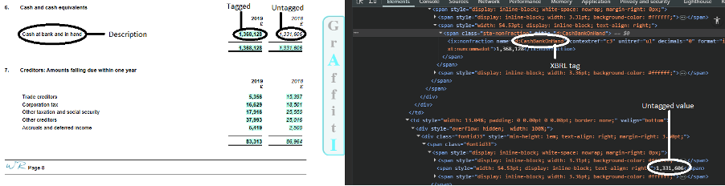

Example iXBRL document opened in the Graffiti viewer (www.stechanalytics.com) with the underlying HTML on the right. Tagged items sit in an `ix:nonfraction` node with a named element (the XBRL concept); untagged items sit in ordinary HTML nodes such as `span`. Source A2.1; supports section 1 and 2.

### B2. Accounts that use HTML table nodes

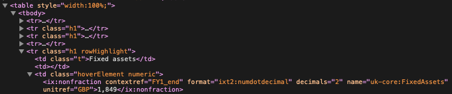

Around 85% of accounts in the sample of 1,000 use HTML `table` nodes, so both the tagged values and the untagged descriptions can be recovered by parsing the table. Source A2.1.2; supports section 5.1.

### B3. Accounts that do not use HTML table nodes

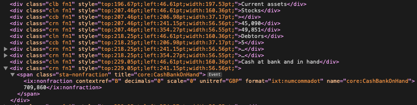

Around 15% of accounts do not use table nodes. The iXBRL data is still easy to extract, but recreating the table from node positions requires bespoke code. These documents are excluded from the notebooks (they are handled by the internal R code). Source A2.1.3; supports section 5.1 and section 12.

### B4. Features available around a value


The description alone ("Total") does not identify the value; the table name ("Employees") and the column headings carry the rest of the meaning. This drove the later addition of table name and heading as features. Source A2.1.4; supports section 5.2 and section 9.

### B5. Rank–frequency of descriptions and concepts (raw data)

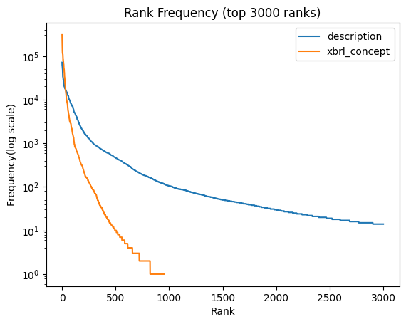

Both distributions have a long tail on a log frequency scale, with descriptions much longer-tailed than concepts. Source A2.2.2; supports section 2 and section 5.2.

### B6. Word-count distribution of descriptions (raw data)

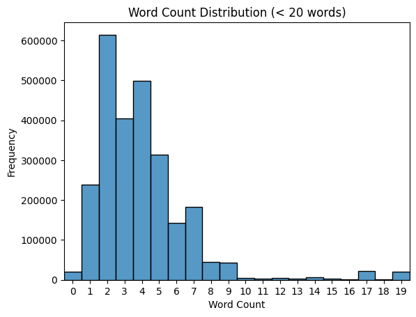

Roughly bell-shaped with a long right tail; most descriptions are 1–9 words with a mode of 2. Source A2.2.3; supports section 5.2 and 5.3.

### B7. Word count by the five most common concepts (raw data)

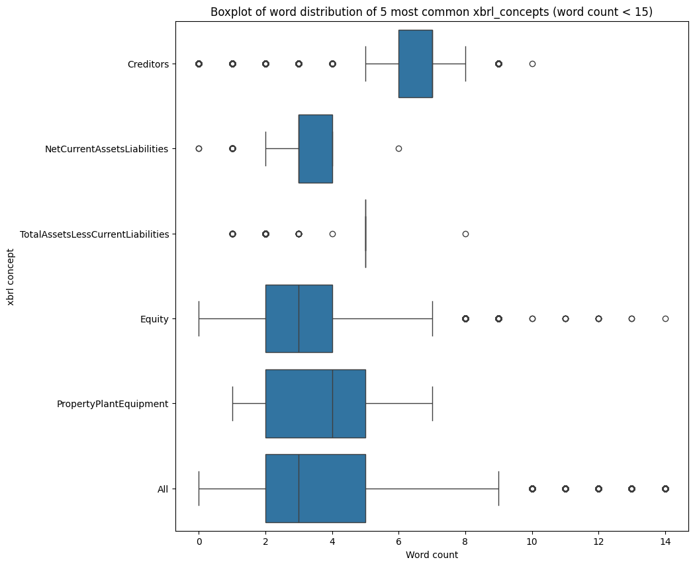

Interquartile ranges of 2–7 words across the five most common concepts. Source A2.2.3; supports section 5.2.

### B8. Pareto chart of concepts (raw data)


The 75 most common concepts cover 95% of items, out of 956 concepts. This is the evidence for using macro-F1 rather than accuracy as the primary metric. Source A2.2.5; supports section 4 and 5.2.

### B9. Concept frequency against power-law, lognormal and exponential fits (raw data)

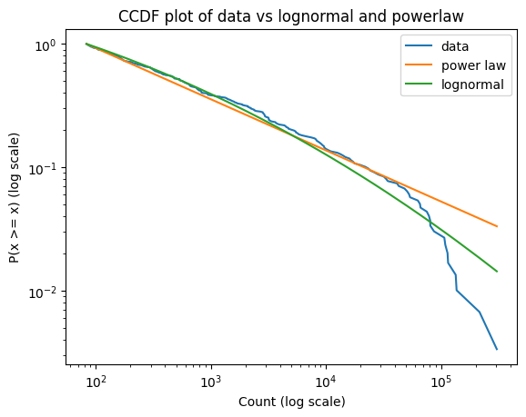

CCDF of the concept counts against fitted distributions. The distribution is closer to lognormal than to power-law or exponential. Source A2.2.6; supports section 5.2.

### B10. Rank–frequency after canonicalisation and label engineering

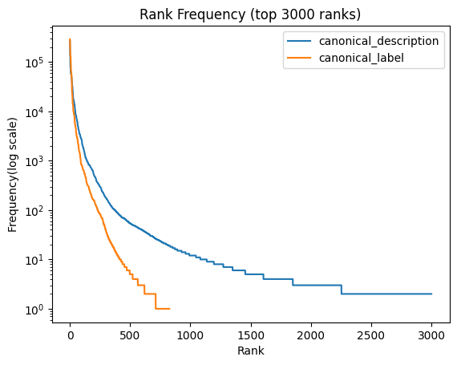

Source A2.4.2; supports section 5.3.

### B11. Word-count distribution after canonicalisation

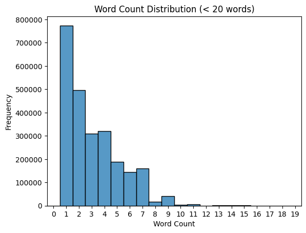

The rough bell shape has gone: empty descriptions are removed and many multi-word values (dates, names, numbers) collapse into a single canonical token. Source A2.4.3; supports section 5.3.

### B12. Word count by most common concepts after canonicalisation


`HubbleDate` and `HubbleName` are now among the most common labels, created by the label engineering step. Source A2.4.3; supports section 5.3.

### B13. Pareto chart of concepts after preprocessing

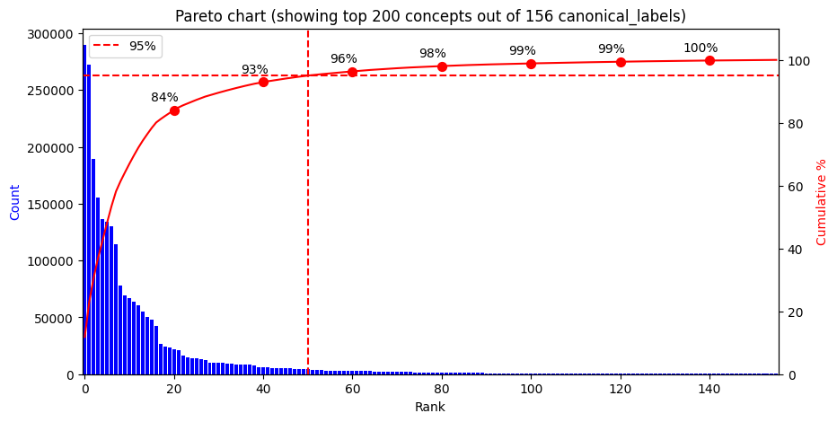

95% of the data is now covered by the top 50 labels out of 826. Source A2.4.5; supports section 5.3.

### B14. Distribution fit after preprocessing

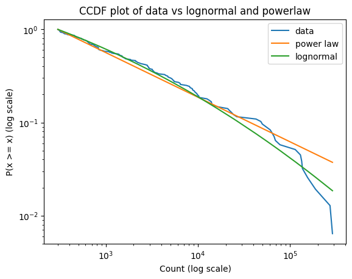

Slightly weaker correlation with lognormal after preprocessing. Source A2.4.6; supports section 5.3.

### B15. Dataset description before and after preprocessing

| Measure | Raw extract | After canonicalisation and filtering |
|---|---|---|
| Rows | 2,857,703 | 2,466,052 |
| Labels (concepts) | 956 | 826 |
| Unique descriptions | 266,178 | 7,795 |
| Unique description/label pairs | 282,515 | 9,492 |
| Missing descriptions | 0 | 0 |
| Missing concepts | 0 | 0 |
| Mean description length (words) | 7.77 | 3.07 |
| Mode description length (words) | 2 | 1 |
| Min description length (words) | 0 | 1 |
| Max description length (words) | 1,762 | 15 |
| Descriptions with no letters or digits | 19,814 | 0 |

The max length of 1,762 words in the raw extract confirmed that long descriptions were extraction errors rather than valid data. The notebook commentary in A2.4.1 quotes 10,591 unique descriptions, which is the figure from an earlier iteration of the preprocessing pipeline. Source A2.2.1 and A2.4.1; supports section 5.3.

### B16. Silhouette scores by embedding (50,000 row sample)

| Embedding | Silhouette score |
|---|---|
| TFIDF, 1–3 word n-grams | 0.4186 |
| TF, 1–3 word n-grams | 0.4186 |
| TF, 1–3 word n-grams + 3–5 character n-grams | 0.4361 |
| MiniLM (`all-MiniLM-L6-v2`) | 0.4409 |
| E5 (`intfloat/e5-base-v2`) | 0.4328 |
| MPNet (`all-mpnet-base-v2`) | 0.4672 |

Classifier-independent comparison of embeddings. MPNet separates the classes best, but the spread is narrow (0.419–0.467). Source A2.5; supports section 5.2.

### B17. Macro-F1 by model type (1% training population)

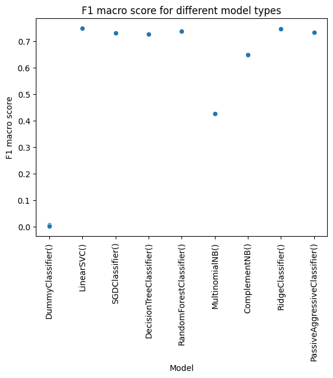

Initial screen of nine model families against a `DummyClassifier` floor. Source A3.3; supports section 7.1.

### B18. Macro-F1 against training time (1% training population)

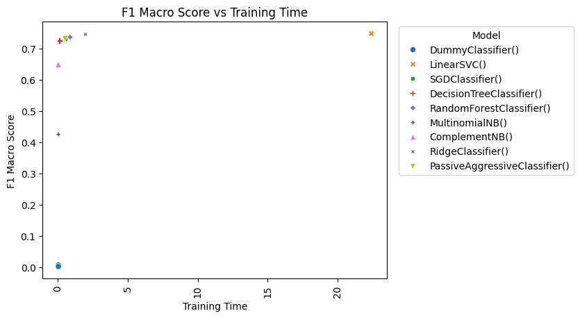

Slower models generally scored better, but several models were both quick and accurate. Source A3.3; supports section 7.1 and 7.2.

### B19. Score agreement between training population sizes

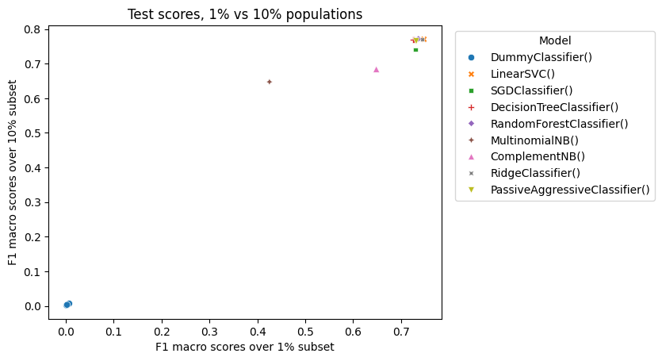


Macro-F1 for the same model/hyperparameter combinations trained on 1%, 10% and 100% of the training data. Source A3.3; supports section 7.1.

### B20. Correlation between population sizes

| Comparison | Pearson (scores) | Spearman (ranks) |
|---|---|---|
| 1% vs 100% | 0.9707 | 0.9364 |
| 10% vs 100% | 0.9980 | 0.9273 |

Differences in ranking between the 1%/10% and 100% populations were 0–3 places, and every model that was not significantly worse at 1% under a paired t-test was also not significantly worse at 100%. This is the justification for filtering candidates on smaller populations. Source A3.3; supports section 7.1.

### B21. Macro-F1 against training time, refined halving search


300 candidates over 5-fold stratified cross validation. The top three models were LinearSVC, SVC (linear kernel) and PassiveAggressiveClassifier. Source A3.4.2; supports section 7.2.

### B22. Fit time and score split by `min_df`

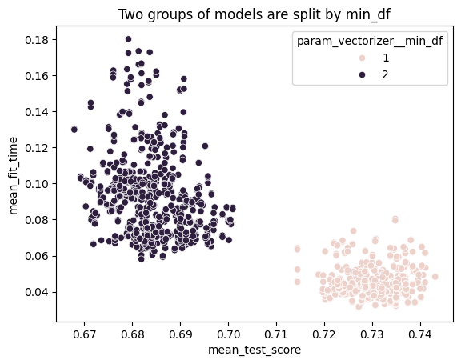

`min_df` of 1 produced two clearly separated clusters that were both faster and better scoring than `min_df` of 2 — the additional rare features make the problem easier to fit rather than harder. Source A3.6; supports section 7.2.

### B23. LinearSVC feature attribution (SHAP) for "cost of goods sold turnover"

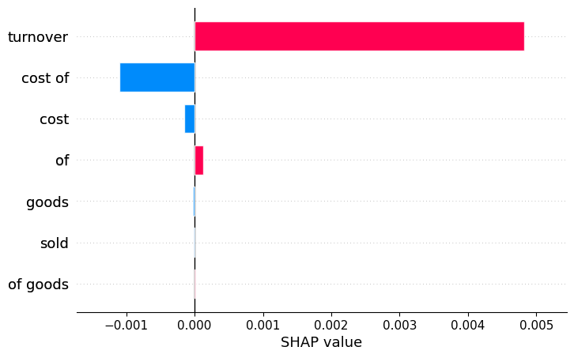

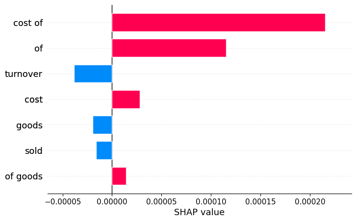

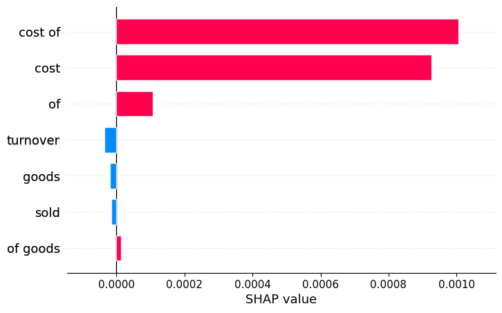

SHAP values for the three competing classes. "cost of" carries no coefficient of its own but still drives the outcome by suppressing competing classes, which the raw coefficients alone do not show. Source A3.9.3; supports section 8 and 9.

### B24. Confusion matrices for individual classes (LinearSVC, holdout)


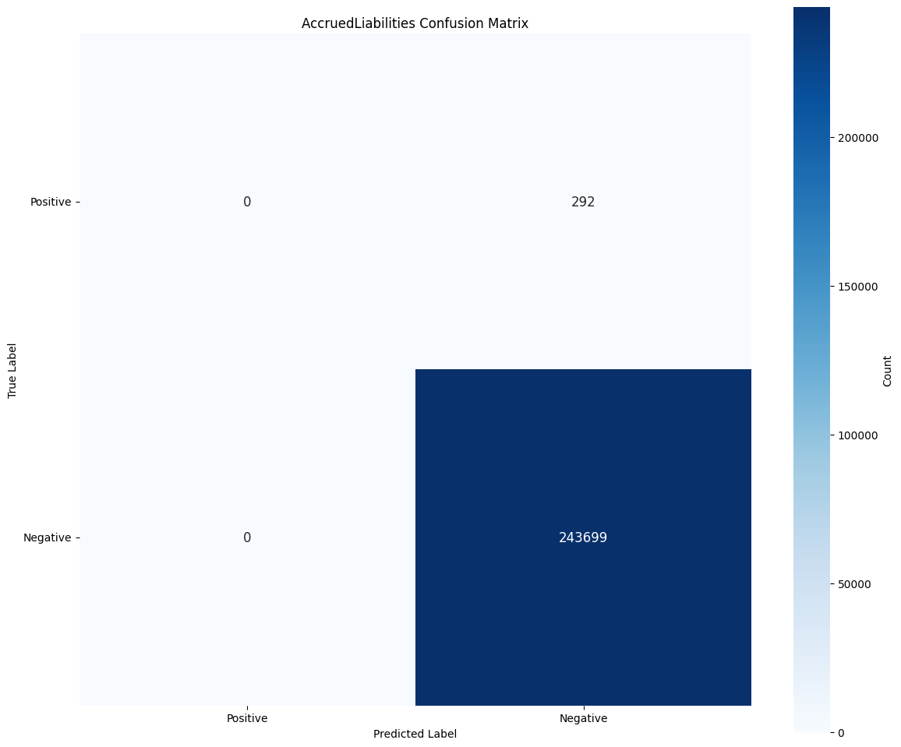


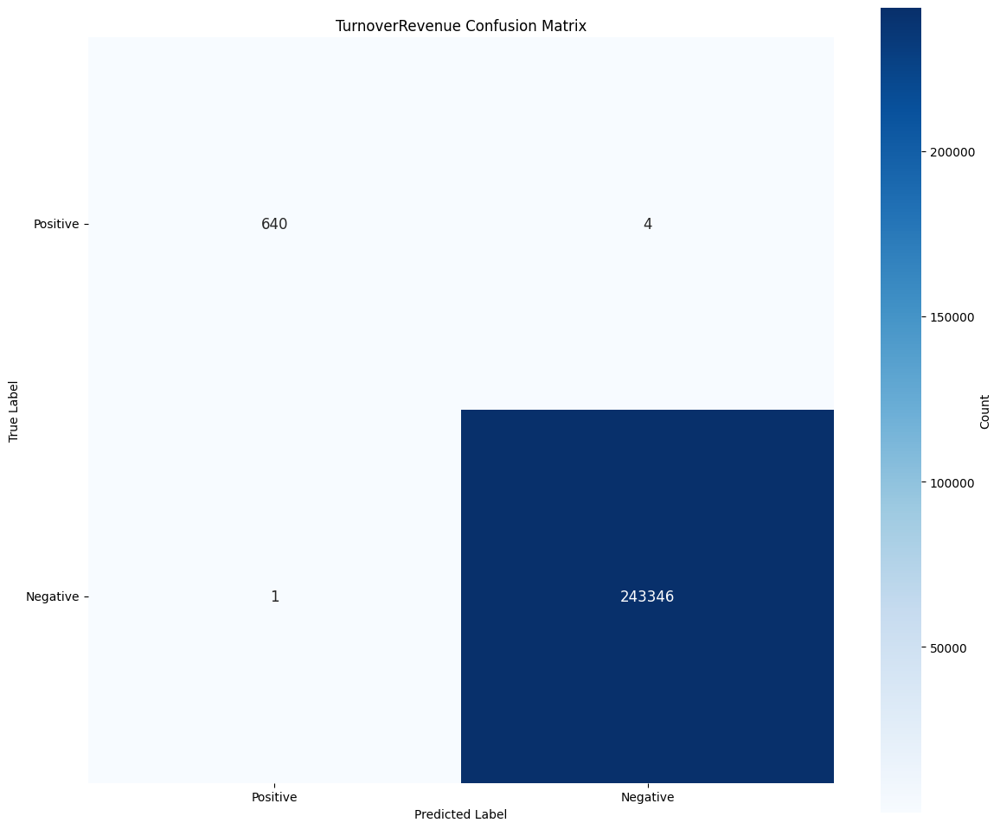

One-vs-rest confusion matrices used in the residual analysis and in the explanations given to analysts. `CashOnHand` and `CashBankOnHand` show the characteristic failure: "cash at bank and in hand" and "cash and cash equivalents" are assigned to whichever of the two near-identical concepts dominates the training data. Eight further matrices are produced by A3.10. Source A3.10; supports section 8.

### B25. Robustness testing, LinearSVC against SEC-BERT

By perturbation category:

| Category | Cases | LinearSVC correct | LinearSVC accuracy | SEC-BERT correct | SEC-BERT accuracy |
|---|---|---|---|---|---|
| abbreviation | 13 | 3 | 0.231 | 3 | 0.231 |
| adversarial | 13 | 12 | 0.923 | 11 | 0.846 |
| canonical | 13 | 13 | 1.000 | 13 | 1.000 |
| command | 1 | 1 | 1.000 | 1 | 1.000 |
| contextual | 13 | 3 | 0.231 | 1 | 0.077 |
| long_context | 13 | 6 | 0.462 | 5 | 0.385 |
| ocr | 13 | 5 | 0.385 | 1 | 0.077 |
| synonym | 13 | 8 | 0.615 | 8 | 0.615 |
| typo | 13 | 4 | 0.308 | 4 | 0.308 |
| unicode | 13 | 1 | 0.077 | 2 | 0.154 |
| variation | 13 | 9 | 0.692 | 7 | 0.538 |

By expected concept:

| Expected concept | Cases | LinearSVC accuracy | SEC-BERT accuracy |
|---|---|---|---|
| AdministrativeExpenses | 10 | 0.6 | 0.6 |
| CashBankOnHand | 10 | 0.7 | 0.7 |
| CorporationTaxPayable | 10 | 0.6 | 0.5 |
| CostSales | 10 | 0.3 | 0.3 |
| CurrentAssets | 10 | 0.4 | 0.3 |
| Debtors | 10 | 0.4 | 0.3 |
| FixedAssets | 10 | 0.6 | 0.5 |
| GrossProfitLoss | 10 | 0.6 | 0.3 |
| IntangibleAssets | 10 | 0.4 | 0.5 |
| InvestmentProperty | 10 | 0.4 | 0.4 |
| OperatingProfitLoss | 10 | 0.4 | 0.3 |
| ProfitLoss | 10 | 0.5 | 0.4 |
| TurnoverRevenue | 11 | 0.545 | 0.455 |

LinearSVC scored equal or better in nine of the eleven categories. Both models handled the canonical and command cases perfectly and both were weak on abbreviations, typos and unicode substitution. Source A3.8 and A5.3.5 (test cases defined in `ixbrl_ai.test.IXBRL_TEXT_CLASSIFICATION_TEST_CASES`); supports section 8.

### B26. CNN validation macro-F1 by epoch

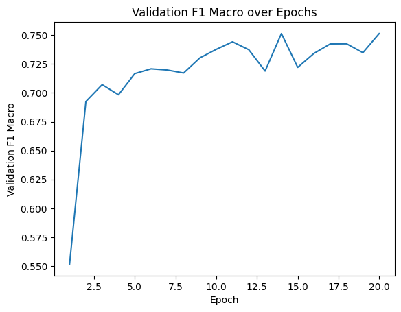

Best Optuna trial from the 200-trial architecture search. Source A4.3.1.1; supports section 7.3.

### B27. CNN validation macro-F1 against cumulative training time

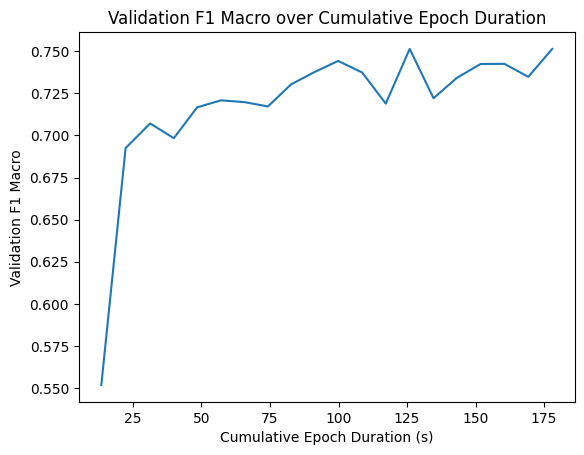

Source A4.3.1.1; supports section 7.3 and 7.5.

### B28. SEC-BERT token contributions (SHAP) for "cost of goods sold turnover"

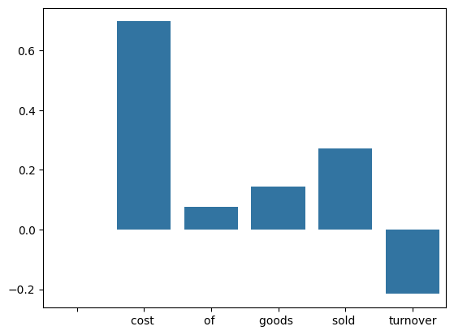

Contribution of each token to the predicted class (`CostSales`). "cost" and "sold" push towards the prediction and "turnover" pulls away from it, which is the expected behaviour. Source A5.4; supports section 9.

### B29. SEC-BERT training and evaluation loss by epoch

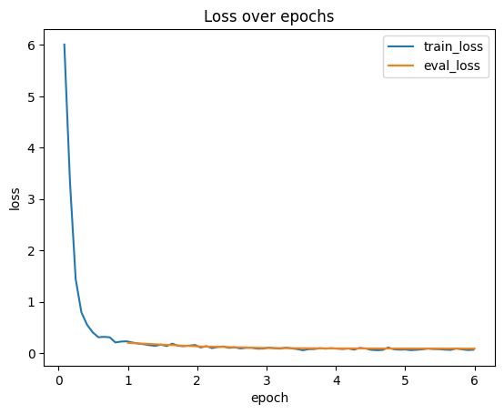

Source A5.5; supports section 7.3.

### B30. SEC-BERT confusion matrices for individual classes

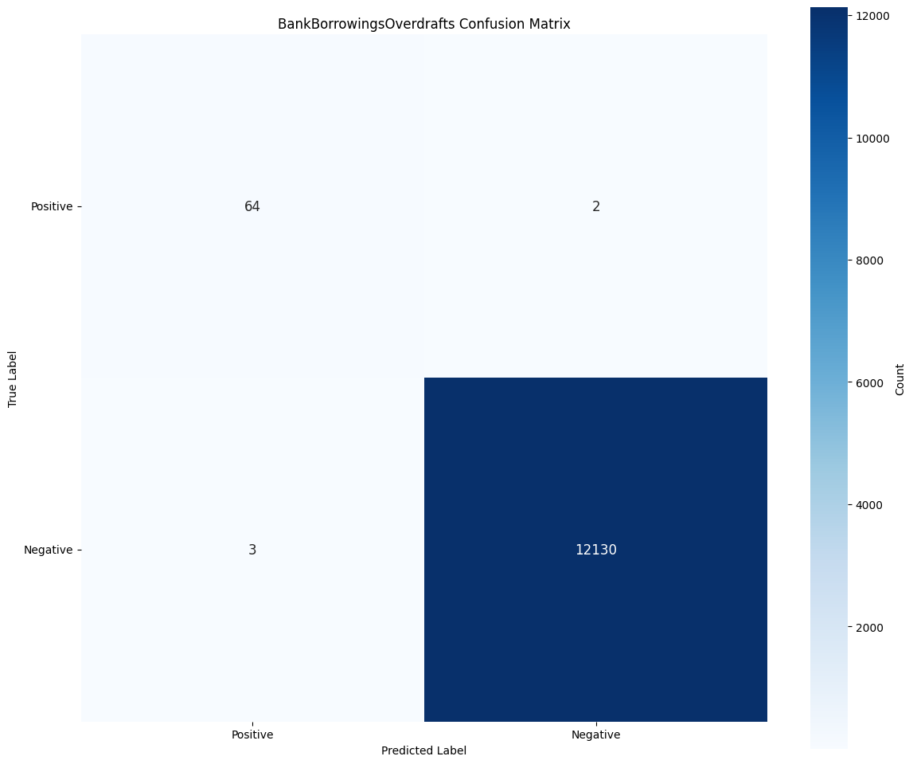

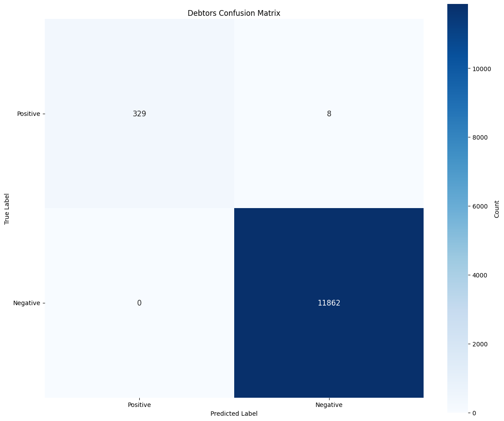

One-vs-rest confusion matrices over the 5% test population for two classes selected as having enough support to be informative. Source A5.6; supports section 7.3.

### B31. Decision matrix — subjective assessubject matter expertsnts

| Model | Interpretability | Deployment simplicity | Maintenance burden | Domain fit | Model lifecycle | Dependency risk | Cost |
|---|---|---|---|---|---|---|---|
| LinearSVC | High interpretability; coefficients and feature weights can be inspected directly for most predictions. | Simple to deploy; standard libraries and low resource requirements. | Limited maintenance; requires monitoring, and is easy to retrain and update. | Good fit for text based classification. TFIDF captures the domain specific terminology well, but may miss semantic nuances. | Low risk; mature packages with long-term support; low risk of obsolescence. | Minimal dependency risk; model can be trained using well established opensource packages. | Lowest cost option; fast to train, cheap to run on CPU, and lightweight to store and serve. |
| CNN | Lower native interpretability than linear models; useful explanations are possible with post-hoc methods such as SHAP or LIME. | Moderate deployment complexity; requires GPU for optimal performance. | Moderate maintenance; requires monitoring and retraining. | Good fit for text classification where local token patterns matter; may miss some long-range semantic relationships. | Low risk; mature packages with long-term support; low risk of obsolescence. | Low dependency risk; model can be trained using well established opensource packages but the software stack is more complicated than traditional approaches. | Higher cost option; training and inference are more resource intensive than LinearSVC and benefit from GPU acceleration. |
| SEC-BERT | Lower native interpretability; explanations are possible with post-hoc analysis and attention diagnostics. | Complex deployment; requires significant resources, expertise and requires GPU for optimal performance. | Moderate-to-high maintenance; requires monitoring, and retraining can be resource intensive on current infrastructure. | Strong theoretical fit for semantic financial language, but robustness was weaker here; likely affected by US SEC pretraining vs UK accounts domain shift. | Higher lifecycle risk in this setup: public SEC-BERT releases show limited recent maintenance, increasing uncertainty around long-term support. | High dependency risk; reliance on unverified external third-party pre-trained models. | Higher cost option; transformer training, storage, and inference are expensive relative to classical models and typically need GPU support. |

Scored against the rubric in A6.2.5, defined in the `subjective_inputs` block. Source A6.1; supports section 7.5.

### B32. Decision matrix — measured values

All three models trained on the 10% square-root weighted training population and evaluated on the same holdout subset, with 95% bootstrap confidence intervals.

| Model | Accuracy | Macro-F1 | Macro-recall | Macro-precision | Weighted-F1 | Train time (s) | Inference time (s) | Model size (bytes) |
|---|---|---|---|---|---|---|---|---|
| LinearSVC | 0.975 (CI 0.972–0.978) | 0.800 (CI 0.781–0.829) | 0.821 (CI 0.806–0.856) | 0.823 (CI 0.792–0.847) | 0.971 (CI 0.967–0.974) | 144 | 0.64 | 8,126,919 |
| CNN | 0.977 (CI 0.974–0.980) | 0.808 (CI 0.788–0.840) | 0.825 (CI 0.810–0.863) | 0.829 (CI 0.799–0.856) | 0.972 (CI 0.969–0.976) | 2,640 | 23.87 | 29,723,312 |
| SEC-BERT | 0.977 (CI 0.974–0.980) | 0.823 (CI 0.798–0.850) | 0.834 (CI 0.817–0.867) | 0.855 (CI 0.814–0.873) | 0.973 (CI 0.969–0.976) | 4,023 | 143.11 | 1,756,868,591 |

Subjective scores (1–5, higher is better) alongside the measured values:

| Model | Interpretability | Deployment simplicity | Maintenance burden | Domain fit | Model lifecycle | Dependency risk | Cost |
|---|---|---|---|---|---|---|---|
| LinearSVC | 5 | 5 | 4 | 3 | 5 | 5 | 5 |
| CNN | 2 | 3 | 3 | 3 | 5 | 4 | 3 |
| SEC-BERT | 2 | 2 | 2 | 3 | 1 | 2 | 3 |

Source A6.1; supports section 7.5 and section 8.

### B33. Decision matrix — weighting

| Metric | Weight | Direction | Source | Weight % | Description |
|---|---|---|---|---|---|
| f1_macro | 25 | higher | objective | 12.8 | Macro F1; important for class imbalance. |
| interpretability | 25 | higher | subjective | 12.8 | Ease of explaining model behaviour. |
| accuracy | 20 | higher | objective | 10.3 | Overall accuracy; intuitive but can be misleading with imbalance. |
| cost | 20 | higher | subjective | 10.3 | Relative implementation and operating cost (higher score = lower cost). |
| dependency_risk | 15 | higher | subjective | 7.7 | Dependency risk (higher score = lower external risk). |
| f1_weighted | 10 | higher | objective | 5.1 | Weighted F1; reflects population-level performance. |
| train_time | 10 | lower | objective | 5.1 | Training time in seconds. |
| inference_time | 10 | lower | objective | 5.1 | Inference time per sample in seconds. |
| model_size | 10 | lower | objective | 5.1 | Model size in bytes. |
| deployment_simplicity | 10 | higher | subjective | 5.1 | Ease of deployment and operationalisation. |
| maintenance_burden | 10 | higher | subjective | 5.1 | Ease of maintaining the model over time. |
| domain_fit | 10 | higher | subjective | 5.1 | Fit for domain-specific requirements. |
| model_lifecycle | 10 | higher | subjective | 5.1 | Expected longevity and support for the model. |
| recall_macro | 5 | higher | objective | 2.6 | Macro recall; penalises false negatives across classes. |
| precision_macro | 5 | higher | objective | 2.6 | Macro precision; penalises false positives across classes. |

Where a model's confidence interval overlapped that of the best model, its score for that metric was reduced by a confidence factor of 0.35 so that statistically indistinguishable results could not decide the outcome. Source A6.1 (`metric_config`); supports section 7.5.

### B34. Decision matrix — final scores

| Model | Decision score | Decision score % |
|---|---|---|
| LinearSVC | 0.3718 | 37.2 |
| CNN | 0.2585 | 25.8 |
| SEC-BERT | 0.1531 | 15.3 |

Weighted score by metric:

| Model | accuracy | f1_macro | recall_macro | precision_macro | f1_weighted | train_time | inference_time | model_size | interpretability | deployment_simplicity | maintenance_burden | domain_fit | model_lifecycle | dependency_risk | cost |
|---|---|---|---|---|---|---|---|---|---|---|---|---|---|---|
| LinearSVC | 2.33 | 2.88 | 0.58 | 0.57 | 1.17 | 7.37 | 5.44 | 5.03 | 13.89 | 5.00 | 4.44 | 3.33 | 4.55 | 6.82 | 9.09 |
| CNN | 2.33 | 2.91 | 0.58 | 0.58 | 1.17 | 2.63 | 4.56 | 4.97 | 5.56 | 3.00 | 3.33 | 3.33 | 4.55 | 5.45 | 5.45 |
| SEC-BERT | 2.34 | 2.96 | 0.59 | 0.60 | 1.17 | 0.00 | 0.00 | 0.00 | 5.56 | 2.00 | 2.22 | 3.33 | 0.91 | 2.73 | 5.45 |

SEC-BERT wins on every raw performance metric, but the differences are small and the confidence intervals overlap, so once interpretability, cost, dependency risk and lifecycle are weighted in, LinearSVC scores highest overall. Source A6.1 (`build_decision_matrix`); supports section 7.5.

## Appendix C. Statistical rigour: uncertainty, bias, and error estimates where appropriate.

The quantitative evidence for this section sits in Appendices A and B:

- Cross validated scores with 95% margins of error, and paired t-tests against the top model, are produced by `add_confidence_interval` and `compare_to_top`(Appendix A3.2) and applied at every search stage in A3.3 to A3.7.
- Bootstrap 95% confidence intervals over the test and holdout populations are at Appendix A3.7 and reported for all three candidate architectures at Appendix B32.
- The population size validation, showing that filtering candidates on a 1% or 10% sample is defensible, is at Appendix B19 and B20.
- Class imbalance and its effect on macro versus weighted metrics is evidenced by Appendix B8 and B13, with the weighting experiments at Appendix A3.7.7, A4.4.1.1 and A5.3.7 to A5.3.9.
- Error analysis, including which classes fail and why, is at Appendix A3.10 and Appendix B24, with robustness under perturbation at Appendix B25.
- Bias testing by company size and software provider was run over HMRC data and is reported in section 8; it is not part of these public data notebooks.

## Appendix D. Mapping of the project report to AM1 KSBs.

## Appendix E. Employer verification that the report reflects my own involvement and work.
