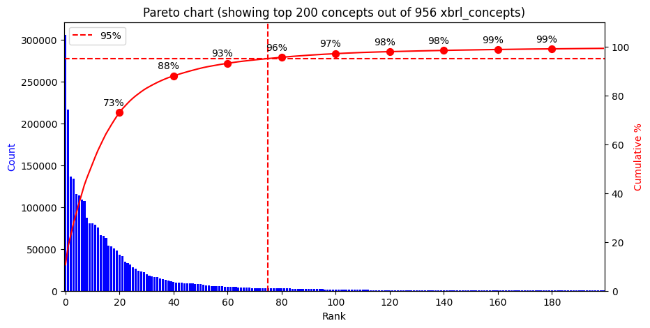
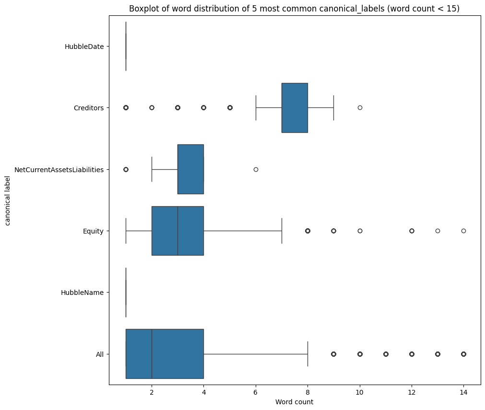
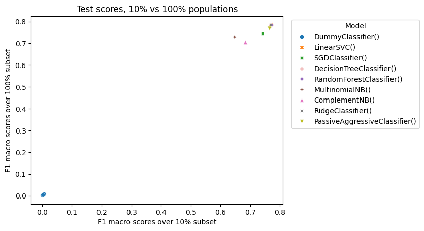
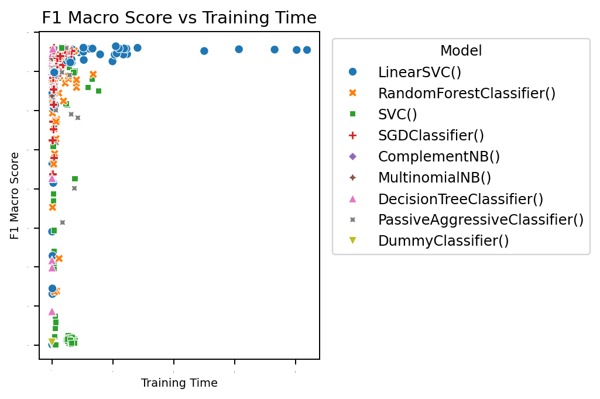
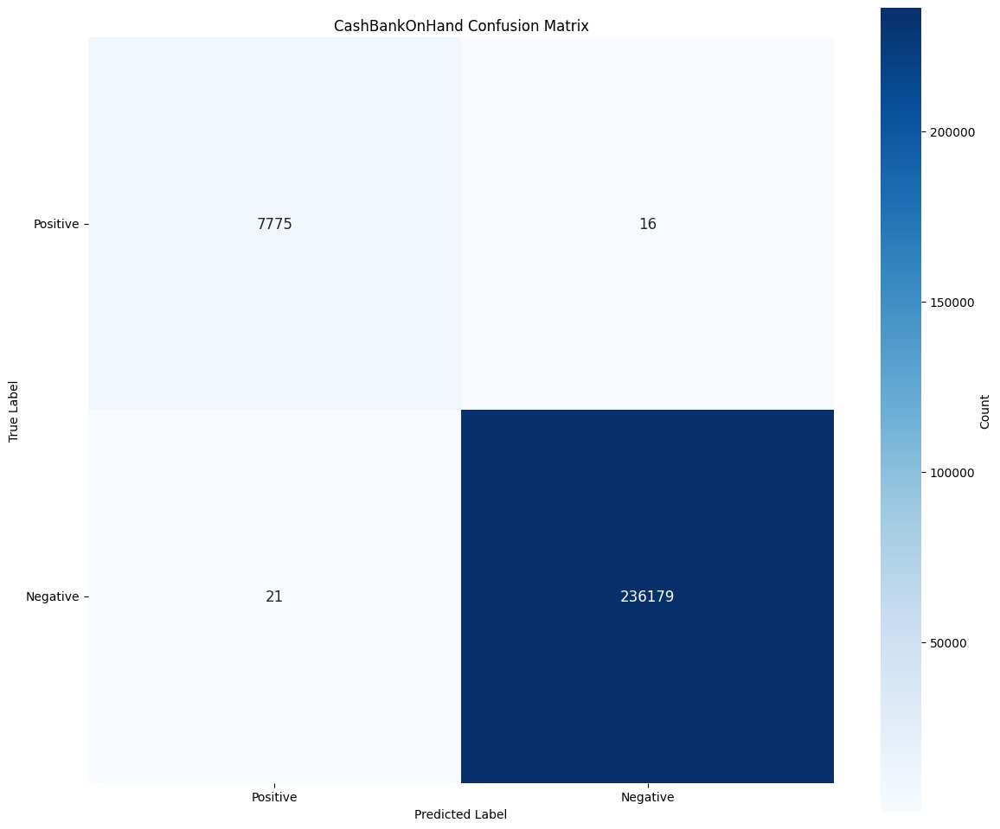
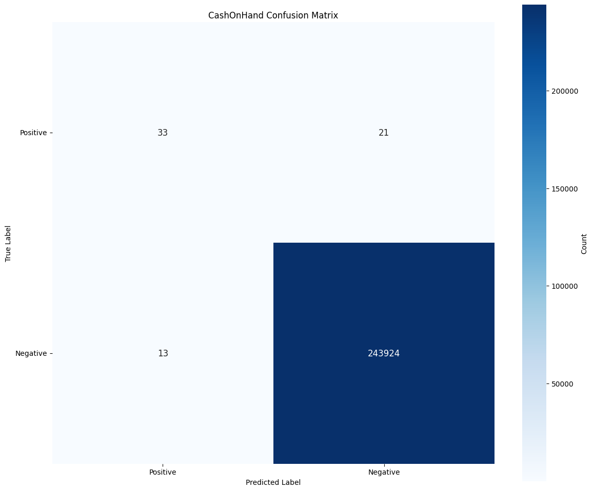

# AM1 presentation draft — Categorising data in financial documents

> Working presentation and speaker-note plan. The slide headings tell the project story; the BCS coverage requirements and KSBs are mapped at the end rather than used as audience-facing headings.

## Delivery plan

- **Target delivery:** 28.5 minutes, leaving approximately 1.5 minutes for natural pauses or a delayed slide change.
- **Assessment format:** 30-minute presentation followed by approximately 45 minutes of supplementary questioning.
- **Structure:** 15 slides. Each slide should make one main claim, supported by one visual and a small number of figures.
- **Core narrative:** business problem → research and decisions → implemented service → honest evaluation → organisational value → recommendations.
- **Personal contribution:** use “I” for my decisions and work; distinguish this from what the later virtual team, subject matter experts, software engineers and DevOps colleagues contributed.
- **Evidence rule:** distinguish the public Companies House holdout evaluation from production results on HMRC data. Do not imply that the estimated financial benefits have been independently validated or completely recorded.

---

## Slide 1 — Categorising data in financial documents (0.5 min)

**On slide**

- Jesse Karadia, HMRC
- Hubble: extracting and classifying tagged and untagged items in iXBRL financial documents
- From inaccessible figures to governed, queryable data

**Speaker notes**

I developed Hubble to make financial data that HMRC could not previously analyse at scale usable. I wrote the vast majority of the code and all of the machine learning. As the project grew, I became lead of the virtual team working on it.

- **Evidence:** report Sections 1–2.
- **BCS coverage:** high-level summary; personal contribution.
- **KSB focus:** K14, B2.

---

## Slide 2 — The project at a glance (2 min)

**On slide**

- **Problem:** in some document types only approximately 30% of figures were tagged, leaving 70% unavailable to bulk analysis
- **Approach:** use the tagged items as supervised training data and classify the untagged items
- **Solution:** TF-IDF word n-grams with `LinearSVC`, embedded in a daily extraction-to-Oracle service
- **Outcome:** over 99% extraction coverage, data available within 3 days, and a full public holdout macro-F1 of 0.785
- **Business use:** multiple teams now use the data for dashboards, policy analysis and identifying companies for investigation

**Suggested visual**

A single before/after flow:

`30% tagged and usable` → **Hubble extraction + classification** → `>99% extracted and classified`

**Speaker notes**

The one-sentence version is: the tagged data provides the labels, the model extends those labels to untagged items, and the resulting service makes the full document queryable. The most accurate candidate model was not the best operational choice; I will show how evidence and HMRC constraints led to that decision.

Be precise: the 30% figure applies to some document types, not every document. The 0.785 macro-F1 is the public Companies House full-holdout evaluation; production performance is shown separately later.

- **Evidence:** report Sections 2, 7.6, 8 and 11.
- **BCS coverage:** high-level summary; context; implications.
- **KSB focus:** K13, K14, K1, S15.

---

## Slide 3 — Business problem, scope and success measures (2 min)

**On slide**

### Business need

- Billions of figures were unavailable for consistent analysis
- Complex, lengthy annual schema updates, with Oracle’s 1,000-column limit being reached
- Raw descriptions had no fixed vocabulary; `CurrentAssets` alone had 23,803 unique descriptions

### Scope and KPIs

- **In scope:** extraction, contextual features, classification and the automated Oracle pipeline
- **Out of scope:** downstream analysis, human labelling and automated decision-making

| KPI | Target |
|---|---:|
| Macro-F1 | >0.60 |
| Accuracy | >0.70 |
| Automated extraction coverage | >95% |
| Availability after receipt | <1 week |

Interpretability and security were core requirements, not optional tiebreakers.

**Suggested visual**

An annotated iXBRL account showing a tagged value, an untagged value and the surrounding HTML.

![[ixbrl annotated example.jpg]]

**Speaker notes**

This was not simply a modelling exercise. The business needed current, queryable data without redesigning a wide database schema every year. Stakeholders helped define measurable success, while I explicitly kept downstream decisions and automated decision-making out of scope. This boundary reduced harm: Hubble supplies attributed predictions to analysts; it does not determine an outcome about a taxpayer.

- **Evidence:** report Sections 2 and 4; Appendices B1, B4 and B44.
- **BCS coverage:** context; practical application.
- **KSB focus:** K14, S5, S27.

---

# What I investigated and what it changed

## Slide 4 — Research finding 1: imbalance and ambiguity shaped the design (2 min)

**On slide**

298,461 Companies House accounts · 2.8 million rows · 956 raw concepts

### Key EDA findings

- Long tail: the 75 most common concepts covered 95% of items
- Descriptions were short mixed-type text, mostly 1-9 words spanning free text, dates, names, postcodes and numbers
- Descriptions and concepts were many-to-many; "Total" alone was tagged with 12 dissimilar concepts
- Some source tags were more specific than the visible text could support

**Suggested visual**

The chart shows the long-tail finding directly; the remaining findings stay as short bullets.

**Speaker notes**

The EDA was decision-making research, not decoration. Speak the consequences rather than listing them on the slide. The long tail meant accuracy would be dominated by common concepts, so I selected macro-F1 as the primary metric and kept accuracy for stakeholder accessibility. The short mixed-type descriptions motivated the canonicalisation covered on the next slide. The many-to-many relationship and over-specific tags showed that no description-only classifier can always reproduce the source labels, so I included contextual features such as table name and heading, which later improved production macro-F1 by 9.8pp, reported per-class performance and treated the performance ceiling as real. That finding later shaped the residual analysis, analyst guidance and the recommendation to simplify the taxonomy.

Public Companies House data allowed broad exploration without taking HMRC customer data onto the standalone GPU device. Production evaluation used controlled HMRC data because it represented the real operating environment.

- **Evidence:** report Sections 5.1–5.2; Appendices B5–B9, B15, B43 and B44.
- **BCS coverage:** research undertaken; practical application.
- **KSB focus:** S3, S9, S10, S22, K5, S11.

---

## Slide 5 — Research finding 2: preprocessing mattered more than complexity (2 min)

**On slide**

- Canonicalised dates, numbers, names and postcodes into typed placeholders, reducing 266,178 unique descriptions to 7,795
- Minimum-support filtering kept 141 modelled concepts while retaining 99% of rows
- Preprocessing improved macro-F1 by approximately 20 percentage points on the evaluation data

**Suggested visual**

**Speaker notes**

This is one of the project’s most important findings. Normalisation was tested rather than assumed—replacing forward slashes with spaces reduced performance, so I removed that step. Canonicalisation improved generalisation and data minimisation. Replacing uncommon personal names with the same typed placeholder also prevented the model from treating a rare ethnic name differently from a common one.

Detail to say, not show: the tax-significant date 31 March 1982 was preserved on subject matter expert advice; placeholder-only descriptions were relabelled where the type itself remained useful; missing, very short, low-quality and excessively long descriptions were removed (13.7% of the raw extract); the 350-example minimum then removed only 26,151 rows, retaining 99% of the remaining data, with 85% of the raw extract surviving preprocessing overall.

I aligned quality controls with DAMA UK dimensions and HMRC expectations: completeness, consistency, timeliness, validity and accuracy. Controlled access, a DPIA, the Data Protection Act 2018 and UK GDPR formed the wider governance context.

Do not directly compare the 20pp preprocessing uplift with the 2.3pp architecture difference without explaining that they come from different experimental settings.

- **Evidence:** report Section 5.3 and Section 10; Appendices B10–B15.
- **BCS coverage:** research undertaken; practical application.
- **KSB focus:** S17, S22, S27, K5.

---

## Slide 6 — Research finding 3: alternatives were eliminated by evidence (2 min)

**On slide**

| Approach              | Evidence and decision                                                                 |
| --------------------- | ------------------------------------------------------------------------------------- |
| Regex repository      | Explainable, but could not cover the long tail and required too much specialist time  |
| Unsupervised grouping | Cosine-similarity analysis showed descriptions within concepts were too varied        |
| Frontier external LLM | Excessive for short phrases and incompatible with taxpayer-data security requirements |
| Traditional ML        | Strong fit for sparse, short domain text; carried forward                             |
| Neural networks       | CNN was the best conventional neural candidate; carried forward                       |
| Transformers          | SEC-BERT was the best transformer candidate; carried forward                          |

**Speaker notes**

I began with business feasibility, then tested the credible technical families rather than assuming that a more complex model would be better. The final comparison was between the champion of each family: `LinearSVC`, CNN and SEC-BERT.

This slide demonstrates critical evaluation. Every rejection has a reason based on evidence, feasibility or governance—not personal preference.

- **Evidence:** report Section 6 and Sections 7.2–7.3.
- **BCS coverage:** research undertaken; practical application.
- **KSB focus:** K1, S2, S3, S10.

---

## Slide 7 — A controlled experiment funnel made the search feasible (2 min)

**On slide**

- Fixed stratified 80/10/10 train, test and holdout splits before comparing architectures
- Pearson score correlation with the full population: 0.971 at 1% and 0.998 at 10%
- Used small samples to eliminate weak candidates, then confirmed finalists at larger scale
- `HalvingRandomSearchCV` searched 10,000 traditional-ML candidates; Optuna searched neural and transformer configurations
- Compared against a stratified `DummyClassifier`; used paired tests and 95% confidence intervals

**Suggested visual**

![[B37 model selection funnel.svg]]

Optionally pair it with:

**Speaker notes**

The purpose of the population-size experiment was commercial as well as scientific. It showed that early screening on smaller samples preserved model rankings and avoided spending full-dataset compute on thousands of poor candidates. Vectorisers were fitted on training data only, and the unseen holdout was protected for final evaluation.

One limitation is that the traditional comparisons used five-fold cross-validation. On reflection, five repetitions of two-fold cross-validation would have reduced the risk of understated variance from overlapping training sets.

- **Evidence:** report Sections 3.5, 5.3, 7.1–7.3 and 12; Appendices B17–B22 and B37.
- **BCS coverage:** research undertaken; practical application.
- **KSB focus:** K3, K26, S2, S11, S22, S25.

---

# From research to a production decision

## Slide 8 — Why I did not choose the highest-scoring model (2.5 min)

**On slide**

### Like-for-like candidate comparison

| Measure | `LinearSVC` | CNN | SEC-BERT |
|---|---:|---:|---:|
| Macro-F1 | 0.800 | 0.808 | **0.823** |
| Training time | **144 s** | 2,640 s | 4,023 s |
| Inference time | **0.64 s** | 23.87 s | 143.11 s |
| Model size | **8.1 MB** | 29.7 MB | 1.76 GB |

- SEC-BERT gained 2.3pp macro-F1, but its confidence interval overlapped `LinearSVC`’s
- `LinearSVC` was approximately 220x faster at inference and 28x faster to train
- It offered direct coefficient inspection, CPU deployment, simpler maintenance and lower dependency/lifecycle risk
- A weighted decision matrix selected `LinearSVC` for the HMRC context

**Suggested visual**

or a simplified version of Appendix B34’s final decision matrix.

**Speaker notes**

The figures on this slide are from the same 10% square-root-weighted training population and the same holdout subset, so they are comparable. I applied a confidence adjustment where intervals overlapped so statistical noise could not decide the outcome.

The commercial decision was not “accuracy versus cost” alone. Interpretability and security were core requirements. `LinearSVC` could run on existing CPU infrastructure and its coefficients expose the learned relationship between n-grams and classes. SEC-BERT depended on a large, externally pretrained model with weaker lifecycle provenance. If SEC-BERT had been materially superior, training an internally governed BERT model would have been the next option.

This is the central trade-off story: I accepted a small apparent performance reduction to optimise the whole business outcome.

- **Evidence:** report Sections 7.5 and 9; Appendices B31–B34 and B39.
- **BCS coverage:** research undertaken; practical application; context and implications.
- **KSB focus:** K13, S2, S3, K23, K3, S11.

---

## Slide 9 — Results met every KPI, but one score is not the whole truth (2 min)

**On slide**

### Public Companies House full holdout — 243,991 rows

| Measure | Result | Target |
|---|---:|---:|
| Accuracy | 0.975 (95% CI 0.975–0.976) | >0.70 |
| Macro-F1 | 0.785 (95% CI 0.780–0.788) | >0.60 |
| Automated extraction coverage | >99% | >95% |
| Availability after receipt | Within 3 days | <1 week |

### One score is not the whole truth

- Production HMRC data: accuracy 0.853 and macro-F1 0.741 on a different population
- 27 of 141 concepts scored below 0.5; eight scored zero

**Suggested visual**

Use a compact KPI scorecard plus the per-class F1 distribution from Appendix B40. Do not use only a good confusion matrix.

**Speaker notes**

All agreed KPIs were met, but presenting only 97.5% accuracy would be misleading. The mean per-class F1 was 0.785 while the median was 0.966, showing a minority of poorly performing concepts; 94.1% of public holdout rows belonged to concepts with per-class F1 of at least 0.9. Production performance was lower because HMRC document types and label distributions differed from the public exploration data. I reported that difference rather than treating the public holdout as a universal performance claim.

- **Evidence:** report Sections 8 and 12; Appendices B38 and B40.
- **BCS coverage:** implications; practical application.
- **KSB focus:** K23, S2, S3, S5, B6.

---

## Slide 10 — Errors, bias and the most important limitation (2.5 min)

**On slide**

### Error mechanism

“cash at bank and in hand” was tagged:

- `CashBankOnHand`: 5,670 times
- `CashOnHand`: 21 times

The same words carry two labels, so a description-only model cannot distinguish the minority case.

### Robustness and group checks

- Macro-F1 by company size: 0.934 for large companies vs 0.790 for small companies
- Software-provider performance ranged from 0.184 to 0.913

### Limitation

The model was trained and evaluated on tagged items, but its main use is untagged items. Tagged labels are a proxy, not ground truth for the target population.

**Suggested visual**

Combine the two confusion-matrix excerpts into a single side-by-side graphic rather than two separate images:

**Speaker notes**

The company-size and software-provider gaps are evidence of representation and labelling effects that require investigation; they are not proof of demographic unfairness. Smaller companies may use different software, and providers tag similar items differently. Because source tags are the training proxy, some measured errors reflect inconsistent taxonomy choices rather than a genuinely wrong human-readable category.

Mitigations already in place are per-class performance reporting, attributed machine-learning predictions and a human in the loop. Further mitigation requires manual expert evaluation of untagged items, provider engagement and possibly a simpler concept taxonomy.

Robustness detail for questioning: `LinearSVC` equalled or beat SEC-BERT in 10 of 11 robustness categories and was weaker only on deliberate unicode manipulation, which is expected to be rare.

- **Evidence:** report Sections 8 and 12; Appendices B24, B25 and B43.
- **BCS coverage:** research undertaken; implications; practical application.
- **KSB focus:** S3, S17, S5, B6, K23.

---

## Slide 11 — I turned the model into a governed daily service (2 min)

**On slide**

- Automated daily pipeline: S3 → R iXBRL extraction → Python canonicalisation and TF-IDF + `LinearSVC` → Oracle for analysts to query
- On-demand CPU EC2 per job; 128 cores produced a >20x speed-up

### Governance in operation

- Customer-supplied tags and ML predictions are clearly distinguished in the outputs and guidance
- Guidance prohibits using the predictions for automated decision-making
- Analysts retain responsibility and can inspect per-class reliability in a dashboard
- Restricted access, documentation, a DPIA and data minimisation support safe use

**Suggested visual**

![[B35 production system architecture.svg]]

**Speaker notes**

The product is the end-to-end service, not just the classifier. Walk the architecture diagram rather than narrating a list: R structures the extracted iXBRL in long format, and each on-demand instance shuts down when its job completes. Long-format storage removed the annual wide-schema bottleneck. On-demand compute met the processing need without paying for a permanently large machine, and CPU availability reinforced the `LinearSVC` decision.

MLflow currently tracks model and data versions during development. Writing the MLflow model version into Oracle for prediction-level traceability is a recommendation, not a control I should claim is already complete.

- **Evidence:** report Sections 3.4, 5.3 and 7.6.
- **BCS coverage:** practical application; implications.
- **KSB focus:** S15, S17, S18, S25, K13.

---

## Slide 12 — Delivery and communication changed the outcome (2 min)

**On slide**

### Delivery

- CRISP-DM for cyclical ML research; proportionate Kanban practices for a small team with competing priorities
- GitLab epics for management visibility and issues for delivery; templates, branches and independent review for quality and continuity
- Usable increments: raw files → iXBRL fields → ML categories → automated Oracle pipeline

### Communication by audience

| Audience | What I changed | Outcome |
|---|---|---|
| Analysts | Confusion matrices, worked errors and an interactive reliability dashboard | Better understanding and increased use |
| DevOps | Runtime, memory, dependencies and EC2 cost-benefit | Scalable on-demand infrastructure |
| Managers | Problem–Solution–Outcome, benefits, blockers and timeframes | Additional people and infrastructure funding |
| Tax/taxonomy SMEs | Concrete ambiguous descriptions and targeted questions | Main-taxonomy choice, canonicalisation rules and realistic limits |

**Speaker notes**

Early technical explanations were too detailed, so I adapted rather than merely simplifying every message in the same way. The dashboard originally showed a top five even when some matches were implausible; users found that confusing, so I changed it to show only plausible matches. That is a concrete example of communication feedback changing the product.

I worked autonomously on extraction, modelling and evaluation, and collaborated where specialist knowledge or operational ownership was required. Without GitLab and its documentation, continuity would have depended too heavily on individual memory.

- **Evidence:** report Sections 3.1–3.5 and 9.
- **BCS coverage:** practical application; follow-on outcomes.
- **KSB focus:** K6, S24, K28, S4, S5, S7, S27, B2, B6.

---

# Value, recommendations and next steps

## Slide 13 — Outcomes and organisational value (2 min)

**On slide**

- Previously inaccessible data is now available for analysis within days
- Multiple teams use the data in dashboards, policy work and company-investigation activity
- More complete data improves consistency and reduces repeated manual regex-style work
- Estimated benefits recorded in the existing spreadsheet are in the tens of millions of pounds
- The spreadsheet was incomplete, so I arranged for benefit monitoring to be added to the central management system
- Demonstrated demand secured additional people and infrastructure funding

**Speaker notes**

The financial figure is an estimate recorded by the organisation, not a causal estimate produced by the model evaluation, and the old spreadsheet was incomplete. The defensible claim is that Hubble supplied data used in work associated with benefits in the tens of millions, while the new central process should improve future attribution and completeness.

The wider organisational value is also capability: a reusable approach to turning embedded tags into supervision, deploying with proportionate infrastructure and keeping predictions clearly separated from source facts.

- **Evidence:** report Sections 9 and 11.
- **BCS coverage:** context and implications; follow-on outcomes.
- **KSB focus:** K14, K13, K28, S4.

---

## Slide 14 — Business recommendations, prioritised (1.5 min)

**On slide**

### 1. Validate and govern

- Ring-fence subject matter expert time for manual evaluation of untagged items
- Write the MLflow model version into Oracle for prediction-level traceability
- Establish data contracts with upstream and downstream teams

### 2. Improve reliability and coverage

- Implement drift monitoring for new taxonomies and sustained 2pp performance drops
- Move tests into CI; improve scheduling and use a fully supported Oracle server
- Increase extraction coverage to 100% before retiring legacy extraction systems

### 3. Improve the problem definition

- Establish the description-only performance ceiling before more tuning
- Consider grouping indistinguishable sibling concepts into a simpler taxonomy

**Speaker notes**

The first priority is manual evaluation because further modelling cannot prove that tagged-data performance transfers to deliberately untagged items. Taxonomy simplification may produce more value than a more complex architecture because many residual errors are distinctions the visible text cannot support.

The proposed drift trigger is a 2 percentage-point drop in accuracy or macro-F1, with non-overlapping confidence intervals over two consecutive days. Automated monitoring can only use tagged items, so it does not replace human evaluation.

- **Evidence:** report Sections 9 and 12.
- **BCS coverage:** business recommendations; actions and next steps.
- **KSB focus:** K13, K14, S2, S3, S15, S17.

---

## Slide 15 — Next steps and lessons learned (1.5 min)

**On slide**

### Immediate actions

1. Complete manual evaluation of untagged descriptions
2. Implement traceability, data contracts, CI and drift monitoring
3. Evaluate a Python port ahead of the lakehouse migration
4. Test taxonomy simplification and contextual features against the performance ceiling

### Lessons I would carry forward

- Research existing packages before writing bespoke search and tracking code; Optuna and MLflow would have replaced earlier manual work
- Keep tuning data separate from final evaluation data
- Treat statistical significance and material business value as different questions
- Communicate headline, example and limitation before technical detail

**Closing line**

Hubble succeeded because the research changed the solution: preprocessing mattered more than architecture, governance changed the model choice, and honest error analysis changed how the output is used.

**Speaker notes**

End on the limitation and its response, not just the highest metric. The next stage is not simply “tune the model”; it is to validate the target population, strengthen the operational controls and simplify the task where the source text does not support the existing labels.

- **Evidence:** report Sections 9, 10 and 12.
- **BCS coverage:** actions and next steps; follow-on outcomes.
- **KSB focus:** S2, S3, S15, S22, B6.

---

## Timing check

| Slide | Time (min) | Cumulative |
|---:|---:|---:|
| 1 | 0.5 | 0.5 |
| 2 | 2.0 | 2.5 |
| 3 | 2.0 | 4.5 |
| 4 | 2.0 | 6.5 |
| 5 | 2.0 | 8.5 |
| 6 | 2.0 | 10.5 |
| 7 | 2.0 | 12.5 |
| 8 | 2.5 | 15.0 |
| 9 | 2.0 | 17.0 |
| 10 | 2.5 | 19.5 |
| 11 | 2.0 | 21.5 |
| 12 | 2.0 | 23.5 |
| 13 | 2.0 | 25.5 |
| 14 | 1.5 | 27.0 |
| 15 | 1.5 | **28.5** |

If running long, shorten Slides 5, 6 and 11. Do not cut Slides 8–10 or the tagged-to-untagged limitation.

## BCS presentation-coverage map

| Required coverage | Slides |
|---|---|
| High-level summary of the main aspects of the report | 1–2 |
| Context, implications and recommendations from the report | 3, 8–14 |
| Research undertaken | 4–8 and 10 |
| Practical application of KSBs | 3–12; personal decisions and contributions are stated throughout |
| Business recommendations | 14 |
| Follow-on outcomes | 12–13 |
| Actions and next steps | 14–15 |

## AM1 grading-theme map

| Grading theme | Strongest slides |
|---|---|
| Business value and growth — K13, K14 | 2–3, 8, 11, 13–14 |
| Critical evaluation — K23, S3, S17 | 4–10, 14 |
| Systematic methodology — S2, S9, S10, S22, S25 | 4–7, 9, 11 |
| Project and development management — K6, S24 | 12 |
| Communication and influencing — K28, S4, S5, S7, S27, B2, B6 | 3, 9–10, 12–13 |
| Technical knowledge — K1, K3, K5, K26, S11, S15, S18 | 4–11 |

## Backup material for supplementary questioning

Keep these in notes or backup slides, not in the timed presentation unless the assessor asks.

### Why `LinearSVC` rather than SEC-BERT?

- Like-for-like macro-F1: 0.800 vs 0.823, with overlapping 95% confidence intervals.
- Inference: 0.64 seconds vs 143.11 seconds on the comparison workload—approximately 220x faster.
- Training: 144 seconds vs 4,023 seconds—approximately 28x faster.
- Size: 8.1 MB vs 1.76 GB.
- Direct coefficients, CPU deployment, mature dependencies, simpler maintenance and lower lifecycle risk.
- SEC-BERT’s US financial pretraining did not produce the expected robustness advantage on UK account descriptions.

### What happens if the model performs badly?

- Predictions are attributed and are not permitted to drive automated decisions.
- Analysts remain in the loop and can check per-class reliability.
- MLflow supports model and data version tracking during development.
- Recommended controls are prediction-level model-version recording in Oracle, drift alerts and controlled redeployment of a validated model.
- A failure therefore degrades to additional analyst checking rather than an automated adverse decision.

### What bias did you find?

- Group performance differed by company size and software provider.
- Treat this as a representation/labelling-proxy issue requiring investigation, not automatic evidence of demographic discrimination.
- Mitigations: canonicalise personal information, report per-class and group performance, distinguish source tags from predictions, retain human review, engage software providers and manually evaluate untagged items.

### What is the return on investment?

- Operational value: less repeated extraction/regex work, data available within days, and reusable central data.
- Decision value: additional figures available for policy, risk analysis and company-investigation activity.
- Recorded estimates associated with use are in the tens of millions, but previous benefit tracking was incomplete.
- I arranged for benefits to be recorded in the central management system; do not claim a precise causal ROI without verified cost and attribution data.

### How would scope extension be handled?

- The long-format architecture can accommodate new taxonomies without new wide-table columns.
- For each new document type, revalidate extraction, label distribution, context features, privacy assumptions and performance.
- Do not assume the Companies House score transfers: HMRC production performance already demonstrates dataset shift.

### What trade-offs did you make?

- 2.3pp candidate macro-F1 versus explainability, speed, cost and lifecycle risk.
- Main-taxonomy consistency for analysts versus potentially higher taxonomy-specific scores.
- Public-data freedom for exploration versus controlled production representativeness.
- R maintainability for existing analysts plus Python ML maturity versus `reticulate` integration complexity.
- On-demand infrastructure availability versus the cost of continuously provisioned compute.

### Explain the classification metrics

- **Precision:** of items predicted as a class, how many carried that label?
- **Recall:** of items carrying a class label, how many were found?
- **F1:** harmonic mean of precision and recall for a class.
- **Macro-F1:** mean of the individual class F1 scores, giving rare and common concepts equal weight.
- **Weighted-F1:** weights class F1 by support, so common classes dominate.
- **Accuracy:** proportion of all predictions that match the source labels; intuitive but potentially misleading under imbalance.

### What would you present differently to an external audience?

- Retain the Companies House methodology and public evidence.
- Remove restricted operational detail, taxpayer-data handling specifics and sensitive compliance-use thresholds.
- Frame the value around reusable document extraction and classification rather than HMRC risk processes.

## Visuals still worth producing

- A clean 30% → Hubble → >99% coverage graphic for Slide 2.
- A simplified KPI scorecard for Slide 9 that clearly labels public holdout and production results.
- A screenshot of the interactive dashboard for Slide 12, using synthetic or public data only.
- A simplified three-model decision graphic for Slide 8; avoid showing the full 15-row decision matrix in the timed deck.
- A single side-by-side confusion-matrix graphic for Slide 10 combining the CashBankOnHand and CashOnHand excerpts.
